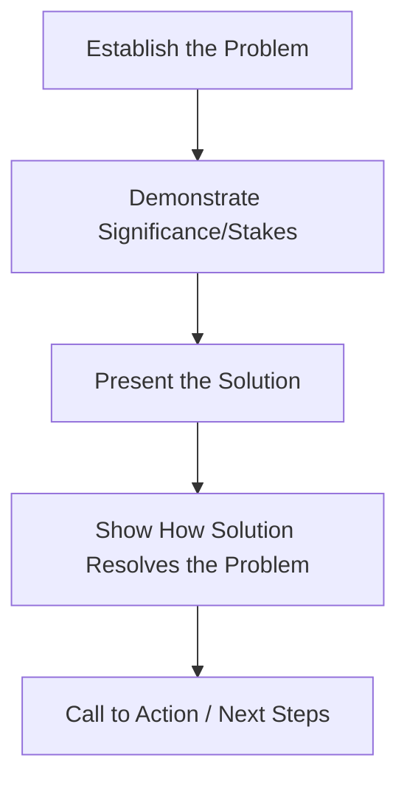
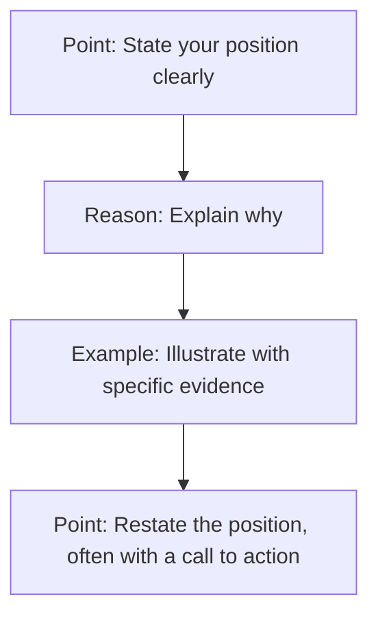

## Modern Structures: Problem-Solution and PREP

### Overview

Problem-Solution and PREP are two widely used modern organizational frameworks for persuasive and business speech, prized for their compactness and applicability to time-constrained modern contexts (elevator pitches, meeting interjections, sales conversations) where the full classical six-part dispositio would be excessive. Both frameworks trade the classical structure's rhetorical completeness for speed and directness, making them dominant in corporate and executive communication settings.

### Problem-Solution Structure

#### Core Logic

Problem-Solution structure argues that a recognized problem justifies the speaker's proposed solution. Its persuasive force depends on the audience first accepting the problem's existence and significance; if that foundation isn't established, the solution will appear unmotivated regardless of its merits.

#### Structural Sequence

**Key Points**

- **Problem legitimacy is the load-bearing element** — if the audience doesn't yet believe the problem is real or significant, no amount of solution quality will persuade; problem establishment often requires more time and evidence than the solution itself.
- **Significance before mechanism** — establishing why the problem matters (cost, risk, missed opportunity) should generally precede detailed solution mechanics, since audiences evaluate solutions more favorably once motivated to want one.
- **Solution-problem fit must be explicit** — simply presenting a solution after a problem is insufficient; the speaker must explicitly connect how each element of the solution addresses a specific element of the problem.
- **Extended variant: Problem-Cause-Solution** — inserting a causal analysis step between problem and solution is common when the audience needs to understand *why* the problem exists before a proposed fix will seem credible.

**Example**

A corporate proposal: "Our customer support tickets have grown 340% in eighteen months, but headcount has grown only 12% [Problem]. Response times have doubled, and satisfaction scores have dropped to their lowest point in company history [Significance]. I'm proposing we implement a tiered triage system with AI-assisted first response [Solution]. This addresses the volume mismatch directly — routine tickets get resolved without human intervention, freeing staff for complex cases [Fit]. I'd like approval to pilot this with the West region team starting next month [Call to Action]."

#### Problem-Solution Variants

| Variant | Structure | Best Fit |
| --- | --- | --- |
| Simple Problem-Solution | Problem → Solution | Straightforward, uncontested problems |
| Problem-Cause-Solution | Problem → Cause → Solution | When audience needs causal understanding to accept the fix |
| Comparative Advantage | (Problem assumed) → Compare solutions → Recommend best | When audience already agrees a problem exists and multiple solutions are being debated |
| Problem-Solution-Objection | Problem → Solution → Anticipated objections addressed | Skeptical or informed audiences likely to counterargue |

### PREP Structure

#### Core Logic

PREP (Point, Reason, Example, Point) is a compact four-part structure optimized for brevity and clarity, particularly suited to situations demanding an immediate, well-organized response: meeting contributions, interview answers, brief persuasive statements, and impromptu speaking.

#### Structural Sequence

**Key Points**

- **Front-loaded clarity** — stating the point first, before justification, respects an audience's (particularly a busy executive audience's) need to immediately know the speaker's position, rather than building toward a conclusion.
- **Reason as the logical bridge** — the reason segment provides the warrant connecting the point to the audience's acceptance, functioning similarly to the "warrant" in Toulmin's model.
- **Example as concrete anchor** — a specific, vivid example transforms an abstract reason into something memorable and credible; examples are often the most retained element of a PREP response.
- **Closing point reinforces, doesn't just repeat** — the final point should feel like a natural conclusion strengthened by the intervening reason and example, not a verbatim restatement.
- **High compression, low structural depth** — PREP intentionally omits background/context-setting (the narratio) and counterargument handling (the refutatio), trading completeness for speed; it is not well suited to complex, multi-faceted arguments requiring extended justification.

**Example**

A meeting contribution: "I think we should delay the launch by two weeks [Point]. Our QA team flagged three unresolved critical bugs in the checkout flow yesterday [Reason]. In our last release, we shipped with two known minor bugs and saw a 15% spike in support tickets in the first week alone — these are more severe than that [Example]. Two weeks gives QA time to close these out properly, and protects the launch's first impression [Point]."

### Comparative Analysis

| Dimension | Problem-Solution | PREP |
| --- | --- | --- |
| Typical length | Medium to long (full speech or presentation) | Short (30 seconds to a few minutes) |
| Best use case | Formal proposals, policy speeches, sales pitches | Meeting interjections, interview answers, impromptu responses |
| Counterargument handling | Often includes explicit objection-handling | Generally omitted due to compression |
| Cognitive demand on speaker | Moderate (requires establishing problem legitimacy) | Low (highly formulaic, easy to apply under time pressure) |
| Audience orientation needs | Requires establishing shared understanding of the problem | Assumes audience can follow a stated point without extensive context |

### Selecting Between the Two Structures

- **Use Problem-Solution** when the audience does not yet perceive the problem as urgent or real, when the proposal involves significant resources or change, or when a formal proposal format (written or spoken) is expected.
- **Use PREP** when time is constrained, when the audience already shares context (internal team meeting, known issue), or when the speaking situation is inherently short-form (a single meeting turn, a brief interview answer, an impromptu response).
- **Hybrid application** — an executive might use PREP to structure an individual point *within* a larger Problem-Solution presentation (e.g., using PREP internally to structure the "significance" section before moving to the solution), since the two frameworks operate at different structural granularities.

### Common Pitfalls

- **Skipping problem establishment** — presenting a solution before the audience accepts the problem's significance is the most common Problem-Solution failure, producing a proposal that feels unmotivated even if technically sound.
- **PREP without a concrete example** — omitting the example step reduces PREP to an assertion plus a reason, which is markedly less persuasive and less memorable than the full four-part form.
- **Restating rather than reinforcing in the final Point** — a verbatim repeat of the opening point can feel redundant rather than conclusive; the closing point should read as earned by the intervening reason and example.
- **Overusing PREP for complex arguments** — attempting to compress a multi-faceted, contested argument into PREP's four beats can produce an underdeveloped case that invites easy counterargument.
- **Mismatched structure to audience readiness** — using Problem-Solution's full buildup on an audience that already agrees a problem exists wastes time better spent on Comparative Advantage structure instead.

**Related Topics**

- Classical Speech Structure: Exordium to Peroration
- Monroe's Motivated Sequence as an Extended Problem-Solution Variant
- Toulmin Argumentation Model in Depth
- Structuring Impromptu Responses Under Time Pressure
- Executive Communication: The Pyramid Principle and Front-Loaded Messaging
- Comparative Advantage Organizational Pattern