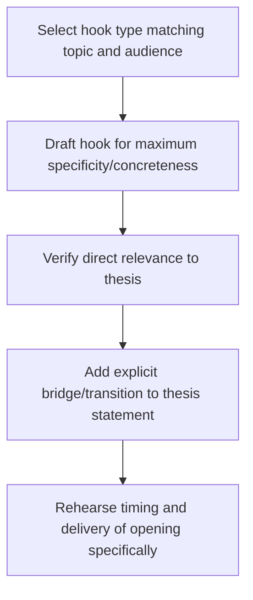

## Crafting a Compelling Opening and Hook

### Overview

The opening moments of a speech disproportionately determine audience engagement for everything that follows. This corresponds to the classical exordium's function but treated here as a distinct technical skill: the deliberate construction of a "hook" — a device that captures attention, establishes relevance, and creates forward motivation for the audience to keep listening. Openings fail or succeed on specific, learnable technique rather than raw charisma.

### Why Openings Matter: The Mechanism

**Key Points**

- **First-impression credibility formation** — audiences form rapid judgments about speaker competence and trustworthiness within the opening moments, and these early judgments color interpretation of everything that follows (a halo/horn effect).
- **Attention is not guaranteed** — unlike written text, a live audience's attention must be actively won; a weak opening allows minds to wander before the substantive content even arrives.
- **Framing effect on subsequent content** — how a topic is introduced shapes the interpretive lens the audience applies to later material, making the opening a structural as well as attentional device.
- **Recency is not available yet** — because the opening lacks the benefit of audience investment built up over the course of a speech, it must earn attention on its own merits rather than relying on prior goodwill.

### Categories of Hook Techniques

| Technique | Mechanism | Best Fit |
| --- | --- | --- |
| Startling statistic or fact | Creates surprise, establishes stakes | Data-driven, policy, or business topics |
| Rhetorical or genuine question | Engages audience's own thinking | Topics with a relatable dilemma |
| Anecdote or story | Creates emotional entry point via narrative | Personal, values-driven, or ceremonial topics |
| Quotation | Borrows authority/credibility from a respected source | Topics with a strong, apt existing articulation |
| Bold or provocative statement | Creates productive tension or curiosity | Persuasive topics challenging a status quo view |
| Vivid imagery/scene-setting | Creates immersive mental picture | Narrative-heavy or experiential topics |
| Direct address of the occasion | Establishes shared context and relevance | Ceremonial or highly context-specific settings |
| Callback-setup (used again in closing) | Plants a device revisited in the peroration | Speeches aiming for strong structural unity |

### Technique: The Startling Statistic

A well-chosen statistic works best when it's unexpected relative to audience assumptions, directly relevant to the thesis (not merely attention-grabbing trivia), and immediately contextualized so the audience understands its significance without further explanation.

**Example**

"By the time I finish this sentence, three more people will have joined a waitlist for affordable housing in this city." This works because it's concrete, time-anchored to the speech itself (creating immediacy), and directly foreshadows the topic.

### Technique: The Question Hook

- **Rhetorical questions** invite the audience to silently answer, creating engagement without requiring a verbal response; effective when the implied answer clearly supports the speaker's thesis.
- **Genuine questions** (sometimes with a show of hands or verbal response) create interactive engagement but carry higher risk in low-energy or unresponsive rooms, and should be used only when the speaker is prepared to handle an unexpected or muted response gracefully.
- **Risk** — overly obvious or manipulative rhetorical questions ("Don't you want to save money?") can feel patronizing rather than engaging.

### Technique: The Anecdote or Narrative Opening

Opening with a brief, concrete story creates an emotional entry point before the audience is asked to process abstract argument or data. Effective anecdotal openings:

- Are specific and sensory rather than generic ("a woman in Ohio" rather than "someone I know").
- Are trimmed to only the details that serve the point being foreshadowed.
- End with a clear pivot connecting the anecdote to the speech's actual thesis, so the story doesn't feel disconnected from what follows.

[Inference] Because narrative openings depend on timing and emotional delivery, they typically benefit from being memorized or very heavily rehearsed even when the rest of the speech is delivered extemporaneously, since a fumbled opening story undercuts the emotional effect it's meant to create.

### Technique: The Quotation Hook

Using a quotation borrows credibility from a respected source, but carries specific risks:

- **Overused quotations** (widely circulated in the genre) can feel cliché and reduce perceived originality.
- **Misattribution risk** — many popular quotations are commonly misattributed; verifying sourcing before use protects credibility.
- **Relevance requirement** — a quotation should directly illuminate the thesis, not merely sound impressive; forced or tangential quotations read as padding.

### Technique: The Bold Statement or Provocative Claim

Opening with a claim that challenges audience assumptions creates productive tension that motivates continued listening to see how the speaker will justify it.

**Example**

"Everything you've been told about how to run an effective meeting is backwards." This creates curiosity and implicit stakes (the audience wants to know what they're doing wrong), but requires the speech to actually deliver a substantive justification or risk feeling like empty provocation.

### Technique: Vivid Imagery and Scene-Setting

Immersive, sensory description places the audience inside a specific moment or place before pulling back to the speech's broader argument. This technique is particularly effective for ceremonial and narrative-heavy informative speech, where establishing emotional or experiential context precedes analytical content.

### Technique: The Callback Setup

Planting an image, phrase, or question in the opening that is deliberately revisited in the closing (the peroration) creates structural unity and a satisfying sense of closure. This technique requires the opening and closing to be planned together rather than independently, since the callback's effectiveness depends on the audience recognizing the return to the initial device.

### Structural Sequence for Constructing a Hook

### Matching Hook Type to Audience and Occasion

- **Skeptical or analytical audiences** — statistics and bold claims tend to perform better than emotional anecdotes, since these audiences respond more readily to logos-first framing.
- **Emotionally receptive or ceremonial audiences** — anecdotes and vivid imagery tend to outperform data-driven openings, aligning with the occasion's relational rather than analytical purpose.
- **Time-constrained settings** (elevator pitches, brief meeting contributions) — favor the most compressed hook types (a single striking statistic or bold statement) over longer narrative openings that a short format cannot accommodate.
- **Culturally and contextually sensitive topics** — humor-based or provocative hooks carry higher risk of misjudging audience reaction and should be tested or reconsidered carefully in advance.

### Common Pitfalls

- **Starting with an apology or self-deprecation about preparation** ("Sorry, I didn't have much time to prepare") — immediately undermines ethos before any content is delivered.
- **Starting with a generic greeting or thanks before the actual hook** — delays the attention-capturing device, wasting the highest-attention moment of the speech on low-value content.
- **Overlong anecdotes** — a story that takes too long to reach its point risks losing the audience before the actual thesis is introduced.
- **Disconnected hooks** — an attention-grabbing opening that doesn't clearly bridge to the thesis can feel like a non-sequitur, confusing rather than orienting the audience.
- **Overused or clichéd devices** — extremely common quotations, statistics, or rhetorical questions specific to a genre can feel stale to audiences familiar with the genre's conventions.
- **Mismatched tone** — an opening whose register doesn't match the occasion's expected formality or emotional tone creates a jarring first impression that can be difficult to recover from.

**Related Topics**

- Classical Speech Structure: Exordium to Peroration
- Crafting Memorable Closings and Calls to Action
- Establishing Ethos in the First Minute of a Speech
- Audience Analysis and Calibrating Opening Technique
- Storytelling Technique for Persuasive and Ceremonial Speech
- Structural Unity: Callback Devices Between Opening and Closing