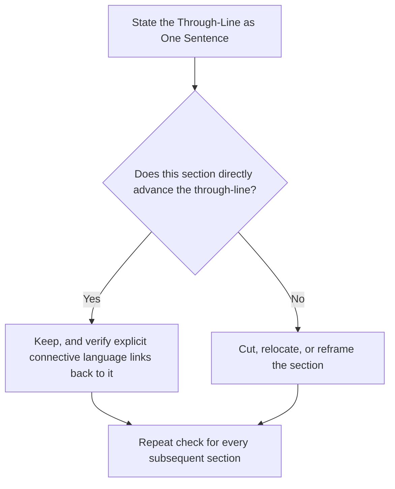

## Building a Logical Through-Line

### Overview

A logical through-line is the single, coherent line of reasoning that connects a speech's opening claim to its closing conclusion, ensuring every section serves one unified argument rather than functioning as loosely related points. Where structural frameworks (Problem-Solution, PREP, classical dispositio) provide the skeleton, the through-line is the connective tissue that makes an audience feel they are following one continuous argument rather than a sequence of disconnected observations.

### Defining the Through-Line

**Key Points**

- **A through-line is not a topic, it's a claim** — "the future of remote work" is a topic; "remote work has permanently changed how we should evaluate management performance" is a through-line, because it makes a specific, defensible assertion that every section can serve.
- **Every section must answer "how does this serve the through-line?"** — content that doesn't visibly advance the central claim, however interesting, weakens the overall coherence and should be cut or reframed.
- **The through-line should be statable in one sentence** — if the central argument cannot be compressed to a single clear sentence, it likely needs sharpening before the speech is drafted further.
- **Distinct from a topic sentence or thesis statement, though related** — the through-line is the connective logic across the entire speech, while the thesis statement is its explicit verbal articulation, typically delivered early (in the exordium or partitio).

### The Through-Line as a Structural Test

A useful diagnostic: for each major section of a draft speech, ask whether removing it would break the argument's coherence, or whether it merely adds tangential color. Sections that pass this test are load-bearing; sections that fail it are candidates for cutting, regardless of how individually interesting they are.

### Technique: Constructing the Through-Line Before Drafting

Building a logical through-line is most effective as a pre-drafting step rather than something imposed after content is written:

1. **Articulate the central claim** in a single, specific sentence.
2. **Identify the two or three supporting pillars** that, together, are sufficient to justify the claim.
3. **Test each pillar independently** — does it hold up as a distinct, non-redundant piece of support, or does it overlap substantially with another pillar?
4. **Sequence the pillars** according to the chosen organizational pattern (chronological, problem-solution, comparative advantage, etc.), ensuring the sequence itself reads as a logical progression rather than an arbitrary order.
5. **Draft explicit connective transitions** between pillars that make the logical relationship audible to the audience, not just visible on an outline.

### Technique: Explicit Connective Language

Because audiences cannot re-read or pause a live speech, the logical relationships between sections must be stated aloud rather than left implicit. Connective language makes the through-line audible:

- **Causal connectives** — "because of this," "as a result," "this is why" — signal a causal link between sections.
- **Contrastive connectives** — "however," "by contrast," "despite this" — signal a shift in direction or an acknowledged tension.
- **Cumulative connectives** — "building on this," "in addition," "this leads directly to" — signal that the next section adds to, rather than diverges from, the prior point.
- **Internal summaries as connective devices** — briefly restating what has been established before introducing the next section reinforces the through-line at each transition point, functioning as periodic checkpoints for audience comprehension.

**Example**

Weak (implicit) transition: "Our customer churn rate increased 20% last quarter. We're also seeing longer support wait times." Strong (explicit) transition: "Our customer churn rate increased 20% last quarter — and that's not a coincidence, because it tracks almost exactly with the rise in support wait times over the same period." The second version makes the causal logic connecting the two facts audible rather than leaving the audience to infer it.

### Distinguishing a Through-Line from a Mere Topic List

| Topic List (Weak) | Logical Through-Line (Strong) |
| --- | --- |
| "Today I'll discuss our sales numbers, our hiring plans, and our new product." | "Our sales growth has outpaced our hiring, and that gap is exactly what our new product is designed to close." |
| "Remote work has pros and cons." | "Remote work's productivity gains only materialize when paired with deliberate communication redesign — without it, the cons dominate." |
| "Let's talk about the history of the bridge, its engineering, and its cultural significance." | "This bridge's engineering ambition and cultural significance both stem from the same civic crisis that made it necessary." |

A topic list can still be internally organized and clearly delivered, but it lacks the argumentative spine that makes an audience feel they've been led somewhere specific rather than given a tour of related information.

### Technique: The "So What" Test at Each Section Boundary

At every major transition, a speaker can silently apply the question "so what does this mean for my central claim?" If the answer isn't immediately clear, the connective transition needs to make that relationship explicit, or the section itself may not actually belong in this version of the speech.

### Maintaining the Through-Line Under Time Pressure or Cuts

**Key Points**

- **Cut supporting detail before cutting connective logic** — when a speech must be shortened, the connective transitions that maintain the through-line's audibility should be preserved even as illustrative examples or secondary evidence are trimmed, since losing the connective logic damages coherence more than losing an example does.
- **Preserve the through-line across all delivery methods** — whether extemporaneous, manuscript, or impromptu, the discipline of returning to "how does this serve my central claim" should govern real-time content decisions, particularly in extemporaneous delivery where a speaker may improvise around an outline.
- **Watch for through-line drift in Q&A** — when audience questions pull a speaker into tangential territory, briefly reconnecting the answer back to the central claim before or after addressing the question preserves overall coherence for the audience tracking the full session.

### Through-Line Coherence Across Multi-Speaker Formats

In team or panel presentations, maintaining a single logical through-line across multiple speakers requires the shared outlining discussed in group-presentation coordination: each speaker's segment must be explicitly framed as advancing the same central claim, with verbal handoffs restating how the upcoming section connects to what has already been argued, preventing the presentation from reading as several independent talks stitched together.

### Common Pitfalls

- **Confusing a topic with a through-line** — organizing a speech around subject matter areas rather than a defensible central claim produces a well-organized tour rather than a persuasive argument.
- **Implicit logic left for the audience to infer** — assuming an audience will independently construct the connections between sections that the speaker sees clearly in their own head; live audiences generally need these connections stated explicitly.
- **Interesting-but-irrelevant tangents** — including content because it's individually compelling rather than because it advances the through-line, which dilutes the argument's overall force.
- **Losing the through-line during rebuttal or refutatio sections** — addressing counterarguments without explicitly reconnecting the rebuttal back to the central claim can make the refutation feel like a detour rather than a reinforcement.
- **A through-line that's actually two arguments** — attempting to advance two distinct central claims in one speech, which forces the audience to track two separate lines of reasoning and typically weakens both.

**Related Topics**

- Classical Speech Structure: Exordium to Peroration
- Toulmin Argumentation Model in Depth
- Transitions and Signposting Technique
- Structuring Persuasive Speeches: Problem-Solution and PREP
- Editing for Coherence: Cutting Content Without Losing the Argument
- Group and Panel Presentations: Coordinating a Shared Narrative