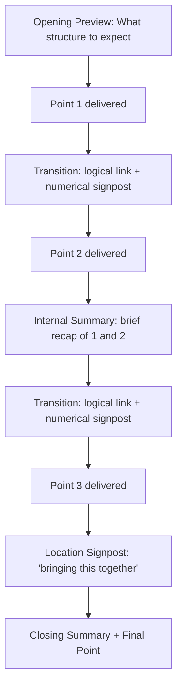

## Using Transitions and Signposting

### Overview

Transitions and signposting are the verbal devices that make a speech's structure audible in real time. Because a live audience cannot see headings, re-read prior sentences, or flip back a page, structural clarity that would be visually obvious in a written document must be explicitly spoken aloud. Transitions connect ideas logically; signposts orient the audience within the overall structure. Together they are the primary mechanism by which an outline that exists in the speaker's head becomes perceptible to a listening audience.

### Distinguishing Transitions from Signposts

**Key Points**

- **Transitions** are phrases that connect two ideas or sections, making the logical relationship between them explicit (causal, contrastive, sequential, cumulative).
- **Signposts** are phrases that orient the audience within the speech's overall structure, telling them where they are ("that's my first point"), how many points remain ("two more reasons to cover"), or what's coming next ("now let's turn to...").
- **Overlap in practice** — many spoken phrases perform both functions simultaneously (e.g., "Now that we've covered the problem, let's move to my second point: the solution" both transitions logically and signposts structurally), so the distinction is functional rather than strictly categorical.

### Categories of Transition Language

| Relationship Type | Example Phrases | Function |
| --- | --- | --- |
| Causal | "As a result," "because of this," "this is why" | Signals one idea causes or explains another |
| Contrastive | "However," "on the other hand," "despite this" | Signals a shift in direction or acknowledged tension |
| Cumulative/Additive | "In addition," "building on this," "furthermore" | Signals the next point adds to the current one |
| Sequential/Temporal | "First... then... finally," "next," "after that" | Signals order or chronology |
| Comparative | "Similarly," "in the same way," "by contrast" | Signals a parallel or divergent relationship |
| Conditional | "If this is true, then," "assuming that" | Signals a logical dependency |
| Concessive | "Even though," "granted that," "while it's true that" | Acknowledges a countervailing point before proceeding |

### Categories of Signpost Language

- **Numerical signposts** — "my first point," "the second reason," "finally" — explicitly counting through a structure, particularly useful for audiences tracking multiple parallel points.
- **Preview signposts** — "before I get to the solution, I need to explain the cause" — telling the audience what's coming and why, reducing uncertainty about the speech's direction.
- **Internal summary signposts** — "so to recap what we've covered so far" — briefly restating completed content before moving on, reinforcing retention at natural break points.
- **Location signposts** — "we're now at the heart of the argument" or "as I bring this to a close" — orienting the audience to their position within the overall speech, particularly useful in longer presentations.
- **Emphasis signposts** — "this next point is the most important one" — explicitly flagging relative significance, since live audiences cannot rely on visual cues like bold text or headers to infer emphasis.

### The Functional Flow of Signposting Across a Speech

### Technique: Calibrating Signpost Density to Content Complexity

**Key Points**

- **Dense, technical, or unfamiliar content requires heavier signposting** — audiences processing new or complex information benefit from more frequent explicit orientation, since cognitive load is already elevated by the content itself.
- **Familiar or simple content tolerates lighter signposting** — over-signposting simple material can feel condescending or mechanical, drawing unnecessary attention to structure rather than content.
- **Longer speeches require more internal summaries** — extended presentations benefit from periodic recaps that shorter speeches can omit, since audience retention across longer time spans degrades without reinforcement.
- **High-stakes or emotionally significant sections may warrant lighter, less mechanical signposting** — heavily formulaic transitions ("moving on to my next point") can feel jarring in ceremonial or emotionally resonant sections where a more natural, less structurally overt transition preserves the tone.

### Technique: Varying Transition Language to Avoid Monotony

Repeating the identical transition phrase throughout a speech ("My next point is...") becomes noticeable and can feel mechanical. Varying the surface language while maintaining consistent underlying structure keeps transitions functional without becoming a distraction:

**Example**

Instead of repeating "My next point is..." three times, a speaker might vary: "That brings me to a second consideration..." / "There's another factor at play here..." / "Which raises a further question worth addressing..." Each performs the same structural signposting function (introducing the next main point) while sounding natural rather than templated.

### Transitions in Different Delivery Methods

- **Manuscript delivery** — transitions can be precisely scripted and worded in advance, allowing careful calibration of tone and rhythm, though risk sounding stilted if not rehearsed for natural vocal delivery.
- **Extemporaneous delivery** — transitions are often the most useful thing to script or memorize precisely, even when the surrounding content is delivered from an outline, because transitions carry disproportionate structural weight relative to their length; a speaker who has firmly internalized transitions can improvise content within sections while maintaining overall coherence.
- **Impromptu delivery** — signposting becomes especially important as a real-time organizational tool for the speaker as much as the audience, since verbally committing to "I have three points" forces the speaker to structure the response even without prior outlining.
- **Memorized delivery** — transitions are typically the most heavily rehearsed portions of a memorized speech, since a stumble during a transition is more disorienting to both speaker and audience than a stumble within a section's content.

### Signposting in Multi-Speaker and Group Presentations

Handoffs between speakers function as a specialized category of transition, requiring both logical connection and explicit signaling of the speaker change: "Now that we've covered the market opportunity [recap/logical link], I'll hand it over to Priya to walk through our go-to-market plan [explicit signpost of what's next and who]." Omitting either component (the logical link or the explicit handoff) creates a noticeably rougher transition than doing both.

### Signposting for Visual/Slide-Based Presentations

**Key Points**

- **Verbal signposting should not be replaced by slide titles alone** — audiences process spoken and visual information somewhat independently, so relying solely on a slide's header to convey structural transition (without a verbal signpost) can leave portions of the audience disoriented, particularly if attention lapses briefly.
- **Slide transitions and verbal transitions should be synchronized** — advancing a slide slightly after, rather than before, the verbal transition prevents the audience's visual attention from jumping ahead of the speaker's spoken logic.
- **Agenda slides function as a persistent visual signpost** — returning to a visible agenda slide periodically (sometimes with the current section highlighted) reinforces location signposting throughout a longer presentation.

### Common Pitfalls

- **Implicit transitions** — moving from one point to the next without any verbal bridge, forcing the audience to infer the logical relationship themselves, which increases the risk of losing less-attentive listeners.
- **Overuse of a single transition phrase** — mechanical repetition of the same connective ("next... next... next...") becomes noticeable and can feel unpolished.
- **Signposting without follow-through** — announcing "three points" and then delivering four, or losing count mid-speech, undermines the credibility that clear signposting is meant to build.
- **Transitions that misrepresent the logical relationship** — using a causal connective ("as a result") when the actual relationship is merely sequential or additive creates a false impression of logical rigor.
- **Over-signposting simple content** — excessive numerical or location signposting on straightforward material can feel condescending or padded.
- **Neglecting transitions in Q&A or unscripted segments** — failing to signpost when pivoting from a tangential question back to the main argument leaves the audience without a clear sense of where the discussion currently stands.

**Related Topics**

- Building a Logical Through-Line
- Classical Speech Structure: Exordium to Peroration
- Internal Summaries and Audience Retention Technique
- Group and Panel Presentations: Managing Speaker Handoffs
- Slide Design for Structural Clarity in Presentations
- Extemporaneous Delivery: Outlining and Rehearsal Strategies