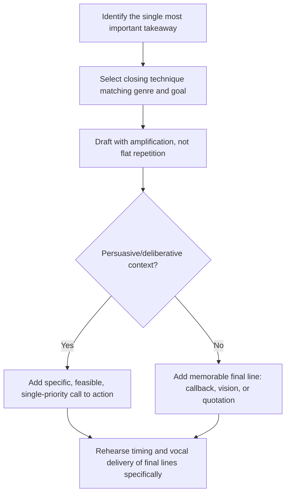

## Designing a Memorable Close and Call to Action

### Overview

The closing of a speech is its final and most durable impression, disproportionately shaping audience recall and, in persuasive contexts, determining whether the audience actually acts. This corresponds to the classical peroratio but treated here as a discrete technical skill: constructing a close that reinforces the central claim, resolves structural devices set up earlier, and — where appropriate — issues a clear, specific call to action.

### Why Closings Carry Disproportionate Weight

**Key Points**

- **Recency effect on memory** — psychological research on serial position effects suggests audiences disproportionately recall the most recent information presented, making the closing lines among the most retained content in the entire speech. [Inference] The strength of recency effects varies with speech length, content complexity, and audience attention, so this should be treated as a general tendency informing closing design rather than a guarantee of recall.
- **Last opportunity for emotional resonance** — the closing is the final chance to shift the audience from intellectual agreement to emotional commitment, which is often the actual determinant of whether persuasive content translates into action.
- **Structural closure** — a well-designed closing resolves tension or questions raised in the opening, giving the audience a sense of completeness rather than an abrupt stop.
- **Action-forcing function** — in persuasive and deliberative speech specifically, the closing is where abstract argument must convert into a concrete, actionable request; without this conversion, even a well-argued speech may fail to produce behavior change.

### Categories of Closing Techniques

| Technique | Mechanism | Best Fit |
| --- | --- | --- |
| Callback to the opening | Creates structural unity and closure | Speeches with a strong opening hook or image |
| Summary with amplification | Reinforces key points at heightened intensity | Longer, information-dense persuasive speeches |
| Explicit call to action | Converts agreement into specific behavior | Deliberative/policy persuasion |
| Vision/future-state closing | Paints a picture of the desired outcome | Motivational and change-management contexts |
| Quotation or aphorism | Borrows authority for a memorable final line | Ceremonial and inspirational contexts |
| Direct challenge to the audience | Issues a personal, provocative charge | Commencement and motivational speech |

### Technique: The Callback Close

Returning to an image, phrase, or question introduced in the opening creates a sense of narrative completeness, signaling to the audience that the speech has come full circle. This requires the opening and closing to be planned together during drafting rather than composed independently, since the callback's effectiveness depends entirely on the audience recognizing the return.

**Example**

Opening: "Three years ago, this district lost its only pediatric emergency room." Closing: "Three years ago, we lost that emergency room. Tonight, you have the chance to bring it back." The callback signals structural closure while reintroducing the emotional stakes established at the outset.

### Technique: Summary with Amplification

Unlike a flat restatement of prior points, an effective summary closing *amplifies* — raising the stakes or emotional register of points already made rather than merely repeating them verbatim. A summary that reads identically to its first statement earlier in the speech underperforms one that intensifies or reframes the point for the final impression.

### Technique: The Explicit Call to Action

**Key Points**

- **Specificity is the primary determinant of effectiveness** — a call to action that specifies exactly what the audience should do, by when, and how, is substantially more likely to produce behavior change than a vague exhortation to "get involved" or "do something."
- **Feasibility must be visible** — the audience needs to perceive the requested action as achievable; a call to action that feels disproportionate to the audience's actual capacity can produce disengagement rather than motivation (related to the Extended Parallel Process Model's finding that fear or urgency without perceived efficacy tends to produce avoidance).
- **Single, prioritized ask** — presenting one clear primary action rather than several competing requests increases the likelihood that the audience retains and acts on it; multiple asks dilute attention and follow-through.
- **Immediate next step** — where possible, providing an action the audience can take immediately (signing something, scanning a code, raising a hand) capitalizes on the motivational peak created by the speech itself, before that motivation naturally decays.

**Example**

Weak call to action: "We need everyone to care more about this issue." Strong call to action: "Before you leave tonight, sign the petition at the table by the door — we need 500 signatures by Friday to get this on the ballot."

### Technique: The Vision/Future-State Closing

Painting a vivid picture of the desired future outcome — what success looks like if the audience acts, or what is lost if they don't — leverages pathos to make abstract stakes feel concrete and personally relevant. This technique is particularly common in change-management and motivational contexts where the goal is shifting audience attitude or commitment rather than a single discrete action.

### Technique: Quotation or Aphorism Closings

A well-chosen quotation can provide a memorable, quotable final line that borrows external authority, particularly effective in ceremonial contexts. As with quotation-based openings, this carries risk of feeling clichéd if overused within a genre, and requires verification of accurate sourcing to protect credibility.

### Technique: The Direct Challenge

Common in commencement and motivational speech, this closing technique directly and personally addresses the audience with a charge or challenge ("Go be the kind of leader this moment requires"), functioning as a more intense, individually-directed variant of the call to action, oriented toward attitude or identity shift rather than a single discrete behavior.

### Structural Sequence for Constructing a Close

### Delivery Considerations for Closings

Because the closing carries disproportionate weight for audience recall and emotional impact, it is one of the most commonly memorized or heavily rehearsed sections of a speech even when the body is delivered extemporaneously or from an outline. A stumble or loss of composure during the closing is more damaging to overall speech impact than an equivalent stumble in the body, since it directly undermines the moment intended to be most polished and impactful.

### Common Pitfalls

- **Flat restatement without amplification** — a summary that merely repeats earlier points verbatim, without heightened stakes or emotional register, underperforms a closing that clearly escalates.
- **Trailing off or ending on a logistical note** ("That's basically it, thanks") — a weak or abrupt ending undercuts the impact of an otherwise strong speech; the final words should be deliberately chosen, not incidental.
- **Vague or unfeasible calls to action** — asking an audience to "care more" or "do better" without specifying a concrete, achievable next step rarely produces measurable behavior change.
- **Multiple competing asks** — diluting the call to action across several requests reduces the likelihood that the audience retains or acts on any single one.
- **New information introduced in the closing** — introducing substantively new content at the close, rather than reinforcing what has already been established, can confuse rather than crystallize the speech's argument.
- **Mismatched intensity for the occasion** — an overly dramatic closing on a low-stakes topic, or an underpowered closing on a high-stakes one, misjudges the audience's expected emotional register.
- **Unplanned callback devices** — attempting a callback to the opening without having deliberately planted the reference earlier can feel forced or go unrecognized by the audience.

**Related Topics**

- Crafting a Compelling Opening and Hook
- Classical Speech Structure: Exordium to Peroration
- Monroe's Motivated Sequence and the Action Step
- Building a Logical Through-Line
- Vocal Delivery Technique for High-Stakes Moments
- Extended Parallel Process Model and Fear-Appeal Efficacy