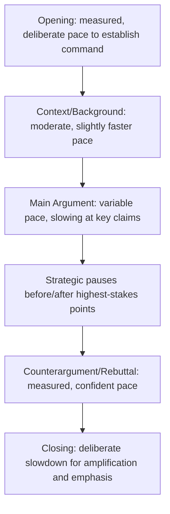

## Time Management and Pacing in Delivery

### Overview

Time management and pacing govern how content is allocated across available speaking time and how vocal and structural rhythm sustains audience engagement throughout delivery. These are distinct but related disciplines: time management is the planning-stage allocation of content to fit a time constraint, while pacing is the real-time control of speed, rhythm, and emphasis during delivery itself. Both directly affect whether a speech's structure and argument actually land as intended.

### Time Management: Planning-Stage Allocation

**Key Points**

- **Content must be sized to time, not the reverse** — the common failure mode is drafting content first and then discovering it doesn't fit, rather than allocating time budgets to sections before drafting.
- **Words-per-minute as a planning heuristic** — conversational speaking rate for prepared remarks is commonly estimated around 130-160 words per minute, though this varies by speaker, content density, and delivery style; a rough word count target can be calculated from the total time budget using this range. [Inference] Actual speaking rate varies considerably by individual speaker, topic complexity, and delivery context, so this figure should be used only as a rough planning estimate, not a precise constraint.
- **Buffer allocation** — reserving 10-15% of total time as buffer for pacing variation, audience reaction (laughter, applause), or unplanned Q&A protects against running over in live delivery.
- **Section-level time budgets** — allocating specific time targets to each structural section (exordium, confirmatio, peroratio, or problem/solution/action) during outlining, rather than only tracking total speech length, prevents any single section from consuming disproportionate time at another's expense.

#### Time Budget Allocation Example

| Section | Target % of Total Time | 10-Minute Speech Example |
| --- | --- | --- |
| Opening/Hook | 5-10% | 30-60 seconds |
| Context/Background | 10-15% | 1-1.5 minutes |
| Main Content/Body | 55-65% | 5.5-6.5 minutes |
| Addressing Counterarguments | 10-15% | 1-1.5 minutes |
| Closing/Call to Action | 5-10% | 30-60 minutes* |

*Note: closing typically 30-60 seconds for a 10-minute speech; percentage ranges are illustrative planning targets and should be adjusted to genre and occasion.

### Technique: Rehearsal-Based Time Calibration

Because planning-stage word counts are only approximate, rehearsing a speech aloud against a timer — not merely reading it silently — is the most reliable method for calibrating actual delivery time, since silent reading speed differs substantially from spoken delivery speed and does not account for pauses, emphasis, or audience interaction points. Multiple timed rehearsals, ideally including at least one rehearsal in front of a listener or recording device, surface pacing issues that silent review cannot reveal.

### Technique: The Cutting Hierarchy

When a rehearsed speech runs over its allocated time, a disciplined cutting priority protects the speech's core argument:

1. **Cut illustrative redundancy first** — if two examples make the same point, cut one before touching structural content.
2. **Cut secondary supporting evidence next** — retain the strongest piece of evidence for each claim, trim additional supporting data.
3. **Compress, don't eliminate, transitions** — shorten connective language rather than removing it entirely, since transitions remain necessary for coherence even under time pressure.
4. **Protect the through-line and call to action last** — the central claim, its primary support, and the closing action step should be the last elements cut, since removing them undermines the speech's fundamental purpose.

### Pacing: Real-Time Rhythm Control

**Key Points**

- **Variable pace signals emphasis** — slowing down on key points and speeding up on less critical connective or contextual material helps an audience implicitly identify what matters most, functioning as an audible equivalent of bold text or emphasis in writing.
- **The strategic pause** — a deliberate silence before or after an important point draws attention to it more effectively than any change in volume or speed; pauses also give the audience processing time for dense or emotionally significant content.
- **Avoiding the monotone trap** — delivering all content at a uniform pace and volume, regardless of relative importance, is a common and easily correctable pacing failure that flattens emphasis and reduces audience engagement.
- **Pacing as anxiety management** — nervous speakers frequently speed up unconsciously under pressure; deliberately building in planned pauses and consciously monitored pace can counteract this tendency.

### Technique: The Strategic Pause

Pauses serve several distinct functions depending on placement:

- **Pre-point pause** — a brief silence immediately before a key statement heightens anticipation and signals importance.
- **Post-point pause** — a silence immediately after a significant statement allows it to resonate rather than being immediately diluted by the next sentence.
- **Transition pause** — a brief pause at structural boundaries (between main points) gives the audience a moment to mentally close one section before opening the next.
- **Recovery pause** — in the event of a stumble or lost train of thought, a composed pause is markedly less disruptive to audience perception than a rushed or visibly flustered recovery attempt.

### Pacing Flow Across a Speech

### Technique: Managing Time in Real Time During Delivery

- **Visible or felt time checkpoints** — establishing internal markers ("I should be starting my second point by the 4-minute mark") allows a speaker to self-correct pacing during delivery rather than discovering a timing problem only at the end.
- **Pre-planned cut points** — knowing in advance which sections can be shortened or skipped if running long allows real-time adjustment without visible panic or improvised, incoherent cutting.
- **Reading room energy without abandoning the plan** — while some pacing adjustment based on audience engagement is valuable (e.g., slowing down if visible confusion appears), wholesale improvisation in response to perceived audience mood risks abandoning a carefully constructed through-line.

### Pacing Considerations Across Delivery Methods

| Delivery Method | Pacing Characteristics |
| --- | --- |
| Manuscript | Requires deliberate marked pauses in the script itself; risk of a flat, unvaried reading pace without conscious effort |
| Extemporaneous | Natural pacing variation is easier to achieve since content isn't verbatim, but requires internalized time-checkpoints against the outline |
| Memorized | Risk of a rehearsed, uniform pace that can sound recited rather than spontaneous unless pacing variation is deliberately built into rehearsal |
| Impromptu | Time management is largely reactive; PREP-style structures help by imposing a natural pacing rhythm even without extensive preparation |

### Pacing in Multi-Speaker Formats

In team and panel presentations, pacing coordination extends beyond individual delivery to overall session rhythm: uneven pacing across speakers (one rushing, another dragging) disrupts the audience's sense of the presentation's overall rhythm, making joint rehearsal against a shared timer a priority alongside individual pacing practice.

### Common Pitfalls

- **Drafting content without a time budget, then cutting under pressure at the last minute** — produces reactive, often poorly prioritized cuts that can damage the through-line if made hastily.
- **Uniform pace regardless of content importance** — a monotone delivery pace flattens emphasis and makes it difficult for audiences to identify the speech's most important claims.
- **Rushing under nervousness** — speeding up unconsciously when anxious, often most pronounced in the opening, which can undermine the deliberate, confidence-signaling pace an opening benefits from.
- **Fear of silence** — avoiding strategic pauses out of discomfort with silence, which sacrifices one of the most effective tools for signaling emphasis and giving audiences processing time.
- **Cutting the call to action or through-line under time pressure** — protecting less essential content (a tangential anecdote, a secondary example) while cutting the closing action step, inverting the correct cutting hierarchy.
- **Relying solely on silent read-throughs for time estimation** — silent reading pace does not reliably predict spoken delivery time, leading to miscalibrated time budgets discovered only during live delivery.

**Related Topics**

- Building a Logical Through-Line
- Designing a Memorable Close and Call to Action
- Vocal Delivery Technique: Pitch, Volume, and Emphasis
- Rehearsal Strategies for Extemporaneous Delivery
- Managing Nervousness and Anxiety in Public Speaking
- Group and Panel Presentations: Coordinating Shared Timing