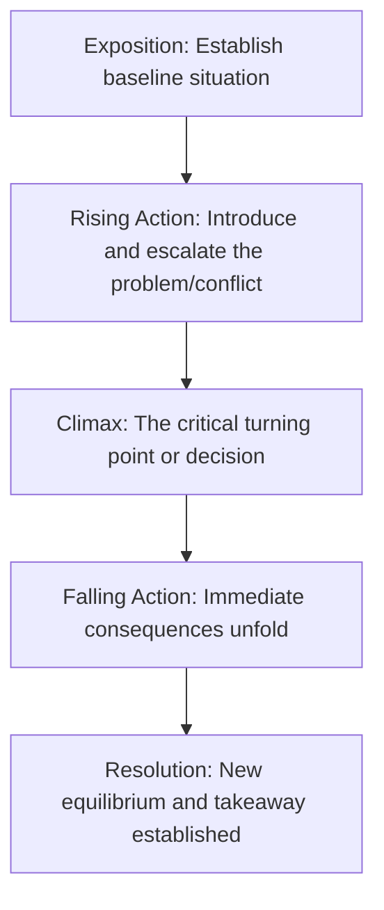

## The Narrative Arc and Story Architecture

### Overview

Narrative arc and story architecture describe the structural patterns underlying effective storytelling, adapted from literary and dramatic theory for use in executive and professional contexts. Unlike purely logical argument structures (Problem-Solution, PREP, classical dispositio), narrative architecture organizes content around character, tension, and resolution — leveraging the audience's deep familiarity with story patterns to make information more engaging, memorable, and emotionally resonant than argument alone typically achieves.

### Why Narrative Works: The Underlying Mechanism

**Key Points**

- **Cognitive ease of narrative processing** — human cognition is highly adapted to processing sequential cause-and-effect story structures, often described in narrative-psychology literature as a more "natural" processing mode than abstract or statistical argument.
- **Emotional engagement drives retention** — narrative content that generates emotional investment in an outcome is generally retained longer than equivalent information presented as abstract data or bullet points.
- **Transportation effect** — audiences psychologically "transported" into a narrative (absorbed in the story world) tend to experience reduced critical scrutiny of embedded claims, a mechanism documented in narrative persuasion research (associated with Green and Brock's transportation theory). [Unverified] The magnitude and reliability of transportation effects vary across studies and contexts, so this should be treated as a documented tendency in the research literature rather than a guaranteed outcome for any specific speech.
- **Concrete anchoring of abstract concepts** — a story's specific characters, setting, and events make abstract principles tangible and easier to recall than the principle stated in isolation.

### The Classical Narrative Arc

| Stage | Function | Executive Communication Equivalent |
| --- | --- | --- |
| Exposition | Establishes setting, characters, baseline situation | Business context, status quo before the problem |
| Rising Action | Introduces conflict, complications, mounting tension | The problem emerges and intensifies |
| Climax | The turning point, moment of maximum tension | The critical decision point or moment of crisis |
| Falling Action | Consequences of the climax begin to unfold | Initial results of the decision or intervention |
| Resolution | Tension resolved, new equilibrium established | Outcome achieved, lessons learned, path forward |

### Narrative Arc Structure

### Freytag's Pyramid and the Man vs. Situation Framework

Freytag's five-part dramatic structure (exposition, rising action, climax, falling action, denouement/resolution) provides the classical literary basis for the arc above. In business storytelling, the "conflict" driving rising action is commonly reframed as a business challenge, market disruption, operational failure, or competitive threat rather than interpersonal antagonism, but the underlying tension-escalation-resolution mechanics remain structurally identical.

### Character in Executive Storytelling

**Key Points**

- **The protagonist need not be a person** — in business narrative, the "protagonist" is frequently the organization, a team, a product, or even the audience themselves (in second-person framing: "imagine you're facing this problem").
- **Relatable stakes drive investment** — audiences invest in a narrative's outcome to the degree they perceive the protagonist's stakes as relevant to their own concerns; establishing this relevance early is critical to narrative engagement.
- **The antagonist force need not be a villain** — market conditions, technical constraints, organizational inertia, or simply uncertainty can function as the opposing force driving rising action, without requiring a literal adversary.
- **Specificity over abstraction in characterization** — a story about "a customer" is less engaging than a story about a specific, named (or realistically composited) customer with concrete details, since specificity is what makes narrative more memorable than equivalent abstract description.

### Technique: Establishing Stakes Early

The rising action's tension only registers with an audience if the stakes have been clearly established during exposition — what is at risk, for whom, and why it matters. Narrative that escalates tension without first establishing what's at stake produces confusion rather than engagement, since the audience cannot appreciate rising conflict without understanding what could be lost or gained.

**Example**

Weak exposition: "Our support team was struggling." Strong exposition: "Every unresolved ticket meant a customer deciding whether to renew a six-figure contract — and our support team was closing fewer than 60% of tickets within the promised 24-hour window." The second version establishes concrete, business-relevant stakes that make the subsequent rising action (further ticket backlog, specific customer losses) land with clear significance.

### Technique: Compressing the Arc for Business Contexts

Full five-stage literary arcs are often compressed for executive communication, where time constraints demand efficiency:

- **Micro-narrative (30-90 seconds)** — often compresses to just exposition-climax-resolution, omitting extended rising and falling action; used for brief illustrative anecdotes within a larger presentation.
- **Case-study narrative (2-5 minutes)** — retains most of the five-stage structure but compresses falling action, moving quickly from climax to resolution and takeaway.
- **Full narrative-driven presentation (10+ minutes)** — can sustain a fuller arc with distinct rising action beats and a more developed falling action before resolution.

### Technique: Multiple Narrative Threads (Braided Structure)

More sophisticated executive storytelling sometimes braids two narrative threads — for example, alternating between a customer's story and an internal team's story — that converge at a shared climax or resolution. This technique requires careful pacing to avoid audience confusion about which thread is currently active, typically managed through explicit signposting when switching threads ("Meanwhile, back at headquarters...").

### The Hero's Journey as an Extended Framework

[Inference] Joseph Campbell's monomyth (the "Hero's Journey") — call to adventure, trials, transformation, return — is sometimes adapted for longer-form executive narratives such as company origin stories, turnaround narratives, or personal leadership journeys, though its application to business contexts is a looser analogical borrowing rather than a precise structural mapping, and its use should be calibrated to whether the underlying story genuinely supports a transformation-and-return arc rather than forced onto content that doesn't fit it.

### Integrating Narrative Arc with Argumentative Structure

**Key Points**

- **Narrative as illustration within argument, not replacement for it** — in most executive contexts, narrative arc serves as a vivid supporting device embedded within a broader argumentative structure (Problem-Solution, classical dispositio) rather than replacing logical argumentation entirely.
- **Placement within the confirmatio or main body** — narrative anecdotes are commonly placed within the confirmatio/main-content section to illustrate and humanize a claim that is otherwise supported by data or reasoning.
- **The takeaway bridge** — a narrative segment should end with an explicit bridge connecting its resolution back to the speech's central through-line, since audiences may otherwise enjoy the story without connecting it to the broader argument.

### Common Pitfalls

- **Underdeveloped stakes** — introducing conflict or tension before the audience understands why it matters, which produces engagement failure regardless of how well-told the subsequent story is.
- **Meandering rising action** — extending complications or tension-building beyond what serves the narrative's point, losing audience patience before reaching the climax.
- **Missing resolution or unclear takeaway** — a narrative that builds tension but fails to clearly resolve it, or resolves it without connecting back to the speech's broader argument, leaves the audience without a clear sense of why the story was told.
- **Overly complex braided structures** — attempting parallel narrative threads without sufficient signposting, confusing the audience about which thread is currently active.
- **Forcing a narrative framework onto content that doesn't fit** — imposing a full Hero's Journey or five-stage arc onto material that lacks genuine dramatic tension produces a stretched, artificial-feeling narrative.
- **Fabrication or exaggeration for dramatic effect** — embellishing details beyond what actually occurred to heighten narrative tension raises both ethical concerns and credibility risk if discovered.

**Related Topics**

- Case Study and Anecdote Selection for Executive Presentations
- Character and Stakes: Making Business Narrative Relatable
- Data Storytelling: Integrating Narrative with Quantitative Evidence
- The Hero's Journey in Leadership and Organizational Narrative
- Building a Logical Through-Line
- Narrative Transportation Theory and Persuasion Research