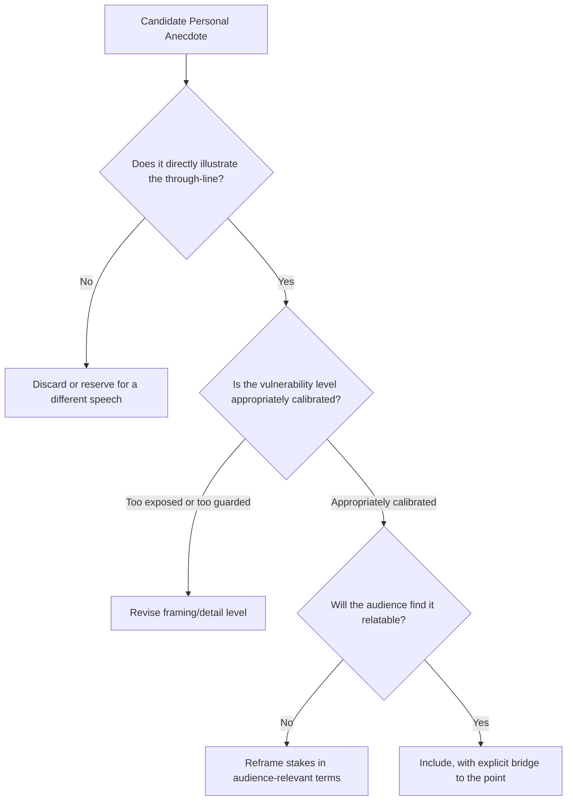

## Selecting and Shaping Personal Anecdotes

### Overview

Personal anecdotes are first-person narrative fragments drawn from the speaker's own experience, used to illustrate a point, build credibility, or create emotional connection. Unlike case studies or third-party stories, personal anecdotes carry unique authenticity value precisely because they are the speaker's own lived experience, but they also carry unique risks around self-focus, oversharing, and relevance discipline that this item addresses specifically.

### Why Personal Anecdotes Carry Distinct Rhetorical Weight

**Key Points**

- **Authenticity premium** — a first-person account is generally perceived as more credible and less rehearsed than a third-party case study, since the speaker is a direct witness to their own experience rather than a reporter of someone else's.
- **Vulnerability as a credibility signal** — appropriately calibrated self-disclosure, including admitting mistakes or struggles, can increase audience trust by signaling honesty rather than a curated, invulnerable image, though this must be balanced against maintaining professional credibility (see calibration guidance below).
- **Direct ethos-building function** — because the anecdote is about the speaker, it simultaneously illustrates a point and builds the speaker's own credibility, a dual function that third-party stories don't automatically provide.
- **Risk of perceived self-indulgence** — because the genre centers the speaker, poorly calibrated personal anecdotes risk feeling self-congratulatory or irrelevant to the audience's actual concerns if selection and framing discipline is weak.

### Selection Criteria for Personal Anecdotes

A personal anecdote should be evaluated against explicit criteria before inclusion, since not every memorable personal experience serves a given speech's purpose:

1. **Direct relevance to the through-line** — the anecdote must illustrate the specific point being made, not merely be interesting on its own; an entertaining but tangential story dilutes rather than reinforces the argument.
2. **Appropriate vulnerability level** — the anecdote should reveal enough genuine struggle or humanity to build connection, without oversharing content that shifts audience focus to concern for the speaker rather than the point being illustrated.
3. **Audience relatability** — the specific circumstances should be translatable to audience experience, even if the literal details differ (a startup founder's near-failure story can resonate with a corporate audience if the underlying tension — risk, uncertainty, difficult decisions — is relatable).
4. **Verifiable accuracy** — because personal anecdotes carry an implicit claim of truthfulness, embellishing or fabricating details for dramatic effect creates significant credibility risk if ever discovered or contradicted.
5. **Freshness within the speaker's repertoire** — for speakers who present repeatedly to overlapping audiences, reusing the same anecdote across multiple appearances risks audience recognition and perceived staleness.

### The Selection Filter

### Technique: Shaping — From Raw Memory to Rhetorical Anecdote

**Key Points**

- **Compression to essential detail** — raw memory typically contains far more detail than serves the rhetorical point; effective shaping strips extraneous detail (names of minor characters, unrelated subplot events, excessive scene-setting) while retaining the specific, concrete details that make the story vivid.
- **Restructuring for narrative clarity** — actual lived experience rarely unfolds in the cleanest possible narrative order; shaping an anecdote for delivery often means reordering events for clarity and impact rather than strict chronological accuracy, while preserving factual truthfulness about what actually occurred.
- **Selecting the "telling detail"** — one specific, sensory, concrete detail (a particular phrase someone said, a specific number, a physical sensation) often does more rhetorical work than extended general description, since specificity is what separates a memorable anecdote from a vague generalization.
- **Explicit bridge to the point** — a shaped anecdote should end with a clear, explicit statement connecting the story to the broader argument, rather than trusting the audience to infer the connection independently.

**Example**

Raw memory (unshaped): "I was working at my first startup and we had all these problems with our product and the team was stressed and we had a lot of meetings about what to do and eventually we figured out a fix and it worked out okay in the end." Shaped anecdote: "Six months into my first startup, our biggest customer called to cancel — not because our product didn't work, but because they said, 'I don't understand what problem this actually solves for us.' That sentence changed how I think about product design permanently: if you can't explain the problem in the customer's own words, you haven't earned the right to explain your solution."

### Technique: Calibrating Vulnerability

Self-disclosure exists on a spectrum, and the appropriate level depends on context, audience, and occasion:

| Vulnerability Level | Content Type | Best Fit |
| --- | --- | --- |
| Low | Professional challenges, tactical mistakes, resolved with clear lessons | Corporate/business presentations, most professional contexts |
| Moderate | Personal struggles connected to professional growth, acknowledged uncertainty | Leadership talks, mentorship contexts, some keynotes |
| High | Deeply personal experiences, unresolved tension, significant emotional exposure | Ceremonial speech, TED-style personal narrative talks, specific invited vulnerability contexts |

[Inference] Selecting too high a vulnerability level for a given professional context risks the audience perceiving the disclosure as inappropriate or attention-seeking, while too low a level in a context that invites personal narrative (e.g., a TED-style talk explicitly seeking personal story) can feel guarded or evasive; the appropriate calibration depends heavily on occasion norms and audience expectation, which the speaker should assess before selecting an anecdote's disclosure depth.

### Technique: The Self-Deprecating Anecdote

A specific and widely used subcategory: anecdotes where the speaker is the one who erred, misjudged, or failed, used to build relatability and disarm potential audience skepticism before pivoting to a lesson learned. This technique works because it demonstrates humility and self-awareness while still allowing the speaker to control the narrative's ultimate resolution (the lesson extracted from the failure).

**Key Points**

- Self-deprecating anecdotes should resolve toward genuine insight, not merely self-mockery, or the story can feel like padding rather than substantive illustration.
- Overuse of self-deprecation across a single speech can undermine overall credibility if it begins to suggest genuine incompetence rather than calibrated humility.

### Placement of Personal Anecdotes Within a Speech

- **Opening placement** — personal anecdotes used as hooks establish both attention and early ethos simultaneously, though require the anecdote to clearly foreshadow the speech's thesis.
- **Confirmatio/body placement** — personal anecdotes used within the main argument typically illustrate a specific claim, functioning as a concrete example supporting an otherwise abstract or data-driven point.
- **Closing placement** — a personal anecdote in the closing, particularly one that resolves a tension established in the opening, can serve as an effective callback device reinforcing structural unity.

### Common Pitfalls

- **Irrelevant but entertaining anecdotes** — including a story because it's a strong story on its own merits, without a tight connection to the through-line, which dilutes rather than reinforces the argument.
- **Excessive length relative to rhetorical payoff** — an anecdote that takes disproportionate time relative to the single point it illustrates risks losing audience patience.
- **Oversharing beyond audience comfort** — vulnerability calibrated too high for the professional context, shifting audience attention to concern for the speaker rather than the intended lesson.
- **Missing the explicit bridge** — ending an anecdote without clearly connecting it back to the point, leaving the audience to guess why the story was told.
- **Fabrication or embellishment** — altering facts for dramatic effect, which creates significant credibility risk if the speaker's account is ever compared against other records of the same events.
- **Anecdote fatigue from overuse** — repeatedly using the same signature story across many appearances to audiences with overlapping membership, risking recognition and diminished impact.
- **Self-focus that crowds out audience relevance** — an anecdote that centers the speaker's experience without clearly translating its relevance to the audience's own concerns.

**Related Topics**

- The Narrative Arc and Story Architecture
- Case Study and Third-Party Story Selection
- Building a Logical Through-Line
- Crafting a Compelling Opening and Hook
- Ethos and Credibility-Building Technique
- Vulnerability and Authenticity in Leadership Communication