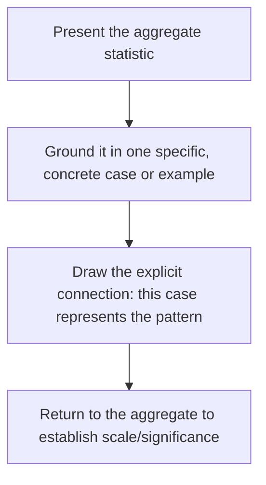

## Data Storytelling: Pairing Numbers With Narrative

### Overview

Data storytelling is the technique of embedding quantitative evidence within narrative structure so that numbers acquire meaning, stakes, and memorability beyond what raw statistics convey alone. Executive audiences are routinely presented with data; the differentiator between forgettable and impactful presentations is often not data quality but whether that data is contextualized through a story that makes its significance concrete and human.

### Why Numbers Alone Underperform

**Key Points**

- **Statistics lack inherent emotional weight** — a number in isolation ("customer churn increased 12%") requires the audience to independently construct its significance; narrative context does that work for them.
- **Psychic numbing on large figures** — research on numerical cognition suggests audiences struggle to emotionally process very large statistics (e.g., figures in the millions or billions) with the same intensity as a single, specific, relatable case, a pattern sometimes discussed in decision-research literature as related to the "identifiable victim effect." [Inference] The strength and generality of this effect varies across studies, populations, and the specific framing used, so it should be treated as a documented tendency rather than a universal law applicable to every dataset or audience.
- **Retention asymmetry** — audiences frequently recall the story or example that accompanied a statistic long after they have forgotten the statistic's precise value, making narrative framing a retention tool as much as a persuasion tool.
- **Numbers alone don't answer "so what"** — a statistic establishes a fact, but narrative is what typically establishes why that fact matters to this specific audience.

### Core Technique: The Statistic-Story Pairing

The foundational data storytelling pattern pairs an aggregate statistic with a single, specific, illustrative case that makes the statistic concrete:

**Example**

"Our support team resolved 94% of tickets within 24 hours last quarter [statistic] — but the 6% that didn't included Maria, a small-business owner who called four times over eight days trying to get her payment system working before finally canceling her subscription [specific case]. Multiply Maria by the roughly 340 other customers in that 6%, and that's not a rounding error — that's real revenue walking out the door because of a process gap we can actually fix [return to aggregate with reframed significance]."

### Technique: Sequencing — Story-First vs. Data-First

| Sequence | Structure | Best Fit |
| --- | --- | --- |
| Data-first | Statistic → illustrative case → significance | Analytical or skeptical audiences who want to see the evidence before the narrative frame |
| Story-first | Case/anecdote → reveal it represents a broader pattern → statistic confirms scale | Audiences more responsive to emotional entry points; effective for surprising or counterintuitive data |
| Interwoven | Narrative and data alternate throughout a longer piece | Extended presentations or reports where sustained engagement across multiple data points is needed |

[Inference] The optimal sequencing choice depends substantially on audience disposition and the nature of the data itself (surprising vs. expected, positive vs. negative), so this should be treated as a set of situational options rather than a fixed rule for all data storytelling contexts.

### Technique: Choosing the Right Data Visualization to Support the Narrative

**Key Points**

- **Visualization should serve the story's point, not display data comprehensively** — a chart included because it's available, rather than because it directly supports the specific claim being made, adds clutter rather than clarity.
- **Annotation over raw display** — labeling the specific data point or trend relevant to the narrative (with a callout, highlight, or annotation) directs audience attention to what matters rather than requiring them to independently locate the relevant detail in a dense chart.
- **Simplification for spoken delivery** — visualizations accompanying live narration should be simpler than those intended for independent reading, since the audience is simultaneously processing spoken narrative and visual information.
- **Consistent framing across the narrative arc** — if a chart establishes a baseline in the exposition, revisiting the same visual (updated) at the resolution reinforces the narrative's before-and-after structure.

### Technique: Framing Statistics for Maximum Impact

- **Relative framing over raw numbers** — contextualizing a statistic against a meaningful baseline ("three times higher than our industry average" rather than a raw percentage) often communicates significance more effectively than the number alone.
- **Per-unit reframing for scale** — translating aggregate figures into per-person, per-day, or per-transaction terms can make large numbers more cognitively tractable ("that's one customer every eleven minutes," rather than "4,800 customers last month").
- **Avoiding statistical overload** — presenting too many statistics in sequence without narrative breathing room causes audience disengagement; data storytelling generally benefits from a small number of well-chosen, well-framed statistics rather than a comprehensive data dump.
- **Honest framing discipline** — selecting the most dramatic possible framing of a statistic (e.g., relative percentage change on a small base rate) without disclosing the underlying context risks both ethical concern and credibility damage if the framing is later scrutinized.

### Technique: The Composite Character for Data Illustration

When a single real case isn't available, appropriate, or sufficiently representative, some data storytellers construct a composite character — a realistic but non-literal illustrative example built from patterns in the actual data — to humanize a statistic without misrepresenting a specific individual's actual story.

**Key Points**

- **Explicit disclosure is an ethical requirement** — if a composite or illustrative (rather than literal, verified) example is used, this should generally be disclosed to the audience ("imagine a customer like...") rather than presented as a specific real account, to avoid implying false verification.
- **Grounding in actual data patterns** — an effective composite reflects genuine statistical patterns in the underlying dataset rather than an invented scenario chosen purely for dramatic effect.

### Structural Integration Within a Larger Presentation

Data storytelling techniques typically operate within the confirmatio/main-body section of a broader speech structure, serving as the illustrative mechanism supporting the speech's overall through-line. A single data-story pairing rarely constitutes an entire presentation; more commonly, several such pairings are sequenced to build the overall argument, with each pairing supporting a distinct claim within the larger structure.

### Common Pitfalls

- **Data dumping without narrative context** — presenting a slide full of statistics without a story or framing that establishes their significance, leaving audience interpretation to chance.
- **Cherry-picked statistics that misrepresent the broader pattern** — selecting the single most dramatic data point without disclosing whether it's representative, which risks credibility damage if scrutinized.
- **Overloading visuals** — including comprehensive, dense charts intended for independent reading rather than simplified visuals appropriate for live spoken narration.
- **Undisclosed composite examples** — presenting an illustrative, non-literal example as though it were a specific verified case, misleading the audience about the nature of the evidence.
- **Losing the narrative in service of precision** — including excessive statistical caveats or methodological detail that disrupts narrative flow; precision and narrative clarity should be balanced according to audience and stakes, with detailed methodology often better suited to supplementary materials than live narration.
- **Statistic without a clear "so what"** — presenting a number without explicitly connecting it to why the audience should care or what action it implies.

**Related Topics**

- The Narrative Arc and Story Architecture
- Selecting and Shaping Personal Anecdotes
- Visual Aid Design for Technical and Executive Audiences
- Ethical Framing of Statistics and Evidence
- Building a Logical Through-Line
- Informative Speaking Techniques: Visual and Multimedia Support