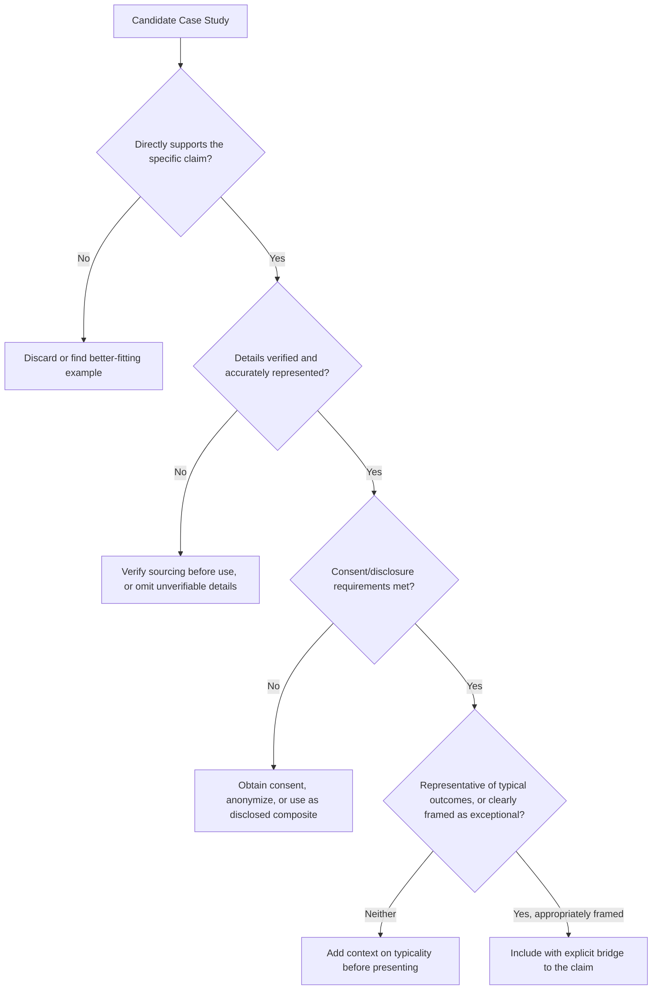

## Using Case Studies and Customer Stories

### Overview

Case studies and customer stories are third-party narrative evidence — accounts of another organization's or individual's experience — used to substantiate claims, demonstrate outcomes, and build credibility through external validation rather than the speaker's own authority alone. They differ from personal anecdotes in a key respect: their persuasive force derives from independent verifiability and social proof rather than from the speaker's direct lived experience, making rigor in sourcing and representation a distinct technical concern.

### Case Studies vs. Personal Anecdotes vs. Composite Examples

| Type | Source | Primary Persuasive Mechanism | Verification Standard |
| --- | --- | --- | --- |
| Personal anecdote | Speaker's own experience | Authenticity, direct witness credibility | Speaker's own honest account |
| Case study | Documented third-party outcome | Independent evidence, social proof | Should be verifiable/sourced |
| Customer story | Named or attributed customer account | Social proof, relatability, external validation | Requires customer consent/accuracy |
| Composite example | Constructed from data patterns | Illustrative clarity | Requires explicit disclosure as non-literal |

### Why Case Studies Carry Distinct Persuasive Weight

**Key Points**

- **Social proof mechanism** — audiences weigh evidence that "someone like me" achieved a result more heavily than an abstract claim of capability, since a third-party outcome implies independent validation the speaker's own claims cannot provide.
- **Reduced perceived self-interest bias** — because the story is about someone other than the speaker, audiences may discount self-serving bias less than they would for a speaker's direct claims about their own product, service, or approach.
- **Specificity as credibility signal** — a case study with specific, verifiable details (named organization, concrete metrics, identifiable circumstances) is generally perceived as more credible than a vague or anonymized success story.
- **Risk of perceived cherry-picking** — because case studies are selected by the speaker, audiences aware of this selection process may discount an isolated success story unless it's positioned within broader context (e.g., "this is representative of X% of our customers," or corroborated by aggregate data).

### Selection Criteria for Case Studies and Customer Stories

1. **Direct relevance to the claim being supported** — the case study should map closely onto the specific outcome or capability being argued for, not merely be a generally positive story.
2. **Audience relatability of circumstances** — a case study drawn from a similar industry, company size, or situation to the audience increases perceived applicability ("if it worked for a company like ours...").
3. **Verifiable and accurately represented details** — figures, quotes, and outcomes attributed to a named customer or case should be accurate and, where possible, sourced or citable, since misrepresentation carries significant reputational and legal risk.
4. **Appropriate consent and disclosure** — using a named customer's story typically requires their consent, and the level of detail disclosed should respect any confidentiality agreements or sensitivities.
5. **Representativeness, not just impressiveness** — a single extreme outlier success story, presented without context about typical results, risks credibility damage if the audience later learns it wasn't representative.

### Selection and Verification Flow

### Technique: Structuring the Case Study Narrative

Case studies are commonly structured using a compressed version of the narrative arc, adapted to a business-evidence context:

1. **Situation/Challenge** — the customer's starting context and the specific problem faced (functions as exposition).
2. **Approach/Solution** — what was implemented or changed (functions as the turning point/climax).
3. **Outcome/Result** — the measurable or observed result (functions as resolution), ideally with specific figures or concrete detail rather than vague improvement claims.
4. **Bridge to the audience's own situation** — an explicit statement connecting the case study's relevance to the current audience's circumstances.

**Example**

"A regional healthcare provider was losing an average of eleven staff hours per week to manual appointment-reminder calls [Situation]. After implementing automated SMS reminders integrated with their existing scheduling system [Approach], they cut no-show rates by 22% and reallocated those eleven hours to direct patient care within the first quarter [Outcome]. Your scheduling volume is roughly comparable to theirs — this is the same category of manual overhead this proposal is designed to eliminate for your team [Bridge]."

### Technique: Framing a Case Study's Representativeness

**Key Points**

- **Aggregate corroboration strengthens a single story** — pairing an individual case study with aggregate data ("this isn't an isolated result — 78% of customers in a similar segment saw comparable improvement") addresses the cherry-picking concern directly.
- **Explicit acknowledgment of variation** — proactively noting that results vary by context, rather than implying uniform guaranteed outcomes, both protects credibility and preempts audience skepticism.
- **Selecting a "typical" rather than "best" case when credibility is the priority** — while an extreme success story may be more dramatic, a representative case study can be more persuasive to a skeptical or analytically sophisticated audience specifically because it avoids the appearance of outlier selection.

### Technique: Multiple Case Studies for Breadth

For claims requiring broader substantiation than a single case can provide, sequencing two or three brief case studies — ideally spanning different contexts (industry, company size, use case) — demonstrates generalizability more convincingly than repeated emphasis on a single example, while remaining more concise than an exhaustive survey of results.

### Attribution and Ethical Considerations

- **Named vs. anonymized attribution** — named customer stories carry more credibility weight than anonymized ones ("Company X" vs. "a Fortune 500 client") but require explicit consent; anonymization protects confidentiality at some cost to persuasive specificity.
- **Accuracy of quoted material** — direct quotes attributed to a customer should be verified against actual statements rather than paraphrased or invented language presented as a direct quotation.
- **Avoiding implied endorsement beyond what was given** — using a customer's story to support a claim beyond what that customer actually experienced or would endorse risks both ethical and relationship (customer-facing) damage.

### Placement Within a Larger Presentation

Case studies function similarly to data storytelling pairings and personal anecdotes as illustrative devices within the confirmatio/main body of a presentation, though case studies specifically carry the added function of external validation and are frequently used to directly counter skepticism during a refutatio-style rebuttal of anticipated objections ("you might wonder if this works at scale — here's a customer three times your size who saw the same result").

### Common Pitfalls

- **Using an unrepresentative outlier without disclosure** — presenting an exceptional success story as though it were typical, risking credibility damage if the audience later encounters contrary evidence.
- **Insufficient specificity** — vague, unattributed success claims ("clients love this") lack the concrete detail that makes case studies persuasive in the first place.
- **Missing the bridge to audience relevance** — presenting a case study without explicitly connecting its circumstances to the current audience's situation, leaving the audience to infer applicability themselves.
- **Unverified or inaccurate details** — presenting figures or quotes that cannot be substantiated, which creates significant credibility and potential legal risk if challenged.
- **Consent or confidentiality violations** — using customer details, names, or proprietary information without appropriate permission.
- **Case study overload** — including too many case studies in sequence without sufficient narrative or analytical connective tissue, producing a repetitive list rather than a building argument.

**Related Topics**

- Data Storytelling: Pairing Numbers With Narrative
- Selecting and Shaping Personal Anecdotes
- The Narrative Arc and Story Architecture
- Social Proof and Credibility-Building Technique
- Refutation Technique and Addressing Anticipated Objections
- Ethical Standards in Evidence Presentation