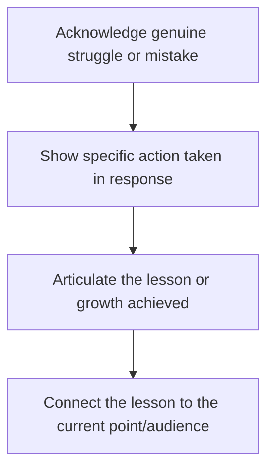

## Balancing Vulnerability and Professionalism

### Overview

Balancing vulnerability and professionalism concerns the calibration problem at the heart of authentic executive communication: sufficient self-disclosure builds trust, connection, and perceived authenticity, while insufficient calibration risks undermining the composure, competence signaling, and role authority that professional contexts require. This is not a fixed formula but a context-sensitive judgment that experienced communicators develop through explicit attention to audience, occasion, and organizational role.

### The Underlying Tension

**Key Points**

- **Vulnerability builds trust and relatability** — appropriately calibrated self-disclosure, including acknowledged uncertainty or past mistakes, signals honesty and humanizes a speaker in ways that a purely polished, invulnerable presentation cannot.
- **Professionalism signals competence and reliability** — audiences, particularly in high-stakes executive contexts, need confidence that the speaker (and by extension, the organization or decision) is sound; excessive or miscalibrated vulnerability can undermine that confidence.
- **These are not opposites on a single dial** — vulnerability and professionalism are better understood as two distinct dimensions that can be jointly maximized through skillful framing, rather than a strict trade-off where more of one necessarily means less of the other.
- **Context determines the appropriate balance point** — the same disclosure that builds connection in a leadership offsite may be inappropriate in a shareholder earnings call, making occasion-specific calibration essential rather than a single universal rule.

### A Framework for Calibration

Vulnerability in executive contexts is generally more effective when it meets several conditions simultaneously, distinguishing productive vulnerability from disclosure that undermines professional standing:

| Condition | Productive Vulnerability | Risk of Miscalibration |
| --- | --- | --- |
| Resolution | Connected to a lesson learned or growth achieved | Unresolved venting without takeaway |
| Relevance | Directly serves the point being made | Disclosure disconnected from the speech's purpose |
| Scope | Personal/professional struggle, not private/unrelated matters | Oversharing beyond what the context calls for |
| Framing | Speaker retains narrative control and composure | Disclosure that suggests ongoing instability or distress |
| Audience fit | Matches occasion norms and expectations | Vulnerability level exceeds what audience/occasion invites |

### Technique: The Resolved-Struggle Pattern

The most reliably effective form of professional vulnerability follows a specific pattern: acknowledging a genuine difficulty, mistake, or uncertainty, followed by a clear articulation of what was learned or how it was addressed. This pattern allows the speaker to demonstrate humanity and honesty while ultimately reinforcing, rather than undermining, their competence.

**Example**

Miscalibrated (unresolved): "Launching that product was a disaster, honestly it still stresses me out thinking about it." Calibrated (resolved): "Our first product launch missed its target by 40% — a mistake that came down to skipping customer validation because we were confident we already knew the answer. We rebuilt our entire pre-launch process around mandatory customer interviews after that, and every launch since has hit or exceeded projections. That's exactly the validation step I want to make sure we don't skip here."

### Technique: Distinguishing Personal from Private

A useful distinction: "personal" disclosure relates to the speaker's professional journey, decisions, uncertainties, or growth — generally appropriate territory in executive communication when relevant. "Private" disclosure relates to matters outside the professional sphere (family details, health specifics, personal relationships) that, even when genuinely felt, generally exceed what most professional and executive contexts call for unless the occasion specifically invites it (e.g., certain ceremonial or explicitly personal-narrative contexts).

### Technique: Maintaining Composure While Being Vulnerable

**Key Points**

- **Vulnerability in content, not necessarily in delivery** — a speaker can disclose emotionally significant content (a difficult decision, a setback) while maintaining vocal steadiness and controlled pacing, which preserves the audience's confidence in the speaker's current stability even while acknowledging past difficulty.
- **Narrative distance as a calibration tool** — describing a past struggle with some retrospective distance ("looking back, I can see...") generally reads as more composed than describing an ongoing, unresolved difficulty in the present tense.
- **Avoiding the confessional register** — professional vulnerability functions best when framed as purposeful disclosure serving the audience's understanding, rather than in a register that suggests the speaker is processing the difficulty for the first time in front of the audience.

### Occasion-Specific Calibration

| Context | Appropriate Vulnerability Level | Rationale |
| --- | --- | --- |
| Earnings calls / investor communication | Low | Stakeholders require confidence in stability and competence; disclosure limited to resolved, forward-looking framing |
| Internal team meetings | Low-moderate | Some acknowledgment of challenge builds trust without undermining team confidence |
| Leadership/keynote talks | Moderate | Audiences often explicitly value authentic leadership narrative, rewarding calibrated disclosure |
| Mentorship/coaching contexts | Moderate-high | Relationship purpose specifically benefits from modeling vulnerability |
| Ceremonial speech (eulogies, tributes) | Context-dependent, often higher | Genre explicitly invites emotional authenticity |
| Crisis communication | Low, carefully managed | Audience needs confidence in leadership stability during instability elsewhere |

### Technique: Vulnerability as a Leadership Credibility Tool

[Inference] Organizational and leadership-communication research and practice increasingly treats calibrated vulnerability (particularly acknowledging uncertainty or admitting mistakes) as a credibility-building rather than credibility-undermining move, on the reasoning that audiences are often more skeptical of unbroken, curated competence narratives than of leaders who demonstrate self-awareness about limitations. This should be treated as a documented trend in contemporary leadership-communication practice rather than a universal rule applicable identically across all organizational cultures, industries, and individual audience expectations, some of which retain stronger preferences for traditional composed authority presentation.

### Gender and Role-Based Considerations

[Unverified] Some communication and organizational-behavior research suggests that audience reception of vulnerability disclosure may not be uniform across speaker demographics or organizational roles — for instance, some studies have examined whether self-disclosure of uncertainty is received differently depending on a leader's gender or seniority level. Because findings in this area are mixed and context-dependent, speakers navigating this dimension should be aware that reception may vary by audience and should calibrate based on their own specific organizational context rather than assuming uniform effects, and should consult current research or organizational feedback rather than a fixed rule.

### Common Pitfalls

- **Unresolved disclosure without a lesson** — sharing a struggle or mistake without articulating what was learned or how it was addressed, which can read as venting rather than purposeful communication.
- **Oversharing beyond occasion norms** — disclosing private (as opposed to professional/personal) details that exceed what the audience and context call for.
- **Vulnerability that undermines rather than builds confidence** — disclosure suggesting ongoing instability, unresolved crisis, or current incompetence, which can genuinely damage audience confidence rather than build connection.
- **Performed or inauthentic vulnerability** — disclosure that feels calculated or formulaic rather than genuine, which audiences can often detect and which undermines the authenticity vulnerability is meant to signal.
- **Miscalibrating for the occasion** — applying a high-disclosure register in a low-disclosure context (or vice versa), misjudging audience and occasion expectations.
- **Confusing vulnerability with lack of preparation or polish** — conflating authentic disclosure with generally unpolished or under-rehearsed delivery, which are distinct dimensions; vulnerability in content does not require, and should not become an excuse for, weak delivery execution.

**Related Topics**

- Selecting and Shaping Personal Anecdotes
- The Narrative Arc and Story Architecture
- Ethos and Credibility-Building Technique
- Crisis Communication Message Discipline
- Leadership Communication and Organizational Trust
- Vocal Delivery Technique for Composure Under Emotional Content