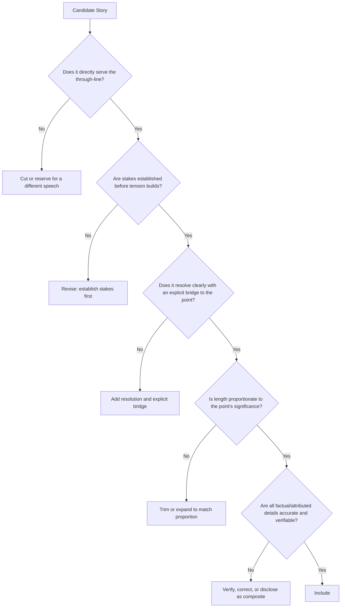

## Avoiding Storytelling Pitfalls and Irrelevance

### Overview

This item consolidates the failure modes of narrative technique in executive communication into a single diagnostic reference, synthesizing pitfalls introduced across narrative arc construction, personal anecdotes, case studies, data storytelling, and vulnerability calibration into a unified framework for auditing a story's fitness before it is used. Because storytelling's persuasive power depends on tight relevance and disciplined execution, most narrative failures stem from a small number of recurring, identifiable errors rather than a lack of storytelling talent.

### The Core Diagnostic Question

**Key Points**

- **Every story must pass a single test before inclusion** — "does this story do more rhetorical work than an equivalent amount of direct statement would?" A story that fails this test, however entertaining, is functioning as decoration rather than argument.
- **Entertainment value is not sufficient justification** — a genuinely funny, moving, or interesting story that doesn't advance the through-line is a well-told irrelevance; audience enjoyment in the moment doesn't offset the structural cost of a disconnected narrative.
- **Relevance must be explicit, not assumed** — even a highly relevant story can fail if its connection to the point isn't made audible through an explicit bridge, since audiences cannot be relied upon to independently reconstruct the intended connection.

### Category 1: Relevance Failures

- **Tangential entertainment** — including a story primarily because it's compelling on its own merits rather than because it serves the argument; the test is whether removing the story would weaken the argument's coherence or merely remove an enjoyable digression.
- **Missing the explicit bridge** — telling a well-constructed story but failing to state the connection to the point being made, leaving the audience to guess why the story was included.
- **Proportion mismatch** — spending disproportionate time on a story relative to the significance of the point it illustrates, signaling to the audience (through time allocation alone) that the story matters more than it should.
- **Multiple stories making the same point** — redundant illustration wastes time that could serve additional distinct points in the argument.

### Category 2: Structural and Narrative Craft Failures

**Key Points**

- **Underdeveloped stakes** — introducing narrative tension before the audience understands why it matters, which produces confusion rather than engagement regardless of how well the subsequent story is told.
- **Meandering rising action** — extending complications or buildup beyond what serves the story's point, testing audience patience before reaching resolution.
- **Missing or unclear resolution** — a narrative that builds tension without a clear payoff leaves the audience without the sense of closure that makes stories satisfying and complete.
- **Overcomplicated structure** — attempting braided narrative threads, non-linear ordering, or extended frameworks (like a full Hero's Journey) without sufficient signposting, confusing rather than engaging the audience.

### Diagnostic Flow for Any Candidate Story

### Category 3: Accuracy and Ethical Failures

- **Fabrication or embellishment** — altering facts for dramatic effect, whether in personal anecdotes, case studies, or data framing; this creates significant credibility risk if the speaker's account is ever compared against other records.
- **Undisclosed composite examples** — presenting an illustrative, non-literal example as a specific verified case without disclosure, misleading the audience about the nature of the evidence.
- **Misattributed or inaccurate quotations** — presenting paraphrased or invented language as a direct quotation, whether from a customer, colleague, or public figure.
- **Consent and confidentiality violations** — using another person's story, identity, or proprietary details without appropriate permission or disclosure.
- **Unrepresentative outliers presented as typical** — using an exceptional case study or statistic without disclosing its atypicality, risking credibility damage if discovered.

### Category 4: Calibration Failures

- **Vulnerability miscalibration** — disclosure that is either too exposed (oversharing beyond occasion norms, unresolved struggle without a lesson) or too guarded (missing an opportunity for authentic connection the occasion invites); see vulnerability-calibration guidance for occasion-specific benchmarks.
- **Tonal mismatch** — a story whose emotional register doesn't match the occasion (excessive levity in a serious context, excessive gravity in a light one).
- **Audience relatability failure** — a story whose circumstances, industry, or scale don't translate to the specific audience's context, even if well-told on its own terms.
- **Anecdote fatigue** — reusing a signature story across many appearances to audiences with overlapping membership, risking recognition and diminished impact.

### Category 5: Delivery and Integration Failures

- **Data dumping without narrative context** — presenting statistics without the accompanying story or framing that establishes their significance.
- **Overloaded visuals accompanying narrative** — dense charts or slides that compete with, rather than support, the spoken story.
- **Losing composure during emotionally significant content** — a stumble or loss of vocal control during a vulnerable or emotionally weighted story is more disruptive to overall impact than an equivalent stumble in a purely informational section.
- **Forcing a story into an ill-fitting structural framework** — imposing a full narrative arc, Hero's Journey, or extended structure onto content too thin to support it, producing an artificial-feeling stretch.

### A Consolidated Pre-Use Checklist

Before including any story — personal anecdote, case study, or data-narrative pairing — in a presentation:

1. Does this story directly and demonstrably serve the through-line, not merely relate to the general topic?
2. Are the stakes established clearly before tension or complication is introduced?
3. Does the story resolve, and does that resolution connect explicitly back to the point being made?
4. Is the story's length proportionate to the significance of the point it illustrates?
5. Are all facts, figures, and quotations accurate and, where required, verified or disclosed appropriately?
6. Is the vulnerability or disclosure level appropriately calibrated to this specific occasion and audience?
7. Will this specific audience find the story's circumstances relatable or translatable to their own context?
8. Has this story been used with this audience (or an overlapping one) recently enough to risk recognition or fatigue?

### Common Root Causes Behind Repeated Pitfalls

**Key Points**

- **Drafting stories in isolation from the through-line** — constructing a compelling narrative first and searching for a place to insert it afterward, rather than starting from the argument's needs and selecting or shaping a story to serve them.
- **Insufficient rehearsal exposing structural weakness** — many relevance, pacing, and calibration failures only become apparent when a story is rehearsed aloud in front of a listener, since silent review often fails to reveal these issues.
- **Absence of an explicit selection filter** — proceeding on instinct about what "feels like a good story" without applying a structured relevance and accuracy check before inclusion.
- **Comfort with a signature story leading to overuse** — a well-honed, reliable anecdote becoming a default choice across too many occasions, outpacing genuine ongoing relevance or audience freshness.

**Related Topics**

- The Narrative Arc and Story Architecture
- Selecting and Shaping Personal Anecdotes
- Using Case Studies and Customer Stories
- Data Storytelling: Pairing Numbers With Narrative
- Balancing Vulnerability and Professionalism
- Building a Logical Through-Line
- Rehearsal Strategies for Identifying Structural Weakness