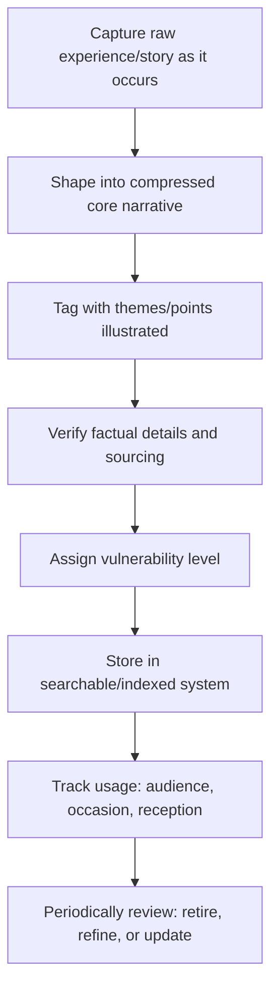

## Building a Personal Story Bank

### Overview

A personal story bank is a deliberately maintained, organized repository of a speaker's accumulated anecdotes, case studies, and narrative fragments, indexed for rapid retrieval when preparing a speech or responding to an unplanned speaking opportunity. Rather than relying on memory or ad hoc recall under time pressure, systematic story-bank maintenance treats narrative material as a reusable professional asset requiring the same deliberate curation as any other communication resource.

### Why a Systematic Story Bank Matters

**Key Points**

- **Reduces preparation time under deadline pressure** — a well-organized bank allows a speaker to search by theme or point rather than trying to recall a fitting story from memory during time-constrained preparation.
- **Prevents overreliance on a small set of default stories** — without systematic tracking, speakers tend to default to whichever two or three anecdotes come most readily to mind, risking audience fatigue for repeat audiences and missing better-fitting alternatives that simply weren't top-of-mind.
- **Enables rapid response in impromptu and Q&A contexts** — a mentally or physically indexed story bank supports quick retrieval of an appropriately illustrative story when responding to an unplanned question, functioning as a resource for impromptu delivery specifically.
- **Supports quality control over time** — systematically tracking which stories have been used with which audiences, and their reception, allows a speaker to refine, retire, or update material based on actual performance rather than assumption.

### Core Structure: Indexing by Theme, Not Just Chronology

The single most important design decision in a story bank is indexing by the point or theme a story illustrates, rather than by when it happened or which speech it was first used in. A story about a failed product launch might serve as an entry for "risk-taking," "customer validation," "resilience after failure," and "decision-making under uncertainty" simultaneously — indexing by theme allows the same raw material to surface for multiple, otherwise unrelated, future speaking needs.

### Recommended Story Bank Fields

| Field | Purpose |
| --- | --- |
| Short title/label | Quick identification at a glance |
| Core narrative (2-4 sentences) | The compressed, shaped version ready for adaptation |
| Themes/points it illustrates | Primary retrieval index (tag multiple themes per story) |
| Vulnerability level | Low/moderate/high, for occasion-matching (see calibration guidance) |
| Verified details/sources | Facts, figures, or quotes requiring accuracy verification |
| Audiences/occasions used | Tracks reuse to prevent audience fatigue |
| Reception notes | What worked, what didn't, adjustments to make next time |
| Length variants | Compressed (30 sec), standard (1-2 min), extended (3+ min) versions |

### Story Bank Construction Workflow

### Technique: Capturing Stories as They Happen

**Key Points**

- **Capture proximate to the event, not months later** — specific, vivid details (a particular phrase someone used, an exact figure, a sensory detail) degrade in memory quickly; capturing a rough note immediately after a notable experience preserves the specificity that makes a story rhetorically effective later.
- **Capture more than seems immediately useful** — an experience that doesn't obviously map to a current speaking need may become valuable once a theme it illustrates becomes relevant; low-cost, low-effort capture at the time of occurrence avoids losing potentially useful material.
- **Distinguish raw capture from shaped narrative** — the initial capture should preserve accurate, complete detail; the shaping into a compressed, rhetorically effective anecdote (as covered in anecdote-shaping technique) is a separate, later step performed when a specific speaking need arises.

### Technique: Multiple Length Variants

Maintaining a compressed (30-second), standard (1-2 minute), and extended (3+ minute) version of frequently used stories allows rapid adaptation to different time constraints without needing to re-shape the narrative under preparation-time pressure. This is particularly valuable for signature stories used repeatedly across varied speaking contexts with different time budgets.

**Example**

Compressed variant: "My first product launch missed target by 40% because we skipped customer validation — we've never skipped it since." Standard variant (as shown in the anecdote-shaping example): includes the specific customer-cancellation trigger and the direct quote that changed the speaker's thinking. Extended variant: adds the specific process changes implemented afterward and a secondary example demonstrating the new process working.

### Technique: Reception Tracking and Refinement

Systematically noting how a story landed with a given audience — whether it generated the intended reaction, whether timing worked, whether the bridge to the point registered — allows deliberate refinement over multiple uses rather than static repetition of an unexamined version. [Inference] Reception can be difficult to assess precisely in the moment, so tracking often relies on approximate signals (audience reaction, follow-up questions, feedback) rather than precise measurement, and refinements should be treated as informed adjustments rather than definitively validated improvements.

### Technique: Auditing for Overuse and Fatigue

Tracking which audiences have heard which stories allows proactive rotation, preventing the common failure mode where a speaker's most polished, go-to anecdote becomes recognizable and stale to any audience with repeated or overlapping exposure (industry conference circuits, recurring internal audiences, media appearances). A story bank with multiple entries per major theme provides rotation options rather than forcing repeated reliance on a single default.

### Sourcing Material for the Bank Beyond Personal Anecdotes

While the "personal" story bank centers on the speaker's own experience, a comprehensive practice often extends the same indexing discipline to:

- **Observed stories** — accounts witnessed but not personally experienced (a colleague's experience, an industry event), used with appropriate attribution.
- **Case studies and customer stories** — third-party evidence maintained with the same theme-indexing and verification discipline covered in case-study selection technique.
- **Data-narrative pairings** — statistic-and-illustrative-case combinations, maintained together since they are typically used as a unit.

### Practical Implementation Approaches

| Approach | Best Fit |
| --- | --- |
| Simple structured document (spreadsheet or table) | Individual speakers with moderate speaking frequency |
| Tagged note-taking system (searchable by theme) | Speakers wanting fast keyword-based retrieval |
| Dedicated personal knowledge-management tool | Speakers with high speaking frequency across many themes |
| Shared team repository | Organizations standardizing narrative material across multiple spokespeople |

### Integration Into Speech Preparation

When preparing a new speech, querying the story bank by the speech's through-line and key points — rather than starting narrative selection from memory — surfaces candidate stories more systematically and reveals options that might not otherwise come to mind. This integrates directly with the story-selection filters covered in anecdote and case-study technique: the bank supplies candidates, and the relevance/calibration/verification filters determine which candidates are actually used.

### Common Pitfalls

- **No systematic capture, relying entirely on memory** — losing specific, vivid detail over time and defaulting to whichever few stories are most readily recalled under preparation pressure.
- **Indexing only by chronology or by the speech it was first used in** — making it difficult to discover that an old story is actually well-suited to a new, thematically different need.
- **Never tracking audience exposure** — leading to inadvertent repetition of a signature story with an audience that has already heard it.
- **Storing only a single length variant** — forcing time-pressured re-shaping of a story under preparation deadline rather than having ready-made length options.
- **Neglecting verification at capture time** — failing to note sources, exact figures, or accurate quotes when a story is fresh, making later verification difficult or impossible.
- **Treating the bank as static** — never revisiting, refining, or retiring entries based on actual reception, missing opportunities for improvement over repeated use.

**Related Topics**

- Selecting and Shaping Personal Anecdotes
- Using Case Studies and Customer Stories
- Impromptu Speaking Techniques and Structuring on the Fly
- Balancing Vulnerability and Professionalism
- Rehearsal Strategies for Extemporaneous Delivery
- Avoiding Storytelling Pitfalls and Irrelevance