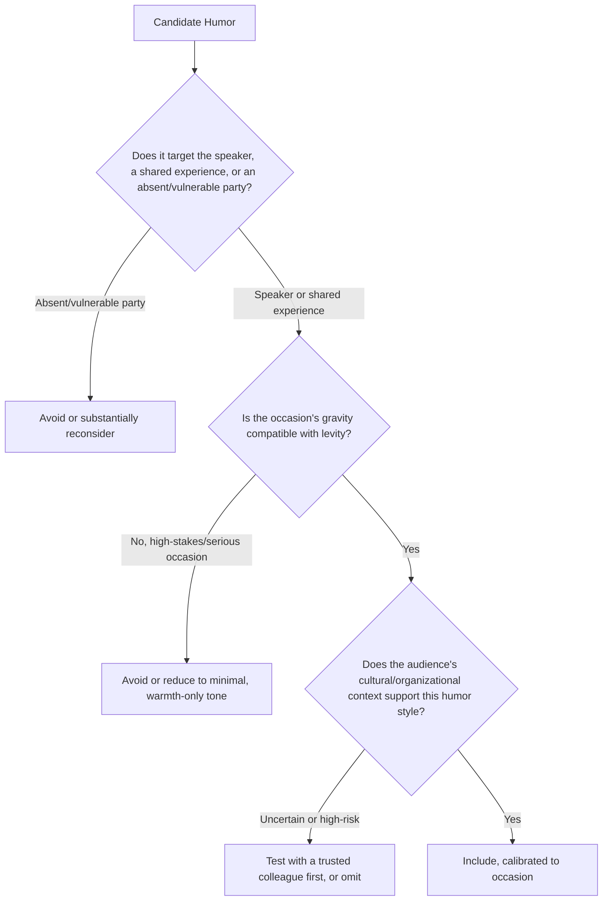

## Using Humor to Build Rapport and Ease Tension

### Overview

Humor in executive and public speaking functions as a tool for building rapport, signaling approachability, defusing tension, and increasing message retention — distinct from comedic performance, where humor is itself the primary product. In executive contexts, humor's rhetorical value lies in what it does for the audience relationship and the message, making calibration and purposefulness more important than raw comedic skill.

### The Functional Roles of Humor in Executive Speech

**Key Points**

- **Rapport-building** — shared laughter creates a sense of in-group connection between speaker and audience, functioning as a fast, low-cost trust-building mechanism compared to more time-intensive credibility-establishing techniques.
- **Tension reduction** — humor can lower audience defensiveness or anxiety before difficult content, making subsequent serious material easier for the audience to receive.
- **Attention renewal** — a well-placed moment of levity can reset audience attention during a long or dense presentation, functioning similarly to a structural pause or transition.
- **Humanizing authority** — for senior executives, appropriately calibrated humor can soften a perceived power or status gap, making the speaker seem more approachable without necessarily undermining authority.
- **Increased message retention** — content associated with a genuine laugh is often more memorable than equivalent content delivered without any levity, though retention benefits depend heavily on the humor actually landing rather than falling flat.

### Categories of Executive-Appropriate Humor

| Type | Mechanism | Risk Level |
| --- | --- | --- |
| Self-deprecating humor | Speaker as target, disarms status concerns | Low |
| Observational humor | Shared recognition of common experience | Low-moderate |
| Situational/callback humor | References something specific to this audience/occasion | Low (if accurate) |
| Wordplay/wit | Clever language use, understatement, irony | Moderate (audience-dependent) |
| Gentle teasing (of self or willing target) | Affectionate needling, requires established rapport | Moderate |
| Topical/current-events humor | References shared external context | Moderate-high (risk of misjudging audience view) |
| Humor targeting others without consent | Mockery of absent parties or groups | High — generally avoid |

### Technique: Self-Deprecating Humor

Self-directed humor is among the lowest-risk and most broadly effective forms of executive humor because it targets no one but the speaker, disarming potential audience skepticism about status or self-importance while signaling humility and self-awareness.

**Example**

"I've given this presentation forty times, which either means I'm the expert in the room or the person least likely to notice if I've said something wrong for the fortieth time in a row." This works because it acknowledges the speaker's authority claim while simultaneously undercutting it just enough to feel approachable rather than boastful.

### Technique: Observational and Shared-Experience Humor

Humor built around a recognizable, shared experience specific to the audience (industry frustrations, a universally understood workplace dynamic, a common experience with the topic at hand) builds rapport through mutual recognition — the "yes, exactly" reaction — without targeting any individual.

### Technique: Using Humor to Ease Tension Before Difficult Content

**Key Points**

- **Sequencing matters** — a brief, appropriately calibrated moment of levity placed just before difficult, uncomfortable, or high-stakes content can lower audience defensiveness, making the subsequent serious material easier to receive.
- **Proportionality to the difficulty ahead** — the intensity and length of a tension-easing humor moment should be modest relative to genuinely serious content that follows; excessive levity immediately before a serious announcement risks appearing tonally jarring or dismissive of the gravity to come.
- **Not a substitute for direct communication** — humor used to ease into difficult content should not become a way of avoiding or softening the substance of that content itself; the humor eases the audience's receptiveness, but the difficult message still needs to be delivered clearly.

**Example (Crisis/Difficult News Context)**

Before addressing a round of layoffs, an executive might use a brief, genuine, non-trivializing acknowledgment of collective difficulty ("None of us wanted to be in this room for this conversation") rather than actual joke-telling — illustrating that in sufficiently serious contexts, "easing tension" may mean warmth and directness rather than humor itself, since misjudged humor in high-gravity contexts risks appearing dismissive of the stakes.

### Technique: Callback Humor

Referencing an earlier joke, shared moment, or detail specific to the current occasion later in a speech rewards audience attention and reinforces a sense of shared experience, functioning as a structural device (similar to a narrative callback) as well as a comedic one.

### Calibration Framework: Assessing Humor Risk Before Use

### Audience and Cultural Considerations

**Key Points**

- **Humor styles and sensitivities vary significantly across cultures and organizational contexts** — what reads as playful in one professional culture may read as inappropriate or unprofessional in another; speakers addressing unfamiliar or mixed audiences should calibrate more conservatively.
- **Status and power dynamics affect reception** — humor from a senior executive directed at more junior audience members, even if well-intentioned, can land differently than the same humor directed upward or laterally, given the power differential.
- **Timing sensitivity to organizational climate** — humor that would be well-received during stable periods may misjudge audience mood during organizational stress, uncertainty, or recent difficult news, requiring situational reassessment rather than reliance on past audience reception.

### Distinguishing Rapport-Building Humor from Comedic Performance

Executive humor differs from stand-up comedy or entertainment-focused humor in a key respect: its success criterion is whether it serves the speaker-audience relationship and the surrounding message, not whether it generates maximum laughter. A moment of humor that gets a modest smile but appropriately calibrates tone and builds warmth can be more successful, by this standard, than a bigger laugh that feels tonally mismatched to the occasion or oversteps a boundary.

### Delivery Considerations for Humor

- **Timing and pacing** — comedic timing (a brief pause before or after the key word or phrase) significantly affects whether a humor attempt lands, making rehearsal of specifically timed humor moments valuable even within an otherwise extemporaneous delivery.
- **Reading the room in real time** — because humor reception is highly context-dependent, a speaker benefits from the flexibility to skip or shorten a planned humor moment if audience energy or mood doesn't support it, rather than rigidly delivering a scripted joke regardless of real-time signals.
- **Recovery from a joke that doesn't land** — a composed, brief acknowledgment and move-forward ("tough room, that's alright") is generally less damaging than visibly dwelling on or over-explaining a failed humor attempt.

### Common Pitfalls

- **Humor at the expense of an absent or vulnerable party** — mocking someone not present to respond, or a group without power to push back, generally reads as punching down and damages rather than builds rapport.
- **Misjudging occasion gravity** — attempting levity immediately before or during genuinely serious content (crisis communication, layoffs, tragedy) risks appearing dismissive of real stakes.
- **Over-reliance on humor as a substitute for substance** — using levity to avoid or soften a difficult message's actual content rather than easing the audience into receiving it.
- **Culturally or contextually misjudged humor** — humor styles that don't translate across the specific audience's cultural or organizational norms, particularly risky with unfamiliar or highly mixed audiences.
- **Punching down via power differential** — senior speakers directing humor at more junior audience members in ways that, even if well-intentioned, land differently given the status gap.
- **Forcing humor that doesn't fit natural speaking style** — attempting a comedic style inconsistent with the speaker's authentic voice, which often reads as less genuine and less effective than modest, well-calibrated humor delivered naturally.

**Related Topics**

- Timing and Delivery Technique for Comedic Moments
- Self-Deprecating Humor and Managing Perceived Status
- Crisis Communication Message Discipline
- Audience Analysis and Cultural Calibration in Public Speaking
- Balancing Vulnerability and Professionalism
- Recovering Gracefully From Delivery Mistakes