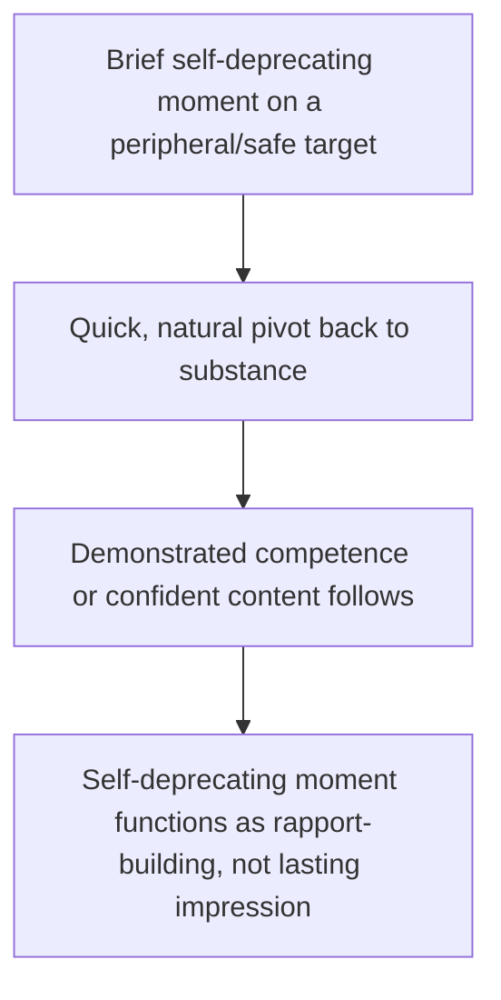

## Self-Deprecation Without Undermining Authority

### Overview

Self-deprecating humor is a specific and widely used tool in executive communication, but it carries a distinct calibration risk not shared by other humor types: because it directly targets the speaker's own competence or status, poorly calibrated self-deprecation can undermine the very authority and credibility the speaker needs to be effective. This item isolates the technique of using self-directed humor productively — building relatability and approachability — while protecting against the specific failure mode of appearing genuinely incompetent, insecure, or unfit for the role.

### The Core Tension

**Key Points**

- **Self-deprecation builds relatability by disarming status concerns** — audiences, particularly toward senior or high-status speakers, can feel distanced by unbroken displays of confidence and competence; self-directed humor signals humility and approachability, humanizing the speaker.
- **Excessive or miscalibrated self-deprecation erodes credibility** — if self-deprecating content suggests genuine incompetence, chronic self-doubt, or unfitness for the speaker's role, the audience's confidence in the speaker (and by extension, the content of the speech) can be directly undermined.
- **The distinction is not frequency alone but target and resolution** — the specific quality that separates productive self-deprecation from credibility-damaging self-deprecation lies in what is being mocked (trivial, non-core competencies versus core professional capability) and whether the moment resolves toward demonstrated competence or remains as unresolved doubt.

### The Safe-Target Principle

Effective self-deprecating humor targets peripheral, non-threatening aspects of the speaker's identity or experience — logistics, minor habits, unrelated skills, common human foibles — rather than the core competency the audience needs to trust the speaker on.

| Safe Targets (Generally Low Risk) | Risky Targets (Generally High Risk) |
| --- | --- |
| Minor logistical fumbles (tech setup, timing) | Core professional judgment or expertise |
| Unrelated skills gaps (e.g., "terrible at parallel parking") | The specific decision or plan being presented |
| Common relatable habits (over-preparation, coffee dependence) | Ethical judgment or integrity |
| Age/generational references handled lightly | Competence directly relevant to the audience's stakes |
| Self-aware acknowledgment of a well-known minor quirk | Financial, legal, or safety-critical judgment |

**Example**

Safe: "I've rehearsed this so many times my family can now recite the opening line — which either means I'm ready, or deeply concerning for family dinner conversation." Risky: "Honestly, I'm not totally sure this financial model is right, but let's go with it" — this targets the exact competency (financial judgment) the audience needs to trust, and undermines rather than builds credibility.

### Technique: The Disarm-and-Recover Pattern

The most reliable structural pattern for productive self-deprecation follows a specific arc: a brief self-directed joke about something peripheral, followed promptly by a return to demonstrated competence or substantive content. The self-deprecating moment should never be the last impression on a topic of genuine importance to the audience's confidence.

**Example**

"I've been told my slide design skills peaked somewhere around 2009 — so bear with the visuals, but the numbers behind them are solid, and here's what they tell us..." The joke targets an irrelevant skill (slide aesthetics) and pivots immediately to the substantive claim (the numbers), ensuring the audience's lasting impression is competence, not the joke itself.

### Technique: Timing Self-Deprecation Relative to Credibility Establishment

**Key Points**

- **Early self-deprecation requires pre-existing or quickly-established credibility** — using self-directed humor very early in a speech, before the speaker has established any competence signals, risks the audience anchoring on the joke rather than on subsequent substance; pairing an early joke with a swift credibility signal (a credential, a track record reference) mitigates this.
- **Self-deprecation after credibility is established carries lower risk** — once an audience has independently registered the speaker's competence (through content quality, prior reputation, or an introduction), self-deprecating humor lands more safely as a humanizing addition rather than a credibility question.
- **Avoid self-deprecation immediately before the highest-stakes content** — using self-directed humor right before the single most important claim or recommendation in a speech risks undercutting the gravity of that specific moment; reserving self-deprecation for lower-stakes transitional moments protects the speech's most important content.

### Frequency Calibration

A single, well-placed self-deprecating moment, or at most a small number spread across a longer speech, generally builds rapport without risk. Repeated or frequent self-deprecation across a speech risks a cumulative effect where the audience begins to register a pattern of self-doubt rather than isolated, charming humility — even if each individual instance would be safe on its own. [Inference] The precise frequency threshold at which self-deprecation shifts from charming to concerning likely varies by speaker, audience, and cultural context, so this should be treated as a directional calibration principle (favor sparing, well-placed use) rather than a fixed numerical rule.

### Role and Seniority Considerations

| Speaker Context | Self-Deprecation Considerations |
| --- | --- |
| Senior executive, high pre-established authority | More latitude — self-deprecation is less likely to be read as genuine incompetence given strong existing credibility |
| Newer leader or less-established speaker | Higher risk — self-deprecation may compound rather than offset audience uncertainty about competence |
| Subject-matter expert presenting outside core expertise | Safer to self-deprecate about the adjacent area than core expertise |
| Crisis or high-stakes communication | Minimal self-deprecation recommended — audience confidence needs are elevated, reducing tolerance for any competence-adjacent humor |

[Unverified] The degree to which speaker seniority moderates audience reception of self-deprecating humor may also interact with other factors such as gender, industry norms, or organizational culture, and available research on these interactions is mixed; speakers should calibrate based on their own specific context and, where available, direct feedback rather than assuming uniform effects across all speaker demographics.

### Distinguishing Self-Deprecation from Genuine Self-Doubt Disclosure

Self-deprecating humor (a deliberate rhetorical device, delivered with comedic framing and clear resolution) should be distinguished from genuine, unresolved expressions of self-doubt or insecurity, which function differently and carry different risk profiles (see vulnerability-calibration guidance for the broader distinction between productive and miscalibrated disclosure). A joke about forgetting where the restroom is functions as humor; an unresolved comment suggesting the speaker doubts their own qualification for the role functions as a credibility-damaging disclosure, even if both are nominally "self-deprecating" in surface form.

### Common Pitfalls

- **Targeting core competency instead of a peripheral trait** — self-deprecating about the exact expertise or judgment the audience needs to trust, directly undermining the speech's persuasive foundation.
- **No recovery or pivot back to substance** — allowing a self-deprecating joke to be the final word on a topic, rather than following it with a swift return to demonstrated competence.
- **Overuse across a single speech** — repeated self-directed humor creating a cumulative impression of insecurity rather than isolated charm.
- **Poor timing relative to stakes** — self-deprecating immediately before the highest-stakes claim or recommendation, undercutting the moment's gravity.
- **Using self-deprecation before credibility is established** — an early joke with no accompanying competence signal risks anchoring audience perception on the joke rather than on subsequent substance.
- **Confusing rhetorical self-deprecation with genuine, unresolved self-doubt** — allowing authentic insecurity to surface in the guise of humor, which reads and functions differently than a deliberate, well-resolved comedic device.

**Related Topics**

- Using Humor to Build Rapport and Ease Tension
- Ethos and Credibility-Building Technique
- Balancing Vulnerability and Professionalism
- Timing and Delivery Technique for Comedic Moments
- Establishing Ethos in the First Minute of a Speech
- Leadership Communication and Perceived Competence