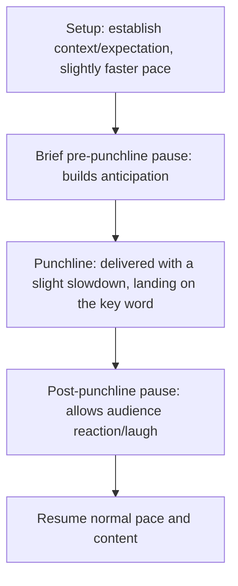

## Comedic Timing and Delivery

### Overview

Comedic timing and delivery is the mechanical, performance-level skill set that determines whether a well-conceived humor attempt actually lands with an audience. Content quality (the joke, observation, or witty line itself) and delivery execution (pacing, pause placement, vocal inflection, physical timing) are separable skills — the same line delivered with strong timing succeeds where the identical line delivered flatly falls silent. This item isolates the mechanics of delivery specifically, distinct from the content-selection and calibration concerns covered in humor-use and self-deprecation technique.

### The Core Mechanics of Comedic Timing

**Key Points**

- **The pause is the primary timing tool** — a brief, deliberate silence immediately before the punchline (the "setup pause") builds anticipation, while a pause immediately after (the "landing pause") gives the audience space to register and react before the speaker continues.
- **Pace variation signals importance and structure** — comedic setups are often delivered at a slightly faster, more conversational pace, with a perceptible slowdown on the punchline itself, marking it as the moment of payoff.
- **Word order and placement of the punchline** — the funniest or most surprising word or phrase should generally land at the end of a sentence, not buried in the middle, since audience attention and anticipation peak at the sentence's conclusion.
- **Not stepping on your own laugh** — continuing to speak immediately after a punchline, before the audience has had time to react, can cut off or diminish the laugh; a brief pause after delivery allows the moment its full effect.

### The Setup-Pause-Punchline-Pause Structure

### Technique: The Rule of Three

A widely used comedic structure involves presenting two items that establish a pattern, followed by a third that breaks or subverts the expectation the first two created. The pattern's persuasive/comedic power comes from the audience's brain completing the expected pattern, only to be surprised by the third element's deviation.

**Example**

"We considered three options: cut costs, raise prices, or ask the CEO to personally hand-deliver each order on a bicycle." The first two items establish a plausible, serious pattern; the third subverts it for comedic effect, with the specific, absurd detail ("hand-deliver... on a bicycle") doing much of the comedic work through its unexpected concreteness.

### Technique: Understatement and Deadpan Delivery

Understatement — describing something significant in deliberately modest or minimizing terms — relies heavily on delivery contrast: a flat, matter-of-fact vocal tone paired with content that the audience recognizes as more significant than the tone suggests creates comedic tension through that mismatch. This technique depends almost entirely on controlled, unemphatic delivery; delivering understated content with exaggerated emphasis defeats the mechanism.

**Example**

After describing a genuinely chaotic product launch: "So, it was a learning experience." The comedic effect depends on the audience's awareness that "learning experience" dramatically understates what was just described, landing only if delivered in a flat, controlled tone rather than an exaggerated one.

### Technique: Physical and Nonverbal Timing

- **The comedic pause paired with a physical beat** — a brief pause combined with a small physical gesture (a slight head tilt, a raised eyebrow, a shrug) can reinforce comedic timing without requiring additional verbal content.
- **Eye contact during the punchline** — maintaining direct eye contact with the audience at the moment of delivery, rather than looking down at notes, increases the sense of connection and spontaneity that supports comedic landing.
- **Avoiding telegraphing** — visibly anticipating one's own joke (smiling broadly before delivering the line, or verbally signaling "this is going to be funny") can reduce the surprise element that much humor depends on.

### Technique: Reading the Room and Adjusting Timing in Real Time

**Key Points**

- **Extending the post-punchline pause for a strong laugh** — when a joke lands well, allowing extra time for the laugh to fully develop and subside before continuing prevents the next line from being lost under residual audience reaction.
- **Compressing or skipping a bit if energy is low** — recognizing early signals (a joke that would normally land is met with lower energy) and adjusting pacing or cutting planned humor material accordingly, rather than rigidly proceeding with a scripted timing plan.
- **Recovering from a joke that doesn't land** — a brief, composed beat followed by a natural transition forward is generally less damaging than dwelling on, over-explaining, or apologizing extensively for an unsuccessful humor attempt.

### Delivery Method Considerations for Comedic Timing

| Delivery Method | Timing Implications |
| --- | --- |
| Manuscript | Requires deliberately marked pause points in the script itself; risk of a rushed or flat delivery if pauses aren't explicitly planned and rehearsed |
| Extemporaneous | Natural pacing variation is more achievable, but specific timed bits (rule of three, planned punchlines) benefit from being memorized precisely even within extemporaneous delivery |
| Memorized | Risk of mechanical-sounding delivery if timing isn't varied in rehearsal; well-rehearsed memorized timing can achieve highly polished, reliable comedic landing |
| Impromptu | Timing is largely intuitive and reactive; general principles (pause before key words, don't rush) remain applicable even without extensive preparation |

### Rehearsal Technique for Comedic Timing Specifically

Because comedic timing is a performance skill rather than purely a content-drafting skill, rehearsing planned humor moments aloud — ideally in front of a listener or recorded — is disproportionately valuable relative to silent review, since timing, pause length, and vocal inflection cannot be assessed from a written script alone. [Inference] The specific pause lengths and pacing that work best likely vary by individual speaker's natural cadence and the specific audience/room, so rehearsal should focus on finding a speaker's own effective timing rather than mechanically replicating a fixed formula.

### Common Pitfalls

- **Rushing the punchline** — delivering the key comedic word or phrase at the same pace as the setup, eliminating the pacing contrast that signals "this is the payoff."
- **No post-punchline pause** — continuing to speak immediately after a joke, cutting off audience reaction time and diminishing the perceived impact.
- **Telegraphing the joke** — visibly smiling, laughing at one's own line before delivery, or verbally flagging that a joke is coming, which reduces the surprise the humor depends on.
- **Burying the punchline mid-sentence** — placing the funniest word or phrase before the sentence's end, rather than as the final beat, weakening the comedic payoff.
- **Over-explaining a joke that doesn't land** — dwelling on or apologizing extensively for an unsuccessful attempt, which draws more attention to the failure than a brief, composed recovery would.
- **Rigid adherence to planned timing regardless of room energy** — failing to adjust pacing, length, or inclusion of humor based on real-time audience signals.
- **Neglecting rehearsal of timing specifically** — treating comedic content as finished once drafted, without rehearsing the pacing and pause mechanics that determine whether it actually lands in delivery.

**Related Topics**

- Using Humor to Build Rapport and Ease Tension
- Self-Deprecation Without Undermining Authority
- Vocal Delivery Technique: Pitch, Volume, and Emphasis
- Time Management and Pacing in Delivery
- Recovering Gracefully From Delivery Mistakes
- Extemporaneous Delivery: Outlining and Rehearsal Strategies