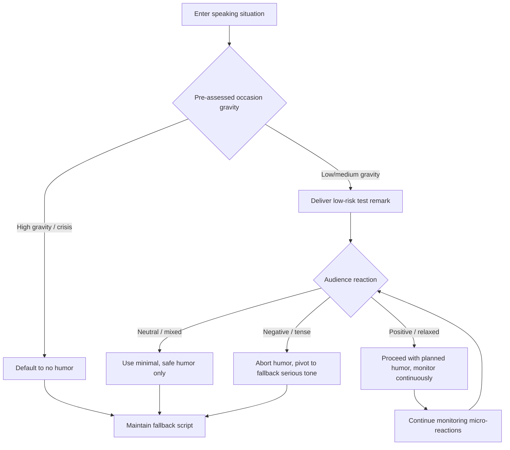

## Reading the Room for Appropriate Humor

### Definition and Scope

Reading the room refers to the real-time assessment of audience composition, emotional state, cultural context, and situational stakes to calibrate whether, when, and what type of humor is appropriate during a communication event. In executive and rhetorical contexts, this is a diagnostic skill exercised *before* and *during* delivery, distinct from joke construction itself. It sits at the intersection of audience analysis, emotional intelligence, and adaptive rhetoric.

### Why This Matters in Executive Communication

Humor carries asymmetric risk for leaders. A well-placed joke can build rapport, signal confidence, and make a speaker memorable. A mistimed or misjudged one can undermine credibility, alienate stakeholders, or become a viral liability. Because executives speak to heterogeneous audiences (employees, investors, press, regulators) often on high-stakes topics (layoffs, earnings, crises), the cost of misreading the room is higher than for a casual speaker. This topic is a risk-management skill as much as a rhetorical one.

### Core Diagnostic Dimensions

**Key Points**

- **Occasion gravity**: Is this a celebratory, neutral, or somber context? Funerals, layoff announcements, and safety incidents demand near-zero humor tolerance; product launches and team offsites tolerate much more.
- **Power distance**: Humor directed "up" a hierarchy (subordinate joking about a superior) is riskier than humor directed "down" or laterally. Executives joking about their own missteps ("punching up at themselves") is generally safer than joking about others.
- **Cultural and demographic composition**: Humor norms vary significantly by national culture, generational cohort, and organizational subculture. What lands in a Silicon Valley all-hands may fail in a formal shareholder meeting or a cross-border merger announcement.
- **Recency of adverse events**: A recent layoff, PR crisis, market downturn, or tragedy in the news cycle raises the sensitivity threshold, even if the humor is unrelated to that event.
- **Audience homogeneity vs. heterogeneity**: Smaller, in-group audiences share more contextual references, making inside jokes viable. Large, mixed, or public audiences require broader, safer humor since any subgroup's offense can dominate the narrative (especially with recording/social media present).
- **Medium and permanence**: Live, ephemeral remarks in a closed room carry different risk than remarks on a recorded webcast, earnings call transcript, or anything likely to be clipped and shared out of context.

### The Pre-Speech Assessment Framework

Before stepping into a speaking situation, rhetors can run a structured check:

1. **Occasion audit** — What is the stated purpose of this event? Does humor serve or distract from that purpose?
2. **Stakeholder mapping** — Who is in the room, and who might see a recording or transcript later? Identify the most sensitive stakeholder present and calibrate to them, not the median.
3. **News/context scan** — Has anything happened recently (internally or externally) that would make certain topics off-limits?
4. **Precedent check** — Has humor been used successfully by others in this same venue/series (e.g., previous earnings calls, previous keynotes)?
5. **Fallback plan** — Prepare the speech to work fully *without* the humor, so a last-minute read of the room ("this crowd is tense") allows cutting the joke without damaging structure.

### In-the-Moment Signals

**Key Points**

- **Micro-reactions**: Early audience response (laughter, silence, murmurs, body posture shifts) to a low-stakes opening remark can serve as a calibration probe for whether more humor will land.
- **Nonverbal cues**: Crossed arms, phones coming out, side-glances between audience members, or a sudden drop in eye contact often signal discomfort before anyone speaks up.
- **Silence typology**: Distinguish between "processing silence" (audience is thinking, humor may land a beat later) and "discomfort silence" (audience is uneasy, requires an immediate pivot).
- **Feedback loop speed**: Skilled speakers treat the first 60-90 seconds as a live test, adjusting subsequent content based on how the initial tone was received rather than running a fixed script regardless of reaction.

### The "Punch Up, Not Down" Principle

A widely used heuristic in comedy and executive rhetoric alike: humor aimed at oneself or at more powerful entities (competitors, industry conventions, one's own past mistakes) is lower risk than humor aimed at less powerful or vulnerable groups (junior staff, customers, marginalized groups, people going through hardship). This is not an absolute rule but a strong prior that should be overridden only with high confidence in the specific audience.

### Common Failure Modes

| Failure Mode | Description | Typical Consequence |
| --- | --- | --- |
| **Timing mismatch** | Joking immediately before or after delivering bad news | Perceived as callous or tone-deaf |
| **In-group leakage** | Using humor calibrated for an internal/insider audience in a public or recorded setting | Public backlash, loss of context |
| **Topic drift** | Starting with safe humor, then escalating into edgier territory as early laughs create false confidence | Sudden loss of goodwill mid-speech |
| **Cultural mismatch** | Deploying humor styles (sarcasm, irony, self-deprecation) that don't translate across cultural or linguistic lines | Confusion or perceived insult |
| **Datedness** | Referencing memes, trends, or events the audience doesn't recognize or has moved past | Awkward silence, appears out of touch |
| **Overcorrection** | Being so risk-averse that all levity is stripped out, making the speaker seem cold or robotic | Reduced likability and engagement |

### Example: Contrasting Scenarios

**Example**

- *Scenario A (Low risk)*: A CEO opens an internal all-hands with a self-deprecating joke about their own typo in a company-wide email sent that morning. Audience is homogeneous (employees), stakes are low, and the joke punches at the speaker themselves.
- *Scenario B (High risk)*: The same CEO, during an earnings call following a disappointing quarter, makes a joke about a competitor's layoffs. This misreads the room because: the medium is permanent and quotable (transcript/recording), the audience is mixed (analysts, press, employees, investors), and the occasion gravity is serious (financial underperformance), making any humor at another company's expense appear opportunistic rather than confident.

### Adjusting Humor Type to Room Temperature

**Key Points**

- **Cold room (tense, first meeting, bad news pending)**: Avoid humor entirely, or use only mild warmth (a brief acknowledgment of the tension itself, e.g., naming the discomfort directly rather than joking around it).
- **Neutral room (routine meeting, standard update)**: Light, observational, or situational humor tied directly to the shared task is generally safe.
- **Warm room (celebration, achieved milestone, friendly audience)**: Broader range of humor tolerated, including gentle teasing of in-group dynamics, provided it still avoids punching down.
- **Recovering room (post-crisis, post-conflict)**: Humor can help signal a return to normalcy but should be introduced gradually and tested with lower-risk material first.

### Process Flow for Real-Time Calibration

### Cross-Cultural Considerations

Humor is one of the least portable rhetorical tools across cultures. [Inference] Self-deprecating humor tends to read as humble confidence in some Western corporate cultures but can be interpreted as a lack of authority or competence in cultures with higher power-distance norms. Executives operating in multinational or cross-border contexts often default to observational or situational humor over irony, wordplay, or sarcasm, since these forms rely heavily on shared linguistic and cultural context and translate poorly. When in doubt, rhetors working with interpreters or translated transcripts should assume idiom-based and wordplay-based humor will not survive translation and should avoid it entirely in favor of universally legible humor (shared human situations, self-referential humor about the speaking event itself).

### Relationship to Other Rhetorical Skills

Reading the room draws directly on:

- **Audience analysis** (a foundational rhetorical skill, often covered earlier in this domain) — the pre-speech dimension of this skill is essentially applied audience analysis with a humor-specific lens.
- **Kairos** (the classical rhetorical concept of the opportune moment) — reading the room is a modern operationalization of kairos specifically for comedic timing and tone.
- **Crisis communication** — in adverse situations, the skill converges heavily with crisis communication norms, where the default posture shifts to gravity and humor becomes a liability unless very carefully deployed.

### Practical Next Steps for Skill Development

**Next Steps**

- Practice the "60-second calibration" drill: begin any presentation with one low-stakes, easily-abandoned humorous or warm remark, and consciously observe the room's reaction before deciding how to proceed.
- Build a personal "safe humor" bank of self-deprecating, occasion-neutral material that can be deployed or dropped without disrupting speech structure.
- Review recordings of past talks (own or others') specifically for the moment right after a joke — study audience reaction shots, not just the joke's construction.
- Study documented cases of executive humor failures (e.g., ill-timed jokes during earnings calls or crisis press conferences) as negative case studies. [Unverified] Because specific incidents and executives change over time and carry reputational sensitivity, this reference recommends researching current, well-documented cases via primary news sources rather than relying on a fixed example set.
- Pair this skill with training in **improvisational listening** — the ability to adjust prepared remarks live based on real-time audience feedback, a core competency in improv theater training increasingly used in executive coaching.

**Related Topics**

- Self-Deprecating Humor as a Credibility Tool
- Crisis Communication Tone Calibration
- Kairos and Timing in Classical Rhetoric
- Cross-Cultural Rhetoric and Idiom Translation
- Nonverbal Feedback Reading in Live Audiences
- Improvisational Techniques for Executive Speakers