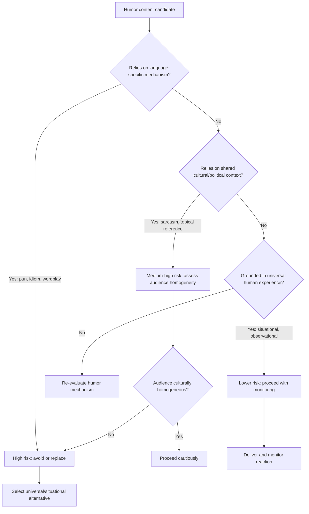

## Cultural Sensitivity in Humor

### Definition and Scope

Cultural sensitivity in humor is the practice of designing, selecting, and delivering humorous content with explicit awareness of how cultural background, group identity, and historical context shape what an audience perceives as funny, neutral, or offensive. In executive and rhetorical contexts, this extends beyond avoiding slurs or overt stereotypes to include subtler variables: which topics are taboo, which comedic structures translate across languages, and which in-group references exclude or alienate parts of a mixed audience.

### Why This Matters in Executive Communication

Executives increasingly speak to audiences that are linguistically, nationally, and culturally heterogeneous — global all-hands meetings, multinational investor calls, cross-border partnership announcements, and public remarks amplified via social media to audiences far beyond the room. A joke that succeeds with one cultural subgroup can fail or offend another simultaneously present or later exposed to a recording. Because reputational damage from a culturally insensitive joke tends to be disproportionate to any rapport-building benefit, this is treated as a risk-mitigation discipline within executive rhetoric, not merely an etiquette concern.

### Core Dimensions of Cultural Variation in Humor

**Key Points**

- **Power distance and hierarchy humor**: In high power-distance cultures, joking about superiors or authority figures (including one's own executive role) can read as inappropriate or destabilizing rather than humble. In low power-distance cultures, self-deprecating humor from leaders is often expected and valued.
- **Individualism vs. collectivism**: Humor that isolates or singles out an individual (even affectionately) can land differently in collectivist cultures, where group harmony is prioritized, versus individualist cultures, where personal ribbing is more normalized.
- **Directness norms**: Cultures with high-context communication styles (where meaning relies heavily on shared context and indirection) often use irony and understatement differently than low-context cultures, where sarcasm may be misread as literal or as genuine criticism.
- **Taboo topic variance**: Religion, politics, family structure, gender roles, and historical conflicts carry different sensitivity thresholds across cultures. A topic considered lightly humorous in one country may reference a serious historical trauma in another.
- **Self-deprecation asymmetry**: [Inference] Self-deprecating humor is often read as confidence-signaling in some Western corporate contexts, but in cultures where public face and status preservation carry more weight, the same behavior from a leader may be read as undermining their own authority or competence.

### Humor Types and Cross-Cultural Portability

| Humor Type | Portability | Notes |
| --- | --- | --- |
| **Wordplay / puns** | Very low | Relies on specific linguistic structures; rarely survives translation |
| **Sarcasm / irony** | Low | Requires shared context to detect tone; high risk of being taken literally, especially through interpreters or translated transcripts |
| **Self-deprecating humor** | Medium | Generally safer but subject to power-distance and face-culture variance |
| **Observational humor (shared situations)** | High | Grounded in common human experience (meetings running long, technology glitches) rather than language-specific mechanics |
| **Physical/situational comedy** | High | Visual and situational humor translates without linguistic dependency |
| **Absurdist/exaggeration humor** | Medium-High | Can work broadly if exaggeration is visually or numerically obvious rather than culturally coded |
| **Topical/political humor** | Very low | Highly dependent on local political context and current events; extremely high risk in mixed audiences |

### Structural Framework for Assessment

1. **Identify audience composition** — map national, linguistic, generational, and organizational-cultural subgroups present or likely to view the content later.
2. **Classify the humor mechanism** — determine whether the joke relies on language (pun, idiom), shared context (irony, callback), or universal human experience (observational, situational).
3. **Cross-check against taboo topic list** — screen the joke's subject matter against known sensitive categories (religion, ethnicity, gender, disability, national conflict, tragedy) for the specific cultures represented.
4. **Assess translation/interpretation path** — if content will be interpreted live or translated in transcripts, evaluate whether the humor survives that process intact or degrades into confusion or unintended literalism.
5. **Evaluate power dynamics** — confirm the direction of the joke (self, peer, institution, or vulnerable group) relative to the audience's own power-distance norms.
6. **Default to universal humor when uncertain** — situational and self-referential humor about the shared event itself (technology issues, time zones, translation delays) tends to be the lowest-risk category across most cultural contexts.

### Common Failure Modes

**Key Points**

- **False universality assumption**: Assuming a joke that works in the speaker's home culture will automatically translate, without accounting for differing taboo thresholds.
- **Translation collapse**: Idiom-based or pun-based humor loses its mechanism entirely when interpreted, sometimes producing a literal (and confusing or unintentionally offensive) translation.
- **Stereotype reliance**: Using national or cultural stereotypes as comedic shorthand, even when intended affectionately, which can read as reductive or offensive to members of that group.
- **In-group/out-group blindness**: Deploying humor calibrated for a majority subgroup in the room while a minority subgroup present experiences it as exclusionary or othering.
- **Historical trauma proximity**: Referencing events, symbols, or phrases that carry unrecognized historical weight for a specific culture (colonial history, conflict, famine, persecution) even in an unrelated joking context.

### Example: Contrasting Approaches

**Example**

- *Lower-risk approach*: A CEO addressing a global, multilingual all-hands opens with an observational joke about everyone joining from different time zones and visibly different times of day (some in pajamas, some mid-afternoon). This is situational, visually self-evident, requires no linguistic translation, and does not depend on any single culture's context to land.
- *Higher-risk approach*: The same CEO uses an idiom specific to their home culture (e.g., a baseball metaphor in a mixed audience where baseball is not widely known) expecting universal recognition. Non-native audiences may miss the humor entirely or receive a flattened, confusing literal translation, creating an accidental in-group/out-group split in the room.

### Decision Flow for Culturally Mixed Audiences

### Interpreters, Translation, and Live Delivery

When humor passes through simultaneous interpretation, the interpreter must render meaning in real time without the luxury of restructuring a joke's mechanics. [Unverified] Because interpreter behavior and skill vary by individual and context, presenters cannot assume interpreters will "save" a joke that depends on wordplay; the safer practice is to pre-brief interpreters on any planned humor or to avoid linguistically-dependent humor altogether in interpreted settings. For written/subtitled contexts (webcasts, translated transcripts), the same principle applies: humor that depends on the sound or dual-meaning of a specific word typically does not survive translation into subtitle or transcript form.

### Relationship to Other Rhetorical Skills

- **Reading the Room for Appropriate Humor** — cultural sensitivity is one specific input variable within the broader room-reading assessment; this topic isolates and deepens the cultural-composition dimension of that broader skill.
- **Audience Analysis** — cultural sensitivity in humor is a specialized application of general audience analysis principles, focused specifically on comedic risk.
- **Cross-Cultural Rhetoric** — shares theoretical grounding with broader cross-cultural communication frameworks (e.g., Hofstede's cultural dimensions, high-context/low-context communication theory) applied specifically to the comedic register.
- **Crisis Communication** — culturally insensitive humor incidents often require crisis-communication response protocols after the fact, linking this topic to reputational recovery rhetoric.

### Practical Next Steps for Skill Development

**Next Steps**

- Build a pre-speech checklist that screens planned humor against a taxonomy of known cross-cultural taboo categories (religion, ethnicity, gender, disability, national conflict, tragedy) relevant to the specific audience composition.
- When speaking to multinational audiences, default to situational or self-referential humor about the event itself (technology, scheduling, logistics) as the lowest-risk category.
- For any content passing through interpretation or subtitling, pre-brief interpreters on humor content and, where possible, test translated versions in advance.
- Study cross-cultural communication frameworks (e.g., high-context vs. low-context communication theory, power-distance research) to build a general model of audience variance, rather than relying on memorized do/don't lists specific to any one culture.
- Debrief after multinational speaking engagements by seeking feedback from colleagues or contacts within different represented cultural groups on how humor specifically landed.

**Related Topics**

- Reading the Room for Appropriate Humor
- Cross-Cultural Rhetoric and High-Context vs. Low-Context Communication
- Self-Deprecating Humor as a Credibility Tool
- Working with Interpreters in Executive Communication
- Crisis Communication After a Public Messaging Failure
- Hofstede's Cultural Dimensions in Business Communication