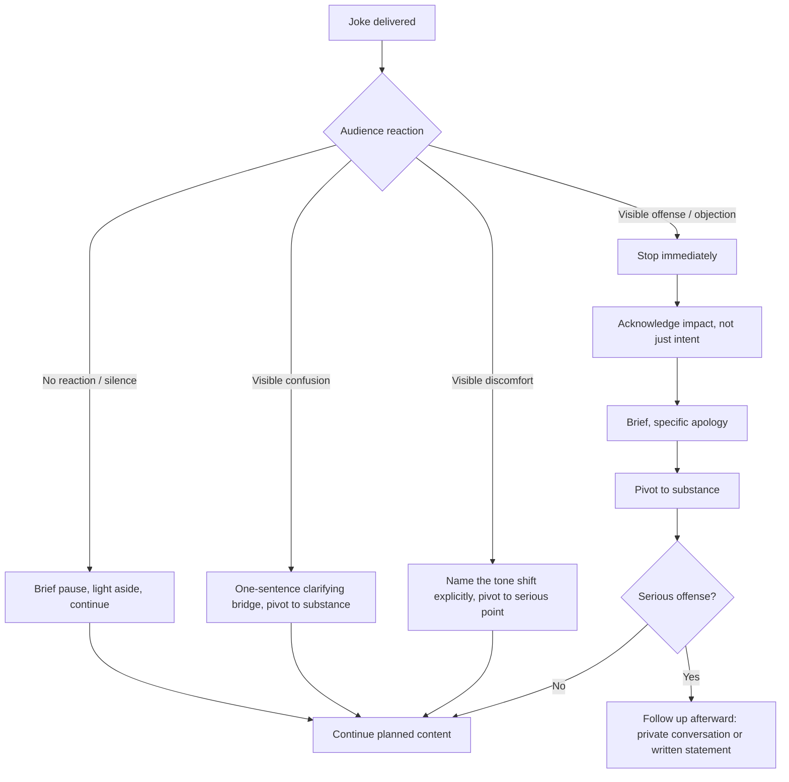

## Recovering Gracefully When Humor Falls Flat

### Definition and Scope

Recovering gracefully when humor falls flat refers to the set of rhetorical and behavioral techniques a speaker uses to maintain composure, credibility, and audience rapport immediately after a joke or humorous remark fails to land — whether through silence, confusion, discomfort, or visible offense. This is a distinct skill from joke construction or room-reading; it operates specifically in the recovery window, the brief interval between a failed comedic beat and the speaker's next move.

### Why This Matters in Executive Communication

Even with careful room-reading and cultural calibration, humor can misfire — audiences are unpredictable, timing can be off, or a remark can land differently than intended despite preparation. For executives, the failure itself is rarely the lasting damage; the *recovery* is what audiences remember. A speaker who freezes, over-apologizes, or doubles down on a failed joke compounds the damage, while one who recovers smoothly often experiences no lasting credibility loss at all. This makes recovery technique a higher-leverage skill than joke-avoidance alone, since it is the only mitigation available once the room-reading assessment proves wrong in the moment.

### Anatomy of a Humor Failure

**Key Points**

- **Silence failure**: The joke is met with no laughter, no reaction — often the most common and mildest form of failure, frequently caused by timing, delivery, or simple mismatch with audience mood rather than offense.
- **Confusion failure**: The audience does not understand the joke, often due to unclear setup, cultural/linguistic mismatch, or an unfamiliar reference (see Cultural Sensitivity in Humor).
- **Discomfort failure**: The audience reacts with visible unease — shifting, avoiding eye contact, or a delayed and forced laugh — usually signaling the joke touched a sensitive topic without full offense being taken.
- **Offense failure**: The audience reacts negatively and visibly, potentially including audible objection, walkouts, or immediate critical feedback — the most severe and rare category, typically triggered by content violating a taboo boundary (see Cultural Sensitivity in Humor for taxonomy).

Distinguishing which failure type has occurred is the first step in selecting a recovery technique, since each calls for a different response.

### The Core Recovery Principle: Acknowledge, Don't Amplify

The governing heuristic across nearly all recovery techniques is that the failed joke should be minimized in duration and attention, not extended. Speakers instinctively want to explain the joke, apologize extensively, or attempt a second joke to "save" the moment — each of these tends to prolong audience discomfort rather than resolve it. The most effective recoveries are brief, acknowledge the moment exists, and move the audience's attention forward immediately.

### Recovery Technique Matrix

| Failure Type | Recommended Technique | Rationale |
| --- | --- | --- |
| **Silence** | Brief pause, then continue immediately without commentary; optionally a light self-aware aside ("Tough crowd — moving on") | Silence is often just a miss, not an offense; drawing attention to it (via over-apology) manufactures a problem that didn't fully exist |
| **Confusion** | One-sentence bridge that reframes or clarifies context, then pivot to substance | Confusion is a comprehension gap, not an emotional injury; a short clarifying bridge resolves it without dwelling |
| **Discomfort** | Direct acknowledgment of the shift in tone, then explicit pivot to the serious point being made | Naming the discomfort transparently signals self-awareness and often defuses tension faster than ignoring it |
| **Offense** | Immediate, sincere, brief apology; explicit statement of intent vs. impact; swift return to substantive content | Offense requires accountability, not minimization; but the apology itself should still be concise to avoid re-centering the room on the failure rather than the recovery |

### Self-Deprecating Recovery as a Universal Tool

**Key Points**

- Turning the failed joke into a self-deprecating remark about one's own comedic timing ("Well, that one's going in the vault of jokes I'll never tell again") is broadly effective across the silence and confusion failure types because it redirects any awkwardness onto the speaker rather than the audience or the joke's subject matter.
- This technique works because it demonstrates composure and self-awareness — qualities audiences associate with executive presence — while requiring no explanation of the original joke's content, which would only prolong the moment.
- [Inference] This technique is less appropriate for offense-type failures, since self-deprecating humor about one's timing can appear to minimize or deflect from the substantive concern raised by the joke's content, rather than addressing it directly.

### The Apology Framework for Offense-Level Failures

When a joke causes genuine offense, a distinct and more careful protocol applies:

1. **Stop immediately** — do not continue the bit, explain the joke, or attempt to clarify "what you really meant" before acknowledging the impact.
2. **Name the impact, not just the intent** — acknowledge how the remark landed rather than leading with a defense of intention (e.g., leading with "I didn't mean it that way" before acknowledging harm often reads as deflection).
3. **Keep the apology brief and specific** — a short, direct acknowledgment is generally more credible than an extended, elaborate apology, which can appear performative or can re-center attention on the speaker's discomfort rather than the audience's.
4. **Pivot to substance quickly** — return to the core content of the talk promptly; lingering in apology mode extends the audience's negative focus on the incident.
5. **Follow up afterward if warranted** — for serious offenses, a more considered follow-up (private conversation, written statement, or public correction) may be appropriate after the live moment, separate from the in-the-room recovery.

### Timing of the Recovery Window

**Key Points**

- The recovery window for silence and confusion failures is typically very short — under 2-3 seconds of pause is usually sufficient before continuing; longer pauses can amplify the awkwardness rather than let it pass.
- For discomfort failures, a slightly longer beat (acknowledging the shift explicitly) is often warranted, since rushing past visible unease can read as ignoring the room rather than reading it.
- For offense failures, the apology itself should be prompt (addressed immediately, not deferred to "after the break") but should not be rushed to the point of appearing insincere.

### Example: Contrasting Recoveries

**Example**

- *Effective recovery (silence failure)*: A speaker's opening joke about a company acronym gets no laughs. They pause briefly, say "Alright, tough room — I'll stick to the slides," and move directly into the substantive content. Total recovery time: under five seconds, no further reference to the joke.
- *Ineffective recovery (same failure)*: The speaker repeats the joke's punchline, explains why it should have been funny, and asks the audience "you get it, right?" This extends the awkward silence, draws more attention to the failure, and can make the audience feel pressured to respond, worsening the discomfort.
- *Effective recovery (offense failure)*: A joke referencing a competitor's recent layoffs draws visible discomfort and a pointed question from an audience member. The speaker says, "That came across poorly — I hear that, and it wasn't fair given what people there are going through. Let's move to the numbers," then proceeds directly into planned content.

### Recovery Decision Flow

### Nonverbal Components of Recovery

**Key Points**

- **Posture and composure**: Maintaining steady body language (avoiding visible flushing reactions like touching the face, looking down, or fidgeting) signals control even when the verbal recovery is brief.
- **Vocal tone**: A steady, unhurried vocal tone during recovery communicates confidence; a rushed or higher-pitched delivery can signal panic and draw more attention to the failure.
- **Eye contact**: Maintaining eye contact with the audience during the recovery (rather than looking away or down) reinforces the impression of composure and ownership of the moment.

### Common Failure Modes in Recovery Itself

| Failure Mode | Description | Consequence |
| --- | --- | --- |
| **Over-explaining** | Elaborating on why the joke should have worked | Extends awkwardness, can appear defensive |
| **Over-apologizing** | Excessive, repeated apology for a mild silence/confusion failure | Manufactures a bigger incident than occurred; can appear insecure |
| **Doubling down** | Attempting a second joke to "save" the first, compounding risk | Often fails again, deepening the credibility hit |
| **Ignoring visible offense** | Proceeding as if nothing happened when the audience clearly reacted negatively | Reads as lack of self-awareness or accountability |
| **Blame-shifting** | Suggesting the audience "didn't get it" or was "too sensitive" | Severely damages credibility; shifts responsibility away from the speaker |
| **Deferred apology** | Waiting until much later in the talk (or after the event) to address a clear in-the-room offense | Appears evasive; audience is left unaddressed during the live moment |

### Relationship to Other Rhetorical Skills

- **Reading the Room for Appropriate Humor** — recovery is the contingency skill for when room-reading assessments prove incorrect in the moment; the two skills form a complete risk-management pair (assessment beforehand, recovery if the assessment fails).
- **Cultural Sensitivity in Humor** — many offense-level failures originate from cultural mismatches; recovery technique for these cases often intersects directly with cross-cultural repair communication.
- **Crisis Communication** — severe, public, or recorded humor failures (especially those that circulate on social media) escalate into full crisis-communication protocols, extending beyond in-the-room recovery into organizational reputation management.
- **Executive Presence** — the composure demonstrated during recovery is itself a core component of perceived executive presence, linking this skill to broader leadership-communication competencies beyond humor specifically.

### Practical Next Steps for Skill Development

**Next Steps**

- Rehearse brief, self-deprecating recovery lines in advance so they are available reflexively rather than improvised under pressure during silence or confusion failures.
- Practice the "name it and move on" technique for discomfort failures in lower-stakes settings (team meetings) before applying it in high-visibility contexts.
- Draft a personal apology template for offense-level failures that separates acknowledgment of impact from explanation of intent, and rehearse delivering it concisely.
- Record and review past talks (own or others') specifically for recovery moments — study the gap between joke and next line for pacing and composure cues.
- Build a post-event debrief habit: after any talk involving humor, briefly assess whether any moment required recovery and evaluate what worked or didn't, independent of the joke's original design.

**Related Topics**

- Reading the Room for Appropriate Humor
- Cultural Sensitivity in Humor
- Executive Presence Under Pressure
- Crisis Communication After a Public Messaging Failure
- Self-Deprecating Humor as a Credibility Tool
- Nonverbal Composure Techniques for Public Speaking