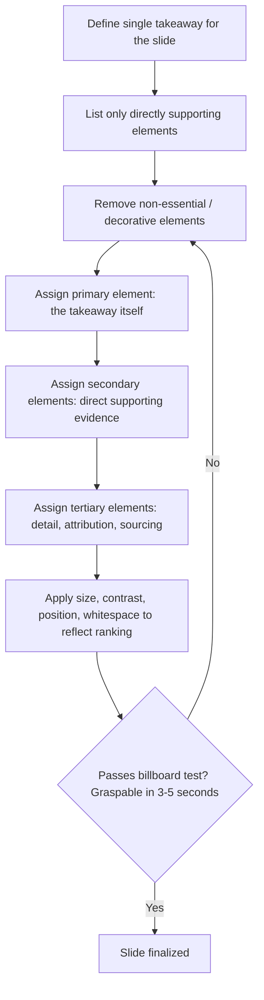

## Principles of Visual Simplicity and Hierarchy

### Definition and Scope

Visual simplicity and hierarchy are foundational design principles governing how information on a slide is reduced to its essential elements (simplicity) and organized so that the eye is guided to the most important content first (hierarchy). In executive communication contexts, these principles determine whether a slide supports the speaker's argument or competes with it for audience attention.

### Why This Matters in Executive Communication

Slides in executive settings — board decks, investor presentations, all-hands meetings — are consumed under time pressure and divided attention. An audience member has seconds to extract meaning from a slide before returning focus to the speaker. Slides that lack simplicity and hierarchy force the audience to choose between reading and listening, degrading comprehension of the spoken message. Well-designed slides, by contrast, reinforce the verbal argument almost instantaneously, functioning as visual aids rather than visual competitors.

### Core Principle: Simplicity

**Key Points**

- **One idea per slide**: Each slide should support a single claim or takeaway. Multiple competing ideas force the audience to determine relevance themselves, splitting attention from the speaker.
- **Signal-to-noise ratio**: Every element on a slide (text, icon, line, color) should serve the core message. Elements that don't contribute to comprehension — decorative borders, unnecessary logos repeated on every slide, redundant labels — constitute noise that dilutes the signal.
- **Cognitive load minimization**: Simplicity is grounded in cognitive load theory: working memory has limited capacity, and dense slides consume that capacity on parsing rather than understanding. [Inference] Reducing extraneous visual elements is generally understood to free cognitive resources for processing the actual message, consistent with widely cited principles in multimedia learning research (e.g., Mayer's coherence principle), though the degree of benefit varies by audience and content type.
- **The "billboard test"**: A common practical heuristic is whether a slide could be understood by someone glancing at it for 3-5 seconds, as if it were a highway billboard. If not, the slide likely contains too much information for a live presentation context.

### Core Principle: Hierarchy

**Key Points**

- **Primary, secondary, tertiary information**: Effective slides establish a clear order of visual importance — a primary takeaway (often the largest or most prominent element), supporting evidence (secondary), and fine detail or attribution (tertiary, often smallest and least prominent).
- **Guided eye movement**: Hierarchy directs the sequence in which an audience's eyes move across a slide, ideally aligning with the order in which the speaker will discuss the content, rather than leaving the audience to discover the intended reading order on their own.
- **Non-uniformity as a tool**: If all elements on a slide have equal visual weight (same size, same color, same emphasis), the audience has no cues about what matters most; hierarchy requires intentional inequality between elements.

### Mechanisms for Establishing Hierarchy

| Mechanism | Effect | Typical Use |
| --- | --- | --- |
| **Size** | Larger elements are perceived as more important | Headline numbers, key takeaway statements |
| **Color/contrast** | High-contrast or accent-colored elements draw the eye first | Highlighting a single critical data point among many |
| **Position** | Elements higher and more central (in left-to-right reading cultures, upper-left) tend to be seen first | Placing the core message in the primary reading zone |
| **Whitespace/proximity** | Isolated elements surrounded by empty space appear more significant; grouped elements are read as related | Separating a key metric from supporting detail |
| **Typographic weight** | Bold, larger, or distinct fonts signal importance relative to regular body text | Differentiating headline text from supporting captions |
| **Sequence/animation (if used)** | Revealing elements in order controls the pace at which the audience receives information | Build-based reveals synced to speaker's verbal pacing |

### The Relationship Between Simplicity and Hierarchy

Simplicity and hierarchy are complementary rather than independent: a slide can be simple (few elements) but still lack hierarchy (all elements weighted equally, leaving the audience unsure what matters most). Conversely, a slide can attempt hierarchy without simplicity, using size and color to try to prioritize information within an already-cluttered layout, which typically fails because competing noise undermines the hierarchy cues. Effective slide design applies simplicity first (removing non-essential elements) and then applies hierarchy (organizing what remains).

### Design Process Framework

1. **Identify the single takeaway** — before any visual design, articulate the one sentence the slide must communicate.
2. **List only supporting elements** — include only the data, images, or text that directly substantiate that single takeaway; remove anything that doesn't.
3. **Assign visual weight by importance** — determine which remaining element is primary (the takeaway itself, often a headline or big number) and which are secondary/tertiary (supporting data, source attribution).
4. **Apply hierarchy mechanisms** — use size, contrast, position, and whitespace to make the importance ordering visually obvious without relying on the audience to read every word.
5. **Apply the billboard test** — evaluate whether the slide's core message is graspable within a few seconds' glance.
6. **Remove remaining noise** — eliminate any decorative or redundant elements that survived the previous steps but don't reinforce the hierarchy.

### Common Failure Modes

**Key Points**

- **The "wall of text" slide**: Dense paragraphs or bullet lists that essentially become a script for the speaker to read aloud, causing the audience to read ahead or disengage rather than listen.
- **Chart-dumping**: Including a complex chart with excessive data series, unlabeled axes, or granular detail, forcing the audience to do analytical work that belongs in the speaker's narration.
- **Uniform emphasis**: Formatting all bullet points, headers, and data points with identical size and weight, leaving no visual indication of what is most important.
- **Decorative clutter**: Adding icons, logos, or background elements that do not carry informational content, increasing visual noise without adding signal.
- **Hierarchy mismatch with narration**: Designing a slide where the visually most prominent element is not actually the point the speaker intends to emphasize, creating a disconnect between what the audience sees and what they hear.

### Example: Before and After

**Example**

- *Before (violates both principles)*: A slide titled "Q3 Performance Summary" contains six bullet points of roughly equal font size covering revenue, headcount, churn, new markets, product launches, and competitor moves, alongside a small unlabeled bar chart in the corner. The audience must read all six items and interpret the chart independently to determine which point matters most for the current discussion.
- *After (applies both principles)*: The slide is split into one slide per topic. The Q3 revenue slide shows a single large number (the headline revenue figure) in the visual center, a one-line supporting statement below it in smaller text ("+18% YoY, exceeding guidance"), and a minimal trend line chart beneath that as tertiary supporting evidence. The single takeaway is graspable within seconds, and the eye naturally moves from number to context to detail.

### SVG Illustration: Visual Hierarchy Comparison (svg_diagram)

<svg xmlns="http://www.w3.org/2000/svg" viewBox="0 0 800 380">
<text x="200" y="25" font-size="16" font-weight="bold" text-anchor="middle" fill="#333">No Hierarchy (svg_diagram)</text>
<rect x="20" y="40" width="360" height="300" fill="none" stroke="#999" stroke-width="1" />
<text x="40" y="70" font-size="13" fill="#444">Revenue grew significantly in Q3</text>
<text x="40" y="100" font-size="13" fill="#444">Headcount increased by 12 people</text>
<text x="40" y="130" font-size="13" fill="#444">Churn decreased slightly this quarter</text>
<text x="40" y="160" font-size="13" fill="#444">Two new markets were entered</text>
<text x="40" y="190" font-size="13" fill="#444">Product launch delayed to Q4</text>
<text x="40" y="220" font-size="13" fill="#444">Competitor announced new pricing</text>
<rect x="40" y="240" width="120" height="60" fill="#ccc" />
<text x="100" y="275" font-size="10" text-anchor="middle" fill="#666">unlabeled chart</text>

<text x="600" y="25" font-size="16" font-weight="bold" text-anchor="middle" fill="#333">Clear Hierarchy (svg_diagram)</text>

<rect x="420" y="40" width="360" height="300" fill="none" stroke="#999" stroke-width="1" />

<text x="600" y="130" font-size="44" font-weight="bold" text-anchor="middle" fill="`#1a5276`">$4.2M</text>

<text x="600" y="165" font-size="16" text-anchor="middle" fill="#444">+18% YoY, exceeding guidance</text>

<polyline points="480,240 540,220 600,230 660,190 720,180" fill="none" stroke="`#1a5276`" stroke-width="2" />

<text x="600" y="300" font-size="10" text-anchor="middle" fill="#888">Quarterly revenue trend, FY26</text>

</svg>

### Hierarchy Application Flow

### Interaction with Typography and Color (Cross-References)

Visual simplicity and hierarchy rely heavily on typographic and color choices to execute the mechanisms described above; the specific rules governing font pairing, sizing scales, and color-contrast accessibility are typically treated as adjacent, dedicated topics within slide design curricula rather than fully elaborated here; see Related Topics.

### Relationship to Verbal Delivery

**Key Points**

- Slide hierarchy should align with, not duplicate, the speaker's verbal emphasis; a slide is a supporting visual, and its primary element should typically correspond to the point the speaker is verbally emphasizing at that moment.
- Overly detailed or hierarchically flat slides tend to pull audience attention away from the speaker and toward independent reading, which is often described in presentation design literature as competing with the speaker rather than supporting them.
- Simple, hierarchically clear slides allow the speaker to maintain audience eye contact and engagement, since the audience can absorb the slide's core point without extended reading.

### Relationship to Other Rhetorical/Design Skills

- **Data Visualization Principles** — hierarchy and simplicity directly inform how charts and graphs should be simplified and labeled for live presentation, extending these principles into quantitative visual design.
- **Typography for Executive Decks** — the specific mechanics of font selection, sizing, and weight referenced under "hierarchy mechanisms" are elaborated in dedicated typography-focused material.
- **Narrative Structure in Presentations** — the "one idea per slide" principle connects directly to broader narrative pacing, where slide sequencing mirrors the argument's logical structure.
- **Audience Analysis** — the appropriate level of simplicity/detail can vary depending on audience expertise and context (e.g., a technical deep-dive with peers vs. a board summary), linking this topic back to audience-calibration principles.

### Practical Next Steps for Skill Development

**Next Steps**

- Apply the "one takeaway per slide" test retroactively to an existing deck: for each slide, write the single sentence it should communicate, and flag any slide where more than one sentence is needed.
- Practice the billboard test on existing slides by having a colleague glance at each for 3-5 seconds and report back what they understood.
- Build a personal or team slide template that pre-establishes hierarchy zones (headline, supporting evidence, detail/attribution) so that hierarchy is designed in from the start rather than retrofitted.
- Study specific hierarchy mechanisms (size, contrast, position, whitespace) individually by auditing effective decks or presentations and identifying which mechanism is doing the most work on each strong slide.
- Pair this study with adjacent topics — typography and data visualization — to build complete technical fluency in slide execution beyond the conceptual principles covered here.

**Related Topics**

- Data Visualization Principles for Executive Decks
- Typography and Font Hierarchy in Presentations
- Color Theory and Contrast for Slide Design
- Narrative Structure and Slide Sequencing
- Cognitive Load Theory in Presentation Design
- Audience Analysis for Calibrating Slide Detail