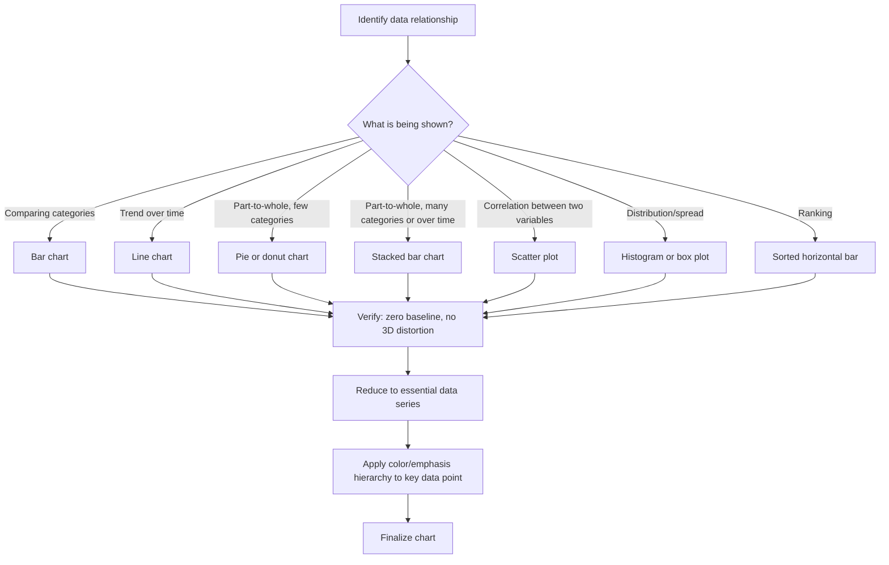

## Data Visualization and Chart Selection

### Definition and Scope

Data visualization and chart selection is the discipline of translating quantitative or categorical data into visual formats that accurately and efficiently communicate a specific insight to an audience. Chart selection specifically refers to choosing the visual encoding (bar, line, pie, scatter, etc.) that best matches the structure of the data and the argument being made, rather than defaulting to whatever chart type a tool generates automatically.

### Why This Matters in Executive Communication

Executives frequently use data to justify decisions, report performance, and persuade stakeholders. A poorly chosen chart can obscure the very insight it was meant to reveal, force the audience to do interpretive work that belongs to the speaker, or — in the worst cases — visually misrepresent the data in ways that damage credibility once noticed. Because data-heavy slides (earnings decks, board reports, KPI dashboards) are a recurring artifact in executive communication, chart selection functions as a specialized extension of the broader visual simplicity and hierarchy principles applied specifically to quantitative content.

### Core Principle: Match Chart Type to Data Relationship

**Key Points**

- **Comparison** (comparing discrete categories): Bar charts (vertical or horizontal) are generally the standard choice, since length is one of the most accurately perceived visual encodings for magnitude comparison.
- **Trend over time**: Line charts are the standard choice for continuous time-series data, since they visually emphasize the direction and rate of change.
- **Part-to-whole composition**: Stacked bar charts or 100% stacked bars are generally preferred over pie charts for more than 2-3 categories, since human perception is less accurate at judging angular/area differences than length differences. [Inference] This preference is grounded in well-established data visualization research on graphical perception (e.g., work by Cleveland and McGill on perceptual accuracy of visual encodings), though the practical difference may be negligible for very simple two-category splits.
- **Correlation/relationship between two variables**: Scatter plots are the standard choice for showing the relationship between two continuous variables.
- **Distribution**: Histograms or box plots are standard for showing how values are spread across a range, though these are less common in executive-facing decks than in technical/analytical contexts.
- **Ranking**: Sorted horizontal bar charts are typically preferred over unsorted vertical bars when the argument depends on relative ranking rather than absolute category identity.

### Chart Type Selection Reference

| Data Relationship | Recommended Chart | Avoid | Rationale |
| --- | --- | --- | --- |
| Comparing categories | Bar chart (vertical/horizontal) | 3D bar charts | Length is accurately perceived; 3D distorts perceived magnitude |
| Trend over time | Line chart | Pie chart | Line charts show directional change; pie charts have no time dimension |
| Part-to-whole (2-3 parts) | Pie or donut chart | N/A (acceptable use case) | Simple compositions are one of the few contexts where pie charts perform adequately |
| Part-to-whole (4+ parts or over time) | Stacked bar chart | Pie chart with many slices | Angular comparison across many slices is difficult to judge accurately |
| Correlation between variables | Scatter plot | Line chart connecting unordered points | Scatter plots don't imply a false sequential relationship |
| Distribution/spread | Histogram or box plot | Single summary bar (mean only) | Distribution shape (skew, outliers) is lost when reduced to a single average |
| Ranking | Sorted horizontal bar | Unsorted vertical bar | Sorting immediately visually communicates rank order |
| Single key metric | Big number / KPI callout | Any chart | A single number often doesn't need a chart at all; a large numeral is more direct |

### Common Failure Modes in Chart Selection and Design

**Key Points**

- **Pie chart overuse**: Applying pie charts to compositions with many categories or to data intended for comparison rather than composition, where angular judgments become unreliable and the chart becomes harder to read than a simple bar chart.
- **3D and decorative distortion**: Using 3D bar or pie charts, which distort the perceived proportions of the underlying data due to perspective effects, misrepresenting magnitude even when the underlying numbers are accurate.
- **Truncated or manipulated axes**: Starting a bar chart's y-axis at a value other than zero to exaggerate differences between bars — a technique that can mislead audiences and, if identified, seriously damage a presenter's credibility.
- **Chart-junk**: Excessive gridlines, redundant data labels, decorative textures, or unnecessary legends that add visual noise without adding informational value (a data-visualization-specific application of the broader simplicity principle).
- **Over-encoding**: Attempting to show too many variables in a single chart (e.g., encoding data through size, color, and position simultaneously) beyond what an audience can parse in a live presentation context.
- **Dual-axis charts**: Combining two different scales on the same chart (e.g., revenue on the left axis, headcount on the right) can create a false visual impression of correlation between unrelated metrics, and is generally treated with caution in data visualization practice.

### Chart Selection Decision Process

1. **Identify the underlying data relationship** — determine whether the data represents comparison, trend, composition, correlation, distribution, or ranking.
2. **Identify the specific insight to communicate** — the same dataset can support multiple chart types depending on which aspect of the data is the point (e.g., time-series revenue data could support a line chart for trend or a bar chart for period-over-period comparison).
3. **Select the chart type matching both data relationship and insight** — cross-reference against the table above rather than defaulting to a tool's default chart type.
4. **Reduce to essential data series** — remove or aggregate data series that do not contribute to the specific insight being communicated (echoing the broader simplicity principle).
5. **Verify perceptual accuracy** — confirm the chosen chart type does not introduce distortion (non-zero baselines, 3D effects, misleading dual axes).
6. **Apply hierarchy within the chart** — use color or emphasis to highlight the specific data point or series relevant to the current argument, rather than presenting all series with equal visual weight.

### Chart Selection Decision Flow

### Example: Chart Selection in Practice

**Example**

- *Scenario*: An executive needs to show quarterly revenue by product line for the past eight quarters, with the argument being that Product B has grown to overtake Product A.
- *Poor choice*: A pie chart for each quarter (eight separate pie charts), forcing the audience to compare angular slices across eight separate images to detect the trend — an extremely difficult perceptual task.
- *Better choice*: A single stacked area or multi-line chart showing both product lines' revenue trends over the eight quarters, with Product B's line highlighted in a strong accent color and Product A's line in muted gray. The crossover point where Product B overtakes Product A becomes immediately visible as a single visual event, directly supporting the argument.

### Color and Emphasis in Data Visualization

**Key Points**

- Color should be used functionally, not decoratively — reserving a strong accent color for the specific data series or point relevant to the current argument, while other series recede into muted or grayscale treatment.
- Consistent color mapping across a deck (e.g., Product B is always the same color on every slide it appears on) reduces cognitive load, since the audience does not need to re-learn the legend on each new slide.
- Color choices should also account for accessibility considerations (e.g., red-green colorblind-safe palettes), particularly for widely distributed decks. [Unverified] Because accessibility standards and tooling for colorblind-safe palettes continue to evolve, presenters producing decks for large or public distribution should verify current best practices and tools rather than relying on a fixed palette assumption.

### Labeling and Annotation Practices

- **Direct labeling over legends**: Where feasible, labeling data series directly on the chart (e.g., placing a series name at the end of its line) reduces the need for audience eye movement between a legend and the chart itself.
- **Annotation of key events**: Adding brief text callouts at specific points on a chart (e.g., "Product launch" marked at the corresponding point on a trend line) ties quantitative data directly to narrative context.
- **Source attribution**: Including a small, tertiary-weighted source citation (consistent with the hierarchy principles of minimal visual weight for supporting/attribution information) supports credibility without competing with the primary insight.

### Relationship to Other Rhetorical/Design Skills

- **Principles of Visual Simplicity and Hierarchy** — chart selection is a specialized application of these broader principles to quantitative content; the "one idea per chart" rule mirrors the "one idea per slide" rule.
- **Narrative Structure in Presentations** — chart sequencing across a deck (e.g., building from a broad trend chart to a detailed breakdown) mirrors the broader narrative pacing principles used in slide sequencing.
- **Ethical Persuasion and Data Integrity** — chart manipulation techniques (truncated axes, misleading scales) intersect directly with rhetorical ethics, since technically accurate data can still be presented in a visually misleading way.
- **Audience Analysis** — the appropriate level of chart complexity varies significantly between technical/analyst audiences (who may want more granular data) and generalist or board audiences (who typically need higher-level aggregation).

### Practical Next Steps for Skill Development

**Next Steps**

- Audit an existing data-heavy deck by identifying, for each chart, the specific underlying data relationship (comparison, trend, composition, correlation, distribution, ranking) and verifying the chart type matches that relationship using the reference table above.
- Practice converting a pie chart with more than three categories into a sorted bar chart or stacked bar chart, and compare which version communicates the relative rankings more quickly.
- Review chosen charts specifically for axis manipulation (non-zero baselines) and correct any that could visually exaggerate differences in the underlying data.
- Build a personal or team color-mapping standard so that recurring data series (specific products, regions, time periods) use consistent colors across all decks.
- Study graphical perception research (e.g., foundational work by Cleveland and McGill on the accuracy of visual encodings) to build a deeper theoretical grounding for chart selection decisions beyond heuristic rules of thumb.

**Related Topics**

- Principles of Visual Simplicity and Hierarchy
- Ethical Persuasion and Data Integrity in Presentations
- Color Theory and Accessibility in Slide Design
- Narrative Structure and Slide Sequencing
- Audience Analysis for Calibrating Data Detail
- Graphical Perception Theory (Cleveland-McGill Framework)