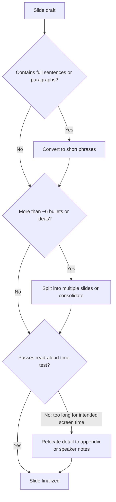

## Avoiding Cluttered and Text-Heavy Slides

### Definition and Scope

Avoiding cluttered and text-heavy slides refers to the specific set of diagnostic criteria and remediation techniques for identifying and reducing excessive textual and visual density on presentation slides. While closely related to the broader principles of visual simplicity and hierarchy, this topic focuses specifically on the text-density failure mode — the tendency to overload slides with prose, bullet lists, and dense supporting detail rather than distilling content to its essential form.

### Why This Matters in Executive Communication

Text-heavy slides are one of the most common and most damaging failures in executive presentations. When a slide contains more text than an audience can read while also listening to the speaker, the audience is forced to choose: read the slide (disengaging from the speaker) or listen to the speaker (missing the slide's content). This split-attention effect undermines both channels simultaneously. In high-stakes settings — board meetings, investor pitches — a text-heavy slide can also signal that the presenter has not done the work of distilling their own thinking, which can subtly undermine perceived command of the material.

### The Split-Attention Problem

**Key Points**

- **Cognitive basis**: [Inference] The core issue is grounded in cognitive load research suggesting that simultaneously processing spoken narration and dense on-screen text competes for the same limited attentional resources, consistent with the "redundancy principle" described in multimedia learning research (e.g., Mayer), though the precise magnitude of the effect varies by audience and content.
- **Reading-ahead behavior**: When a slide contains full sentences or paragraphs, audiences tend to read ahead of the speaker's pace, then disengage from listening once they've finished reading, often missing nuance or emphasis the speaker intended to add verbally.
- **The "teleprompter slide" trap**: Some presenters construct slides that function as their own speaking notes, effectively scripting their talk in bullet form. This produces slides optimized for the speaker's memory rather than the audience's comprehension.

### Diagnostic Criteria for Clutter and Text-Heaviness

| Symptom | Description | Typical Cause |
| --- | --- | --- |
| **Full-sentence bullets** | Bullet points written as complete grammatical sentences rather than short phrases | Slide used as a speaking script |
| **Excessive bullet count** | More than 4-6 bullet points on a single slide | Attempting to cover multiple ideas on one slide |
| **Nested sub-bullets** | Multiple levels of indentation creating a dense outline structure | Trying to preserve full document-level detail in slide form |
| **Small font sizes** | Text sized below readable thresholds for the room/screen (commonly cited as roughly 24-28pt minimum for body text in a live room, though this varies with room size and screen distance) | Fitting too much content into a fixed slide space |
| **Dense paragraph blocks** | Full paragraphs of prose rather than distilled phrases | Copy-pasting from a written report or memo directly into slide form |
| **Redundant repetition** | The slide text closely mirrors what the speaker is saying verbally, word for word | Lack of distinction between the slide's role and the speaker's role |
| **Visual crowding** | Multiple charts, images, and text blocks competing on a single slide with minimal whitespace | Attempting to consolidate multiple topics into fewer slides |

### The "Assertion-Evidence" Alternative Structure

A widely referenced alternative to traditional bullet-heavy slides is the assertion-evidence structure:

- **Headline as assertion**: The slide's title is written as a complete, specific sentence stating the slide's core claim (e.g., "Customer churn dropped 22% after the onboarding redesign" rather than a generic label like "Churn Metrics").
- **Visual as evidence**: The body of the slide contains a single supporting visual (chart, diagram, image) that substantiates the headline assertion, rather than bullet text repeating or elaborating on it.
- **Minimal supporting text**: Any additional text is reduced to short labels or a single supporting statement, not paragraph-level elaboration.

This structure directly addresses text-heaviness by replacing prose-based explanation with a specific, falsifiable claim paired with visual proof, shifting elaboration to the speaker's verbal delivery.

### Remediation Techniques

**Key Points**

- **The "phrase, not sentence" rule**: Convert full sentences into short noun or verb phrases (e.g., "We increased revenue by 18% in Q3 due to expansion into new markets" becomes "Revenue +18% — new market expansion").
- **The 6x6 (or similar) guideline**: A commonly cited informal heuristic suggests no more than roughly six bullet points per slide and six words per bullet, though this is a starting heuristic rather than a strict rule, and even six bullets can be too many depending on content complexity.
- **Progressive disclosure via slide splitting**: Rather than compressing multiple ideas onto one dense slide, split the content across multiple simpler slides, each covering a single point — trading slide count for per-slide clarity.
- **Appendix relocation**: Moving detailed supporting data, methodology notes, or backup material to an appendix section (referenced but not displayed during the main presentation) preserves rigor for those who want it without cluttering the primary narrative flow.
- **The "read it aloud" test**: If a slide's text takes longer to read aloud than the speaker intends to spend on that slide, it likely contains too much text for live delivery.

### Text Density Reduction Process

1. **Identify the slide's single core assertion** — as in the visual hierarchy framework, articulate the one claim the slide must make.
2. **Audit existing text against that assertion** — mark any sentence, bullet, or phrase that does not directly support the core assertion for removal or relocation.
3. **Convert remaining text to phrases** — apply the phrase-not-sentence rule to all retained text.
4. **Consolidate or eliminate bullets** — merge closely related bullets, and cut any that fall below the six-point (or similar) threshold guideline.
5. **Relocate excess detail** — move removed but potentially valuable content to speaker notes or an appendix rather than discarding it entirely.
6. **Apply the read-aloud test** — verify the remaining text can be read in a duration proportional to the slide's intended screen time.

### Example: Before and After

**Example**

- *Before (cluttered, text-heavy)*: A slide titled "Market Expansion Strategy" contains a paragraph describing the company's rationale for entering three new markets, followed by six sub-bulleted considerations for each market (regulatory environment, competitive landscape, projected demand), totaling roughly 150 words of dense text in small font.
- *After (assertion-evidence structure)*: The slide is split into three slides, one per market. Each has a headline assertion ("Southeast Asia offers the strongest near-term growth opportunity"), a single supporting visual (a simple comparative bar chart of market size and growth rate across the three candidate markets, with the discussed market highlighted), and a single short supporting phrase beneath it. Full regulatory and competitive detail is moved to an appendix slide referenced verbally ("full market analysis is in the appendix for those who want the detail").

### Clutter Reduction Decision Flow

### Relationship to Speaker Notes and Delivery

**Key Points**

- Detailed talking points, statistics, and elaboration belong in the speaker's own notes or verbal delivery, not on the visible slide — the slide's role is to anchor and visually reinforce what the speaker says, not substitute for it.
- Presenters who rely on dense slides as a memory aid are encouraged to separate that function from the audience-facing slide entirely (e.g., using a presenter-notes view or a printed script), preserving the audience-facing slide for clarity rather than for the speaker's own reference.
- Handout or leave-behind versions of a deck (distributed after a meeting for reference) can legitimately contain more text and detail than the live-presentation version; a common practice is maintaining two versions of a deck — a sparse "presentation" version and a denser "reading" or leave-behind version — rather than compromising the live version's clarity to serve the handout's informational completeness.

### Relationship to Other Rhetorical/Design Skills

- **Principles of Visual Simplicity and Hierarchy** — this topic is a specific, diagnostic application of the broader simplicity principle, focused narrowly on the text-density failure mode.
- **Data Visualization and Chart Selection** — chart-based clutter (excessive data series, chart-junk) is a parallel failure mode in the visual/quantitative domain, addressed by chart selection principles.
- **Narrative Structure in Presentations** — the technique of splitting a dense slide into multiple simpler slides connects directly to narrative pacing, since slide count and sequencing shape the story's rhythm.
- **Executive Presence** — a presenter's ability to speak fluently without depending on dense slide text is itself a marker of command over the material, linking directly to perceived executive presence.

### Practical Next Steps for Skill Development

**Next Steps**

- Apply the read-aloud test to an existing deck: time how long it takes to read each slide's text aloud, and flag any slide exceeding the intended screen time for that point in the talk.
- Practice converting five full-sentence bullets from a past deck into short phrases using the phrase-not-sentence rule, then compare clarity and speed of comprehension.
- Build a habit of drafting two versions of key decks — a sparse live-presentation version and a more detailed leave-behind/handout version — rather than compromising one for the other.
- Experiment with the assertion-evidence slide structure on a small section of an existing deck and compare audience engagement or comprehension against the original bullet-based version.
- Pair this study with the broader Visual Simplicity and Hierarchy and Data Visualization topics to build a complete diagnostic toolkit for auditing slide density across an entire deck.

**Related Topics**

- Principles of Visual Simplicity and Hierarchy
- Data Visualization and Chart Selection
- Assertion-Evidence Slide Design Structure
- Narrative Structure and Slide Sequencing
- Executive Presence and Command of Material
- Speaker Notes vs. Audience-Facing Slide Content