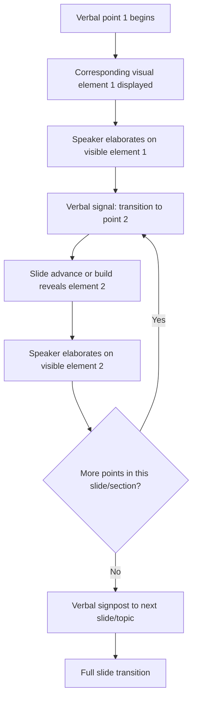

## Aligning Visuals With the Spoken Narrative

### Definition and Scope

Aligning visuals with the spoken narrative is the discipline of synchronizing what appears on screen with what the speaker is saying at any given moment, so that the visual and verbal channels reinforce rather than compete with or contradict one another. This extends beyond individual slide design (covered in simplicity, hierarchy, and chart selection principles) to the temporal and sequential relationship between slide content and spoken delivery across an entire presentation.

### Why This Matters in Executive Communication

A slide can be well-designed in isolation — simple, hierarchical, appropriately charted — and still fail if it is misaligned with the speaker's verbal timing. Audiences process visual and auditory information through partially shared cognitive channels; when a slide shows content the speaker hasn't yet addressed, or lingers on a previous point after the speaker has moved on, the mismatch creates confusion about which channel to trust. In executive settings, this misalignment can make a presenter appear disorganized even when the underlying content and slide design are individually sound.

### Core Principle: Synchrony Between Channels

**Key Points**

- **Temporal alignment**: The visual element the audience sees should correspond to the point the speaker is currently making, not a point already covered or one not yet reached.
- **Redundancy vs. complementarity**: Visuals should complement spoken content (adding a dimension speech alone cannot, such as showing exact figures or spatial relationships) rather than simply redundantly restating it word-for-word, which adds no informational value and can create the split-attention problem described in text-heaviness principles.
- **Directional cueing**: When a speaker references a specific part of a visual ("as you can see in the top-right corner"), the visual should be visible and unambiguous at that exact moment, not several slides removed from the current screen.
- **Avoiding premature reveal**: If a slide contains a punchline number, conclusion, or twist that the speaker intends to build toward verbally, displaying it too early undercuts the verbal build and can cause the audience to read ahead and disengage before the speaker arrives at the point.

### Techniques for Achieving Alignment

| Technique | Description | Use Case |
| --- | --- | --- |
| **Progressive builds/reveals** | Revealing slide elements incrementally (e.g., one bullet or chart series at a time) synced to the speaker's pacing | Preventing premature reveal of conclusions; walking through multi-step logic |
| **Slide-per-point structure** | Dedicating one slide to each discrete point in the verbal narrative rather than covering multiple points on one static slide | Ensuring the visible slide always matches the current verbal point |
| **Deictic/pointer cues** | Using cursor highlighting, laser pointers, or animated call-outs to direct attention to a specific part of a visual as it's being discussed | Large or complex charts/diagrams where the audience might not know where to look |
| **Verbal signposting of visual transitions** | Speaker explicitly says "Let's move to the next chart" or "Now look at this comparison" immediately before advancing the slide | Preventing a mismatch window where the audience is still processing the old slide while a new one appears |
| **Rehearsed timing** | Practicing the talk with the actual slide advances included, not just reading through content, to catch timing mismatches before live delivery | High-stakes presentations where precise synchrony matters (investor pitches, keynotes) |

### The Progressive Build/Reveal Technique in Detail

Progressive builds are one of the most direct mechanisms for maintaining narrative-visual alignment, particularly for slides containing multiple data points, argument steps, or comparison elements:

1. **Segment the slide's content into logical units** matching the speaker's intended verbal sequence (e.g., each bar in a comparison chart, each step in a process diagram).
2. **Set the reveal order to match speaking order** — the first element to appear on screen should correspond to the first point the speaker will make.
3. **Avoid revealing all elements simultaneously** if the speaker intends to discuss them sequentially, since simultaneous reveal invites the audience to read ahead of the speaker's pace.
4. **Time reveals to speaker pauses**, not to a fixed timer — builds should generally be manually triggered so the visual only appears once the speaker is verbally ready to discuss it, since audience reading speed and speaker pacing rarely match a fixed automated timer exactly.

### Common Failure Modes

**Key Points**

- **Slide lag**: The speaker has moved on to a new point verbally, but the visible slide still shows the previous point's content, creating a brief but noticeable disconnect.
- **Slide lead (premature reveal)**: A slide displays a conclusion, punchline number, or full dataset before the speaker has built up to it verbally, undercutting the intended narrative arc and inviting the audience to read ahead.
- **Orphaned visual reference**: The speaker references a specific visual detail ("as this chart shows...") without that visual currently being on screen, forcing the audience to either recall an earlier slide or wait in confusion.
- **Silent slide advance**: Slides change without any verbal cue, causing a brief moment where the audience is processing new visual content while the speaker has already begun discussing it, creating a comprehension gap.
- **Redundant narration**: The speaker reads the slide's text aloud verbatim, which adds no new information beyond what the audience could read themselves and can make the delivery feel mechanical.
- **Static overload with sequential narration**: A single dense, non-building slide is used to cover multiple sequential points, forcing the audience to visually search for whichever point the speaker is currently discussing among many simultaneously visible elements.

### Alignment Verification Process

1. **Map the verbal outline to slide content** — for each planned verbal point, confirm which slide (and which specific element within it) should be visible at that moment.
2. **Identify build/reveal needs** — flag any slide containing multiple sequential points that should be revealed incrementally rather than all at once.
3. **Rehearse with actual slide advances** — practice the talk while triggering slide transitions and builds at the intended verbal moments, not just reading through the script separately from the visuals.
4. **Check transition cues** — verify that each slide change is preceded or accompanied by a verbal signal, so the audience is prepared for the shift rather than caught by a silent change.
5. **Adjust pacing based on rehearsal timing** — if verbal delivery consistently runs faster or slower than planned slide timing, adjust either the script or the number/pacing of builds accordingly.

### Example: Contrasting Alignment

**Example**

- *Misaligned*: A speaker says, "Our biggest growth driver this quarter was the enterprise segment," while the visible slide still shows the previous slide's overview chart with no enterprise-specific data visible. The audience has no visual anchor for the claim being made and must wait for the next slide to catch up.
- *Aligned*: The speaker says the same line while advancing to a slide whose primary visual element (a highlighted bar in an already-appropriately-designed comparison chart) shows the enterprise segment specifically, colored distinctly from other segments. The visual appears at the exact moment the claim is made, reinforcing it immediately rather than requiring a delayed connection.

### Alignment Flow Across a Presentation Segment

### Rehearsal as the Primary Verification Method

**Key Points**

- Because alignment is inherently temporal, it cannot be fully verified by reviewing slides or scripts independently — it requires rehearsing the two together, ideally with the actual presentation software and clicker/remote that will be used live.
- [Inference] Presenters who rehearse verbally without advancing slides, or who review slides without speaking the accompanying narration aloud, are likely to miss timing mismatches that only become apparent when both channels run simultaneously, since alignment problems are a property of the interaction between the two channels rather than either one alone.
- For high-stakes presentations, a full run-through with a colleague observing specifically for alignment issues (rather than content accuracy) can catch mismatches the presenter themselves may not notice, since they already know what's coming next.

### Relationship to Other Rhetorical/Design Skills

- **Principles of Visual Simplicity and Hierarchy** — alignment depends on each individual slide already being simple and hierarchically clear; a cluttered slide makes alignment nearly impossible to achieve since there's no single element for the audience to focus on at any given verbal moment.
- **Avoiding Cluttered and Text-Heavy Slides** — the slide-per-point and progressive build techniques described here are direct extensions of the clutter-avoidance principle of "one idea per slide," applied to sequencing rather than single-slide density.
- **Narrative Structure in Presentations** — alignment is essentially the mechanical execution layer of narrative structure; a well-structured narrative outline is a prerequisite for determining what should be visible at each verbal moment.
- **Timing and Pacing in Delivery** — verbal pacing (a distinct rhetorical/delivery skill) directly determines whether planned visual alignment holds up in live delivery, since a speaker running faster or slower than rehearsed will shift the alignment relationship in real time.

### Practical Next Steps for Skill Development

**Next Steps**

- Rehearse an upcoming presentation with actual slide advances and builds included, rather than reviewing the script and slides separately, and note any moments where visual and verbal content don't match up in time.
- Convert one dense, multi-point static slide from an existing deck into a progressive build, sequencing the reveal order to match the intended verbal order.
- Practice explicit verbal signposting before each slide transition ("Now let's look at...", "Moving to the next point...") to reduce silent, unanticipated slide changes.
- Ask a colleague to observe a rehearsal specifically watching for alignment issues (slide lag, premature reveal, orphaned references) rather than reviewing content accuracy.
- Pair this study with Narrative Structure and Delivery Pacing topics to build a complete model of how verbal and visual timing interact across a full presentation.

**Related Topics**

- Principles of Visual Simplicity and Hierarchy
- Avoiding Cluttered and Text-Heavy Slides
- Narrative Structure and Slide Sequencing
- Timing and Pacing in Verbal Delivery
- Rehearsal Techniques for High-Stakes Presentations
- Progressive Disclosure and Build Techniques in Slide Design