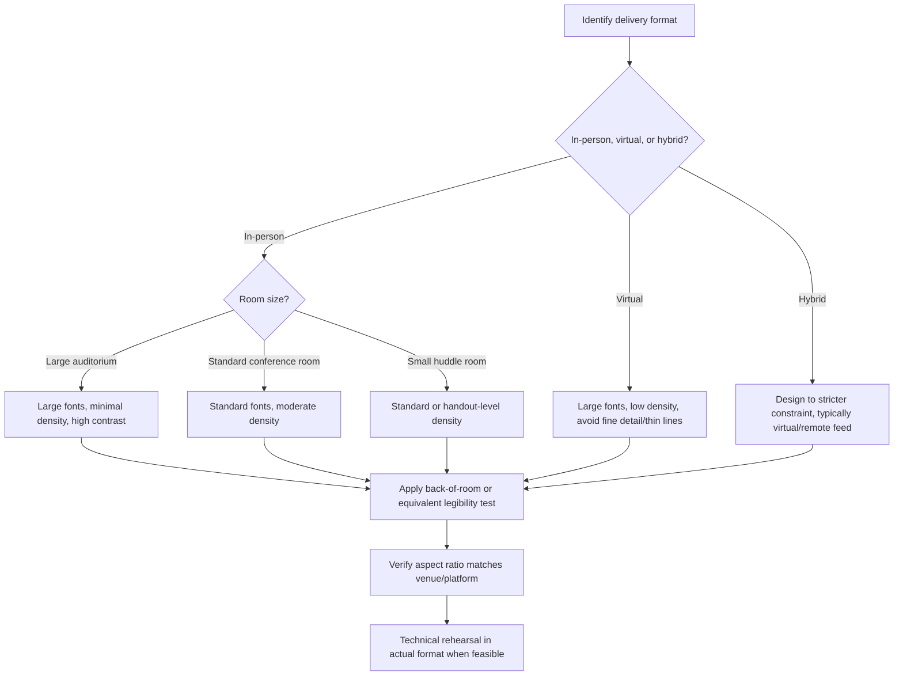

## Designing for Different Room Sizes and Formats

### Definition and Scope

Designing for different room sizes and formats refers to the practice of adapting slide design specifications — font size, contrast, layout density, aspect ratio, and content pacing — to match the physical or digital viewing context in which a presentation will be delivered. This includes variation across large auditoriums, small conference rooms, virtual/video-call formats, and hybrid settings combining in-person and remote audiences.

### Why This Matters in Executive Communication

The same slide deck rarely performs identically across contexts. A slide designed for a boardroom viewed on a large screen at close range can become illegible when projected in a large auditorium at distance, or when compressed into a small video-call window on a viewer's laptop. Executives frequently reuse decks across multiple formats (an investor deck shown live, then sent as a PDF; a keynote given in-person, then streamed) without adjusting for the format's specific constraints, leading to readability and impact failures that have nothing to do with the content's quality.

### Core Variables Affected by Format

**Key Points**

- **Viewing distance**: The physical or effective distance between the audience and the screen determines minimum legible font size and acceptable visual density.
- **Screen/projection size and resolution**: Larger screens and higher resolution can display more detail legibly; smaller or lower-resolution displays (including compressed video-call streams) degrade fine detail, thin lines, and small text.
- **Aspect ratio**: Standard presentation aspect ratios (4:3 legacy, 16:9 widescreen) affect available layout space and how content should be composed; format mismatches can cause cropping or awkward letterboxing.
- **Lighting conditions**: Auditoriums with ambient stage lighting or bright rooms reduce effective contrast on screen, requiring higher-contrast color choices than a dim conference room would need.
- **Audience attention mode**: In-person audiences in a dedicated presentation setting typically maintain more sustained visual attention than virtual audiences, who often view presentations in a small window alongside other applications or distractions.

### Room Size and Format Reference Table

| Format Context | Key Constraint | Design Adjustment |
| --- | --- | --- |
| **Large auditorium/keynote stage** | Long viewing distance, large screen | Larger minimum font sizes (commonly cited guidance suggests body text scaled well above standard conference-room minimums), higher contrast, fewer but bolder visual elements |
| **Standard conference room** | Moderate viewing distance, mid-size screen/TV | Standard body text sizing (commonly cited around 24-28pt minimum), moderate density acceptable |
| **Small huddle room / close viewing** | Short viewing distance, small screen | More detail tolerable, but audience size is typically small enough that printed handouts may be a viable alternative to projected slides |
| **Virtual/video call presentation** | Small window size, variable viewer screen size, video compression artifacts | Larger fonts than in-person equivalents, simplified visuals, avoidance of fine detail or thin lines that compress poorly, higher color contrast |
| **Hybrid (in-person + remote simultaneously)** | Must satisfy both in-room projection and remote video-feed legibility simultaneously | Design to the stricter of the two constraints (typically the remote/virtual constraint, since compression and small windows are usually more limiting than in-room projection) |
| **Printed handout / leave-behind** | No projection constraints; close reading distance | Can tolerate significantly higher text density and finer detail than any live-projected version |

### Font Size Guidance by Context

**Key Points**

- Font size recommendations scale with viewing distance rather than being fixed absolute values; a slide legible in a small meeting room at typical fonts can become illegible in a large auditorium at the same font size.
- [Unverified] Specific minimum font size recommendations vary across different presentation design sources and depend on exact room dimensions, screen size, and resolution, so presenters working with an unfamiliar or unusually large venue should verify sizing against the specific room's dimensions (e.g., via a venue site visit or technical rider) rather than relying solely on generic guidance.
- A commonly cited general heuristic across presentation design literature is that the smallest text on a slide should remain legible from the back row of the intended room; this can be tested via the "back of the room" test — printing or displaying a slide and viewing it from the maximum intended viewing distance before finalizing.

### Adapting Content Density by Format

- **Large-format/keynote settings** tend to favor lower content density per slide (often just an image, a single large number, or a very short phrase), since the audience is typically fully focused on the screen with no competing reading tasks and larger visual elements are more impactful at scale.
- **Conference room/business settings** can tolerate moderate density (short bullet points, small charts), since audiences are closer to the screen and often referencing the material more analytically.
- **Virtual formats** paradoxically often require *lower* density than their in-person conference-room equivalent, despite closer effective viewing distance on a personal screen, because of compression artifacts, smaller relative window size compared to a full room screen, and higher likelihood of divided attention.

### Format-Specific Design Process

1. **Identify the primary delivery format** — determine whether the presentation will be delivered in-person (and at what room scale), virtually, or in a hybrid setting.
2. **Determine the binding constraint** — for hybrid settings, identify which viewing context (in-room or remote) is more restrictive and design to that standard.
3. **Set font size and contrast based on viewing distance** — apply the back-of-the-room test or equivalent verification for the specific venue when possible.
4. **Adjust content density accordingly** — reduce density for large-format or virtual contexts; moderate density is more tolerable in standard conference-room settings.
5. **Verify aspect ratio compatibility** — confirm the deck's aspect ratio matches the venue's screen/projector specifications to avoid cropping or letterboxing.
6. **Test under actual conditions when feasible** — for high-stakes presentations, a technical rehearsal in the actual room or via the actual video-call platform can reveal format-specific issues (unexpected color rendering, cropping, illegible fine print) before live delivery.

### Common Failure Modes

**Key Points**

- **Direct reuse across formats without adjustment**: Using an identical deck (built for a conference room) unmodified for both an in-person keynote and a virtual webinar, without adjusting density or font size for either more demanding context.
- **Underestimating auditorium distance**: Assuming a font size that reads clearly on a laptop screen during deck preparation will translate to a large projected screen viewed from a distant seat.
- **Ignoring video compression effects**: Using thin lines, fine gridlines, or subtle color distinctions that render clearly on a local screen but degrade or disappear after video-call compression.
- **Aspect ratio mismatch**: Preparing a deck in one aspect ratio (e.g., 4:3) for a venue configured for another (16:9), resulting in stretched, cropped, or letterboxed display.
- **Neglecting hybrid asymmetry**: Designing solely for the in-room audience's experience in a hybrid setting, without verifying how the same slide appears through the remote video feed, which often has different color rendering, cropping, or resolution.
- **Static, single-version deck assumption**: Treating a single deck file as suitable for both live presentation and post-event distribution, when the two purposes (live legibility vs. detailed reference) often benefit from separate versions, as noted in the text-density remediation techniques.

### Example: Contrasting Format Adaptations

**Example**

- *Scenario*: A CFO presents Q3 results first at an internal all-hands in a large auditorium, then delivers a condensed version of the same content in a virtual investor call the following week.
- *Auditorium version*: Slides use large, high-contrast headline numbers with minimal supporting text, since the room is large and the audience's attention is primarily visual and centralized on the big screen.
- *Virtual version*: The same core numbers are presented with even simpler visual treatment — a single number and a short label, no secondary chart in the same frame — anticipating that view compression and variable local screen sizes on investors' individual devices make fine chart detail unreliable to render clearly, and that investor attention during a call is more divided than an in-person all-hands audience.

### Format Adaptation Decision Flow

### Practical Testing Techniques

**Key Points**

- **Back-of-the-room test**: Viewing or printing a slide at the maximum intended viewing distance to verify legibility before finalizing, particularly important for auditorium or large-venue contexts.
- **Screen-share simulation**: Sharing the deck via the actual video-call platform to a colleague during rehearsal, then reviewing what it looks like from the viewer's side, since presenter-side and viewer-side rendering can differ.
- **Grayscale/contrast check**: Viewing slides in grayscale or under simulated bright-room lighting to verify that color-based hierarchy or emphasis (see Data Visualization principles) still holds up under degraded contrast conditions.
- **Aspect ratio verification with venue AV staff**: For significant in-person events, confirming screen/projector specifications directly with venue technical staff in advance rather than assuming a default aspect ratio.

### Relationship to Other Rhetorical/Design Skills

- **Principles of Visual Simplicity and Hierarchy** — format constraints often force additional simplification beyond what might be used in a lower-constraint context, making room/format awareness an additional filter applied on top of general simplicity principles.
- **Avoiding Cluttered and Text-Heavy Slides** — virtual and large-auditorium formats generally require even stricter application of text-density reduction than a standard conference-room deck would need.
- **Data Visualization and Chart Selection** — fine chart detail (thin gridlines, subtle color distinctions, dense data labels) is particularly vulnerable to degradation in large-venue projection and video-call compression, linking chart design choices directly to format constraints.
- **Aligning Visuals With the Spoken Narrative** — hybrid and virtual formats often introduce additional alignment challenges (e.g., delay between slide advance and remote audience's view due to streaming latency), extending narrative-visual alignment considerations into the technical format layer.

### Practical Next Steps for Skill Development

**Next Steps**

- Apply the back-of-the-room test to an existing deck intended for a large-venue presentation by viewing it from the maximum expected audience distance before finalizing.
- Before a hybrid or virtual presentation, screen-share the deck to a colleague and review the viewer-side rendering for cropping, color shifts, or illegible fine detail.
- Build a habit of maintaining format-specific versions of high-stakes decks (auditorium, virtual, and print/handout) rather than a single deck reused unmodified across contexts.
- Confirm aspect ratio and screen specifications with venue technical staff in advance of significant in-person presentations.
- Pair this study with Data Visualization and Text-Density topics to build a complete checklist for adapting a single core deck across multiple delivery formats.

**Related Topics**

- Principles of Visual Simplicity and Hierarchy
- Avoiding Cluttered and Text-Heavy Slides
- Data Visualization and Chart Selection
- Aligning Visuals With the Spoken Narrative
- Virtual and Hybrid Presentation Delivery Techniques
- Technical Rehearsal Practices for High-Stakes Presentations