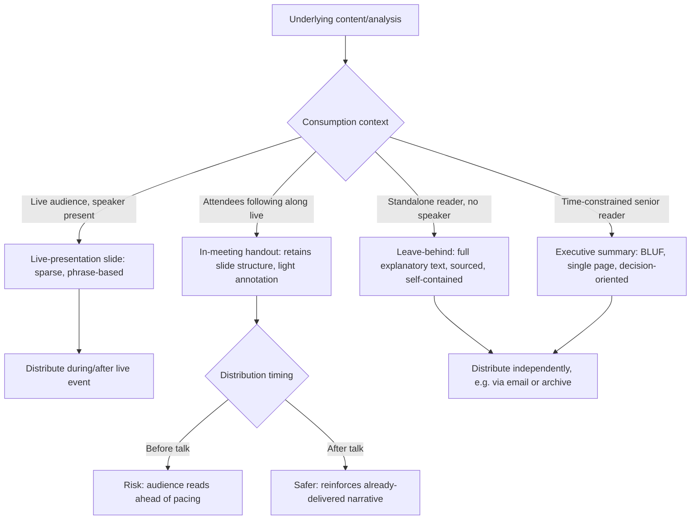

## Handouts, Leave-Behinds, and Executive Summaries

### Definition and Scope

Handouts, leave-behinds, and executive summaries are supplementary or standalone document formats designed to communicate presentation content to audiences who are not simultaneously listening to a live speaker — either because they are reviewing material before or after a live event, or because they will never attend the live presentation at all. This topic covers how these formats differ structurally and functionally from live-presentation slides, and how to design each for its specific consumption context.

### Why This Matters in Executive Communication

Executive content frequently outlives its original delivery context. A board deck is read by directors before the meeting and referenced afterward; an investor pitch deck is forwarded to partners who weren't in the room; a strategy presentation is archived for future reference. Applying live-presentation slide design principles (sparse text, large fonts, minimal density — per Visual Simplicity and Avoiding Cluttered Slides) directly to these standalone-reading contexts produces documents that are frustratingly uninformative on their own, since they were built to be narrated rather than read. Conversely, applying dense-document design to live-presentation slides produces the text-heavy clutter problem addressed elsewhere. Recognizing which format a given deliverable actually is — and designing accordingly — is a distinct executive communication competency.

### The Core Distinction: Read Alone vs. Presented Live

**Key Points**

- **Live-presentation slides** are designed on the assumption that a speaker provides the connective narration, context, and elaboration; the slide itself is intentionally incomplete without the speaker.
- **Handouts and leave-behinds** are designed on the assumption that the reader has no speaker present to fill gaps; the document must be self-contained and fully comprehensible without narration.
- **Executive summaries** are a further-condensed format, designed for readers who may not read the full document at all, requiring the single most critical information to be extractable from a very short read (often one page or less).
- **The "two versions" principle**: Because these two consumption modes have contradictory design requirements (sparse-for-narration vs. complete-for-standalone-reading), presentation design practice generally recommends maintaining separate versions of a deck rather than compromising either version to serve both purposes simultaneously.

### Format Comparison Table

| Format | Primary Consumption Mode | Text Density | Typical Length | Design Emphasis |
| --- | --- | --- | --- | --- |
| **Live-presentation slide** | Viewed while listening to speaker | Very low (phrases, single numbers) | N/A (per-slide) | Visual hierarchy, minimal reading required |
| **Handout (distributed with live talk)** | Read during or immediately after live event, alongside or shortly after narration | Moderate | Matches slide count, often with added notes/annotations | Retains visual structure of slides but with added explanatory text |
| **Leave-behind** | Read entirely independently, no narration, often forwarded to others | High (self-contained) | Can exceed original slide count; may restructure into document form | Full sentences, complete explanations, self-sufficient without speaker |
| **Executive summary** | Skimmed or read in full by time-constrained senior audience | Very high information density per word, but very short overall | Typically one page or a few short paragraphs | Leads with conclusion/recommendation; only most critical facts included |

### Designing the Executive Summary

**Key Points**

- **Lead with the conclusion**: Executive summaries generally follow a "bottom line up front" (BLUF) structure, stating the key finding, recommendation, or decision required in the first sentence or two, rather than building up to it as a live narrative might.
- **Single-page discipline**: A common practical constraint is fitting the summary onto a single page, forcing rigorous prioritization of only the most decision-relevant information.
- **Decision-oriented framing**: Where the underlying content involves a request or recommendation, the summary should make explicit what action or decision is being asked of the reader, rather than only summarizing background information.
- **Self-sufficiency for non-readers of the full document**: The summary should be written so that a reader who reads only this page (and no further) still understands the core issue, the recommendation, and the key supporting rationale — a real possibility for time-constrained senior stakeholders.
- **Numbers over qualitative description where possible**: Concrete figures ("Revenue grew 18% YoY") are generally preferred over vague qualitative claims ("Revenue grew significantly") in this format, since the summary may be the only artifact a reader encounters and needs to stand on its own evidentiary weight.

### Designing the Leave-Behind Document

- **Restore explanatory text removed from live slides**: Content deliberately stripped from live slides (per the text-density principles) to preserve legibility and pacing should generally be restored or expanded in the leave-behind version, since there is no speaker present to supply that missing context.
- **Convert phrases back into complete explanations**: Short phrases used on a live slide ("Revenue +18% — new market expansion") should be expanded into full explanatory sentences or paragraphs in the leave-behind version ("Revenue increased 18% year-over-year, driven primarily by expansion into three new Southeast Asian markets launched in Q2").
- **Add source citations and methodology notes**: Detail appropriate for a document but distracting on a live slide (data sources, calculation methodology, caveats) belongs in the leave-behind version, often as footnotes or an appendix section.
- **Consider format restructuring, not just text addition**: In some cases, a leave-behind is better served by converting slide-based structure into a more traditional document/report format entirely, rather than simply adding text boxes to slide layouts.

### Designing the In-Meeting Handout

- **Retain visual structure from the live deck**: Unlike a fully restructured leave-behind, an in-meeting handout (distributed at the start of a live presentation, e.g., in a board setting) often preserves the slide-by-slide visual structure for easy following along, since attendees are cross-referencing it with the live delivery.
- **Add supplementary notes without full restructuring**: Brief explanatory annotations can be added beneath or beside each slide reproduction to aid attendees who may review the document later without the benefit of having heard the live narration.
- **Consider printed vs. digital distribution implications**: Printed handouts distributed at the start of a meeting risk audience members reading ahead of the live pacing (undermining the narrative-alignment principles discussed elsewhere); some presenters deliberately delay handout distribution until after the live delivery for this reason.

### Common Failure Modes

**Key Points**

- **Single-deck compromise**: Attempting to use one deck for both live presentation and standalone distribution, resulting in either a live deck too dense to present effectively or a leave-behind too sparse to be understood without narration.
- **Executive summary that isn't a summary**: Writing an "executive summary" that simply restates the introduction of the full document rather than leading with the conclusion and key decision points, failing the BLUF principle.
- **Leave-behind with unexplained live-slide brevity**: Distributing the exact live-presentation slides (with minimal phrase-based text) as a leave-behind without adding back the explanatory context, leaving readers who weren't in the room unable to fully understand the content.
- **Handout distributed too early**: Providing a detailed printed handout before or at the very start of a live talk, causing the audience to read ahead and disengage from the live narrative (connecting to the alignment principles discussed in narrative-visual synchrony).
- **Executive summary exceeding its length discipline**: Allowing an executive summary to sprawl beyond a page or to bury the key recommendation in later paragraphs, defeating its purpose for time-constrained readers.

### Format Selection and Design Process

1. **Determine the actual consumption context** — will this document be read live-alongside-narration, read standalone after the fact, or skimmed by a time-constrained decision-maker?
2. **Select the appropriate format** — live-presentation slide, in-meeting handout, leave-behind, or executive summary (a single project may require several of these simultaneously for different audiences).
3. **Adjust text density and completeness to match the format** — apply the sparse-for-narration principle only to the live-presentation slide version; restore or expand explanatory content for standalone formats.
4. **For executive summaries specifically, apply BLUF structure** — lead with conclusion/recommendation, enforce single-page (or similarly strict) length discipline.
5. **Decide on distribution timing** — particularly for in-meeting handouts, determine whether early distribution risks undermining live narrative pacing.
6. **Maintain version consistency** — ensure that key figures and claims remain consistent across all format versions derived from the same underlying content, even as text density and structure vary.

### Example: One Content Set, Multiple Formats

**Example**

- *Underlying content*: A quarterly business review showing revenue growth driven by new market expansion.
- *Live-presentation slide*: Large headline number ("$4.2M, +18% YoY") with a single supporting phrase ("New market expansion") and a minimal trend chart — designed to be narrated by the speaker with full context provided verbally.
- *Leave-behind version*: The same slide is expanded into a paragraph explaining the 18% year-over-year growth, specifying which three markets were entered, when, and citing the data source and calculation period in a footnote — fully comprehensible without a speaker present.
- *Executive summary*: A single sentence near the top of a one-page summary states, "Q3 revenue grew 18% YoY to $4.2M, driven by new market expansion; recommend approving continued investment in the two highest-performing new markets" — leading directly with the figure and the decision being requested, without requiring the reader to review the full deck or leave-behind.

### Format Relationship Flow

### Relationship to Other Rhetorical/Design Skills

- **Avoiding Cluttered and Text-Heavy Slides** — this topic directly complements that principle by clarifying that the sparse-slide guidance applies specifically to the live-presentation format, not to handouts, leave-behinds, or summaries, which have the opposite density requirement.
- **Principles of Visual Simplicity and Hierarchy** — hierarchy principles still apply within leave-behinds and executive summaries (e.g., BLUF structure is itself a hierarchy technique, placing the most important information first), even though overall density is higher than in live slides.
- **Narrative Structure in Presentations** — the decision of when to distribute a handout relative to a live talk is a direct extension of narrative pacing and alignment considerations.
- **Written Business Communication / Memo Writing** — leave-behinds and executive summaries share substantial structural overlap with broader written business communication formats (e.g., the classic BLUF memo structure), connecting this topic to written communication skills beyond presentation design specifically.

### Practical Next Steps for Skill Development

**Next Steps**

- Audit an existing deck to determine whether it is currently serving as a single compromised artifact for both live presentation and standalone reading, and identify where a split into separate versions would improve either or both purposes.
- Practice writing a one-page executive summary using strict BLUF structure for an existing project, leading with the conclusion/recommendation before any background context.
- Convert a set of sparse live-presentation slides into a leave-behind document by restoring full explanatory text, source citations, and methodology notes removed for live delivery.
- Establish a personal or team practice of always producing both a live-presentation version and a leave-behind version for significant decks, rather than defaulting to a single-file approach.
- Review handout distribution timing for upcoming live presentations and consider whether early or delayed distribution better serves the specific audience and narrative structure.

**Related Topics**

- Avoiding Cluttered and Text-Heavy Slides
- Principles of Visual Simplicity and Hierarchy
- Narrative Structure and Slide Sequencing
- BLUF (Bottom Line Up Front) Structure in Business Writing
- Written Memo and Report Structuring for Executives
- Designing for Different Room Sizes and Formats