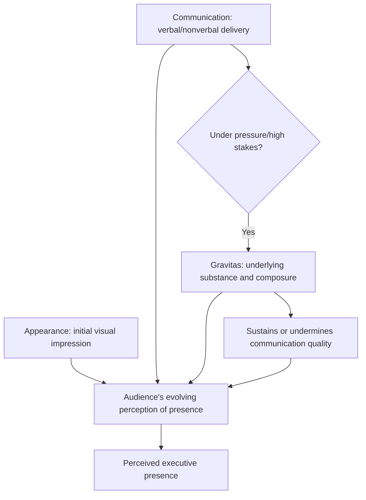

## Defining Executive Presence: Gravitas, Communication, and Appearance

### Definition and Scope

Executive presence is the aggregate impression of credibility, authority, and leadership capability that a person projects to others, independent of their formal title or technical competence. It is commonly analyzed as comprising three interacting components: gravitas (the substance of how one thinks and acts under pressure), communication (how one speaks and listens), and appearance (how one looks and carries oneself). This tripartite framework is widely associated with research by Sylvia Ann Hewlett and the Center for Talent Innovation, whose studies on executive presence popularized this specific three-part structure in the leadership development field.

### Why This Matters in Executive Communication

Executive presence functions as a gatekeeping perception: audiences, boards, and stakeholders often use it — consciously or not — to judge whether a person is ready for greater responsibility or worth listening to on a given matter, sometimes independent of the actual quality of that person's ideas. For rhetoric and executive communication specifically, this matters because presence directly shapes how persuasively a message is received; the same argument delivered with strong versus weak executive presence often produces measurably different audience trust and buy-in. Because presence is a composite and partially learnable skill set rather than a fixed trait, it is treated as a subject of deliberate development in executive communication training.

### The Three-Component Framework

**Key Points**

- **Gravitas**: Often cited as the most heavily weighted component in presence research, gravitas refers to the perceived substance behind a person — confidence, decisiveness, integrity, and the ability to project calm authority, particularly under pressure or in high-stakes moments.
- **Communication**: This component covers both verbal and nonverbal communication skill — speaking ability, listening skill, assertiveness calibration, and the capacity to command a room's attention through delivery rather than volume or title alone.
- **Appearance**: The most visually immediate component, appearance concerns polish, grooming, and dress appropriateness for context — functioning less as a stand-alone credibility signal and more as a "threshold" factor whose absence can undermine an otherwise strong impression, even when it is not sufficient on its own to establish presence.

### Component Deep Dive: Gravitas

| Sub-Element | Description | Rhetorical Relevance |
| --- | --- | --- |
| **Confidence** | Projected certainty in one's own judgment and position, without arrogance | Affects how persuasively a claim or recommendation is received |
| **Decisiveness** | Willingness to commit to a position or decision rather than hedging excessively | Signals leadership readiness, particularly in crisis or ambiguous situations |
| **Integrity/authenticity** | Consistency between stated values and observed behavior over time | Builds long-term credibility beyond any single speech or interaction |
| **Composure under pressure** | Maintaining visible calm and clear thinking during difficult questions, crises, or conflict | Directly relevant to Q&A handling, crisis communication, and humor-recovery scenarios covered elsewhere in this curriculum |
| **Emotional regulation** | Managing visible reactions to provocation, bad news, or unexpected challenges | Prevents the audience from perceiving the speaker as reactive or unstable |

### Component Deep Dive: Communication

**Key Points**

- **Verbal command**: Clarity, vocabulary precision, and the ability to structure spoken arguments coherently under time pressure.
- **Vocal delivery**: Tone, pace, pitch variation, and projection — mechanical delivery elements that interact directly with content to shape perceived authority.
- **Listening skill**: Genuine, visible attentiveness to others' input, which paradoxically strengthens perceived presence by demonstrating confidence secure enough to yield the floor.
- **Assertiveness calibration**: Striking a balance between passivity (which undermines perceived authority) and aggression (which can undermine perceived collaborative credibility) — the specific calibration point often varies by organizational and cultural context.
- **Storytelling and framing ability**: The capacity to frame information persuasively and memorably rather than merely accurately, directly connecting this component to core rhetorical skill.

### Component Deep Dive: Appearance

- **Grooming and professional polish**: Baseline expectations for personal presentation appropriate to the specific professional and cultural context.
- **Dress appropriateness**: Alignment between attire and the specific occasion, audience, and organizational norms — misalignment in either direction (underdressed or overdressed relative to context) can create a distracting mismatch.
- **Body language and posture**: Physical carriage, stance, and movement that either reinforces or undermines the verbal and gravitas-based signals being sent simultaneously.
- **Threshold rather than differentiator**: [Inference] Because appearance is often described in executive presence research as necessary-but-not-sufficient, meeting a baseline standard is generally treated as removing a potential distraction or credibility deduction, but exceeding that baseline is not typically described as adding proportional additional presence value the way strengthening gravitas or communication does.

### Interaction Between the Three Components

The three components are not independent; weakness in one can undermine strength in another, and the components interact dynamically in live audience perception:

1. **Appearance sets initial context** — first impressions formed before any words are spoken create an initial frame through which subsequent communication and gravitas signals are interpreted.
2. **Communication delivers gravitas-relevant content** — strong gravitas (genuine confidence, sound judgment) can be undermined by weak delivery (mumbling, excessive hedging, poor structure) that fails to convey that underlying substance to the audience.
3. **Gravitas sustains communication under pressure** — strong communication skill in calm conditions can collapse under pressure if the underlying gravitas (composure, emotional regulation) is insufficient, revealing the components' interdependence specifically in high-stakes or adversarial moments.
4. **Cumulative impression forms over repeated interactions** — while any single interaction is shaped by momentary appearance and communication, longer-term gravitas assessment (integrity, consistency) tends to accumulate across multiple observed interactions over time.

### Component Interaction Diagram

### Common Misconceptions and Failure Modes

**Key Points**

- **Overweighting appearance**: Assuming polish and dress alone constitute presence, while underinvesting in the substantively heavier gravitas and communication components.
- **Confusing volume/dominance with gravitas**: Mistaking loudness, interruption, or aggressive assertiveness for genuine gravitas, when composed confidence typically reads as stronger presence than forceful dominance.
- **Presence as fixed trait rather than developable skill**: Treating executive presence as an innate characteristic some people simply "have," rather than as a set of component skills that can be deliberately studied and improved, particularly in the communication component.
- **Context-blindness**: Applying a single fixed presence style across all contexts, without adjusting communication and appearance calibration to different audiences, cultures, or organizational norms (connecting to the Cultural Sensitivity and Audience Analysis principles discussed elsewhere in this curriculum).
- **Neglecting gravitas under low-pressure conditions**: Assuming gravitas only matters during crises, when consistent composure and sound judgment during routine interactions build the reputational foundation that gravitas assessments during high-pressure moments draw upon.

### Example: The Three Components in a Single Scenario

**Example**

- A newly promoted VP delivers their first major presentation to the board. Their **appearance** is appropriately polished and contextually calibrated to the formality of a board setting, removing any distraction from that channel. Their **communication** is clear and well-structured, with confident vocal delivery and genuine engagement with board members' questions rather than defensive or evasive answers. When a director raises a pointed, unexpected challenge about a project delay, their **gravitas** shows through composed acknowledgment of the issue, a clear explanation of the corrective plan, and no visible defensiveness or panic — the moment where all three components are simultaneously tested, and where gravitas specifically becomes the differentiating factor in how the VP's overall presence is assessed afterward.

### Developability of Each Component

- **Appearance** is generally the most straightforwardly and quickly adjustable component, since it primarily involves conscious choices about grooming and dress relative to context.
- **Communication** is developable through deliberate practice — rehearsal, feedback, coaching on vocal delivery, structuring, and listening skill — though it typically requires sustained effort over a longer period than appearance adjustments.
- **Gravitas** is often described as the most difficult component to develop quickly, since it is tied to underlying judgment, emotional regulation, and accumulated experience under pressure; [Inference] this is consistent with gravitas being frequently identified in executive presence literature as the most heavily weighted but also most slowly developed of the three components, since it depends partly on lived experience navigating high-stakes situations rather than on discrete, immediately trainable behaviors alone.

### Relationship to Other Rhetorical Skills

- **Recovering Gracefully When Humor Falls Flat** — the composure demonstrated during humor recovery is a direct, specific application of the gravitas component under a particular type of pressure.
- **Reading the Room for Appropriate Humor** — audience-calibrated communication (adjusting tone and content to context) reflects the communication component's assertiveness-calibration and audience-sensitivity sub-elements.
- **Vocal Delivery and Nonverbal Communication** — a dedicated deep-dive into the mechanical aspects of the communication component referenced only at a high level here.
- **Crisis Communication** — gravitas under acute pressure is the central tested variable in crisis communication scenarios, making this topic foundational to that later subject.
- **Q&A and Handling Difficult Questions** — the composure and communication skills required to handle unscripted, adversarial questions draw directly on both the gravitas and communication components described here.

### Practical Next Steps for Skill Development

**Next Steps**

- Conduct a self-assessment (or seek structured feedback) against each of the three components separately, since strengths and weaknesses often differ across gravitas, communication, and appearance rather than being uniform.
- Identify a specific upcoming high-pressure situation (difficult conversation, board presentation, Q&A) as a deliberate practice ground for gravitas — specifically observing and working on composure under pressure rather than general confidence.
- Record and review a past presentation specifically for communication-component elements (vocal delivery, pacing, listening behavior during Q&A) separate from content quality.
- Audit dress and grooming choices against the specific context and audience of upcoming engagements, treating appearance as a threshold to clear rather than a primary differentiator to over-invest in.
- Study documented executive presence research (e.g., the Hewlett/Center for Talent Innovation framework) in greater depth to build a more nuanced, evidence-grounded understanding of how the three components are weighted and assessed in professional contexts.

**Related Topics**

- Vocal Delivery and Nonverbal Communication Techniques
- Composure and Emotional Regulation Under Pressure
- Crisis Communication and Leadership Under Scrutiny
- Q&A Handling and Responding to Difficult Questions
- Building Credibility and Trust Over Time
- Cross-Cultural Variation in Executive Presence Norms