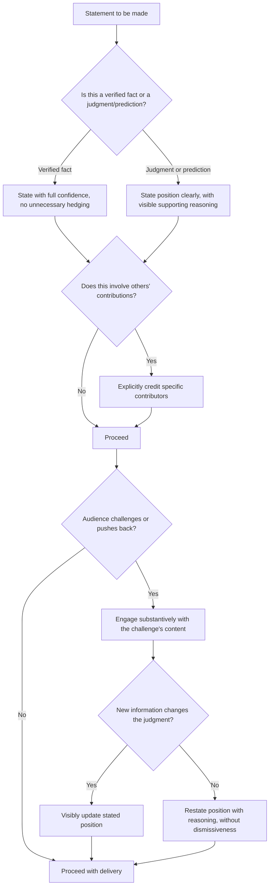

## Projecting Confidence Without Arrogance

### Definition and Scope

Projecting confidence without arrogance refers to the calibrated communication of self-assurance and competence in a way that builds trust and credibility without triggering audience perceptions of dismissiveness, superiority, or closed-mindedness. This topic addresses the specific line between two states that share surface-level similarities (both involve visible self-assurance) but produce opposite audience reactions — confidence typically builds trust and followership, while arrogance typically erodes goodwill and invites resistance.

### Why This Matters in Executive Communication

Confidence is a prerequisite for the gravitas component of executive presence; audiences generally do not extend trust or follow direction from someone who appears uncertain of their own judgment. However, the mechanisms used to project confidence — assertive language, direct eye contact, minimal hedging — are the same surface behaviors that, taken too far or applied without corresponding openness, read as arrogance. Because the distinction is often more about specific behavioral calibration than about an executive's underlying character, this is treated as a learnable communication skill rather than a fixed personality trait.

### The Core Distinction: Confidence vs. Arrogance

**Key Points**

- **Confidence** communicates certainty about one's own capability and judgment while remaining open to being wrong, learning new information, and acknowledging others' contributions.
- **Arrogance** communicates certainty combined with a dismissiveness toward others' input, an unwillingness to acknowledge limitations, and often an implicit or explicit positioning of oneself as superior to the audience.
- **The shared surface layer**: Both states can involve similar external markers — direct speech, minimal hedging, steady eye contact — meaning the distinction often lies in accompanying behaviors (how one responds to challenge, how one credits others) rather than in the confident delivery itself.
- **Audience-dependent perception**: [Inference] Because the same behavior can be read differently by different audiences or cultural contexts (see Cultural Sensitivity in Humor for a parallel dynamic), the confidence/arrogance boundary is not a fixed universal threshold but is calibrated partly by audience expectation and cultural norms around assertiveness and hierarchy.

### Behavioral Comparison Table

| Dimension | Confidence | Arrogance |
| --- | --- | --- |
| **Handling being wrong** | Acknowledges error directly, adjusts position | Deflects, minimizes, or refuses to acknowledge error |
| **Crediting others** | Explicitly credits team/colleagues for contributions | Centers self, omits or minimizes others' contributions |
| **Responding to challenge/pushback** | Engages substantively with the counterargument | Dismisses the challenge without engagement, or responds defensively |
| **Language of certainty** | "I believe/I'm confident that..." paired with reasoning | "Obviously/clearly..." implying the audience should already agree |
| **Eye contact and body language** | Steady, engaged, includes the room | Steady but can include looking past or over others, minimal reciprocal engagement |
| **Listening behavior** | Visibly attentive, asks follow-up questions | Interrupts, minimal visible attention to others' points |
| **Use of qualifiers** | Selective, used for genuine uncertainty | Either absent entirely (false certainty) or used dismissively about others' views |
| **Tone toward disagreement** | Curious, treats disagreement as information | Irritated, treats disagreement as a challenge to status |

### Core Technique: Confident Language Without Overclaiming

**Key Points**

- **Committing to a position while acknowledging its basis**: Rather than hedging excessively ("I think maybe this could possibly work") or overclaiming certainty ("This will definitely work"), confident language states a clear position with its supporting reasoning ("Based on the Q2 data, I'm confident this approach will work, though we should monitor X closely").
- **Distinguishing fact from judgment**: Confidently stating facts ("Revenue grew 18%") differs from confidently stating a prediction or opinion ("This will grow revenue by 18% next year"); conflating the two — presenting judgment with the same certainty as verified fact — is a common driver of perceived overconfidence or arrogance.
- **Calibrated qualifiers**: Using qualifying language only where genuine uncertainty exists, rather than either removing all qualifiers (creating false certainty) or over-qualifying every statement (undermining perceived confidence) — the goal is precision about what is and isn't known, not the elimination of nuance.
- **Owning decisions without disowning input**: A confident leader can say "I made this decision after considering the team's input" without either taking sole credit for the underlying analysis or diffusing accountability entirely onto the group.

### Core Technique: Responsiveness to Challenge

- **Substantive engagement over dismissal**: When challenged, confident communicators address the substance of the challenge directly, even while maintaining their position, whereas arrogant communicators tend to dismiss the challenge's validity without engaging its content.
- **Distinguishing pushback from disrespect**: Treating genuine substantive pushback as valuable information rather than as a status threat is a key behavioral marker distinguishing confidence from defensiveness-driven arrogance.
- **Willingness to update publicly**: Visibly changing one's stated position when presented with compelling new information — rather than quietly changing behavior while maintaining the original public claim — signals confidence secure enough to withstand being seen as wrong.

### Core Technique: Crediting and Inclusion

- **Explicit attribution**: Naming specific team members or contributors when describing work, rather than using ambiguous or self-centered framing ("I built this" vs. "The team, led by X, built this").
- **Inviting rather than excluding input**: Confident communicators often actively solicit questions or counterpoints ("What am I missing here?"), a behavior that simultaneously reinforces gravitas (comfort with scrutiny) and reduces the appearance of dismissiveness associated with arrogance.
- **Visible respect for expertise**: Acknowledging when a topic falls outside one's own primary expertise and deferring to others' specialized knowledge, rather than projecting uniform confidence across all subject areas regardless of actual expertise depth.

### Common Failure Modes

**Key Points**

- **Overcorrection into excessive hedging**: In an effort to avoid appearing arrogant, over-qualifying every statement to the point of undermining perceived competence and decisiveness — a failure mode that trades one problem (arrogance risk) for another (weak gravitas).
- **False certainty on judgment calls**: Presenting predictions, opinions, or strategic bets with the same unqualified certainty appropriate only for verified facts, which can initially read as confident but erodes credibility once outcomes diverge from the stated certainty.
- **Selective crediting**: Publicly crediting team contributions in some contexts (e.g., internal meetings) while omitting that credit in higher-visibility contexts (e.g., external press, board presentations), which can be perceived as opportunistic rather than genuinely confident.
- **Defensive reaction to legitimate challenge**: Responding to substantive, good-faith pushback with visible irritation, dismissiveness, or status-based deflection ("that's not really your area"), which reads as insecurity-driven arrogance rather than confidence.
- **Confusing volume/repetition with confidence**: Repeating a claim more loudly or more often in response to pushback, rather than engaging with the substance of the disagreement, which can read as forceful assertion of status rather than substantive confidence.

### Calibration Process

1. **Separate fact from judgment in your own statements** — before speaking, identify which claims are verified facts (state with full confidence) and which are predictions or opinions (state with confidence but with visible reasoning, not false certainty).
2. **Pre-identify contributors to credit** — for any presentation describing work or results, explicitly plan which specific individuals or teams to name rather than defaulting to self-centered framing.
3. **Prepare for challenge, not just delivery** — anticipate likely pushback or difficult questions in advance, and rehearse substantive responses rather than dismissive ones, so that in-the-moment reactions to challenge are considered rather than reflexively defensive.
4. **Audit qualifier usage**: review a draft of prepared remarks for both excessive hedging (undermining confidence) and absent qualifiers on judgment calls (creating false certainty), adjusting toward calibrated precision.
5. **Solicit feedback on perceived tone**: because the confidence/arrogance line is partly audience-perceived rather than self-evident, seeking direct feedback from trusted colleagues on how one's communication style is actually received can reveal blind spots not visible from the inside.

### Confidence Calibration Flow

### Example: Contrasting Responses to Challenge

**Example**

- *Arrogant response*: A director challenges a VP's revenue projection during a board meeting. The VP responds, "I've been doing this for fifteen years — trust me, the number is right," without addressing the specific concern raised, implicitly framing the challenge as a status violation rather than legitimate input.
- *Confident response*: The same challenge is met with, "That's a fair concern — the projection assumes the new market ramps on the timeline we saw in the pilot; if that slips a quarter, the number would come down by roughly 8%. I'm confident in the base case, but I can share the sensitivity analysis if that would help." This response maintains a clear position, engages the substance of the challenge directly, and offers to provide further evidence rather than relying on status or tenure as justification.

### Relationship to Other Rhetorical Skills

- **Defining Executive Presence: Gravitas, Communication, and Appearance** — confidence-without-arrogance is a specific behavioral execution of the gravitas component, and a primary mechanism through which gravitas is either strengthened or undermined in live interaction.
- **Recovering Gracefully When Humor Falls Flat** — the same underlying skill (distinguishing confident composure from defensive over-explanation) applies directly to recovery scenarios.
- **Q&A Handling and Responding to Difficult Questions** — the challenge-response technique described here is directly applicable to structured Q&A contexts, extending this topic into that more specific skill.
- **Persuasive Argumentation and Ethos** — confidence without arrogance is closely tied to the classical rhetorical concept of ethos (credibility), where audience trust depends partly on perceived character alongside perceived competence.

### Practical Next Steps for Skill Development

**Next Steps**

- Review a recent presentation or set of prepared remarks specifically for judgment-vs-fact conflation, flagging any predictions or opinions stated with the same certainty language as verified facts.
- Practice the "fair concern, here's the reasoning" response structure for handling pushback, rehearsing it for likely challenges before a high-stakes meeting or presentation.
- Audit recent work descriptions or presentations for crediting patterns, checking whether team contributions are named explicitly and consistently across both internal and external contexts.
- Solicit direct feedback from a trusted colleague on how one's confident communication style is actually perceived, specifically probing for any arrogance-adjacent impressions not visible from the inside.
- Study the classical rhetorical concept of ethos in greater depth to build a theoretical grounding for how credibility and character are jointly assessed by audiences, connecting this practical skill to its broader rhetorical foundation.

**Related Topics**

- Defining Executive Presence: Gravitas, Communication, and Appearance
- Q&A Handling and Responding to Difficult Questions
- Persuasive Argumentation and the Role of Ethos
- Recovering Gracefully When Humor Falls Flat
- Composure and Emotional Regulation Under Pressure
- Giving Credit and Building Collaborative Credibility