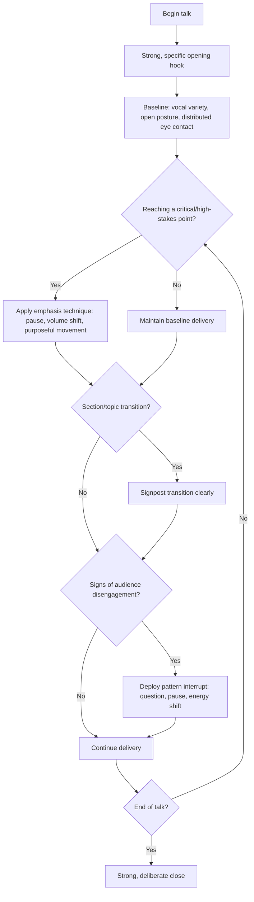

## Commanding a Room and Holding Attention

### Definition and Scope

Commanding a room and holding attention refers to the set of vocal, physical, and structural techniques a speaker uses to capture and sustain audience focus throughout a live presentation or address. This is distinct from confidence or gravitas as internal states; it concerns the observable, learnable delivery mechanics — pacing, vocal variation, physical presence, strategic pausing — that translate internal command into externally perceived and sustained audience engagement.

### Why This Matters in Executive Communication

An executive can possess strong ideas, sound judgment, and genuine confidence, yet still fail to hold an audience's attention if delivery mechanics are weak — monotone vocal delivery, static physical presence, or poor pacing can cause even substantively strong content to lose an audience mid-presentation. Attention is a finite and actively competed-for resource, particularly in modern settings with pervasive digital distraction (phones, laptops, competing notifications); the ability to actively command and re-capture attention throughout a talk, rather than assuming it is a fixed given once a talk begins, is treated as a core executive delivery skill.

### Core Vocal Techniques

**Key Points**

- **Vocal variety (prosody)**: Deliberate variation in pitch, pace, and volume prevents the monotone delivery pattern that causes audience attention to drift; sustained flat vocal delivery is one of the most commonly cited drivers of audience disengagement in presentation research and coaching literature.
- **Strategic pausing**: Pausing before or after a key point creates emphasis and gives the audience processing time, while also serving as a natural attention-reset mechanism — silence, counterintuitively, is one of the most effective attention-commanding tools available to a speaker.
- **Pace variation**: Slowing down for emphasis on critical points and speeding up slightly during lower-stakes transitional content creates a rhythmic contrast that sustains engagement more effectively than a uniform pace throughout.
- **Volume modulation**: Deliberately lowering volume at a key moment (rather than only raising it) can be a highly effective attention-commanding technique, since it requires the audience to lean in and focus more closely, whereas simply speaking louder throughout can fatigue listeners.
- **Vocal fry and filler word reduction**: Minimizing filler words ("um," "like," "so") and vocal patterns that signal uncertainty preserves the perceived authority and clarity needed to sustain command over an extended delivery.

### Core Physical Techniques

| Technique | Description | Effect on Attention |
| --- | --- | --- |
| **Purposeful movement** | Moving with intention (e.g., stepping toward the audience to emphasize a point) rather than pacing randomly or remaining rigidly static | Purposeful movement reinforces key moments; random movement or complete stillness can both reduce engagement in different ways |
| **Open body language** | Avoiding closed postures (crossed arms, hands in pockets, turned away from audience) | Open posture signals confidence and approachability, sustaining perceived connection with the room |
| **Eye contact distribution** | Distributing eye contact across the full room/audience rather than fixating on one section or reading from notes/slides | Broad eye contact makes individual audience members feel personally addressed, increasing sustained attention |
| **Gesture for emphasis** | Using deliberate hand gestures to underscore key points, sized appropriately to room scale | Reinforces verbal emphasis nonverbally; gestures too small for a large room lose their reinforcing effect |
| **Physical stillness at key moments** | Deliberately stopping movement during a critical statement | Sudden stillness after continuous movement draws focused attention to that specific moment |

### Structural Techniques for Sustaining Attention

**Key Points**

- **Open strong**: The first 30-60 seconds of a talk disproportionately determine whether an audience commits attention for the remainder; a compelling, specific opening (a striking statistic, a direct question, a brief story) outperforms a generic administrative opening ("Thanks for having me, today I'll cover...").
- **Pattern interrupts**: Periodically breaking an established rhythm — a rhetorical question, a brief pause for audience reaction, a change in vocal energy, an unexpected visual — resets attention that naturally decays during sustained, uniform delivery.
- **Signposting and structure**: Clearly marking transitions between sections ("Now let's turn to...") helps the audience mentally re-engage at natural break points, functioning as attention checkpoints throughout a longer talk.
- **Strategic audience involvement**: Direct questions to the audience (rhetorical or literal), brief interactive moments, or requests for a show of hands re-engage passive listeners by requiring active response.
- **Narrative and story structure**: Content framed as a story (with tension, characters, and resolution) tends to hold attention more effectively than flat, list-based information delivery, since narrative structure creates anticipation that sustains engagement across a longer arc.

### The Attention Decay Curve and Its Management

[Inference] Presentation and cognitive research broadly suggests that sustained audience attention naturally decays over time during any uniform, unbroken stretch of content delivery, making periodic "resets" (via pattern interrupts, structural signposting, or vocal variation) a practical necessity rather than an optional stylistic flourish for talks exceeding a few minutes in length. This underlies the common practice of structuring longer talks into shorter sub-segments (often cited informally around the 10-minute range in some presentation design literature) rather than a single sustained uniform delivery block, though exact optimal segment length varies by content type and audience.

### Common Failure Modes

**Key Points**

- **Monotone delivery**: Uniform pitch, pace, and volume throughout a talk, causing the audience's attention to gradually disengage due to lack of any variation to track.
- **Reading from slides or notes**: Breaking eye contact with the audience to read directly from slides or a script removes the personal connection that sustains engagement and often flattens vocal delivery simultaneously.
- **Weak or administrative opening**: Beginning with logistical or procedural content ("Let me pull up my slides... okay, so today...") rather than a compelling hook, causing the audience to disengage before substantive content even begins.
- **Uniform pacing across high- and low-stakes content**: Delivering critical points and minor supporting details at the same pace and energy level, failing to signal to the audience which moments deserve heightened attention.
- **Excessive or nervous movement**: Random pacing, fidgeting, or repetitive gestures that carry no intentional emphasis, which can become a distraction rather than an attention-commanding tool.
- **No structural checkpoints in long talks**: Delivering an extended talk as one continuous, undifferentiated block without signposted transitions, causing audience attention to drift with no natural re-engagement points.

### Room-Commanding Techniques by Escalation Level

1. **Baseline delivery calibration** — establish vocal variety, appropriate pacing, and open body language as a consistent foundation throughout any talk.
2. **Strategic emphasis insertion** — identify the 2-4 most critical points in the talk and pre-plan specific vocal/physical emphasis techniques (a pause, a volume drop, purposeful movement) for each.
3. **Structural signposting** — mark section transitions clearly, particularly in longer talks, to create natural attention-reset checkpoints throughout.
4. **Active re-engagement for waning attention**: if visible signs of audience disengagement appear (phones out, glazed expressions, side conversations), deploy a pattern interrupt — a direct question, a brief pause, a change in vocal energy, or a request for audience input — to actively recapture focus mid-talk.
5. **Strong close**: sustain command through the final moments rather than trailing off, since a weak ending can retroactively diminish the perceived impact of an otherwise well-delivered talk.

### Room-Commanding Technique Flow

### Example: Applying Techniques in Sequence

**Example**

- A CEO opens an all-hands not with "Thanks everyone for joining, let's get started," but with a brief pause, direct eye contact across the room, and the line: "Six months ago, we almost lost our biggest customer. Here's what changed." This hook immediately establishes narrative tension. Mid-talk, when reaching the critical point about a strategic pivot, the CEO deliberately slows pace, lowers volume slightly, and pauses briefly before stating the key decision, causing the room to visibly lean in. Noticing some side conversation during a data-heavy segment, the CEO pauses and asks directly, "Show of hands — who's dealt with this exact problem on their team?" re-engaging the room through direct participation before continuing.

### Relationship to Other Rhetorical Skills

- **Defining Executive Presence: Gravitas, Communication, and Appearance** — room-commanding technique is the primary practical execution layer of the communication component of executive presence.
- **Projecting Confidence Without Arrogance** — composed vocal delivery and purposeful (rather than nervous) physical presence are shared behavioral markers between confidence projection and room-commanding technique.
- **Aligning Visuals With the Spoken Narrative** — structural signposting techniques described here directly correspond to the verbal transition cues needed for visual-narrative alignment.
- **Narrative Structure in Presentations** — the use of story structure to sustain attention connects room-commanding technique directly to broader narrative design principles for entire presentations.

### Practical Next Steps for Skill Development

**Next Steps**

- Record a rehearsal of an upcoming talk and review specifically for vocal monotony, flagging any extended stretches without pace, pitch, or volume variation.
- Draft and rehearse a specific, non-administrative opening hook for an upcoming presentation, replacing any generic logistical opening.
- Identify the 2-3 most critical points in an existing talk and pre-plan a specific emphasis technique (pause, volume shift, purposeful movement) for each.
- Practice noticing and responding to audience disengagement signals in lower-stakes settings (team meetings) by deploying a pattern interrupt technique and observing its effect.
- Study narrative structure techniques in greater depth to build stronger story-based framing for data-heavy or technical content that might otherwise default to flat, list-based delivery.

**Related Topics**

- Defining Executive Presence: Gravitas, Communication, and Appearance
- Projecting Confidence Without Arrogance
- Narrative Structure and Slide Sequencing
- Vocal Delivery Techniques for Public Speaking
- Aligning Visuals With the Spoken Narrative
- Handling Audience Disengagement and Reviving a Flagging Room