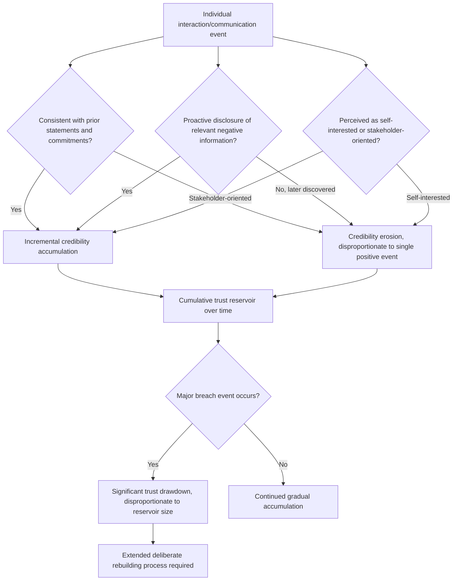

## Building Credibility and Trust Over Time

### Definition and Scope

Building credibility and trust over time refers to the cumulative, longitudinal process by which an executive's communications and actions across repeated interactions establish a durable reputation for reliability, competence, and integrity. Unlike single-interaction skills (delivery technique, humor calibration, Q&A handling), this topic addresses how a pattern of behavior across many interactions compounds into (or erodes) the underlying trust that makes any single act of persuasion more or less effective.

### Why This Matters in Executive Communication

Persuasive technique operates within a trust ceiling set by accumulated credibility: the same argument, delivered with identical rhetorical skill, lands differently depending on whether the audience already trusts the speaker based on prior history. Executives who neglect long-term credibility-building in favor of optimizing individual presentations often find that technique alone cannot overcome an audience's accumulated skepticism, while executives with strong long-term credibility can sometimes persuade even with a technically weaker single presentation. This makes credibility-building a multiplier that operates across, rather than within, individual communication events — connecting single-event skills (covered elsewhere in this curriculum) to a longer-horizon strategic layer.

### The Trust Equation Framework

**Key Points**

- A widely referenced model in trust-building literature (popularized by Charles Green's "Trust Equation") frames trust as a function of credibility, reliability, and intimacy, divided by self-orientation — where **credibility** refers to the words spoken (expertise, track record), **reliability** refers to consistency of action over time, **intimacy** refers to the safety others feel in confiding or being candid with the person, and **self-orientation** refers to the degree to which the person appears focused on their own interests versus the other party's.
- This framework highlights that credibility is not solely about being right or expert, but is diminished by perceived self-interest even when expertise and reliability are strong — a leader perceived as prioritizing personal advancement over stakeholder interests can undermine trust even while being technically correct and consistent.
- [Unverified] Because this framework originates from a specific popular trust/consulting model rather than a single unified academic consensus, practitioners should treat it as one useful lens among several rather than an exhaustive or universally validated formula.

### Core Components of Long-Term Credibility

| Component | Description | Erosion Risk |
| --- | --- | --- |
| **Track record / demonstrated competence** | A history of accurate predictions, sound decisions, and delivered commitments | A single major public failure can disproportionately damage this component relative to many minor successes |
| **Consistency between word and action** | Follow-through on stated commitments and alignment between public statements and observed behavior | Even minor, repeated inconsistencies compound into a perception of unreliability faster than occasional larger lapses |
| **Transparency about limitations and uncertainty** | Willingness to acknowledge what is unknown or where a prior position was wrong | Overclaiming certainty that is later proven false damages credibility more than acknowledged uncertainty that resolves cautiously |
| **Perceived motives (self-orientation)** | Whether communications appear oriented toward stakeholder benefit or self-interest | Even accurate information can be discounted if the audience believes it is being shared self-servingly |
| **Consistency across audiences** | Whether the same message and behavior is presented consistently to different audiences (employees, press, investors) rather than tailored contradictorily | Discovered inconsistency between what is told to different audiences (e.g., internal vs. external messaging) causes disproportionate trust damage once revealed |

### The Asymmetry of Trust: Building vs. Losing

**Key Points**

- Trust is widely understood in behavioral and reputational research to be asymmetric: it accumulates slowly through many consistent interactions but can be damaged rapidly through a single significant breach or inconsistency.
- [Inference] This asymmetry means that credibility-building strategy should weight downside protection (avoiding significant breaches of trust) at least as heavily as active credibility-building efforts, since a strong track record built over years can be substantially damaged by a single well-publicized instance of dishonesty or broken commitment.
- Recovery from a significant trust breach is possible but generally requires a longer and more deliberate rebuilding process than the original accumulation, often requiring explicit acknowledgment, changed behavior demonstrated over time, and sometimes third-party validation, rather than being resolved by a single corrective statement.

### Behavioral Practices That Build Long-Term Credibility

**Key Points**

- **Following through on stated commitments**: Consistently delivering on public and private commitments, even small ones, builds a cumulative reliability record that compounds over many interactions.
- **Proactive disclosure of bad news**: Communicating negative information proactively rather than waiting to be asked or allowing it to surface externally first signals integrity and reduces the perception of self-interested information management.
- **Consistent messaging across audiences**: Ensuring that the substance of communications (even if tailored in tone or detail) remains factually consistent across internal, external, investor, and press audiences.
- **Acknowledging mistakes directly**: Publicly owning errors with specific acknowledgment (rather than vague or minimized language) tends to build more durable long-term credibility than avoiding acknowledgment, since audiences often extend more trust to leaders who visibly demonstrate accountability.
- **Demonstrated expertise through track record**: Allowing a pattern of accurate assessments and sound decisions to accumulate visibly over time, rather than relying primarily on asserted expertise in any single instance.
- **Visible prioritization of stakeholder interest**: Making decisions and communications that are visibly aligned with stakeholder benefit, particularly in situations where a self-interested alternative was plausible and available, reinforces low self-orientation in the trust equation framework.

### Common Failure Modes

**Key Points**

- **Overclaiming certainty repeatedly**: A pattern of stating predictions or plans with high confidence that subsequently fail to materialize erodes the track-record component of credibility faster than acknowledged uncertainty would.
- **Inconsistent messaging across audiences**: Communicating different substantive positions to different stakeholder groups (e.g., a more optimistic internal message than external disclosure, or vice versa), which — if discovered — causes disproportionate trust damage.
- **Delayed or reactive bad-news disclosure**: Waiting for negative information to be discovered or forced out rather than disclosing proactively, which reinforces a perception of self-interested information control even if the underlying information itself was not manipulated.
- **Defensive response to error**: Responding to identified mistakes with deflection, minimization, or blame-shifting rather than direct acknowledgment, compounding the original error with a credibility-damaging response pattern.
- **Perceived self-orientation**: Communications or decisions that appear primarily designed to benefit the speaker's own position, compensation, or reputation rather than stakeholder interests, even when the underlying facts presented are accurate.
- **Single-event overreliance**: Treating one strong presentation or announcement as sufficient to establish credibility, neglecting the longitudinal consistency that actually builds durable trust over repeated interactions.

### Credibility-Building Process Over Time

1. **Establish a consistent public track record** — make verifiable commitments and follow through visibly, allowing a pattern to accumulate that others can observe and reference.
2. **Disclose difficult information proactively** — build a habit of surfacing bad news or uncertainty before being asked, rather than only when forced.
3. **Maintain message consistency across audiences** — before communicating to multiple stakeholder groups, verify that the substantive content remains aligned even where tone or framing may differ.
4. **Respond to errors with direct acknowledgment** — when a mistake or failed prediction becomes evident, address it specifically and promptly rather than deflecting or minimizing.
5. **Monitor perceived self-orientation** — periodically assess whether recent decisions and communications could reasonably be perceived as self-interested, and address that perception proactively where it exists.
6. **Protect against single-event breaches** — treat major commitments and public statements with elevated scrutiny before making them, given the asymmetric cost of a significant trust breach relative to the slow accumulation of positive credibility.

### Credibility Accumulation and Erosion Model

### Example: Contrasting Long-Term Patterns

**Example**

- *Credibility-building pattern*: A CEO who, over several years, consistently flags emerging risks to the board before they become crises, publicly acknowledges specific missed targets with clear explanations rather than vague language, and maintains factually consistent messaging between internal town halls and external earnings calls. Even when a significant setback eventually occurs, the board and investors extend more benefit of the doubt due to the accumulated track record of proactive transparency.
- *Credibility-eroding pattern*: A different CEO who presents consistently optimistic projections that repeatedly fail to materialize, discloses setbacks only when directly questioned by analysts, and gives a notably rosier account internally than externally. Even accurate, well-delivered individual presentations from this CEO face heightened audience skepticism due to the accumulated pattern, illustrating how single-event delivery skill cannot fully compensate for longitudinal credibility erosion.

### Relationship to Other Rhetorical Skills

- **Defining Executive Presence: Gravitas, Communication, and Appearance** — long-term credibility is the cumulative, longitudinal manifestation of the gravitas component's integrity and consistency sub-elements, extended across many interactions rather than assessed within a single one.
- **Projecting Confidence Without Arrogance** — the "owning decisions without disowning input" and "willingness to update publicly" techniques described there are single-event behaviors that, repeated consistently, become the track record this topic addresses at a longer time horizon.
- **Crisis Communication** — accumulated credibility functions as a reserve that is drawn upon during crisis communication; leaders with strong pre-existing trust generally have more room to maneuver during a crisis than those without it.
- **Ethical Persuasion and Rhetorical Ethics** — the self-orientation dimension of the trust equation connects directly to broader questions of rhetorical ethics, since the perception (and reality) of whose interest is being served underlies both trust-building and ethical persuasion frameworks.

### Practical Next Steps for Skill Development

**Next Steps**

- Audit recent public and internal commitments for follow-through consistency, identifying any gaps between stated commitments and delivered outcomes that may require direct acknowledgment.
- Review recent messaging across different stakeholder audiences (internal, external, investor) for substantive consistency, flagging any material differences in framing that could be perceived as inconsistency if compared directly.
- Practice proactive bad-news disclosure in a lower-stakes context (e.g., a project update) by surfacing a known risk or setback before being asked about it.
- Study the Trust Equation framework (credibility, reliability, intimacy, self-orientation) in greater depth and apply it as a diagnostic lens to a specific ongoing stakeholder relationship.
- Reflect on any past instance of a credibility setback (personal or organizational) and evaluate whether the recovery response followed a deliberate rebuilding process or relied on a single corrective statement, adjusting future practice accordingly.

**Related Topics**

- Defining Executive Presence: Gravitas, Communication, and Appearance
- Projecting Confidence Without Arrogance
- Crisis Communication and Leadership Under Scrutiny
- Ethical Persuasion and Rhetorical Ethics
- Trust Equation Framework (Credibility, Reliability, Intimacy, Self-Orientation)
- Transparent Communication During Organizational Change