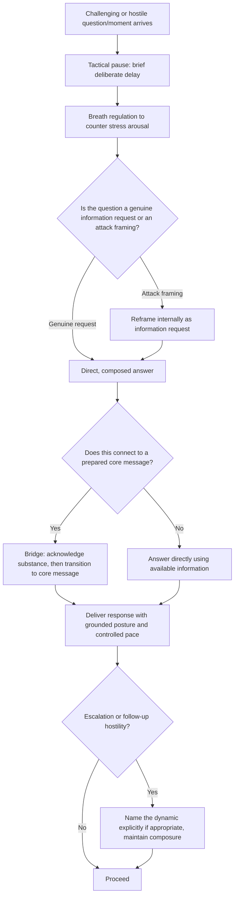

## Presence Under Pressure and Scrutiny

### Definition and Scope

Presence under pressure and scrutiny refers to the ability to maintain composure, clear thinking, and effective communication during high-stakes moments characterized by adversarial questioning, unexpected challenges, public visibility, or acute stakes. This topic isolates the stress-tested application of executive presence — specifically the gravitas component — to conditions where the underlying skill is most difficult to sustain and most consequential when it fails.

### Why This Matters in Executive Communication

Baseline executive presence, cultivated and rehearsed under calm conditions, is only loosely predictive of how a leader performs when genuinely tested. Hostile media questions, adversarial board challenges, live crisis situations, and public scrutiny place unique physiological and cognitive demands (elevated stress response, time pressure, high visibility of any misstep) that can degrade communication quality even for otherwise skilled communicators. Because these are precisely the moments audiences remember most vividly and weight most heavily in overall credibility assessments, presence under pressure is treated as a distinct, high-leverage skill area rather than an automatic extension of general presence competence.

### The Physiological and Cognitive Basis of Pressure Degradation

**Key Points**

- **Acute stress response**: [Inference] Under acute stress, physiological arousal (elevated heart rate, adrenaline release) is widely understood in stress-response research to narrow cognitive processing bandwidth, which can manifest as reduced verbal fluency, difficulty accessing prepared information, or impaired judgment under pressure — a well-established general pattern, though its exact severity varies significantly by individual and by prior stress-exposure training.
- **Fight-flight-freeze patterns**: Under sufficient perceived threat, individuals may default to defensive verbal patterns (over-explaining, becoming argumentative), withdrawal patterns (going quiet, disengaging), or freezing (losing verbal fluency entirely) — recognizing one's own default pattern is a first step toward managing it deliberately.
- **Attention narrowing**: High-stress conditions tend to narrow attentional focus, which can cause a speaker to miss important contextual cues (an interviewer's tone shift, a board member's underlying concern) that would be more readily noticed under calmer conditions.
- **Habituation through exposure**: [Inference] Because acute stress responses are partly physiological rather than purely a matter of willpower, repeated deliberate exposure to lower-stakes pressure situations is generally understood in performance psychology to reduce the intensity of the stress response over time, forming the basis for rehearsal-under-pressure training techniques described below.

### Core Techniques for Maintaining Presence Under Pressure

| Technique | Mechanism | Application |
| --- | --- | --- |
| **Tactical pause before responding** | Creates a brief buffer between stimulus (a hostile question) and response, allowing cognitive processing to catch up to the stress response | Adversarial interviews, unexpected board questions |
| **Breath regulation** | Deliberate slow breathing counteracts physiological stress arousal, supporting clearer subsequent speech | Immediately before or during a high-stakes exchange |
| **Reframing the threat** | Consciously interpreting a challenging question as a request for information rather than a personal attack reduces the perceived threat level driving the stress response | Hostile or adversarial questioning |
| **Anchoring to prepared core messages** | Returning to a small set of well-rehearsed, simple core points under pressure, rather than attempting to construct entirely new arguments in the moment | Any high-pressure exchange with unpredictable specific questions |
| **Physical grounding** | Maintaining stable posture and deliberate physical stillness counteracts the fidgeting or defensive body language that stress can otherwise produce | Live, visible settings (press conferences, televised interviews) |
| **Naming the dynamic explicitly** | Directly acknowledging a tense or adversarial dynamic in the room ("I understand this is a frustrating topic") can defuse escalation and buy processing time | Visibly hostile or emotionally charged exchanges |

### The Tactical Pause in Detail

The tactical pause is among the most broadly applicable techniques for managing pressure in live exchanges:

1. **Recognize the trigger moment** — an unexpected, hostile, or high-stakes question arrives, creating an impulse to respond immediately.
2. **Insert a deliberate brief pause** — rather than filling the silence immediately (often with a filler word or reflexive defensive statement), take a visible but brief pause (roughly one to two seconds is often sufficient) before beginning to respond.
3. **Use the pause for both cognitive and physiological benefit** — the brief delay allows cognitive processing to catch up to the stress response and allows a breath, both of which support a more composed subsequent response.
4. **Avoid over-using the pause to the point of appearing evasive** — the technique is intended to be brief and natural, not an extended, conspicuous silence that itself signals discomfort or evasion.

### Anchoring to Core Messages Under Pressure

**Key Points**

- **Pre-identifying 2-3 core messages** before any high-stakes engagement (a media interview, a board presentation with anticipated difficult questions) provides a stable reference point to return to when a specific question is unexpected or difficult to answer directly.
- **Bridging technique**: Acknowledging a question directly, then deliberately transitioning to a related core message ("That's an important question, and it connects to something I think is critical here...") allows a speaker to maintain composure and message discipline without appearing to dodge the question entirely.
- **Distinguishing bridging from evasion**: [Inference] Because audiences and interviewers can often perceive the difference between a genuine bridge (which engages the question's substance before pivoting) and pure evasion (which ignores the question's substance entirely), the credibility of this technique depends on at least partially addressing the actual question asked before transitioning to the prepared message.

### Common Failure Modes Under Pressure

**Key Points**

- **Defensive over-explanation**: Responding to a challenging question with lengthy, defensive justification rather than a direct, composed answer, which can signal insecurity and often draws further scrutiny rather than resolving the challenge.
- **Visible physiological stress signals**: Fidgeting, flushing, voice cracking, or excessive filler words under pressure, which can undermine the content of an otherwise sound response by visibly signaling distress to the audience.
- **Freezing or verbal fluency collapse**: Losing the ability to access prepared information or construct coherent responses entirely under acute stress, often the most severe manifestation of pressure degradation.
- **Escalatory reactivity**: Responding to an adversarial or hostile question with matching hostility or defensiveness, which can escalate the confrontation and shift audience sympathy away from the speaker.
- **Complete evasion**: Failing to engage with the substance of a difficult question at all, relying entirely on pivots to unrelated prepared messages, which audiences and skilled interviewers typically recognize and penalize in credibility terms.
- **Overcompensating false calm**: Projecting artificial, flat calm that reads as detached or dismissive of a genuinely serious situation, rather than composed engagement that still conveys appropriate seriousness.

### Preparation Techniques: Rehearsal Under Simulated Pressure

- **Adversarial rehearsal / murder boards**: Practicing responses to anticipated hostile questions with a colleague deliberately playing an aggressive or skeptical role, simulating the pressure conditions of the actual event before it occurs.
- **Progressive exposure**: [Inference] Building tolerance for pressure conditions through deliberately practicing in progressively higher-stakes lower-risk settings (e.g., practicing composed responses to challenging questions in internal team settings before a high-visibility media appearance) is consistent with general performance psychology principles regarding stress habituation through graduated exposure.
- **Scenario-specific preparation**: Anticipating the most likely difficult questions or challenges specific to the upcoming event (rather than generic pressure-response practice) allows more targeted rehearsal of both content and composure technique together.
- **Post-event debrief**: Reviewing recordings or feedback from past high-pressure engagements specifically for composure markers (pace, filler words, physical tension) separate from content accuracy, to identify individual stress-response patterns for targeted future practice.

### Presence-Under-Pressure Response Flow

### Example: Contrasting Responses Under Pressure

**Example**

- *Degraded presence*: During a televised interview following a product safety incident, a CEO is asked pointedly why the company delayed public disclosure. The CEO responds immediately and defensively, speaking rapidly, over-explaining internal process details, and visibly showing tension, without directly answering the timeline question — reading as evasive despite (potentially) not intending to be.
- *Maintained presence*: The same question is met with a brief pause, then: "That's a fair question, and I understand the concern. We took two days to confirm the root cause before disclosing, because we wanted to give accurate information rather than a preliminary guess. In hindsight, we could have communicated that we were investigating sooner, even before having the full picture." This response uses a tactical pause, directly engages the substance of the question, acknowledges a legitimate critique, and maintains a composed, grounded pace throughout.

### Relationship to Other Rhetorical Skills

- **Defining Executive Presence: Gravitas, Communication, and Appearance** — this topic represents the specific stress-tested application of the gravitas component, isolating composure under pressure as the most demanding manifestation of that broader component.
- **Recovering Gracefully When Humor Falls Flat** — shares the core underlying skill of brief, composed recovery from an unexpected negative moment, applied here to adversarial questioning rather than failed humor specifically.
- **Q&A Handling and Responding to Difficult Questions** — presence-under-pressure technique is directly applicable within structured Q&A settings, extending this topic's general principles into that more specific format.
- **Crisis Communication** — presence under pressure is a foundational prerequisite skill for effective crisis communication, since crisis settings inherently combine high stakes, public scrutiny, and adversarial questioning simultaneously.
- **Building Credibility and Trust Over Time** — how a leader performs under pressure in a single high-visibility moment can disproportionately affect the longer-term credibility trajectory discussed in that topic, linking single-event composure to longitudinal trust outcomes.

### Practical Next Steps for Skill Development

**Next Steps**

- Practice the tactical pause technique in lower-stakes settings (team meetings, routine Q&A) to build familiarity before applying it in genuinely high-pressure situations.
- Conduct an adversarial rehearsal ("murder board") session before an upcoming high-stakes engagement, having a colleague pose the most difficult anticipated questions.
- Identify personal default stress-response patterns (over-explanation, withdrawal, escalation) by reviewing past recordings of challenging exchanges, and target that specific pattern in future practice.
- Pre-draft 2-3 core messages before any anticipated high-pressure engagement, and practice bridging from likely difficult questions back to those messages while still directly engaging each question's substance.
- Study progressive exposure and stress-habituation principles from performance psychology to build a structured personal practice plan for increasing pressure tolerance over time.

**Related Topics**

- Defining Executive Presence: Gravitas, Communication, and Appearance
- Q&A Handling and Responding to Difficult Questions
- Crisis Communication and Leadership Under Scrutiny
- Recovering Gracefully When Humor Falls Flat
- Building Credibility and Trust Over Time
- Bridging Techniques for Media and Interview Training