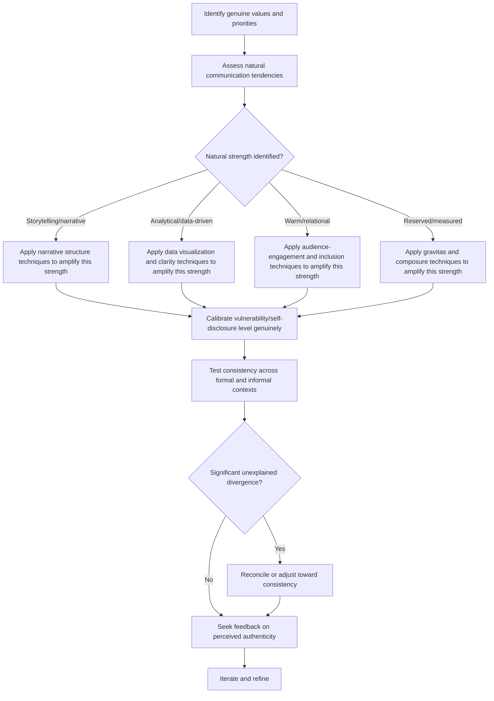

## Authentic Leadership Voice and Personal Style

### Definition and Scope

Authentic leadership voice and personal style refers to the practice of developing a communication approach that reflects an individual leader's genuine values, personality, and natural strengths, rather than imitating a generic or borrowed model of executive communication. This topic addresses how leaders reconcile the learnable techniques covered elsewhere in this curriculum (delivery mechanics, confidence calibration, room-commanding technique) with the risk that overly formulaic application of those techniques can produce a communication style that feels inauthentic or disconnected from the leader's actual character.

### Why This Matters in Executive Communication

Audiences are generally sensitive to perceived inauthenticity, and a technically polished delivery that feels performative or borrowed can undermine trust even when individual mechanics (vocal variety, structure, confidence signaling) are executed correctly. Because trust and credibility (per Building Credibility and Trust Over Time) depend partly on perceived genuineness, leaders who adopt a communication style that doesn't match their actual personality or values risk a specific failure mode: technically competent delivery that nonetheless fails to build the deeper trust that only perceived authenticity can generate. This makes authentic voice not an alternative to technique, but a filter through which technique should be applied.

### The Tension Between Technique and Authenticity

**Key Points**

- **False dichotomy risk**: Authenticity is sometimes misunderstood as being in opposition to skill development — the idea that "just being yourself" is sufficient and that deliberate technique is inherently inauthentic. This framing is generally considered a misunderstanding of the relationship, since technique can be applied in service of one's authentic voice rather than replacing it.
- **Technique as amplification, not replacement**: The more accurate framing treats delivery technique (vocal variety, structure, confident language) as tools for more effectively expressing a leader's genuine perspective and values, rather than as a fixed external template to be imposed regardless of personal style.
- **Style vs. substance distinction**: Authentic voice concerns the leader's genuine values, priorities, and natural communication tendencies (substance), while personal style concerns the specific stylistic choices (word choice, humor use, formality level, storytelling approach) through which that substance is expressed — both can be developed without becoming inauthentic, provided the underlying substance remains genuine.

### Core Dimensions of Authentic Voice

| Dimension | Description | Development Approach |
| --- | --- | --- |
| **Values alignment** | Consistency between stated communication and genuinely held beliefs and priorities | Reflection on what the leader actually believes, rather than what seems expected |
| **Natural communication tendencies** | A leader's inherent style (e.g., naturally analytical vs. naturally narrative, naturally reserved vs. naturally expressive) | Identifying and building on existing strengths rather than adopting a mismatched external model |
| **Vulnerability and self-disclosure calibration** | The degree to which a leader shares personal experience, uncertainty, or emotion in communication | Finding a calibration point that feels genuine to the individual rather than a fixed universal standard |
| **Consistency across contexts** | Whether the leader's communication style remains recognizably consistent across formal and informal settings | A marker of authenticity; significant unexplained shifts between contexts can read as performative |
| **Distinctive language and framing patterns** | Recurring phrases, metaphors, or ways of framing ideas that become recognizably associated with a specific leader over time | Emerges organically through consistent communication rather than being manufactured deliberately |

### Common Failure Modes

**Key Points**

- **Wholesale imitation of admired leaders**: Directly copying the specific mannerisms, phrases, or delivery style of an admired public figure or predecessor, producing a communication style that feels borrowed rather than genuinely one's own, and that audiences often perceive as such even when they cannot articulate exactly why.
- **Formulaic technique application without personalization**: Applying generic presentation techniques (a standard opening hook format, a standard vocal pattern) rigidly and identically regardless of personal fit, producing technically correct but personality-flattened delivery.
- **Performed vulnerability**: Sharing personal stories or admissions of uncertainty in a calculated, formulaic way (e.g., because "vulnerability builds trust" as a generic principle) without genuine connection to the actual content, which audiences can often perceive as manipulative or hollow rather than authentic.
- **Inconsistency between contexts**: Presenting a markedly different persona in formal executive settings versus informal ones, creating a perception (when both are observed by the same audience members) that neither version is fully genuine.
- **Overcorrection into unpolished delivery**: Using "authenticity" as a justification for neglecting basic delivery competence (structure, clarity, vocal variety), conflating genuine personal style with a lack of preparation or skill.
- **Suppressing natural strengths to fit a mold**: A naturally warm, storytelling-oriented leader forcing themselves into a rigid, data-driven delivery style (or vice versa) because it matches a perceived executive archetype, rather than developing their natural tendency more skillfully.

### Developing Authentic Voice: A Process Framework

1. **Identify genuine values and priorities** — before developing delivery technique, clarify what the leader actually believes is important about the message being communicated, distinct from what might be expected or conventional.
2. **Assess natural communication tendencies** — through self-reflection, feedback from trusted colleagues, or review of past communications, identify existing natural strengths (e.g., storytelling ability, analytical clarity, warmth) rather than defaulting to a generic model.
3. **Apply technique in service of natural strengths** — select and adapt delivery techniques (from vocal variety to structural frameworks) that amplify existing natural tendencies rather than techniques that require suppressing them.
4. **Calibrate vulnerability and self-disclosure intentionally**: determine a genuine, sustainable level of personal openness in communication, rather than adopting a fixed level because it is generically recommended.
5. **Test for cross-context consistency**: periodically compare communication style across formal and informal settings, addressing any significant unexplained divergence that might read as inconsistency.
6. **Refine iteratively based on feedback**: seek direct feedback on perceived authenticity specifically (not just technical delivery quality) from trusted colleagues who can identify moments that felt performative versus genuine.

### Authentic Voice Development Flow

### Example: Two Authentic Styles Achieving the Same Goal

**Example**

- *Leader A (naturally narrative and warm)*: Opens a major strategy presentation with a personal story about an early failure that shaped their thinking on the current initiative, using storytelling and emotional connection as the primary persuasive mechanism, consistent with their natural communication tendency.
- *Leader B (naturally analytical and measured)*: Opens the same type of presentation with a striking data point and a clear, structured logical case for the initiative, using precision and analytical rigor as the primary persuasive mechanism, consistent with a different but equally natural communication tendency.
- Both approaches can achieve strong executive presence and audience trust, provided each is applied skillfully and genuinely reflects the respective leader's actual style — neither is inherently more "authentic" or more effective in the abstract; the effectiveness depends on the fit between the technique and the individual's genuine tendencies, and on how skillfully each is executed.

### Balancing Authenticity With Organizational and Cultural Expectations

**Key Points**

- Authentic voice does not mean disregarding legitimate contextual or professional norms (e.g., appropriate formality in a board setting, cultural communication norms in cross-border contexts covered in Cultural Sensitivity in Humor); it means finding genuine expression within those legitimate constraints rather than treating the constraints themselves as inauthentic impositions.
- [Inference] Leaders operating across multiple cultural or organizational contexts may need to adapt specific stylistic elements (formality level, directness, self-disclosure) while maintaining a consistent underlying values base, since the alternative — a single rigid style applied regardless of context — would likely be perceived as less effective and, in some cross-cultural cases, as less appropriate rather than more authentic.
- Distinguishing genuine contextual adaptation from inauthentic code-switching is itself a nuanced judgment; the practical test is often whether the underlying values and substance remain consistent even as surface style adapts, versus a leader appearing to hold fundamentally different positions or values depending on the audience.

### Relationship to Other Rhetorical Skills

- **Defining Executive Presence: Gravitas, Communication, and Appearance** — authentic voice functions as the personalization layer applied across all three presence components, since generic technique execution without authentic grounding can undermine the credibility that presence is meant to build.
- **Projecting Confidence Without Arrogance** — genuine confidence (rooted in authentic self-assessment) is generally more sustainable and more accurately calibrated than performed confidence borrowed from an external model.
- **Building Credibility and Trust Over Time** — perceived authenticity is a significant contributor to the "intimacy" and low "self-orientation" components of the trust equation framework referenced in that topic, linking authentic voice directly to longitudinal credibility outcomes.
- **Commanding a Room and Holding Attention** — room-commanding techniques (vocal variety, physical presence, narrative structure) should be selected and calibrated in a way that fits a leader's authentic style rather than applied as a rigid universal template, connecting this topic to that one's practical execution.

### Practical Next Steps for Skill Development

**Next Steps**

- Reflect on and write down the genuine values and priorities underlying an upcoming significant communication, distinct from what might be conventionally expected, as a foundation before selecting delivery techniques.
- Seek direct feedback from trusted colleagues specifically on perceived authenticity in past communications, asking them to identify any moments that felt performative or borrowed versus genuine.
- Review a past communication modeled closely on an admired leader or generic template, and identify specific adjustments that would better reflect personal natural tendencies while retaining effective structure.
- Practice calibrating vulnerability and self-disclosure deliberately in a lower-stakes setting, assessing afterward whether the level felt genuine or performative.
- Compare communication style across a formal and an informal recent context, identifying any significant unexplained divergence and considering whether reconciliation toward greater consistency is warranted.

**Related Topics**

- Defining Executive Presence: Gravitas, Communication, and Appearance
- Projecting Confidence Without Arrogance
- Building Credibility and Trust Over Time
- Commanding a Room and Holding Attention
- Cultural Sensitivity in Humor
- Vulnerability and Self-Disclosure in Leadership Communication