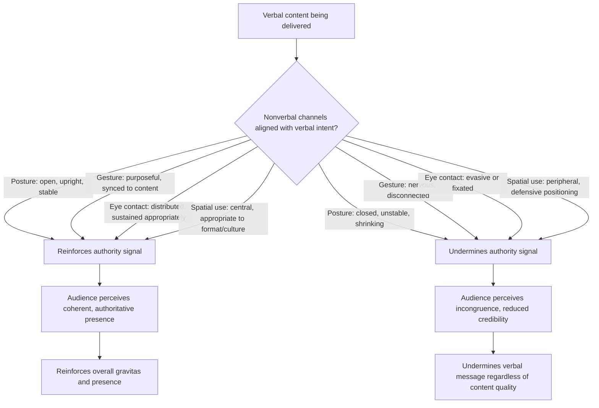

## Nonverbal Markers of Authority

### Definition and Scope

Nonverbal markers of authority are the physical, vocal-adjacent, and spatial behaviors that signal leadership status, competence, and command independent of the verbal content being delivered. This includes posture, gesture, spatial use, eye contact, facial expression, and physical positioning relative to others. This topic isolates the nonverbal channel specifically, providing a deeper technical treatment than the brief mentions embedded within Commanding a Room and Defining Executive Presence.

### Why This Matters in Executive Communication

A substantial portion of how audiences assess authority and credibility happens through nonverbal channels processed largely automatically and often below conscious awareness, meaning misaligned nonverbal signals can undermine strong verbal content without either the speaker or audience being fully aware of the mechanism. [Inference] Because nonverbal signals are processed rapidly and often before conscious evaluation of verbal content, a leader whose posture, gesture, and spatial behavior contradict their verbal message (e.g., confident words paired with defensive body language) is likely to have the nonverbal signal weighted heavily by the audience, sometimes outweighing the literal verbal content in the audience's overall impression.

### Core Nonverbal Channels

**Key Points**

- **Posture**: Upright, open, and stable posture generally signals confidence and authority, while slouched, closed, or unstable posture can signal uncertainty or low status, independent of what is being said.
- **Gesture**: Purposeful, moderate-amplitude gestures that reinforce verbal content tend to signal confidence and command, while excessive, erratic, or absent gestures can respectively signal nervousness or disengagement.
- **Spatial use (proxemics)**: How a leader uses physical space — standing centrally versus at the periphery, taking up appropriate room versus minimizing physical presence — carries status signaling independent of verbal content.
- **Eye contact**: Sustained, distributed eye contact generally signals confidence and engagement, while minimal or evasive eye contact can signal uncertainty, dishonesty (rightly or wrongly perceived), or disengagement.
- **Facial expression**: Alignment between facial expression and verbal content (e.g., appropriate seriousness during serious content, genuine warmth during positive content) reinforces perceived authenticity, while mismatched expression can create an uncanny or untrustworthy impression.
- **Physical stillness and movement control**: Deliberate stillness at key moments, contrasted with purposeful movement at others, signals control over one's own physical presence rather than being physically reactive to internal nervousness.

### Posture in Detail

| Posture Element | Authority-Signaling Version | Authority-Undermining Version |
| --- | --- | --- |
| **Spine/shoulders** | Upright, shoulders back and relaxed (not rigid) | Slouched, shoulders forward/rounded |
| **Stance width and stability** | Grounded, stable stance (feet roughly shoulder-width) | Shifting weight repeatedly, unstable stance |
| **Head position** | Level, facing the audience directly | Tilted down, avoiding direct orientation to the room |
| **Arm position (at rest)** | Relaxed at sides or loosely clasped, open | Crossed defensively, hands in pockets, or self-touching (adjusting hair, clothing repeatedly) |
| **Occupied space** | Comfortable use of available space, not minimized | Physically shrinking, minimizing footprint, edging toward a corner or lectern for cover |

### Gesture in Detail

**Key Points**

- **Purposeful vs. nervous gestures**: Gestures that emerge naturally to emphasize a specific verbal point (a hand movement timed to a key word) read as purposeful and reinforcing, while repetitive, disconnected movements (fidgeting with a pen, touching one's face repeatedly) read as nervous energy unrelated to content.
- **Amplitude calibration to room size**: Gesture size should scale with room and audience size — gestures appropriate for an intimate small-group setting can appear insufficient in a large auditorium, while gestures appropriate for a large stage can appear exaggerated in a small conference room.
- **Open-palm gestures**: Gestures using open palms (rather than pointing fingers or closed fists) are widely described in nonverbal communication literature as generally reading as more inclusive and less confrontational, useful for building collaborative authority rather than purely dominant authority.
- **Gesture-word synchrony**: Gestures that are well-timed to the specific word or phrase they emphasize reinforce the verbal point; mistimed gestures (occurring notably before or after the relevant word) can create a subtle sense of disconnect even if not consciously identified by the audience.

### Spatial Use (Proxemics) in Detail

- **Central positioning**: Standing in a visually central or prominent position (rather than at the edge of a stage or behind a lectern for the entire talk) generally signals greater confidence and command of the space.
- **Approaching the audience**: Physically moving toward the audience (where the format allows, e.g., stepping away from a lectern) at key moments can reinforce connection and emphasis, though this should be calibrated to formality level and cultural context.
- **Height and level signaling**: Physical elevation (standing versus sitting, a raised stage) carries status signaling in many cultural contexts, though the appropriate use varies significantly by setting (a raised stage keynote versus a collaborative seated discussion may call for opposite spatial choices).
- **Personal space and cultural variation**: [Inference] Comfortable interpersonal distance and appropriate physical proximity vary significantly across cultures, meaning proxemic authority signals that work well in one cultural context (e.g., closer physical proximity signaling warmth and confidence) may read as inappropriate or aggressive in another, connecting this dimension directly to the cross-cultural considerations discussed in Cultural Sensitivity in Humor.

### Eye Contact in Detail

**Key Points**

- **Distribution across the room**: Systematically distributing eye contact across different sections of a room (rather than fixating on one friendly face, one section, or reading exclusively from notes/slides) signals inclusive engagement and command of the full room.
- **Duration calibration**: Eye contact held too briefly can read as evasive or nervous, while eye contact held excessively on a single individual can feel uncomfortable or confrontational; a natural rhythm of engaging and moving on is generally preferred.
- **Eye contact during listening**: Maintaining eye contact while another person (a board member, an interviewer) is speaking — rather than looking away, at notes, or at a device — signals engaged authority and respect simultaneously.
- **Cultural variation in eye contact norms**: [Unverified] Direct eye contact norms vary across cultures in ways that can affect how the same behavior is interpreted; because specific norms and their evolution vary by culture and context, practitioners operating cross-culturally should verify current expectations for the specific audience rather than assuming a universal standard.

### Common Failure Modes

**Key Points**

- **Verbal-nonverbal mismatch**: Delivering confident, assertive language while displaying closed or defensive body language (crossed arms, minimal eye contact), creating an incongruence that audiences often register even without consciously identifying the specific mismatch.
- **Nervous energy leakage**: Repetitive, disconnected physical habits (pen-clicking, hair-touching, foot-shifting) that signal underlying anxiety regardless of verbal content quality.
- **Static, defensive positioning**: Remaining fixed behind a lectern or podium for an entire talk when the format and room would allow more open positioning, potentially signaling a need for physical cover rather than command of the space.
- **Gesture-content mismatch**: Gesturing in ways disconnected from or contradicting verbal content (e.g., a dismissive hand gesture while verbally expressing commitment to an idea).
- **Culturally miscalibrated proxemics or eye contact**: Applying a home-culture default for personal space or eye contact duration in a cross-cultural setting where that default reads differently, undermining rather than reinforcing intended authority signals.
- **Over-rehearsed, mechanical nonverbal execution**: Applying nonverbal techniques so rigidly and deliberately that they appear performative rather than natural, creating a different but related authenticity problem to that discussed in Authentic Leadership Voice.

### Nonverbal Calibration Process

1. **Establish baseline awareness**: record and review past presentations or high-stakes interactions specifically for nonverbal patterns (posture, gesture, eye contact distribution) separate from verbal content review.
2. **Identify specific mismatch or leakage patterns**: flag any recurring nonverbal habits that contradict intended verbal messaging or signal nervousness independent of actual confidence level.
3. **Practice targeted adjustment in low-stakes settings**: work on specific identified patterns (e.g., posture correction, gesture purposefulness) in lower-stakes practice contexts before applying under genuine pressure.
4. **Calibrate to room, format, and cultural context**: adjust gesture amplitude, spatial positioning, and eye contact norms to the specific venue, audience size, and cultural context of each engagement.
5. **Integrate with verbal content rehearsal**: practice nonverbal elements together with verbal delivery (not as a separate, disconnected exercise) so that gesture-word synchrony and overall verbal-nonverbal alignment develop jointly.
6. **Seek external feedback**: because nonverbal habits are often outside a speaker's own conscious awareness, direct feedback from trusted colleagues or video review is generally necessary to identify patterns that self-assessment alone would miss.

### Nonverbal Authority Signal Flow

### Example: Contrasting Nonverbal Presentations of the Same Content

**Example**

- *Undermining nonverbals*: A newly appointed executive delivers a strategy update from behind a lectern for the entire talk, gripping the edges of the lectern, maintaining minimal eye contact with the room while frequently glancing at notes, and using few if any gestures. The verbal content is sound, but the nonverbal presentation signals uncertainty that colors the audience's overall impression of the executive's command of the material.
- *Reinforcing nonverbals*: The same content is delivered by stepping away from behind the lectern at key moments, maintaining an upright and open posture, using purposeful gestures timed to key statements, and distributing eye contact systematically across different sections of the room. The identical verbal content is received with a stronger sense of command and confidence due to the reinforcing (rather than contradicting) nonverbal signals.

### Relationship to Other Rhetorical Skills

- **Defining Executive Presence: Gravitas, Communication, and Appearance** — nonverbal markers of authority are a core technical component of both the communication and gravitas dimensions of that broader framework, providing the specific behavioral mechanics underlying those higher-level concepts.
- **Commanding a Room and Holding Attention** — several nonverbal techniques described here (purposeful movement, gesture, eye contact distribution) directly overlap with and extend the physical techniques introduced in that topic.
- **Projecting Confidence Without Arrogance** — nonverbal signals (open posture, calibrated eye contact) function as the physical channel through which the confidence/arrogance distinction is also communicated, alongside the verbal/language-based mechanisms discussed there.
- **Cultural Sensitivity in Humor** — the cross-cultural variation in proxemics and eye contact norms discussed here parallels the broader cross-cultural calibration principles discussed in that topic, applied specifically to nonverbal rather than comedic content.
- **Authentic Leadership Voice and Personal Style** — nonverbal technique, like verbal technique, should be calibrated to fit a leader's genuine natural tendencies rather than applied as a rigid universal template, connecting this topic's mechanics to that topic's authenticity framework.

### Practical Next Steps for Skill Development

**Next Steps**

- Record a past or rehearsed presentation and review it with sound off, focusing exclusively on posture, gesture, and spatial use to identify patterns independent of verbal content.
- Identify one specific nonverbal habit (e.g., a nervous gesture, minimal eye contact distribution) and practice targeted correction in a low-stakes setting before a high-stakes engagement.
- Practice gesture-word synchrony by rehearsing a key passage of an upcoming talk with deliberate attention to timing specific gestures to specific emphasized words.
- Seek direct feedback from a trusted colleague specifically on nonverbal presence, since self-awareness of one's own habitual nonverbal patterns is often limited without external observation.
- Research current cross-cultural norms for eye contact and proxemics for any specific upcoming cross-cultural engagement, rather than relying on home-culture defaults.

**Related Topics**

- Defining Executive Presence: Gravitas, Communication, and Appearance
- Commanding a Room and Holding Attention
- Projecting Confidence Without Arrogance
- Cultural Sensitivity in Humor
- Authentic Leadership Voice and Personal Style
- Video and On-Camera Presence for Executives