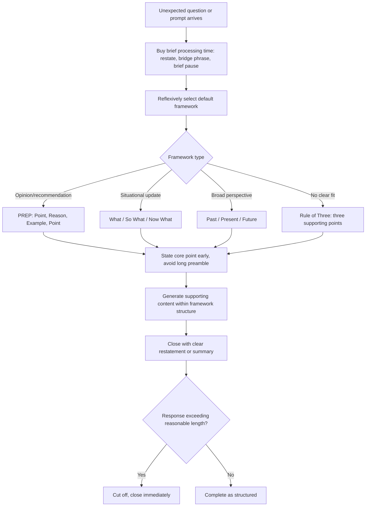

## Thinking on Your Feet Under Time Pressure

### Definition and Scope

Thinking on your feet under time pressure refers to the cognitive and structural techniques used to generate coherent, organized spoken responses with little or no preparation time — typically seconds rather than the minutes or days available for prepared remarks. This is distinct from presence-under-pressure (which concerns composure during adversarial or high-stakes moments) in that it centers specifically on the content-generation problem: constructing a logically organized response from scratch under severe time constraints, independent of whether the situation is adversarial.

### Why This Matters in Executive Communication

Executives are frequently required to respond substantively without preparation — an unexpected question in a meeting, a reporter's question outside a planned topic, a request to comment on breaking news, or an impromptu toast or introduction. Unlike rehearsed remarks, these moments cannot rely on memorized content or slide support; they test a distinct cognitive skill of rapid structuring under time pressure. Because impromptu moments often occur at unpredictable but consequential times (a hallway conversation with a key investor, an unplanned question during a public forum), the ability to think on one's feet functions as a a distinct, trainable competency rather than a fixed talent some people simply have.

### The Core Challenge: Structure Under Time Scarcity

**Key Points**

- **The organization problem**: Without preparation time, the primary risk is not lacking relevant knowledge but failing to organize that knowledge into a coherent, followable structure in real time — rambling, circular, or unstructured responses are the most common failure mode even when the underlying content is sound.
- **The completeness-versus-speed tradeoff**: Attempting to construct a fully comprehensive response before speaking (waiting until every point is mentally organized) often produces excessive hesitation; effective impromptu speakers generally begin speaking with only a rough structural skeleton in mind, filling in detail as they go.
- **Working memory constraints**: [Inference] Because working memory has limited capacity for holding multiple unstructured points simultaneously, using a simple, pre-internalized organizing framework (rather than attempting to hold a full response in mind before beginning) is generally more reliable under time pressure than improvising structure from scratch.

### Core Structural Frameworks for Impromptu Speaking

| Framework | Structure | Best Use Case |
| --- | --- | --- |
| **PREP** | Point, Reason, Example, Point (restated) | General-purpose framework for opinion or recommendation questions |
| **What/So What/Now What** | What happened, why it matters, what should be done | Situational updates or questions about a specific event or development |
| **Past/Present/Future** | Historical context, current state, forward outlook | Questions asking for a broader perspective on a topic or trend |
| **Problem/Solution/Benefit** | The issue, the proposed fix, the resulting benefit | Questions calling for a recommendation or proposal |
| **Rule of Three** | Three supporting points under a single overarching claim | Nearly any impromptu context; provides a simple, memorable, and flexible container |

### The PREP Framework in Detail

PREP is among the most broadly cited impromptu-speaking frameworks due to its simplicity and general applicability:

1. **Point**: State the core answer or position immediately and clearly, avoiding a long preamble before arriving at the main point.
2. **Reason**: Provide the primary justification or rationale supporting that point.
3. **Example**: Offer a specific, concrete example or piece of evidence illustrating the reason.
4. **Point (restated)**: Close by restating the original point, often with slightly different phrasing, to reinforce the answer and provide a clear sense of closure.

This structure is deliberately simple enough to be internalized and applied reflexively under time pressure, providing a reliable container into which content can be generated on the fly without requiring the speaker to first plan the entire response's architecture.

### Techniques for Buying Processing Time

**Key Points**

- **Restating or paraphrasing the question**: Briefly repeating or rephrasing the question before answering provides a few seconds of processing time while also confirming understanding and signaling engagement, rather than technique-free silence.
- **Bridging phrases**: Brief, natural transitional phrases ("That's an important question, and I'd say...") create a short buffer for organizing thought without appearing to stall excessively.
- **Acknowledging complexity briefly**: For genuinely complex questions, briefly noting the complexity ("There are a few angles to this...") before launching into a structured response can both buy time and set audience expectations for a multi-part answer.
- **Selecting a framework reflexively**: Rather than consciously deliberating which structural framework to apply, practiced impromptu speakers often develop a reflexive default (e.g., defaulting to PREP or Rule of Three for most questions) that removes an additional decision point from the time-pressured moment.

### Common Failure Modes

**Key Points**

- **Rambling without structure**: Speaking continuously without an organizing framework, producing a response that may contain accurate information but lacks a followable logical arc, leaving the audience uncertain what the actual answer or point was.
- **Excessive hedging preamble**: Spending disproportionate time on qualifying statements or disclaimers before arriving at any substantive content, causing the audience to lose the thread before the actual answer begins.
- **Silent freezing**: Extended, visible silence while attempting to fully organize a response before speaking, which can read as unpreparedness or evasiveness even when the eventual content is sound.
- **Circular return without progression**: Repeating similar points in slightly different words without ever advancing to new content or arriving at a clear conclusion, often occurring when a speaker has no framework and is essentially stalling by rephrasing the same idea.
- **Overreach beyond actual knowledge**: Attempting to construct an authoritative-sounding response on a topic genuinely outside one's knowledge, rather than briefly acknowledging the limitation and redirecting to what can be credibly addressed.
- **Losing the original question's thread**: Wandering into tangentially related content and failing to return to directly answer the question originally asked, particularly likely when no structural framework anchors the response back to the original point.

### The Rule of Three as a Flexible Default

- **Cognitive and rhetorical basis**: [Inference] The rule of three is widely used in rhetoric generally (see classical rhetorical tricolon structures) and is particularly useful for impromptu speaking because three points is a small enough number to track without external notes, yet substantial enough to feel organized and complete rather than thin.
- **Application under pressure**: Upon receiving an unexpected question, a speaker using this technique commits immediately to naming (even mentally) three points related to the topic, then verbally delivers them in sequence, providing forward momentum without needing complete advance planning of each point's exact content.
- **Flexibility**: The rule of three can be nested within other frameworks (e.g., providing three examples within the "Example" step of PREP) or used as a standalone default when no other framework clearly fits the specific question type.

### Impromptu Response Construction Process

1. **Buy a brief moment**: use restating, a bridging phrase, or a brief pause to create a few seconds of processing time without extended silence.
2. **Select a default framework reflexively**: apply a pre-internalized structure (PREP, Rule of Three, or a context-specific framework) rather than attempting to freely improvise structure from scratch.
3. **State the core point or position early**: avoid extended preamble; arrive at the central answer or position within the first few sentences.
4. **Fill in supporting content within the framework**: generate reasons, examples, or sub-points as the response progresses, using the framework's structure to guide real-time content generation.
5. **Close with clarity**: explicitly signal the end of the response (restating the point, or a brief summary phrase) rather than trailing off or continuing indefinitely.
6. **Monitor and cut off rambling**: maintain awareness of response length and rein in additional tangential content once the core structural framework has been completed.

### Impromptu Speaking Process Flow

### Example: Applying PREP Under Pressure

**Example**

- *Prompt*: A journalist unexpectedly asks a CFO in a hallway, "Do you think the industry is headed for consolidation?"
- *Unstructured response (weak)*: "That's interesting... I mean, there's a lot going on in the space, and different companies are thinking about different things, and it really depends on a lot of factors, so it's hard to say exactly, but there could be some movement in different directions depending on how things play out..."
- *PREP-structured response (strong)*: "I do think we'll see some consolidation over the next few years. [Point] The smaller players are facing rising compliance costs that make standalone operation increasingly difficult. [Reason] We've already seen two of our regional competitors merge in the past year for exactly that reason. [Example] So yes, I'd expect the trend toward consolidation to continue. [Point restated]" This response arrives at a clear position immediately, supports it with one specific reason and example, and closes with clarity — constructed in real time using a simple, internalized structure rather than extensive advance preparation.

### Relationship to Other Rhetorical Skills

- **Presence Under Pressure and Scrutiny** — thinking on your feet is the content-generation counterpart to the composure-focused techniques discussed there; both are frequently required simultaneously in genuinely adversarial impromptu situations.
- **Q&A Handling and Responding to Difficult Questions** — the structural frameworks described here (PREP, Rule of Three) are directly applicable within formal Q&A settings, extending impromptu technique into that more specific format.
- **Commanding a Room and Holding Attention** — the vocal and physical delivery techniques from that topic remain relevant during impromptu responses, layered on top of the structural content-generation techniques covered here.
- **Bridging Techniques for Media and Interview Training** — the time-buying bridging phrases described here overlap directly with bridging techniques used in adversarial media contexts specifically.

### Practical Next Steps for Skill Development

**Next Steps**

- Practice the PREP framework in low-stakes settings by having a colleague pose random, unexpected questions and responding using the four-step structure until it becomes reflexive.
- Rehearse time-buying phrases (restating the question, brief bridging language) to have them readily available rather than needing to construct them in the moment.
- Practice the Rule of Three technique specifically by mentally generating three points immediately upon hearing a novel question, before beginning to speak, to build the habit of instant structural commitment.
- Record impromptu practice responses and review specifically for rambling, circular repetition, or loss of the original question's thread, distinct from content accuracy.
- Identify a personal default framework (PREP, Rule of Three, or another) to internalize as a reflexive first response to any unexpected question, reducing the additional cognitive load of framework selection under genuine time pressure.

**Related Topics**

- Presence Under Pressure and Scrutiny
- Q&A Handling and Responding to Difficult Questions
- Commanding a Room and Holding Attention
- Bridging Techniques for Media and Interview Training
- Classical Rhetorical Structures (Tricolon and the Rule of Three)
- Structuring Impromptu Toasts and Introductions