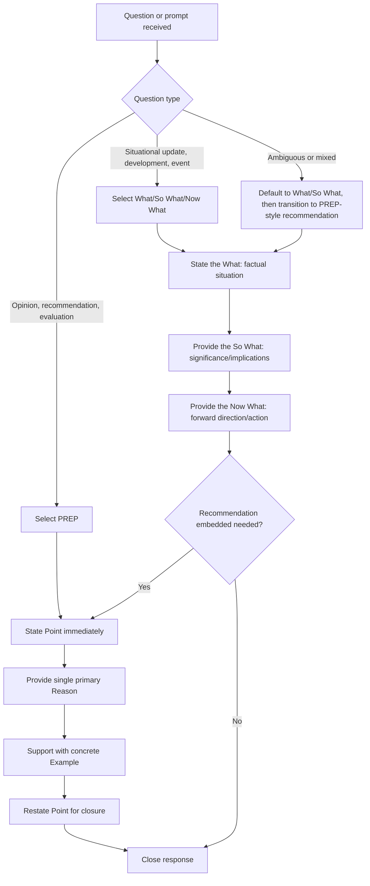

## Impromptu Frameworks: PREP and What, So What, Now What

### Definition and Scope

This topic provides a deep technical treatment of two specific, widely used structural frameworks for impromptu speaking: PREP (Point, Reason, Example, Point) and What/So What/Now What. While both were introduced at a high level in the broader treatment of thinking on your feet, this topic isolates each framework's internal mechanics, appropriate use cases, variations, and common misapplications in greater depth.

### Why This Matters in Executive Communication

Generic advice to "structure your answer" under time pressure is difficult to execute without a specific, internalized template to apply in the moment. PREP and What/So What/Now What are two of the most operationally useful frameworks precisely because they are simple enough to hold in working memory under pressure while still producing organized, complete-sounding responses. Understanding the specific mechanics and appropriate use case for each — rather than treating them as interchangeable — allows a speaker to select and apply the better-fitting framework reflexively based on question type, improving both speed and quality of impromptu response construction.

### Framework 1: PREP (Point, Reason, Example, Point)

**Key Points**

- **Point**: The framework opens by immediately stating the core answer, opinion, or position — not background context, not a qualifying preamble, but the direct answer to the question asked.
- **Reason**: Following the point, the speaker provides the primary justification — the "why" underlying the stated position, typically a single, clear rationale rather than an exhaustive list.
- **Example**: The reason is then substantiated with a specific, concrete instance, statistic, or illustration that makes the abstract reasoning tangible and credible.
- **Point (restated)**: The framework closes by returning to and restating the original point, often with slightly varied phrasing, providing the audience with a clear sense of resolution and reinforcing the takeaway.

### PREP: Internal Mechanics and Variations

| Step | Function | Common Pitfall |
| --- | --- | --- |
| **Point** | Anchors the entire response; gives the audience an immediate answer to track | Delaying the point behind a lengthy preamble, causing the audience to lose the thread before the actual position is stated |
| **Reason** | Provides logical justification, moving from assertion to argument | Providing multiple competing reasons simultaneously, diluting focus and adding unplanned complexity under time pressure |
| **Example** | Converts abstract reasoning into concrete, memorable, and credible support | Choosing a vague or overly complex example that itself requires additional explanation, extending the response beyond its intended scope |
| **Point (restated)** | Provides closure and reinforces retention | Omitting the restatement, causing the response to trail off without a clear sense of conclusion |

- **Single-reason discipline**: [Inference] Under time pressure, attempting to provide multiple reasons rather than committing to a single primary reason is a common cause of rambling or losing structural clarity, since each additional reason introduces its own branching complexity that must be managed extemporaneously; PREP's effectiveness under pressure depends partly on the discipline of selecting one strong reason rather than attempting comprehensiveness.
- **Example selection speed**: Because the example step requires retrieving a specific, concrete instance in real time, speakers who maintain a small mental inventory of frequently relevant examples, statistics, or anecdotes (from their own work or organization) can apply this step more fluidly than those attempting to generate a novel example from scratch under pressure.

### Framework 2: What / So What / Now What

**Key Points**

- **What**: The first step states the facts or situation directly — what happened, what the current state is, or what the relevant information is, delivered as neutral, factual description before any interpretation.
- **So What**: The second step provides interpretation and significance — why the factual situation matters, what its implications are, connecting the raw fact to its broader relevance for the audience.
- **Now What**: The third step provides forward-looking direction — what should happen next, what action is being taken or recommended, or what the audience should expect going forward.

### What/So What/Now What: Internal Mechanics and Variations

| Step | Function | Common Pitfall |
| --- | --- | --- |
| **What** | Establishes shared factual grounding before interpretation begins | Skipping directly to interpretation without first clearly establishing the underlying fact, leaving some audience members without necessary context |
| **So What** | Bridges from fact to relevance, addressing the audience's implicit "why does this matter to me" question | Providing interpretation that is too generic or obvious, failing to add genuine insight beyond restating the fact in different words |
| **Now What** | Provides actionable closure and forward momentum | Omitting this step entirely, leaving the response feeling incomplete or purely descriptive/analytical without practical direction |

- **Origin and common use context**: This framework is frequently used in reflective and experiential learning contexts (situational debriefs, after-action reviews) in addition to impromptu speaking, and its clear separation of fact, interpretation, and action makes it particularly well-suited to situational updates or questions about developing events.
- **Distinguishing from PREP**: While PREP is oriented around stating and supporting a position or opinion, What/So What/Now What is oriented around describing a situation and its implications — the two frameworks are not fully interchangeable, and applying the wrong one to a given question type can produce an awkward fit (e.g., using What/So What/Now What to answer a pure opinion question can feel evasive if it delays stating a clear position until late in the response).

### Comparative Use-Case Selection

**Key Points**

- **Use PREP when**: the question directly asks for an opinion, recommendation, evaluation, or position ("Do you think X?", "What's your view on Y?", "Should we do Z?") — situations where the audience is explicitly seeking the speaker's judgment.
- **Use What/So What/Now What when**: the question asks about a situation, event, or development ("What's happening with X?", "Can you give us an update on Y?", "What does this development mean?") — situations where the audience is seeking situational awareness and its implications more than a personal opinion.
- **Overlap and combination**: In some cases, a single response can incorporate both — using What/So What to establish situational context, then transitioning into a PREP-style structure to state and support a specific recommendation about what to do about that situation, effectively nesting one framework within the other.

### Selection Decision Process

1. **Parse the question type**: determine whether the question is fundamentally seeking an opinion/position (favoring PREP) or a situational update/explanation (favoring What/So What/Now What).
2. **Commit to the framework immediately**: avoid spending processing time deliberating between frameworks; a fast, reflexive selection (even if imperfect) generally outperforms a delayed, more deliberated choice under genuine time pressure.
3. **Populate the first step immediately**: begin speaking with the first structural element (Point, or What) as soon as selected, rather than attempting to fully plan all four (or three) steps before beginning.
4. **Generate subsequent steps in sequence**: allow the framework's structure to guide real-time content generation for each subsequent step, rather than needing the entire response pre-planned.
5. **Close deliberately**: explicitly complete the final step (restated Point, or Now What) rather than trailing off, providing clear closure regardless of which framework was used.

### Framework Selection and Application Flow

### Example: Same Underlying Situation, Two Frameworks

**Example**

- *Underlying situation*: A company has just lost a major client to a competitor.
- *PREP application* (in response to "Should we be worried about this?"): "I don't think this signals a broader problem. [Point] This client's decision was driven by a highly specific pricing structure unique to their industry vertical, not a general competitive weakness. [Reason] Our win rate against this same competitor in every other vertical remains above 70% this year. [Example] So no, I see this as an isolated case rather than a trend. [Point restated]"
- *What/So What/Now What application* (in response to "Can you update us on the client situation?"): "We lost the Meridian account to a competitor last week. [What] This represents about 3% of quarterly revenue, and it's the first loss of this size in our enterprise segment this year. [So What] We're conducting a win-loss review this week, and I'll have a specific action plan to share with this group by Friday. [Now What]" Note the same underlying event is handled with fundamentally different framework choices depending on whether the question sought an opinion/reassurance (PREP) or a factual update (What/So What/Now What).

### Common Misapplications

**Key Points**

- **Using What/So What/Now What for a pure opinion question**: Responding to "What's your view on X?" with an extended factual recap before ever stating a personal position can feel evasive, since the audience explicitly asked for judgment, not situational description.
- **Using PREP for a pure factual update request**: Responding to "What's the status of X?" by immediately stating an opinion-style "Point" before establishing the actual facts can feel presumptuous or confusing if the audience genuinely lacks the basic situational context first.
- **Abandoning the framework mid-response**: Beginning with a clear structural intent (e.g., stating a Point) but failing to follow through with the Reason, Example, and restated Point, resulting in a response that starts strong but trails into unstructured rambling.
- **Over-elaborating a single step**: Spending disproportionate time on one step (e.g., an extended, multi-part Reason in PREP) at the expense of completing the framework, leaving the response structurally lopsided and potentially exceeding an appropriate response length.

### Relationship to Other Rhetorical Skills

- **Thinking on Your Feet Under Time Pressure** — this topic provides the detailed mechanical treatment of two specific frameworks introduced at a survey level in that broader topic.
- **Q&A Handling and Responding to Difficult Questions** — both frameworks are directly applicable within formal Q&A settings, providing reflexive structural options for handling a wide range of anticipated and unanticipated question types.
- **Presence Under Pressure and Scrutiny** — applying a clear framework under pressure directly supports composure, since a reliable structural template reduces the cognitive load that might otherwise contribute to stress-related fluency breakdown.
- **Crisis Communication** — the What/So What/Now What framework in particular maps closely onto standard crisis communication structures (situation, impact, response), extending its relevance into that more specialized context.

### Practical Next Steps for Skill Development

**Next Steps**

- Practice categorizing a series of sample questions (opinion-seeking versus situational-update-seeking) to build speed and accuracy in framework selection before attempting live application.
- Rehearse the PREP framework specifically on opinion-style prompts, focusing on the discipline of committing to a single Reason rather than listing multiple competing justifications.
- Rehearse the What/So What/Now What framework specifically on situational-update prompts, ensuring the "Now What" step is never omitted even under time pressure.
- Build a small personal inventory of frequently relevant examples, statistics, or anecdotes that can be readily deployed in the PREP framework's Example step without needing to generate a novel example under pressure.
- Practice nesting the two frameworks (using What/So What to establish context, then transitioning into PREP-style recommendation) for questions that combine situational and opinion-seeking elements.

**Related Topics**

- Thinking on Your Feet Under Time Pressure
- Q&A Handling and Responding to Difficult Questions
- Presence Under Pressure and Scrutiny
- Crisis Communication Structures (Situation, Impact, Response)
- Classical Rhetorical Structures (Tricolon and the Rule of Three)
- Bridging Techniques for Media and Interview Training