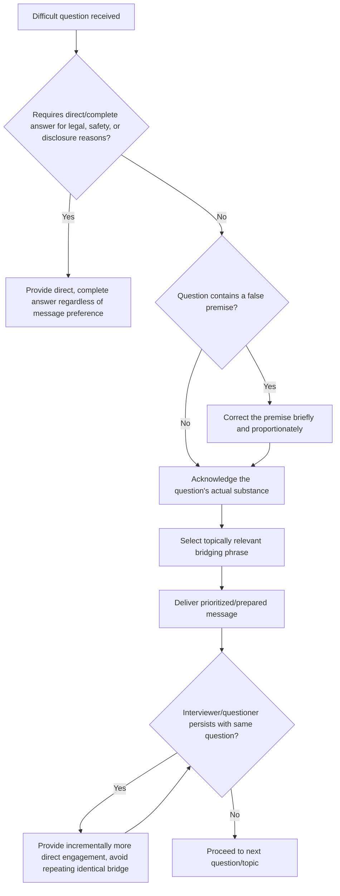

## Bridging and Redirecting Difficult Questions

### Definition and Scope

Bridging and redirecting difficult questions refers to the technique of acknowledging a question directly while deliberately transitioning the response toward prepared or more advantageous content — used when a question is hostile, off-topic, based on a false premise, outside the speaker's authority to answer, or otherwise poorly served by a fully direct response. This is a specific, named technique within the broader impromptu speaking skill set, distinguished from simple evasion by its requirement to engage the question's substance before pivoting.

### Why This Matters in Executive Communication

Executives regularly face questions in media interviews, board meetings, and public forums that cannot or should not be answered exactly as posed — because the question contains a false premise, seeks confidential or legally sensitive information, is designed to provoke rather than inform, or simply falls outside the speaker's area of authority. Refusing to answer outright can appear evasive or defensive, while answering exactly as framed can validate a false premise, disclose inappropriate information, or waste the opportunity to deliver the speaker's actual priority message. Bridging provides a middle path: a technique for maintaining message discipline and control of the narrative without appearing to dodge legitimate scrutiny.

### The Bridge Structure

**Key Points**

- **Acknowledge**: Briefly recognize the question, its premise, or the underlying concern — this step is what distinguishes legitimate bridging from pure evasion, since it demonstrates the question was heard and taken seriously.
- **Transition**: Use a brief connecting phrase to pivot from the acknowledgment toward the intended content — phrases like "What's really important here is..." or "The bigger picture is..." signal a deliberate, natural-sounding shift.
- **Deliver the bridge-to content**: Provide the speaker's prepared or prioritized message, ideally one that still relates plausibly to the original question's topic area rather than being a completely unrelated pivot.
- **Reinforce if needed**: For particularly persistent or repeated difficult questions, briefly returning to acknowledge the original question again before re-bridging can maintain the appearance of engagement across multiple exchange rounds.

### Bridging Phrase Reference

| Bridge Type | Example Phrases | Use Case |
| --- | --- | --- |
| **Reframing bridge** | "The real issue here is...", "What matters most is..." | Redirecting from a narrow or loaded framing to a broader, more favorable framing |
| **Positive pivot bridge** | "What I can tell you is...", "Here's what we do know..." | Redirecting from unknown/unconfirmed information to confirmed information |
| **Priority bridge** | "Let me step back and share the bigger picture...", "The most important thing for people to understand is..." | Redirecting from a narrow tactical question to a strategic message |
| **Correction bridge** | "I want to clarify something first...", "That's not quite accurate — here's what's actually happening..." | Addressing a false premise embedded in the question before proceeding |
| **Deferral bridge** | "That's outside what I can speak to directly, but what I can address is...", "I'll leave the legal specifics to our counsel, but from a business perspective..." | Redirecting from a question outside one's authority or appropriate scope |

### Distinguishing Bridging From Evasion

**Key Points**

- **The substance test**: [Inference] Because audiences and skilled interviewers can often distinguish genuine engagement from pure evasion, the credibility of a bridge depends heavily on whether the acknowledgment step meaningfully engages the actual substance of the question asked, even briefly, before pivoting — a bridge that skips genuine acknowledgment and moves immediately to an unrelated prepared message is more likely to be perceived (and called out) as evasive.
- **Repetition risk**: Using the same bridging phrase repeatedly across multiple different questions in a single exchange increases the likelihood that the technique itself becomes visible and is perceived negatively, undermining its own effectiveness.
- **Topical relevance requirement**: An effective bridge pivots to content that remains plausibly connected to the original question's topic area; pivoting to a completely unrelated message makes the redirection more conspicuous and can appear more evasive than a bridge to closely related content.
- **When bridging becomes inappropriate**: For questions requiring direct factual answers where evasion itself would constitute a meaningful omission (e.g., specific safety, legal, or material financial disclosure questions), bridging without substantively answering can create legal, regulatory, or reputational risk beyond the immediate communication concern — direct, complete answers are sometimes the only appropriate response regardless of message-discipline preferences.

### Redirecting False Premises

- **Correcting before bridging**: When a question contains an inaccurate underlying assumption ("Given that the company has been losing market share for years..."), an effective response corrects the factual premise directly and specifically before proceeding, rather than allowing the false premise to stand unaddressed by simply answering the question as framed.
- **Avoiding repetition of the false claim**: [Inference] Communication research on message reinforcement suggests that repeating a false claim, even to deny it, can inadvertently reinforce that claim's association with the topic in audience memory; effective correction often reframes in affirmative terms ("Our market share has actually grown for three consecutive years") rather than extensively repeating and then negating the original false framing.
- **Balancing correction with proportionality**: Overly aggressive or lengthy correction of a minor premise inaccuracy can itself appear defensive or make the inaccuracy seem more significant than it was; correction should generally be proportionate to the actual significance of the inaccuracy.

### Common Failure Modes

**Key Points**

- **Pure evasion without acknowledgment**: Pivoting immediately to a prepared message without any genuine engagement with the original question, which experienced audiences and interviewers typically recognize and may call out directly, damaging credibility more than a direct but less favorable answer would have.
- **Over-reliance on identical bridging language**: Using the same transitional phrase repeatedly within a single exchange, making the technique itself conspicuous and undermining its intended subtlety.
- **Bridging on questions that require direct answers**: Applying redirection technique to questions where a direct, specific answer is legally, ethically, or reputationally necessary (e.g., material financial or safety disclosures), where the appearance of evasion itself becomes the primary story rather than the original question's content.
- **Irrelevant pivot destination**: Bridging to content with no plausible connection to the original question's topic, making the redirection obvious and potentially appearing more manipulative than a closely related pivot would.
- **Over-correcting minor premise issues**: Spending disproportionate time and energy correcting a minor inaccuracy in a question's framing, drawing more attention to the point than it warranted.
- **Failing to eventually address persistent follow-up**: If an interviewer or questioner repeatedly returns to the same original question after multiple bridge attempts, continuing to bridge without ever engaging the substance can itself become a visible pattern that damages credibility more than the original question's content would have.

### Bridging Application Process

1. **Assess whether bridging is appropriate**: determine whether the question is one that can appropriately be partially redirected, or one that requires a direct, complete answer regardless of message-discipline preference (particularly for legal, safety, or material disclosure questions).
2. **Genuinely acknowledge the question's substance**: engage briefly but authentically with what was actually asked, correcting any false premise if present, before transitioning.
3. **Select an appropriate, topically relevant bridge phrase**: choose a transition that connects naturally to both the acknowledged question and the intended pivot content.
4. **Deliver the prioritized message**: provide the prepared or strategically preferred content, keeping it reasonably concise rather than using the bridge as a launching pad for an extended monologue.
5. **Monitor for persistent follow-up**: if the same question recurs, adjust by providing incrementally more direct engagement with each subsequent round rather than repeating an identical bridge, to avoid the appearance of a fixed, evasive pattern.

### Bridging Decision and Execution Flow

### Example: Contrasting Bridge Quality

**Example**

- *Poor bridge (perceived as evasive)*: Asked "Why did the product launch slip by six months?", a spokesperson responds: "Great question — what I really want to talk about is our exciting roadmap for next year." This skips any acknowledgment of the actual question and pivots to entirely unrelated content, likely to be perceived as a dodge.
- *Effective bridge*: The same question is met with: "The delay came down to additional security testing we decided was necessary after an internal review. What's important is that this testing has significantly strengthened the product, and early results from the extended beta have been the strongest we've seen for any launch." This response directly acknowledges the reason for the delay (engaging the actual question), then bridges to a related, favorable point about the outcome — remaining topically connected while still emphasizing the speaker's preferred message.

### Relationship to Other Rhetorical Skills

- **Thinking on Your Feet Under Time Pressure** — bridging is a specialized technique operating within the broader impromptu speaking skill set, specifically addressing questions that are difficult rather than merely unexpected.
- **Impromptu Frameworks: PREP and What, So What, Now What** — bridging content often benefits from being delivered using one of these structural frameworks once the pivot has occurred, combining the redirect technique with organized delivery.
- **Presence Under Pressure and Scrutiny** — the tactical pause and composure techniques from that topic directly support effective bridging, since a composed, unhurried acknowledgment-then-pivot reads more credibly than a rushed or visibly anxious one.
- **Crisis Communication** — bridging technique is heavily used in crisis and media training specifically, since crisis-related questions frequently combine hostility, false premises, and legal sensitivity simultaneously.
- **Ethical Persuasion and Rhetorical Ethics** — the line between legitimate message discipline and inappropriate evasion connects this technique directly to broader questions of rhetorical ethics, particularly regarding disclosure obligations.

### Practical Next Steps for Skill Development

**Next Steps**

- Practice constructing bridges for a list of anticipated difficult questions before a high-stakes engagement, ensuring each includes genuine acknowledgment before the pivot.
- Rehearse varying bridging phrases across multiple practice questions to avoid over-reliance on a single repeated transitional phrase.
- Review recordings of past interviews or Q&A sessions (own or others') specifically to identify bridges that felt genuine versus evasive, and analyze what distinguished the two.
- Develop a clear personal or organizational policy distinguishing which question types require direct, complete answers (legal, safety, material disclosure) versus which are appropriate candidates for bridging technique.
- Practice the escalating-engagement technique for persistent follow-up questions, preparing incrementally more direct responses for second and third rounds of the same question rather than repeating an identical bridge.

**Related Topics**

- Thinking on Your Feet Under Time Pressure
- Impromptu Frameworks: PREP and What, So What, Now What
- Presence Under Pressure and Scrutiny
- Crisis Communication and Leadership Under Scrutiny
- Ethical Persuasion and Rhetorical Ethics
- Media Training and Interview Preparation Techniques