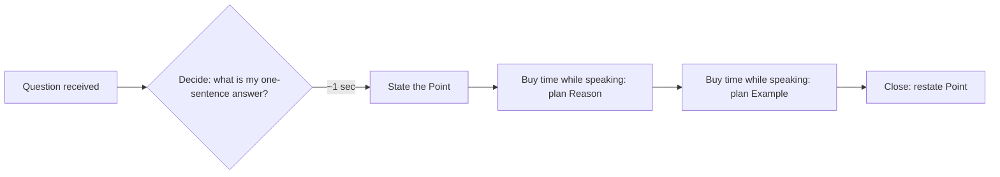

## Structuring an Answer in Seconds

### Overview

This is the tactical discipline of imposing a coherent structure on a spoken answer within roughly 2–5 seconds of latency — the window between receiving a question and beginning to speak. It sits at the intersection of rhetoric (classical arrangement/*dispositio*), cognitive psychology (working memory constraints under stress), and executive media/crisis training. The core problem: unstructured impromptu speech tends toward rambling, hedging, or losing the thread mid-answer, because the speaker is composing content and structure simultaneously. Fast structuring frameworks solve this by supplying a **pre-loaded template** so the brain only has to fill slots rather than invent architecture in real time.

---

### The Core Problem: Why Unstructured Answers Fail

Under time pressure and audience scrutiny, several failure modes recur:

- **Front-loading uncertainty** — starting with hedges ("um, so, I think maybe...") before any content, which erodes perceived credibility in the first 2 seconds, the window in which audiences form a strong first impression
- **Answer drift** — beginning a response and wandering into tangents because no endpoint was pre-defined
- **Buried lede** — arriving at the actual answer only after 30+ seconds of preamble, causing listeners (especially executives, journalists, boards) to lose patience or the point
- **No exit** — not knowing how to stop, resulting in trailing off or over-explaining past the point of diminishing returns

Fast structuring frameworks directly counter each of these by fixing the **first move** (always the point/answer) and the **last move** (always a defined close), leaving only the middle to be generated live.

---

### Core Framework: PREP

The most widely taught real-time structure for impromptu answers.

- **P**oint — Answer the question directly, in one sentence, first
- **R**eason — Give the underlying justification
- **E**xample — Ground it in a concrete case, data point, or story
- **P**oint — Restate the answer to close the loop

**Why it works under time pressure**: it requires the speaker to commit to an answer *before* justifying it, which prevents rambling toward a conclusion. The single hardest cognitive step — deciding what you actually think — is forced to happen in the first half-second, not discovered mid-ramble.

**Example**

> Q: "Is now the right time to expand into the European market?"
>
> "Yes, I believe it is. [Point] Because our domestic growth has plateaued while European demand signals are strong. [Reason] Our Q3 pilot in Germany, for instance, converted leads at nearly double our domestic rate. [Example] So the data supports moving now rather than waiting. [Point]"

---

### Alternative Framework: STAR (for behavioral/experience questions)

Used specifically when a question asks for a past experience or example (common in interviews, board Q&A about track record).

- **S**ituation — brief context
- **T**ask — what needed to be done
- **A**ction — what the speaker specifically did
- **R**esult — the outcome, ideally quantified

**Distinction from PREP**: STAR is narrative-first (it answers "tell me about a time..."), while PREP is claim-first (it answers "what do you think about...?" or "should we...?"). Using STAR for an opinion question, or PREP for a "tell me about a time" question, produces a mismatched, less coherent answer. [Inference] This framework-matching distinction is a commonly taught refinement in communication coaching, though exact terminology and boundaries vary across sources.

---

### Alternative Framework: Rule of Three

For structuring supporting content rather than the whole answer — useful as a rapid organizing device for the "Reason" or middle section of any answer.

- Group supporting points into exactly three categories, stated up front as a signpost: "There are three reasons for this..."
- Three is retained by audiences better than two (feels incomplete) or four+ (exceeds working memory capacity for a spoken, unwritten list)
- Functions as a **generative constraint**: forcing content into three buckets, live, is often faster than trying to enumerate an unbounded list under pressure

---

### The Underlying Timing Mechanic: Answer First, Justify Second

All fast-structuring frameworks share one non-negotiable ordering principle: **state the conclusion before the evidence**. This is sometimes called the "BLUF" principle (Bottom Line Up Front), borrowed from military and executive briefing culture.

**Why this specifically solves the speed problem**:

- It converts an open-ended generative task ("compose a coherent multi-part answer") into a **sequential fill-in-the-blank task** — decide, then justify, then close
- It gives the speaker an immediate, usable first sentence within the first second, buying additional processing time during its delivery to plan the "Reason" and "Example" slots
- It ensures that if the speaker is cut off, interrupted, or runs out of time, the most important content (the answer) has already been delivered

---

### Practical Technique: The "Signpost" Buy-Time Move

Because a genuine structuring decision still takes a beat of cognitive processing, speakers use **verbal signposting phrases** that are content-neutral but buy 1–2 seconds of processing time without sounding like a stall:

- "There are really two things going on here."
- "Let me answer that directly, then explain why."
- "The short answer is X — here's the reasoning."

These phrases are pre-rehearsed and reusable across any question, so they do not need to be composed in the moment; only the content that follows them does. [Inference] This is a common technique in media and executive coaching, though specific phrase lists are not standardized across training programs.

---

### Practical Technique: Mental Bucket Pre-Loading

Before entering a high-stakes Q&A (board meeting, press conference, all-hands), experienced communicators pre-load 3–5 anticipated question categories with a rough PREP skeleton already drafted, so that even "impromptu" answers are drawing on partially pre-structured content rather than starting from zero. This blurs the line between pure impromptu and extemporaneous delivery and is standard practice in executive media training. [Inference] The specific practice of pre-loading question buckets is documented across media training methodologies, though the exact number of buckets and preparation depth varies by coach and context.

---

### Common Failure Patterns and Corrections

| Failure Pattern | What It Looks Like | Correction |
| --- | --- | --- |
| Hedge-first | "Um, that's a good question, so I think, well..." | Lead with the Point sentence; hedges belong nowhere in the structure |
| No stated conclusion | Reasoning given, but the actual answer never explicitly stated | Force a final "Point" restatement — the close is mandatory, not optional |
| Overloaded reasons | Listing 5–7 justifications | Cap at Rule of Three; excess reasons dilute the strongest one |
| No exit strategy | Trailing off after the example | Always plan the closing sentence as a fixed template, not an improvisation |
| Narrative used for opinion question | Answering "should we expand?" with a long story first | Match framework to question type: PREP for opinion/recommendation, STAR for experience |

---

### Executive Communication Application

- **Board and investor Q&A**: PREP is the default real-time structure; BLUF ordering is expected by sophisticated audiences (journalists, analysts, boards) who actively penalize buried answers
- **Media interviews**: signposting phrases combined with pre-loaded buckets allow executives to appear both spontaneous and disciplined simultaneously
- **Crisis response (verbal, pre-written-statement stage)**: BLUF-first structuring is critical when a spokesperson must give an immediate verbal response before a formal manuscript statement is ready — the first sentence must contain the core message, since it is the most likely to be quoted, aired, or clipped
- Effectiveness of any given framework depends on speaker rehearsal, question complexity, and audience expectations, and outcomes may vary across contexts.

---

**Related Topics**

- Bridging and pivoting techniques for redirecting hostile questions
- BLUF (Bottom Line Up Front) briefing structure in military and corporate communication
- Message discipline and pre-loaded talking points in media training
- Nonverbal buy-time techniques (pacing, strategic pausing) as complements to verbal signposting
- Crisis communication: verbal first response vs. prepared manuscript statement
- Classical rhetorical *dispositio* (arrangement) as the theoretical ancestor of modern answer frameworks