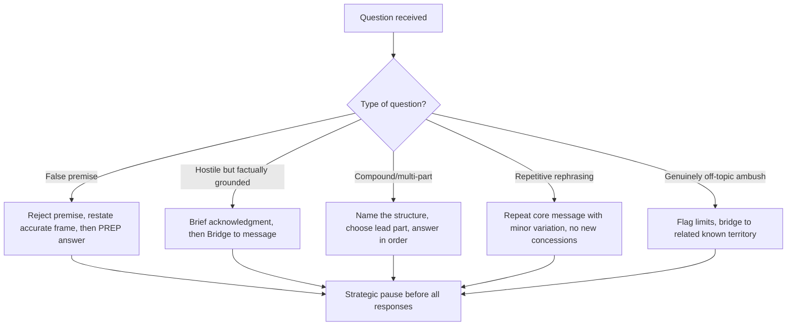

## Managing Hostile or Unexpected Questions

### Overview

This covers the tactical and rhetorical repertoire for handling questions designed to destabilize a speaker — whether through overt hostility (accusatory framing, "gotcha" phrasing, aggressive tone) or through genuine unexpectedness (topics outside prepared material, ambush timing, false premises). This is a specialized subset of impromptu speaking that layers **psychological composure management** on top of **structural answering technique**, because the primary failure mode here is not lack of content but loss of control — visible defensiveness, anger, panic, or capitulation to a hostile frame.

---

### Taxonomy of Difficult Questions

| Type | Characteristic | Example |
| --- | --- | --- |
| **Hostile/accusatory** | Embeds blame or wrongdoing in the question itself | "Why did leadership ignore the warning signs?" |
| **Loaded/false premise** | Contains an unstated assumption the speaker did not agree to | "When did you decide to cut corners on safety?" |
| **Multi-part/compound** | Several questions bundled into one, designed to overwhelm | "What went wrong, who's responsible, and what are you doing about it?" |
| **Off-topic ambush** | Genuinely unexpected, outside prepared material | Personal question during a product launch press event |
| **Repetitive pressure** | Same question rephrased repeatedly to force a slip | Journalist rephrasing "will you resign?" five ways |
| **Silence/pause trap** | Interviewer stays silent after an answer, hoping speaker fills the gap with more (often self-damaging) content | — |

Recognizing the type in the first second is itself a skill, since the correction technique differs by type.

---

### Core Technique: Bridging

**Definition**: Acknowledging the question briefly, then pivoting to a pre-loaded, safe talking point, rather than fully answering a hostile or off-message question on its own terms.

**Structure**:

1. Brief acknowledgment (never silence, never argument)
2. Bridge phrase (transitional pivot)
3. Deliver the pre-loaded message

**Common bridge phrases**:

- "What's really important here is..."
- "Let me put that in context..."
- "The bigger picture is..."
- "That's one part of it — the other part is..."

**Example**

> Q (hostile): "Isn't it true your company knew about the defect for months and did nothing?"
>
> Bridge response: "I understand the concern, and I want to address it directly. What's important is what we're doing now: we identified the issue, initiated a full recall within 48 hours of confirmation, and we're implementing three new quality checkpoints. That's where our focus is."

**Caution**: Bridging that is too obvious (ignoring the question entirely) reads as evasive and can amplify hostility. Effective bridging requires at minimum a partial, credible acknowledgment before pivoting.

---

### Core Technique: Flagging (Signposting the Move)

Explicitly naming what you're about to do, which paradoxically increases perceived transparency even while redirecting:

- "I can't speak to the specifics of that investigation, but I can tell you about our current safety protocols."
- "That's a fair question — let me reframe it slightly, because I think the more useful question is..."

This differs from pure bridging by making the redirection visible and justified rather than seamless, which reduces the audience's sense of being managed. [Inference] This distinction between silent bridging and flagged reframing is a common refinement taught in media training, though terminology varies by source.

---

### Core Technique: Correcting False Premises

When a question contains an embedded false assumption, answering it directly (even briefly) implicitly ratifies the false premise. The correction must happen **before** any further answer.

**Structure**:

1. Explicitly reject the premise (without becoming defensive)
2. Restate the accurate premise
3. Proceed with PREP-style answer on the corrected ground

**Example**

> Q: "When did you decide to prioritize profit over employee safety?"
>
> "That's not what happened, and I want to correct the premise. Safety has been our top operational metric throughout this period — here's the data..."

**Failure mode to avoid**: Repeating the hostile framing verbatim while denying it (e.g., "We did NOT prioritize profit over safety") can reinforce the negative frame in the audience's memory (a well-documented phenomenon in framing research — negation still activates the underlying frame). Better to state the *affirmative* frame directly rather than negate the hostile one.

---

### Core Technique: The Strategic Pause

Contrary to the instinct to fill silence immediately, a 1–2 second pause before responding to a hostile question:

- Signals composure rather than panic
- Buys processing time to select premise-correction vs. bridging vs. direct-answer strategy
- Denies the questioner the reactive, defensive response they may be trying to provoke

This pause should be visibly deliberate (steady eye contact, calm posture) rather than appear as hesitation or confusion.

---

### Core Technique: Refusing the Compound Question

For multi-part hostile questions, answering all parts in the order asked cedes control of structure to the questioner and often buries the strongest point. Instead:

1. Explicitly name the compound structure: "That's really three questions — let me take them one at a time."
2. Choose to lead with the part most favorable to answer, not necessarily the order asked
3. Use Rule of Three to organize the response transparently

---

### Core Technique: Handling Repetitive Pressure

When a question is rephrased repeatedly to force a different (often more damaging) answer:

- Recognize the pattern rather than treating each rephrasing as a genuinely new question
- Repeat the core message with only minor variation each time — deliberate repetition, not new concessions, is the correct response
- Avoid escalating tone to match the questioner's persistence; flat, consistent repetition is more disarming than defensiveness

This is sometimes called the "broken record" technique in assertiveness and media training literature. [Inference] The term "broken record technique" is used across multiple communication training traditions, though its specific application to hostile media questions specifically (vs. general assertiveness contexts) is a domain-specific adaptation.

---

### Core Technique: Silence Discipline (Not Filling the Gap)

When an interviewer or questioner goes silent after an answer, hoping the speaker will nervously add more (often damaging) content:

- Deliver the answer, then stop completely
- Tolerate the silence; do not treat it as a cue to elaborate further
- If pressed ("anything else?"), it is acceptable to say "No, that covers it" rather than generating new content under the discomfort of silence

---

### Composure Management (Physiological Layer)

Structural techniques fail if delivered with visible anger, panic, or defensiveness, because audiences read nonverbal signals (tone, posture, facial tension) as more credible than words. Core composure techniques:

- **Controlled breathing** before responding, to prevent audible tension in the voice
- **Deliberate vocal pacing** — hostile questions often trigger speeding up; consciously slowing the rate signals control
- **Neutral facial affect** — avoiding visible defensiveness (eye-rolling, sighing) which reads as guilt or contempt regardless of content
- **Maintained eye contact** with the questioner during the acknowledgment phase, shifting to the broader audience during the bridge/message phase (in group settings)

---

### Decision Flow

---

### Common Failure Patterns

| Failure Pattern | Consequence | Correction |
| --- | --- | --- |
| Answering a false premise directly | Implicitly ratifies the accusation | Correct the premise before answering |
| Negating the hostile frame verbatim | Reinforces the frame in audience memory | State the affirmative frame instead |
| Filling silence after answering | Volunteers damaging new content | Practice silence discipline |
| Escalating tone to match hostility | Reads as loss of composure, feeds the narrative | Deliberately slow pace and lower intensity |
| Fully ignoring the question to bridge | Reads as evasive, can amplify hostility | Partial credible acknowledgment before pivot |
| Treating rephrased questions as new | Concessions creep with each rephrasing | Recognize the pattern, repeat core message |

---

### Executive Communication Application

- **Earnings calls**: analysts frequently use compound and false-premise questions; premise correction and Rule-of-Three structuring are standard responses among trained executives
- **Crisis press conferences**: bridging and flagging are the dominant techniques, since full transparency may be legally constrained while total silence is reputationally damaging
- **Board Q&A**: repetitive-pressure and silence-trap techniques are common from skeptical directors; composure management is often the deciding factor in perceived executive credibility
- **Regulatory hearings**: false-premise correction is critical, since unchallenged premises can become part of the public record
- These techniques describe standard practice in executive and media communication training; actual audience reception and outcomes depend on context, questioner intent, and speaker execution, and may vary.

---

**Related Topics**

- PREP and BLUF structuring as the answer-content layer beneath these composure techniques
- Framing theory and the risks of negating a hostile frame
- Crisis communication: legal counsel constraints on verbal disclosure
- Media training simulation and mock press conference rehearsal methods
- Nonverbal credibility signals (vocal pacing, posture, eye contact) under pressure
- Deflection vs. transparency: ethical boundaries of bridging technique