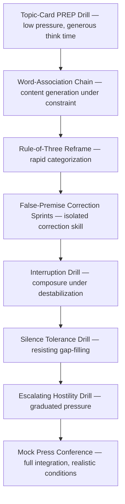

## Practicing Impromptu Speaking Drills

### Overview

This covers the structured training methodology for developing impromptu speaking ability as a repeatable, coachable skill rather than an innate trait. The core pedagogical premise: impromptu competence comes not from eliminating preparation but from **automating structure** through repetition, so that frameworks (PREP, Rule of Three, bridging) execute reflexively under time pressure rather than requiring conscious real-time construction. Drills isolate specific sub-skills — rapid structuring, composure under pressure, vocal delivery without notes — so each can be trained independently before being integrated under full pressure conditions.

---

### Pedagogical Rationale: Why Drilling Works

Impromptu speaking fails most often not from lack of knowledge but from **cognitive overload** — the speaker must simultaneously generate content, impose structure, monitor delivery, and manage nerves. Drilling addresses this through:

- **Chunking**: repeated practice with a fixed framework (e.g., PREP) moves structural decisions from conscious, effortful processing to a more automatic, rehearsed pattern, freeing cognitive resources for content generation
- **Progressive overload**: drills are sequenced from low-pressure/low-complexity to high-pressure/high-complexity, mirroring standard skill-acquisition principles
- **Isolated sub-skill training**: separating "can I structure an answer" from "can I stay composed under hostility" allows targeted correction rather than vague, global feedback

[Inference] The framing of impromptu skill development in terms of cognitive load reduction and automaticity draws on general skill-acquisition and cognitive load theory; specific claims about neural or memory mechanisms are not independently verified here.

---

### Foundational Drill: Topic-Card PREP Drill

**Setup**: A stack of random topic cards (abstract nouns, current events, opinion prompts) and a timer.

**Procedure**:

1. Draw a card
2. Allow **5–10 seconds** of silent thinking (deliberately short)
3. Speak for **60–90 seconds** using PREP structure
4. Self- or peer-review against a structure checklist (see below)

**Example prompts**:

- "Is remote work good for company culture?"
- "Describe a lesson failure taught you."
- "Should this city invest in public transit?"

**Progression**: Reduce thinking time from 10s → 5s → 0s (cold-start) as competence increases.

---

### Foundational Drill: The Word-Association Chain

**Purpose**: Trains the ability to generate content fluidly under a randomly imposed constraint, building comfort with unpredictability itself (not just structuring).

**Procedure**:

1. Speaker is given a single unrelated word (e.g., "umbrella")
2. Must speak for 60 seconds connecting the word to a relevant professional topic, in real time
3. No preparation time permitted

This isolates **content generation under constraint** as a sub-skill distinct from structuring, since the structure (PREP) can remain constant while the topic-generation difficulty varies.

---

### Composure Drill: The Interruption Drill

**Purpose**: Trains maintaining structure and composure while being deliberately destabilized — simulating hostile Q&A conditions.

**Procedure**:

1. Speaker begins a PREP answer to a prompt
2. A partner or coach interrupts mid-answer with a follow-up, contradiction, or unrelated question at an unpredictable moment
3. Speaker must incorporate the interruption (via bridging or premise correction) and return to completing a coherent structure

**Variant — Escalating Hostility Drill**: Partner assigns increasing hostility levels (neutral → skeptical → openly hostile) across repeated rounds on the same topic, training the composure techniques (strategic pause, vocal pacing, silence discipline) under graduated pressure.

---

### Composure Drill: The Silence Tolerance Drill

**Purpose**: Specifically trains resistance to the "filling the gap" failure mode.

**Procedure**:

1. Speaker delivers a complete PREP answer
2. Partner remains completely silent for 5–8 seconds afterward, regardless of quality
3. Speaker must tolerate the silence without volunteering additional (often weaker) content
4. Debrief: did the speaker stay silent, or add unnecessary material?

---

### Structural Drill: The Rule-of-Three Reframe

**Purpose**: Trains rapid categorization of unstructured content into three organized buckets — useful for compound-question handling.

**Procedure**:

1. Speaker is given a broad, messy prompt (e.g., "What's wrong with our current onboarding process?")
2. Must verbally sort the response into exactly three categories within 15 seconds of thinking time
3. Deliver each category with one supporting point

---

### Structural Drill: False-Premise Correction Sprints

**Purpose**: Isolated practice for the specific skill of rejecting an embedded false assumption before answering.

**Procedure**:

1. Partner delivers loaded questions with clearly false or unfair premises ("Why did you let the project fail?")
2. Speaker must, within 3 seconds, (a) name the false premise explicitly, (b) restate the accurate frame, (c) proceed with a PREP answer
3. Rounds increase in premise subtlety (obvious false premises → subtle, harder-to-catch ones)

---

### Integration Drill: The Mock Press Conference

**Purpose**: Full-pressure integration of all sub-skills — structuring, bridging, composure, premise correction — in a single simulated high-stakes environment.

**Procedure**:

1. Assign a realistic scenario (product recall, earnings miss, controversial policy)
2. Multiple "questioners" (peers or coaches) fire a mix of hostile, compound, false-premise, and neutral questions in rapid, unpredictable sequence
3. Speaker must handle 8–12 questions with no advance notice of content
4. Full video recording for delivery review (vocal pacing, composure, body language)

This drill is the standard capstone exercise in executive media training programs, integrating all preceding isolated drills into realistic conditions. [Inference] Mock press conference simulation is widely used across media and crisis-communication training methodologies, though specific formats and rigor vary by provider.

---

### Structure Checklist for Drill Review

| Criterion | Pass Condition |
| --- | --- |
| Point stated first | Answer given within first sentence, before justification |
| Reason present | Clear "why" articulated, not just assertion |
| Example present | Concrete case, data point, or story included |
| Closing restatement | Answer explicitly restated at the end |
| No hedge-opening | No "um, I think maybe..." as the first words |
| Time discipline | Answer falls within target window (e.g., 60–90 sec) |
| Composure (if applicable) | No visible defensiveness, consistent pacing |
| Premise handling (if applicable) | False premises explicitly corrected, not silently accepted |

---

### Drill Progression Sequence

---

### Group Training Formats

- **Round-robin card draws**: group setting, each member draws and answers in sequence, with peer feedback against the structure checklist
- **Fishbowl hostile Q&A**: one speaker at the center fields questions from a surrounding group in rotating roles (neutral questioner, hostile questioner, compound-question questioner)
- **Video self-review**: recording drills and reviewing for hedge-language, filler words, pacing, and structural completeness is standard practice in executive coaching, since speakers are often unaware of their own hedging or pacing patterns in the moment

---

### Common Pitfalls in Drill Design

| Pitfall | Consequence | Correction |
| --- | --- | --- |
| Skipping to full-pressure drills too early | Overwhelms before sub-skills are automated | Follow progressive sequencing |
| No feedback checklist | Vague, unfocused feedback ("that was good/bad") | Use structured criteria for every round |
| Only practicing friendly topics | False confidence; hostile-question skills undertrained | Include escalating hostility variants regularly |
| No time constraints in practice | Fails to build the automaticity needed for real deadline pressure | Enforce strict thinking-time and speaking-time limits |
| No video review | Speakers remain unaware of nonverbal composure issues | Record and review regularly |

---

### Executive Communication Application

- **New spokesperson onboarding**: structured drill progressions (as above) are standard in executive media training curricula before a spokesperson faces live press
- **Pre-earnings-call rehearsal**: mock Q&A sessions using anticipated analyst questions function as a targeted mock press conference drill
- **Crisis-readiness training**: organizations often run periodic mock press conferences as part of crisis preparedness planning, independent of any active crisis
- Drill effectiveness depends on consistency of practice, quality of feedback, and realism of simulated pressure; outcomes may vary by individual and organizational context.

---

**Related Topics**

- PREP and Rule of Three as the structural frameworks being drilled
- Bridging, premise correction, and silence discipline as composure techniques
- Media training program design and spokesperson certification
- Video-based self-review methods in public speaking coaching
- Cognitive load theory and skill automaticity in performance psychology
- Mock press conference design for crisis communication readiness