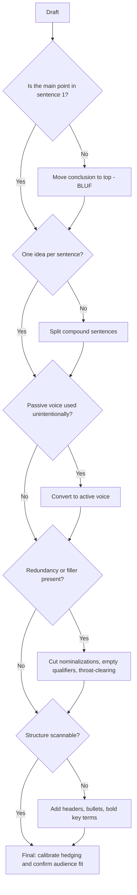

## Principles of Clear, Concise Business Writing

### Overview

Clear, concise business writing is the discipline of transmitting information and intent with minimum cognitive load on the reader and maximum actionability. Unlike academic or literary prose, business writing is judged primarily by **decision-enabling efficiency**: how quickly and unambiguously a reader can extract what they need to know, decide, or do. This chapter covers the core linguistic, structural, and rhetorical principles that separate effective executive prose from verbose, ambiguous, or buried communication.

---

### Core Principle 1: BLUF (Bottom Line Up Front)

State the conclusion, request, or key finding in the first sentence or first paragraph — before supporting detail, background, or context.

**Why it matters**: Executive readers routinely skim; if the main point is buried in paragraph four, it may never be read. BLUF also protects against partial reading — if a reader stops after the first sentence, they still get the essential message.

**Example**

- Weak: "Following extensive review of Q3 performance across all regional offices, taking into account seasonal variance and market conditions, we have concluded that..."
- Strong: "We recommend closing the Denver office by Q1. Here's why: [reasoning follows]."

---

### Core Principle 2: One Idea Per Sentence

Each sentence should carry a single main proposition. Compound sentences stacking multiple independent clauses force the reader to parse relationships that should have been made explicit through structure (lists, separate sentences, headers).

**Example**

- Weak: "The budget was reduced due to lower revenue, which was caused by decreased demand, and as a result we need to cut two positions, though we may be able to restore them next quarter if sales improve."
- Strong: "Revenue fell due to lower demand. As a result, the budget was reduced and two positions must be cut. We may restore these roles next quarter if sales recover."

---

### Core Principle 3: Active Voice by Default

Active voice (subject performs the action) is generally more direct, shorter, and clearer about responsibility than passive voice (subject receives the action).

**Example**

- Passive: "Mistakes were made in the reporting process."
- Active: "The finance team made errors in the Q2 report."

**When passive is appropriate**: when the actor is genuinely unknown, irrelevant to the point, or when diplomatically de-emphasizing blame is a deliberate rhetorical choice (see cautionary note on strategic ambiguity below) — but this should be a conscious exception, not a default habit.

---

### Core Principle 4: Eliminate Redundancy and Filler

Common categories of unnecessary bulk in business writing:

| Category | Example | Concise Alternative |
| --- | --- | --- |
| Redundant pairs | "each and every," "first and foremost" | "each," "first" |
| Empty qualifiers | "very unique," "really important" | "unique," "important" |
| Nominalizations | "make a decision," "conduct an investigation" | "decide," "investigate" |
| Throat-clearing openers | "It is important to note that..." | (delete entirely) |
| Wordy prepositional phrases | "in order to," "due to the fact that" | "to," "because" |

**Example**

- Weak: "In order to make a decision regarding the matter of budget allocation, it is important to note that we should conduct an analysis."
- Strong: "To decide on budget allocation, we should analyze the data."

---

### Core Principle 5: Concrete Over Abstract

Prefer specific, measurable language over vague generalities. Abstract language ("significant improvement," "various stakeholders," "several issues") forces the reader to guess at magnitude and identity.

**Example**

- Weak: "Performance improved significantly across several key metrics."
- Strong: "Conversion rate rose 14% and churn fell 6% in Q3."

---

### Core Principle 6: Parallel Structure

Items in a list or series should share the same grammatical form, reducing processing effort and signaling that items are genuinely comparable.

**Example**

- Weak: "Our goals are to increase revenue, cost reduction, and we want to improve retention."
- Strong: "Our goals are to increase revenue, reduce costs, and improve retention."

---

### Core Principle 7: Hierarchical Structure and Scannability

Business documents are rarely read linearly start-to-finish; they are scanned. Structure should support non-linear reading:

- **Headers and subheaders** that convey meaning on their own (not generic labels like "Section 1")
- **Bulleted/numbered lists** for parallel or sequential items rather than run-on prose enumeration
- **Bolded key terms** to allow visual scanning for the core takeaway
- **Short paragraphs** (generally 3–5 sentences) — long unbroken blocks discourage engagement

---

### Core Principle 8: Precision in Word Choice

Choose the single accurate word over a vague one requiring reader inference, and avoid words with unstable or context-dependent interpretation in business contexts (e.g., "soon," "several," "significant") when a precise figure is available.

**Example**

- Vague: "We'll get back to you soon."
- Precise: "We'll respond by Thursday, June 12."

---

### Core Principle 9: Audience Calibration

Conciseness is relative to what the specific reader already knows and needs. Writing for a technical peer differs from writing for an executive summary audience — the same underlying content may need different levels of jargon, background explanation, and detail depth.

**Practical technique**: the "one-screen rule" for executive audiences — if the reader has only 30 seconds and one screen of text, does the message survive? If not, restructure with BLUF and trim supporting detail to an appendix or attachment.

---

### Core Principle 10: Deliberate Use of Hedging and Certainty

Overuse of hedges ("might," "perhaps," "it seems") undermines authority and clarity, but zero hedging on genuinely uncertain claims creates false confidence and reputational/legal risk. The skill is **calibrated certainty** — matching the language's confidence level to the actual epistemic status of the claim.

**Example**

- Overhedged: "It might perhaps be the case that the project could possibly be delayed."
- Appropriately calibrated: "The project is likely to be delayed by two weeks, pending vendor confirmation."

---

### Cautionary Note: Strategic Ambiguity vs. Poor Clarity

Not all ambiguity in business writing is a defect — diplomatic communication sometimes uses deliberate vagueness (e.g., "there were process gaps" rather than naming an individual) as a conscious rhetorical choice to manage relationships or legal exposure. This differs fundamentally from *unintentional* ambiguity caused by poor structuring or word choice. Distinguishing deliberate diplomatic imprecision from accidental unclear writing is itself an executive communication skill, not a contradiction of the clarity principles above. [Inference] This distinction between intentional and unintentional ambiguity is a widely recognized nuance in executive and diplomatic communication coaching, though its formal treatment varies across sources.

---

### Common Business Writing Failure Patterns

| Failure Pattern | Example | Fix |
| --- | --- | --- |
| Buried lede | Recommendation appears in the final paragraph | Move conclusion to the first sentence (BLUF) |
| Nominalization overload | "We made an assessment of the situation" | "We assessed the situation" |
| Hedging cascade | Multiple stacked qualifiers diluting the point | Commit to a calibrated, single-level hedge |
| Wall-of-text formatting | No headers, bullets, or paragraph breaks | Add scannable structure |
| Jargon mismatch | Technical terms used with a non-technical audience | Calibrate vocabulary to audience |
| Passive-voice blame-diffusion (unintentional) | "Errors were made" with no clear actor, used habitually rather than deliberately | Default to active voice unless diplomatic vagueness is a conscious choice |

---

### Revision Workflow

---

### Executive Communication Application

- **Executive summaries**: BLUF and the one-screen rule are non-negotiable — executives routinely make decisions based on summary paragraphs alone
- **Status reports and updates**: parallel structure and concrete metrics prevent stakeholders from misreading progress or risk
- **Emails to leadership**: eliminating filler and nominalizations directly correlates with response speed and clarity of requested action
- **Board memos**: calibrated hedging is critical — overconfidence on uncertain projections carries governance and legal risk, while excessive hedging undermines decision-making utility
- Effectiveness of these principles depends on genre, audience expectations, and organizational culture, and outcomes may vary.

---

**Related Topics**

- BLUF structuring as shared foundation with impromptu/extemporaneous speaking frameworks
- Executive summary writing and the one-screen rule
- Plain language guidelines and readability metrics (e.g., Flesch-Kincaid)
- Email etiquette and request-clarity in professional correspondence
- Diplomatic and strategic ambiguity in crisis or sensitive communications
- Editing and self-revision techniques for concision