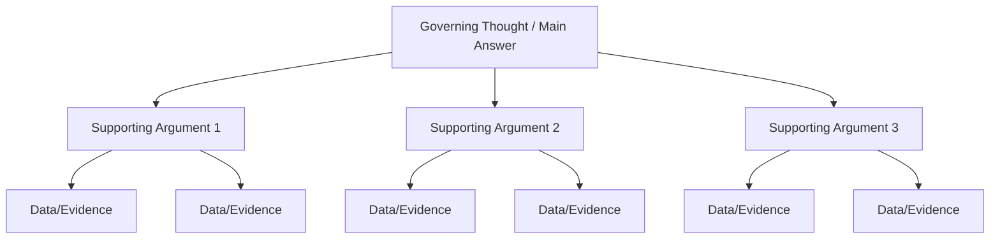

## The Pyramid Principle: Leading With the Answer

### Overview

The Pyramid Principle is a structured communication framework, originally developed by Barbara Minto during her time at McKinsey & Company for organizing consulting reports and executive documents. Its central premise: information should be organized top-down, starting with the governing conclusion or recommendation, followed by grouped supporting arguments, followed by underlying data and evidence — the inverse of how most people naturally think through a problem (bottom-up, from data to conclusion) and the inverse of how many were trained to write in academic contexts (building an argument toward a conclusion at the end).

---

### Core Structure: The Pyramid Shape

The apex is the single, top-level answer to the reader's implicit question ("What should we do?" or "What happened?"). Each branch below groups logically related supporting arguments, and each of those is backed by concrete evidence at the base. Crucially, **every level answers a question raised by the level above it** — the structure is held together by a continuous question-and-answer logic, not just topical grouping.

---

### Core Mechanism: The Governing Thought

The single sentence at the top of the pyramid must satisfy several conditions simultaneously:

- It directly answers the reader's central question or need
- It is specific enough to be actionable, not a vague summary statement
- It can stand alone as a complete, coherent message even if nothing else is read

**Example**

- Weak governing thought: "This report examines our market position."
- Strong governing thought: "We should exit the Southeast Asian market by Q2 due to sustained losses and low growth prospects."

---

### Core Mechanism: MECE Grouping (Mutually Exclusive, Collectively Exhaustive)

Supporting arguments beneath the governing thought must be grouped so that:

- **Mutually exclusive**: no overlap between categories (each supporting point belongs to exactly one group)
- **Collectively exhaustive**: the set of supporting arguments covers all major relevant considerations, with no significant gaps

**Why MECE matters**: overlapping categories confuse the reader about how points relate to each other, while gaps leave the argument vulnerable to the objection "but what about X?"

**Example — Non-MECE (flawed) grouping**:

> Reasons to expand: (1) market is growing, (2) we have strong sales in urban areas, (3) competitors are weak, (4) our urban team is experienced

Here, points 2 and 4 overlap (both about "urban" performance) and the grouping mixes market-level and team-level reasoning without clear separation.

**Example — MECE (corrected) grouping**:

> Reasons to expand, grouped by category:
>
> - **Market factors**: growing demand, weak competition
> - **Internal capability**: proven urban sales performance, experienced regional team

---

### Core Mechanism: The Situation-Complication-Resolution (SCR) Introduction

Before the pyramid's supporting logic is presented, Minto's framework recommends a brief narrative introduction using three elements to establish why the governing thought matters:

- **Situation**: the stable, agreed-upon context the reader already accepts
- **Complication**: the disruption, problem, or question that creates the need for an answer
- **Resolution**: the governing thought itself, stated as the answer to the complication

**Example**

> Situation: "Our Southeast Asia division has operated for five years."
>
> Complication: "Losses have grown each of the last three years despite two restructuring attempts."
>
> Resolution: "We recommend exiting the market by Q2."

This SCR sequence functions similarly to BLUF but adds a deliberate narrative justification for *why the reader should care* before stating the answer, which can be useful when the governing thought alone might seem surprising or requires context to land credibly. [Inference] The SCR framework is a well-documented component of Minto's original methodology, though practitioners vary in how strictly they apply the three-part sequence versus a pure BLUF opening.

---

### Vertical Logic vs. Horizontal Logic

The Pyramid Principle distinguishes two axes of logical relationship:

- **Vertical logic**: the relationship between a point and the point above/below it in the hierarchy — each level should answer a question ("why?" or "so what?") implicitly raised by the level above
- **Horizontal logic**: the relationship between points at the same level — these must form either a deductive argument (each point leads to the next, syllogism-style) or an inductive argument (points are independent but jointly support the same conclusion)

**Deductive horizontal example**: "Costs are rising. Rising costs reduce margin. Therefore margin will decline." (each statement depends on the prior)

**Inductive horizontal example**: "Margin will decline because (1) costs are rising, (2) pricing power is weakening, (3) currency headwinds persist." (each point is independent, but jointly they support the conclusion)

Distinguishing which horizontal logic type is in use matters because deductive arguments break entirely if one link fails, while inductive arguments remain partially supported even if one point is weak.

---

### Application: Document and Presentation Structuring

The Pyramid Principle governs structure at multiple levels of a document simultaneously:

| Level | Application |
| --- | --- |
| Whole document | Executive summary states the governing thought; body elaborates supporting arguments |
| Section | Each section header states its own sub-conclusion, not a generic topic label |
| Paragraph | Topic sentence states the paragraph's point; subsequent sentences support it |
| Slide (in presentations) | Slide headline states the takeaway as a full sentence, not a generic label like "Revenue Trends" |

**Example — slide headline application**:

- Weak: "Q3 Revenue" (a topic label, forces the reader to derive the point from the chart)
- Strong: "Q3 revenue grew 12%, driven primarily by the enterprise segment" (a governing thought, the chart becomes supporting evidence)

---

### Contrast With Natural (Non-Pyramid) Writing Order

| Dimension | Natural/Academic Order | Pyramid Order |
| --- | --- | --- |
| Starting point | Background and context | Governing thought/conclusion |
| Reader effort | Must read to the end to find the point | Point available immediately |
| Risk if reader stops early | Main point never received | Main point already received |
| Best suited for | Building suspense, academic argumentation, narrative | Time-constrained executive/business readers |

This contrast is the same underlying logic as BLUF in business writing generally, but the Pyramid Principle extends it into a full **hierarchical document architecture** rather than a single-sentence opening technique — governing every level of the document, not just the first sentence.

---

### Common Failure Patterns

| Failure Pattern | Consequence | Correction |
| --- | --- | --- |
| Governing thought too vague | Reader cannot act on it; sounds like a topic, not an answer | Sharpen to a specific, decision-relevant claim |
| Non-MECE grouping | Overlapping or gapped supporting arguments confuse the logic | Re-sort into mutually exclusive, exhaustive categories |
| Mixed horizontal logic | Combining deductive and inductive points at the same level without signaling which | Clarify or separate logic types explicitly |
| Section headers as topic labels | "Market Analysis" instead of a stated conclusion | Rewrite headers as complete governing-thought sentences |
| SCR skipped entirely for a surprising conclusion | Governing thought lands as confusing or unjustified | Add brief Situation-Complication framing before the Resolution |

---

### Building a Pyramid: Practical Workflow

1. **Identify the reader's core question** (explicit or implied) that the document must answer
2. **Draft the governing thought** as a single, specific, actionable sentence
3. **Brainstorm supporting arguments**, then sort them into MECE groups
4. **Test each group's horizontal logic** — is it deductive (chain) or inductive (parallel)? Make it consistent
5. **Attach evidence/data** beneath each supporting argument
6. **Draft the SCR introduction** to justify why the governing thought matters
7. **Assemble top-down**: governing thought first, then grouped arguments, then evidence — reversing the natural bottom-up thinking process used to develop the content

---

### Executive Communication Application

- **Consulting deliverables and client reports**: the Pyramid Principle originated in this context and remains a default structuring standard in strategy consulting
- **Executive summaries**: the governing thought functions as the entire summary if a reader has time for nothing else
- **Slide decks and board presentations**: "governing thought as headline" (Strong slide headline above) is a widely adopted convention in corporate presentation design
- **Memos and recommendations**: MECE grouping prevents executives from raising "but what about X?" objections that a well-structured, exhaustive argument would have already addressed
- Effectiveness depends on correctly identifying the reader's actual question and accurately grouping supporting logic; poorly executed MECE grouping can create a false appearance of rigor, and outcomes may vary by document type and audience.

---

**Related Topics**

- BLUF as the single-sentence precursor to full pyramid structuring
- MECE frameworks in structured problem-solving and consulting methodology
- Situation-Complication-Resolution (SCR) narrative openings
- Slide headline writing and the "governing thought as headline" convention
- Deductive vs. inductive argument structures in rhetoric
- Executive summary writing principles