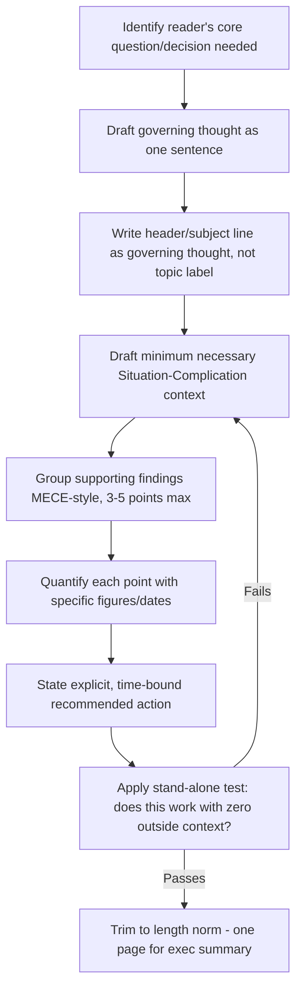
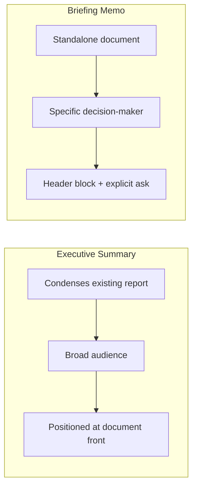

## Writing Executive Summaries and Briefing Memos

### Overview

Executive summaries and briefing memos are the most time-pressured genre of business writing: documents explicitly designed to be read by decision-makers with limited time, often as a substitute for reading the full underlying report. Both genres apply the Pyramid Principle and BLUF at maximum intensity, but each has distinct structural conventions, length norms, and purposes. An executive summary condenses a longer document for readers who may never see the original; a briefing memo is often a freestanding document prepared specifically to inform or drive a decision, with no larger report behind it.

---

### Executive Summary: Purpose and Constraints

**Definition**: A standalone condensation of a longer report, positioned at the front of the document, written so that a reader who reads *only* the summary understands the core findings, conclusion, and recommended action.

**Key constraint — the "stand-alone test"**: an executive summary must be fully comprehensible without reference to the body report. It is not a preview or teaser; it is a complete, self-sufficient answer to the reader's question.

**Length norms**: Typically 5–10% of the full document length, often capped at one page regardless of underlying report length — the "one-page rule" is a common convention in corporate and consulting settings. [Inference] The one-page convention is broadly documented across business writing guides, though exact norms vary by organization and document type.

---

### Executive Summary: Standard Structure

1. **Governing thought / recommendation** — the single most important conclusion, stated first (per Pyramid Principle)
2. **Brief context** — minimum necessary background (Situation) so the recommendation is comprehensible
3. **Key supporting findings** — 3–5 MECE-grouped points, each with the strongest available evidence
4. **Financial/risk implications** — quantified impact where available
5. **Recommended next steps** — specific, actionable, time-bound

**Example — condensed executive summary**

> We recommend consolidating our three regional data centers into a single facility by Q3, reducing annual operating costs by an estimated $2.4M.
>
> Our current three-facility model duplicates infrastructure and staffing without corresponding performance benefit. Consolidation analysis shows: (1) combined capacity needs can be met by our largest facility alone, (2) migration risk is manageable within a 90-day window, (3) staff redundancies can be addressed through planned attrition rather than layoffs.
>
> We recommend approving a Q1 migration plan, with board review of progress at the Q2 meeting.

Note the escaped dollar sign (`\$2.4M`) to prevent unintended LaTeX math-mode triggering in Markdown/MathJax environments.

---

### Briefing Memo: Purpose and Constraints

**Definition**: A freestanding document prepared to inform a specific decision or bring a reader up to speed on a situation, typically addressed to a specific decision-maker or small group, often with an explicit ask embedded.

**Distinguishing features from executive summaries**:

| Dimension | Executive Summary | Briefing Memo |
| --- | --- | --- |
| Relationship to larger document | Condenses an existing report | Often the primary/only document |
| Typical audience | Broad (board, investors, general leadership) | Specific decision-maker(s) |
| Primary purpose | Inform + summarize | Inform + often request a specific decision or action |
| Format header conventions | Usually untitled, positioned at report's front | Formal header block (To/From/Date/Re) |

---

### Briefing Memo: Standard Structure

1. **Header block**: To, From, Date, Re (subject line stated as a governing thought, not a topic)
2. **Purpose statement**: one sentence stating why this memo exists and what decision or action it supports
3. **Background**: minimum necessary context (Situation-Complication)
4. **Analysis**: MECE-grouped key considerations
5. **Recommendation**: explicit, specific ask
6. **Next steps/timeline**: what happens after the reader acts on this memo

**Example — header and purpose**

```plaintext
TO: VP of Operations
FROM: Regional Planning Team
DATE: September 12, 2026
RE: Recommendation to close the Denver distribution center by Q1

PURPOSE: This memo requests approval to close the Denver facility, 
consolidating operations into the Phoenix hub, based on the cost 
and efficiency analysis below.
```

---

### Shared Technique: The Subject Line / Header as Governing Thought

Both genres should avoid generic topic labels in titles and subject lines, applying the Pyramid Principle's "headline as conclusion" convention even at the document title level.

| Weak (topic label) | Strong (governing thought) |
| --- | --- |
| "Q3 Sales Report" | "Q3 sales grew 12%, exceeding target by $400K" |
| "Data Center Review" | "Recommendation: Consolidate three data centers into one by Q3" |
| "Denver Office Update" | "Recommendation: Close Denver office by Q1 to reduce costs $1.2M annually" |

---

### Shared Technique: Quantification and Specificity

Executive audiences require decision-grade specificity — vague magnitude language ("significant," "substantial") forces the reader to request clarification, delaying decisions.

**Example**

- Weak: "The proposed change would result in significant cost savings."
- Strong: "The proposed change would reduce annual operating costs by $2.4M (18% of current spend)."

---

### Shared Technique: Explicit, Actionable Asks

A common failure in both genres is ending with a vague call to action ("let us know your thoughts") rather than a specific, time-bound request.

**Example**

- Weak: "Please review and share any feedback."
- Strong: "Please approve the Q1 migration budget by September 30 so implementation can begin on schedule."

---

### Common Failure Patterns

| Failure Pattern | Consequence | Correction |
| --- | --- | --- |
| Summary fails stand-alone test | Reader must consult full report to understand summary | Add minimum necessary context inline |
| Generic subject line/title | Reader cannot triage or prioritize without opening the document | Rewrite as a governing-thought headline |
| Buried recommendation | Reader must read to the end to find the ask | Move recommendation to the first sentence/paragraph (BLUF) |
| Vague quantification | Reader cannot assess materiality of the claim | Add specific figures, percentages, and dates |
| No explicit next step | Recipient unsure what action is expected of them | State a specific, time-bound ask |
| Non-MECE analysis section | Overlapping or gapped reasoning weakens the recommendation's credibility | Apply MECE grouping (see Pyramid Principle) |

---

### Drafting Workflow



---

### Genre Comparison Diagram



---

### Executive Communication Application

- **Board packages**: executive summaries are frequently the only section board members read in full before a meeting; the stand-alone test is critical here
- **Decision requests to leadership**: briefing memos with explicit, time-bound asks measurably speed decision turnaround compared to open-ended "thoughts?" requests
- **Cross-functional alignment**: MECE-grouped analysis sections reduce follow-up clarification cycles by preemptively addressing likely objections
- **Crisis and time-sensitive decisions**: briefing memo structure (purpose statement first, explicit ask) is standard for rapid escalation documents
- Effectiveness depends on accurate reader-question identification and disciplined adherence to length and specificity norms; outcomes may vary by organizational culture and document context.

---

**Related Topics**

- The Pyramid Principle and MECE grouping as the underlying structural logic
- BLUF as the sentence-level implementation of these document-level conventions
- Board memo writing and governance communication norms
- Quantitative storytelling and data specificity in business writing
- Email and memo etiquette for time-sensitive executive requests
- One-page rule and length discipline in corporate documentation standards