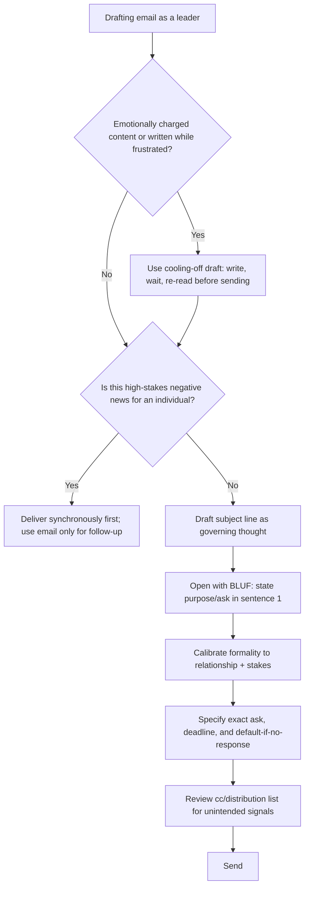

## Email Etiquette and Tone for Leaders

### Overview

Executive email carries disproportionate weight relative to its length: a leader's emails are read closely for tone, scrutinized for hidden meaning, forwarded without context, and often archived as a record of decisions or attitudes. This chapter covers the structural and tonal conventions that distinguish effective executive email from either overly casual or needlessly cold correspondence, with particular attention to how word choice, formatting, and response timing function as leadership signals independent of the literal content.

---

### Core Principle: Email as a Leadership Signal, Not Just a Message

Every email from a leader is read on two simultaneous channels: the **literal content** (what is being communicated) and the **relational signal** (what this communication implies about the sender's respect, urgency assessment, and state of mind toward the recipient). Leaders' emails are disproportionately scrutinized because recipients often lack other channels to assess the leader's current disposition toward them.

**Practical implication**: brevity that reads as efficient from a peer can read as dismissive or angry from a leader. Tone calibration matters more, not less, as organizational position rises.

---

### Core Principle: Subject Lines as Governing Thoughts

Following the same logic as the Pyramid Principle applied to memos, subject lines should state the core point or ask, not a generic topic label — this allows recipients to triage without opening the email.

| Weak Subject Line | Strong Subject Line |
| --- | --- |
| "Meeting" | "Reschedule request: Tuesday 1:1 → Thursday 2pm" |
| "Question" | "Need budget approval by Friday for Q4 hire" |
| "Update" | "Launch delayed to Oct 15 — no action needed" |

---

### Core Principle: BLUF in Email Body

The first sentence should state the purpose or ask, not build up to it — recipients frequently read only the first two lines on mobile devices or in preview panes.

**Example**

- Weak: "Hope you're doing well. I wanted to reach out because I've been thinking about our Q4 planning and there are a few things..."
- Strong: "I need your decision on the Q4 hiring freeze by Wednesday. Context below."

---

### Core Principle: Calibrated Formality by Relationship and Stakes

Formality should scale with three factors: hierarchical distance, stakes of the content, and existing relationship familiarity — not default to either extreme.

| Context | Formality Level | Example Opening |
| --- | --- | --- |
| Close direct report, routine matter | Low | "Hey — can you send the deck by EOD?" |
| Cross-functional peer, first contact | Medium | "Hi [Name], I'm reaching out regarding..." |
| External stakeholder or board member | High | "Dear [Name], I am writing to update you on..." |
| High-stakes internal (layoffs, crisis) | High, regardless of relationship | Formal, precise, no casual openers |

**Common error**: defaulting to uniformly high formality with all direct reports, which can read as cold or distancing over time; or defaulting to uniform casualness with external/high-stakes contexts, which can read as insufficiently serious.

---

### Core Principle: Tone Signals Independent of Content

Certain formatting and word-choice patterns carry strong tonal signals regardless of literal content, and leaders should be deliberate about them:

- **All caps**: reads as shouting/anger, virtually without exception in professional contexts
- **Excessive exclamation points**: can read as performative enthusiasm or, in leadership contexts, forced positivity that undermines credibility
- **One-word or terse replies** ("Ok." / "Noted.") from a leader to a substantive message can read as dismissive or displeased, even when intended as simple efficiency
- **Delayed response to a direct question**: can be read as avoidance or lower priority assigned to the sender, regardless of actual cause (may simply be a busy day)
- **CC/BCC choices**: cc'ing a recipient's manager on a routine email can read as an implicit escalation or reprimand, even if unintended

[Inference] These tone-signal patterns are widely discussed in professional communication and management literature; specific reader interpretation varies by organizational culture and individual relationship.

---

### Core Principle: Managing Emotional Content — The Cooling-Off Draft

For emails written in frustration, anger, or under significant stress, standard executive communication guidance recommends drafting the email, then **waiting before sending** — often stored as a draft or sent to oneself first — to allow a re-read with reduced emotional activation before it reaches the recipient.

**Practical technique**: leave the "To" field empty until the final re-read is complete, preventing accidental premature sending.

---

### Core Principle: Precision in Requests and Deadlines

Vague requests generate clarifying-question cycles that slow decisions. Leadership email should specify:

- **What** exactly is being requested
- **By when** (specific date/time, not "soon" or "ASAP")
- **What happens if no response** (default action, escalation path, or explicit "no action needed")

**Example**

- Weak: "Let me know your thoughts when you get a chance."
- Strong: "Please reply with approve/reject by Thursday 5pm. If I don't hear back, I'll proceed with the default plan."

---

### Core Principle: Difficult News Delivered by Email — When and When Not

Email is generally considered an inappropriate primary channel for high-emotional-stakes news (terminations, serious performance concerns, conflict resolution), which are better delivered synchronously (in person or by call) with email used only for follow-up documentation.

**Appropriate email use for difficult topics**: confirming details after a synchronous conversation has already occurred, or communicating decisions to broader groups after individual stakeholders have been informed directly.

**Inappropriate use**: delivering a termination, a significant reprimand, or a major unexpected negative decision to an individual via email as the first channel of communication.

---

### Core Principle: Reply-All and Distribution Discipline

Leaders' distribution choices are read as signals about who "needs to know," and errors here have outsized effects:

- Reply-all to a broad distribution list should be reserved for content genuinely relevant to the entire list
- Removing recipients from a thread (rather than reply-all) can appear to exclude or sideline them if not explained
- CC'ing senior leadership on a routine operational email can be read as either transparency or an implicit signal of concern, depending on context and framing

---

### Common Failure Patterns

| Failure Pattern | Consequence | Correction |
| --- | --- | --- |
| Terse reply misread as anger | Recipient assumes displeasure, may become anxious or defensive | Add brief warmth marker even in short replies ("Thanks — approved.") |
| Vague deadline ("soon") | Recipient deprioritizes or over-asks for clarification | Specify exact date/time |
| High-stakes news sent by email first | Recipient blindsided, relationship damage | Deliver synchronously first; email for follow-up only |
| Angry email sent immediately | Irreversible relational damage, no correction possible | Use cooling-off draft technique |
| Generic subject line | Recipient cannot triage, may deprioritize urgent content | Rewrite as governing-thought subject line |
| Unexplained cc change | Recipient feels excluded or surveilled | Explain distribution changes explicitly when non-obvious |

---

### Tone Calibration Decision Flow

---

### Executive Communication Application

- **Direct report management**: tone calibration in routine emails shapes day-to-day relationship quality more than any single formal review conversation
- **Cross-functional requests**: precision in asks and deadlines directly correlates with response speed and reduces clarification back-and-forth
- **Crisis and sensitive personnel matters**: the synchronous-first principle is critical to avoid reputational and legal risk from delivering serious news via an impersonal channel
- **Board and external stakeholder correspondence**: formality calibration and subject-line precision are closely scrutinized as signals of executive polish
- Effectiveness of any given tone or formality choice depends on organizational culture, existing relationship, and individual recipient interpretation, and outcomes may vary.

---

**Related Topics**

- BLUF and Pyramid Principle as shared structural foundations across memos and email
- Difficult conversations: synchronous delivery of negative news
- Crisis communication channel selection (email vs. call vs. in-person)
- Nonverbal-equivalent signals in written communication (formatting, response timing)
- Distribution list management and organizational transparency norms
- Emotional regulation techniques for high-stakes professional writing