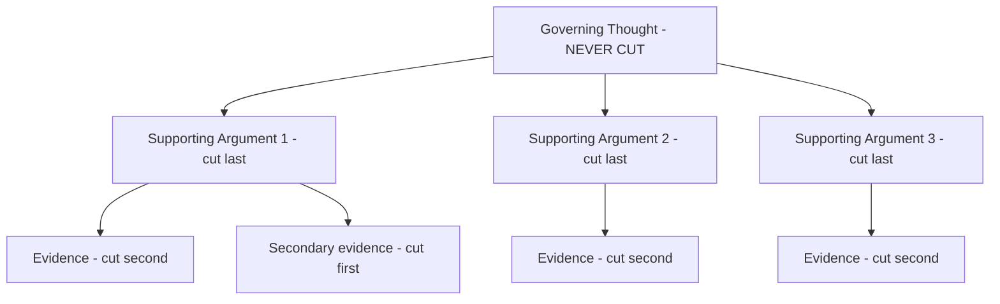
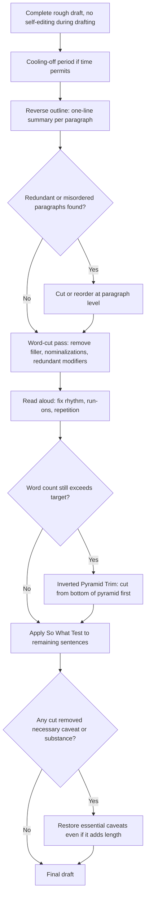

## Editing Ruthlessly for Impact and Brevity

### Overview

Editing for impact and brevity is the systematic post-drafting process of removing everything from a piece of writing that does not directly serve the reader's understanding or the writer's core objective. Unlike drafting, which is generative, editing is subtractive and evaluative — it requires treating the first draft as raw material to be cut, reordered, and compressed rather than as a finished product to be lightly polished. This is a distinct skill from the compositional principles covered elsewhere (BLUF, Pyramid Principle, MECE structuring); those govern how content is organized, while ruthless editing governs how much of it survives and in what exact words.

---

### Core Principle: Draft Generously, Edit Ruthlessly

Effective writers separate the drafting mindset (generate freely, don't self-censor) from the editing mindset (evaluate critically, cut without sentiment). Attempting both simultaneously — self-editing every sentence as it's written — slows drafting and often produces overly cautious, hedge-heavy prose. The recommended sequence is: draft complete and rough, then edit as a separate subsequent pass with a different cognitive mode.

---

### Core Technique: The Word-Cut Pass

A dedicated editing pass focused exclusively on removing words that add no information, organized by category of common offenders:

| Category | Example (before) | Edited (after) |
| --- | --- | --- |
| Filler openers | "It is important to note that costs rose." | "Costs rose." |
| Redundant modifiers | "Completely eliminate," "totally unique" | "Eliminate," "unique" |
| Throat-clearing | "I just wanted to reach out to let you know that..." | "..." (delete entirely) |
| Nominalizations | "We conducted an evaluation of the proposal." | "We evaluated the proposal." |
| Wordy connectors | "Due to the fact that," "in the event that" | "Because," "if" |
| Unnecessary intensifiers | "Very significant," "extremely important" | "Significant," "critical" |

**Target discipline**: a common benchmark in professional editing practice is a **10–20% word-count reduction** on a second pass without loss of meaning — if a draft cannot be cut by at least this much, it likely was not drafted freely enough in the first place. [Inference] This specific percentage range is a commonly cited editing heuristic in business and journalistic writing training, though it is not a universal or precisely benchmarked standard.

---

### Core Technique: The "So What?" Test

For every sentence or paragraph, ask explicitly: does removing this change what the reader understands or can act on? If not, it is a candidate for deletion regardless of how well-written it is in isolation.

**Application**: this test is particularly effective against well-written but non-essential content — elegant sentences that nonetheless do not serve the reader's core question survive many editing passes precisely because they read well, not because they're needed.

---

### Core Technique: Reverse Outlining

After drafting, extract a one-line summary of each paragraph's actual function (not intended function) into a separate outline. This reveals:

- **Redundant paragraphs**: multiple paragraphs performing the same function
- **Missing logical steps**: gaps in the argument only visible once reduced to bare structure
- **Misordered content**: paragraphs whose one-line summaries reveal they belong elsewhere for better MECE grouping or Pyramid structure

**Example reverse outline**:

```plaintext
Para 1: States the recommendation (governing thought)
Para 2: Provides market context
Para 3: Restates market context with different examples [REDUNDANT WITH PARA 2]
Para 4: Gives financial projection
Para 5: States the recommendation again, less clearly [REDUNDANT WITH PARA 1]
```

---

### Core Technique: Cutting at the Sentence Level — Verb Strength

Replacing weak verb + noun combinations (nominalizations) with a single strong verb is one of the highest-yield edits for both brevity and impact, since it compresses word count while increasing directness.

**Example**

- Weak: "The team will make a decision about the timeline next week."
- Strong: "The team will decide the timeline next week."

| Weak Construction | Strong Verb |
| --- | --- |
| "conduct an analysis of" | "analyze" |
| "make an assessment of" | "assess" |
| "provide assistance to" | "assist" |
| "come to the conclusion that" | "conclude" |
| "give consideration to" | "consider" |

---

### Core Technique: Cutting at the Paragraph Level — The Inverted Pyramid Trim

When a document is still too long after sentence-level cuts, apply Pyramid Principle logic in reverse: identify which supporting arguments and evidence are least essential to the governing thought, and cut from the bottom of the pyramid first (specific evidence, secondary examples) before ever touching the governing thought or top-level supporting arguments.



---

### Core Technique: Reading Aloud for Rhythm and Redundancy

Reading a draft aloud surfaces problems that silent reading misses: run-on sentences that are grammatically valid but exhausting to speak, unintentional repetition of words or phrases in close proximity, and awkward rhythm that signals overly complex sentence structure.

---

### Core Technique: The Cooling-Off Period

Where time permits, a delay between drafting and editing (even a few hours, ideally overnight) allows the writer to return with reduced attachment to specific phrasings, making cuts easier to identify and execute without the sentimentality that attaches to text immediately after writing it.

---

### Distinguishing Ruthless Editing From Under-Editing and Over-Editing

| Failure Mode | Symptom | Correction |
| --- | --- | --- |
| Under-editing | Draft published essentially as first-written; filler, redundancy, and buried points remain | Apply dedicated word-cut and reverse-outline passes before finalizing |
| Over-editing (hedging into blandness) | All personality, specificity, and voice edited out in pursuit of "safety" | Distinguish cutting filler from cutting substance; keep concrete detail and calibrated confidence |
| Cutting substance instead of filler | Important nuance or necessary caveat removed for brevity, creating misleading oversimplification | Apply the "so what" test to information, not just wording — essential caveats pass the test |

**Critical distinction**: ruthless editing targets **words that carry no information**, not information itself. A common editing error is conflating "shorter" with "better" and cutting necessary qualifications, evidence, or context in pursuit of a word-count target, which can create false confidence or misleading oversimplification — particularly dangerous in board memos, risk disclosures, or technical reports where a cut caveat has downstream consequences.

---

### Editing Workflow



---

### Common Failure Patterns

| Failure Pattern | Consequence | Correction |
| --- | --- | --- |
| Editing while drafting | Slows drafting, produces overly cautious prose | Separate drafting and editing into distinct passes |
| No word-count reduction target | Draft ships with filler intact | Apply explicit word-cut pass with a reduction benchmark |
| Cutting caveats for brevity | Misleading oversimplification, downstream risk | Apply "so what" test to substance, not just wording |
| No reverse outline | Redundant paragraphs and structural gaps go unnoticed | Extract one-line paragraph summaries before finalizing |
| Skipping read-aloud pass | Awkward rhythm and unintentional repetition ship uncaught | Read the final draft aloud before submission |

---

### Executive Communication Application

- **Board memos and executive summaries**: ruthless editing is what makes strict length norms (e.g., the one-page rule) achievable without losing the governing thought or essential evidence
- **Press statements and public communications**: word-cut discipline reduces the risk of ambiguous or over-qualified language being misquoted or misread
- **Internal status updates**: reverse outlining prevents redundant restatement of the same point across multiple paragraphs, a common failure in routine reporting
- **High-stakes technical or risk disclosures**: the distinction between cutting filler and cutting substance is critical — over-editing here can create legal or safety exposure by removing necessary caveats
- Editing effectiveness depends on writer discipline, available revision time, and correctly distinguishing filler from substantive caveats; outcomes may vary by document type and stakes.

---

**Related Topics**

- The Pyramid Principle as the structural logic guiding what to cut first
- BLUF and concise business writing principles as the target state of an edited document
- Reverse outlining as a diagnostic tool for structural problems
- Calibrated hedging and the risk of over-editing away necessary uncertainty
- Read-aloud editing technique and prose rhythm
- One-page rule and length discipline in executive documents