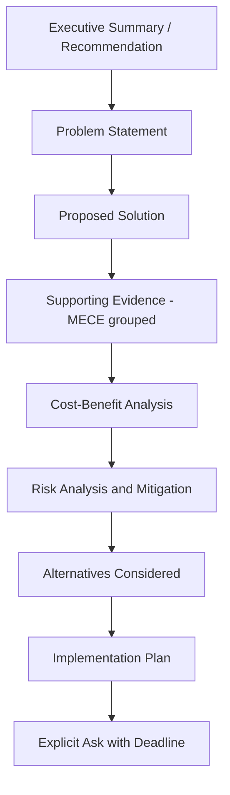
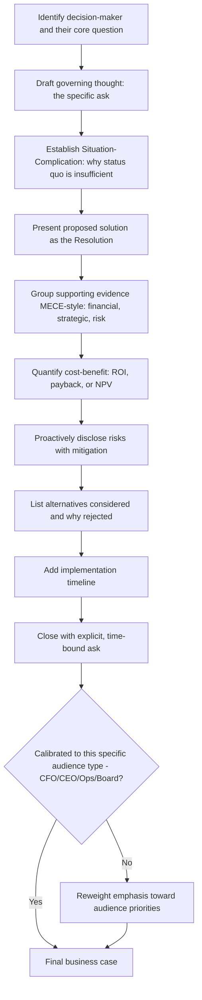

## Structuring a Persuasive Business Case

### Overview

A persuasive business case is a structured argument designed to secure a specific decision — budget approval, project sign-off, strategic pivot, resource allocation — from a decision-maker or committee. Unlike a purely informational report, a business case is explicitly rhetorical: it must not only convey information but move a specific audience from a current position (neutral, skeptical, or unaware) to an intended position (approval). This chapter integrates classical rhetorical appeals (ethos, pathos, logos) with structured business frameworks (Pyramid Principle, MECE) into a purpose-built persuasive architecture.

---

### Core Principle: The Business Case Answers "Why Should I Say Yes?"

Every structural decision in a business case should be filtered through the decision-maker's implicit question, which is rarely just "is this a good idea?" but more precisely: "why should I commit resources/reputation/political capital to this, over the alternative of doing nothing or doing something else?" This reframes the entire document around persuasion of a specific, self-interested decision-maker rather than neutral information transfer.

---

### Standard Structure

1. **Executive summary / recommendation (governing thought)** — the ask, stated first, per Pyramid Principle
2. **Problem statement / opportunity** — why the status quo is insufficient (the Complication)
3. **Proposed solution** — what is being recommended
4. **Supporting evidence** — MECE-grouped rationale (financial, strategic, risk-mitigation)
5. **Cost-benefit / financial analysis** — quantified return, payback period, or risk-adjusted value
6. **Risk analysis and mitigation** — address likely objections proactively
7. **Alternatives considered** — demonstrates rigor and preempts "did you consider X?" objections
8. **Implementation plan / timeline** — makes the recommendation feel executable, not theoretical
9. **Explicit ask** — the specific decision, resource, or approval requested, with a deadline

---

### Core Technique: Establishing the Problem Before the Solution

A business case that opens with the solution before establishing why the status quo is inadequate risks the decision-maker mentally objecting "why do we need this at all?" before the rationale is presented. The Complication (per Situation-Complication-Resolution) must create genuine urgency or dissatisfaction with the current state before the Resolution (recommendation) is introduced as the answer.

**Example**

> Situation: "Our current onboarding process takes 6 weeks."
>
> Complication: "New-hire attrition in the first 90 days has risen 22% year-over-year, and exit interviews cite onboarding confusion as the top cause."
>
> Resolution (business case ask): "We recommend investing $150K in a redesigned onboarding platform, reducing time-to-productivity and projected first-year attrition by an estimated 8 percentage points."

---

### Core Technique: Quantified Cost-Benefit Framing

Persuasive business cases rely on financial specificity to convert an abstract benefit into decision-grade material. Common quantification frameworks:

- **ROI (Return on Investment)**: (Gain − Cost) / Cost, expressed as a percentage
- **Payback period**: time required for cumulative benefit to equal initial cost
- **NPV (Net Present Value)**: discounted future cash flows minus initial investment, accounting for time value of money
- **Opportunity cost framing**: explicit comparison to the cost of inaction or of the next-best alternative

**Example**

> "The $150K onboarding investment pays back in 14 months based on reduced attrition-related rehiring costs (estimated at $210K annually), yielding a first-year ROI of approximately 40%."

---

### Core Technique: Proactive Risk Disclosure

Business cases that omit risks or downsides can appear either naive or evasive to a sophisticated decision-maker, and unaddressed risks become ready-made objections that stall approval. Addressing risk proactively — before the reader raises it — is both an ethos-building move (signals rigor and honesty) and a logos-strengthening move (preempts the strongest counterargument).

**Structure for risk sections**:

| Risk | Likelihood | Impact | Mitigation |
| --- | --- | --- | --- |
| Vendor implementation delay | Medium | Schedule slip of 4–6 weeks | Contractual milestone penalties; phased rollout |
| Adoption resistance from managers | Medium | Reduced effectiveness of new process | Change management plan, manager training sessions |
| Cost overrun beyond estimate | Low | Budget variance up to 15% | Fixed-price vendor contract; contingency reserve |

---

### Core Technique: Alternatives Considered (Preempting "Did You Think of X?")

Explicitly listing rejected alternatives, with brief reasons for rejection, demonstrates analytical rigor and preempts the common decision-maker objection of proposing an alternative the case's author had already considered and ruled out.

**Example**

> **Alternative 1 — Do nothing**: Rejected due to continued attrition costs exceeding the proposed investment within 18 months.
>
> **Alternative 2 — Partial process fix (no new platform)**: Rejected; pilot testing showed insufficient impact on time-to-productivity.
>
> **Alternative 3 — Build in-house rather than buy**: Rejected due to 18-month development timeline vs. 3-month vendor implementation.

---

### Rhetorical Appeals in Business Case Structure

| Classical Appeal | Business Case Application |
| --- | --- |
| **Ethos** (credibility) | Citing rigorous analysis, proactive risk disclosure, alternatives considered, and credible data sources |
| **Logos** (logic/evidence) | MECE-grouped supporting arguments, quantified ROI/NPV, structured cost-benefit analysis |
| **Pathos** (emotional resonance) | Framing the problem in terms of stakes the decision-maker cares about — customer impact, competitive risk, team morale — used to create urgency, not to manipulate |

Effective business cases deploy all three appeals in combination; logos alone (pure data) without ethos (credibility signals) or pathos (stakes-framing) often fails to generate genuine urgency, even when the underlying numbers are sound.

---

### Core Technique: The Explicit, Time-Bound Ask

The business case must end with a specific, actionable request — not a vague invitation for feedback. This mirrors the same principle in briefing memos, but is especially critical here since the entire document exists to secure a specific decision.

**Example**

- Weak close: "We welcome your thoughts on this proposal."
- Strong close: "We request approval of the $150K budget by September 30 to begin implementation in Q4."

---

### Audience Calibration: Financial vs. Strategic vs. Operational Decision-Makers

Different decision-maker types weight different sections more heavily, and business case emphasis should shift accordingly:

| Audience Type | Emphasize |
| --- | --- |
| CFO / Finance committee | Cost-benefit analysis, ROI/NPV, risk of cost overrun |
| CEO / Strategy leadership | Strategic fit, competitive positioning, opportunity cost of inaction |
| Operational leadership | Implementation plan, timeline, resource and staffing impact |
| Board / Governance | Risk mitigation, alternatives considered, legal/compliance implications |

---

### Common Failure Patterns

| Failure Pattern | Consequence | Correction |
| --- | --- | --- |
| Solution presented before problem established | Reader questions necessity before rationale is given | Establish Complication/urgency before Resolution |
| No quantified financial case | Reader cannot assess materiality or compare to alternatives | Add ROI, payback period, or NPV framing |
| Risks omitted or minimized | Reader perceives naivety or evasiveness; risk becomes their objection | Proactively disclose risks with mitigation plans |
| No alternatives considered | Reader proposes an alternative already ruled out, stalling the decision | Include a brief alternatives-considered section |
| Vague or missing ask | Reader unsure what specific action or approval is being requested | State exact ask with a deadline |
| Pure logos with no stakes framing | Sound numbers fail to generate urgency | Add pathos-based stakes framing (customer/competitive/team impact) |

---

### Persuasive Business Case Drafting Workflow

---

### Executive Communication Application

- **Capital allocation requests**: quantified ROI/NPV framing combined with proactive risk disclosure is standard practice for securing CFO and finance committee approval
- **Strategic pivots**: pathos-based stakes framing (competitive risk, market timing) is often necessary to generate urgency alongside logos-based financial justification
- **Cross-functional project approval**: the alternatives-considered section is particularly important when multiple stakeholders may have preferred a different approach
- **Board-level proposals**: risk analysis and governance implications typically receive the heaviest emphasis and scrutiny
- Effectiveness of any given business case depends on accurate audience calibration, credible quantification, and genuine (not manufactured) rigor in the alternatives and risk sections; outcomes may vary by organizational context and decision-maker priorities.

---

**Related Topics**

- The Pyramid Principle and MECE grouping as the structural backbone of the business case
- Classical rhetorical appeals (ethos, pathos, logos) applied to business persuasion
- ROI, NPV, and payback period as quantification frameworks
- Risk disclosure and objection-preemption techniques
- Briefing memos and explicit, time-bound asks
- Audience analysis and stakeholder-specific message calibration