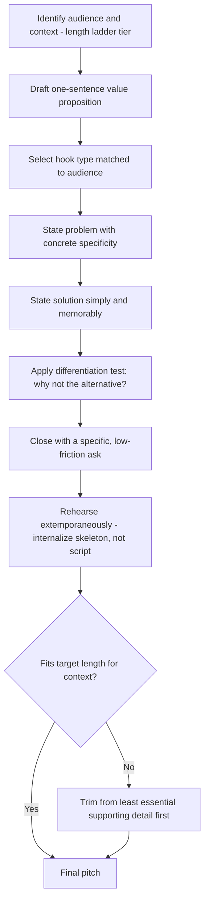

## Writing Compelling Pitches and Elevator Summaries

### Overview

A pitch or elevator summary is the maximally compressed form of persuasive communication: a spoken or written argument designed to be delivered and understood within a severely constrained time window (typically 30 seconds to 2 minutes), aimed at generating interest, securing a follow-up conversation, or prompting an immediate decision. Unlike the full business case (which assumes a captive, attentive reader), the pitch must earn continued attention with every sentence — losing the listener at any point ends the opportunity. This makes pitch-writing the most rhetorically dense genre in executive communication: every word must simultaneously inform, persuade, and sustain interest.

---

### Core Principle: The Attention Economy of the Pitch

A pitch operates under the assumption that the listener's attention is not guaranteed and can be lost at any sentence. This differs fundamentally from a written business case, where a reader has already committed to reading the document. Consequently, pitch structure must front-load the most compelling element rather than building toward it, and every subsequent sentence must actively earn the right to the next one.

---

### Core Structure: The Hook-Problem-Solution-Ask Arc

1. **Hook** — an opening line designed to immediately capture attention (a striking fact, a provocative question, a relatable pain point)
2. **Problem** — the pain point or gap, stated with enough specificity to feel real and urgent
3. **Solution** — what is being proposed, stated simply and memorably
4. **Differentiation** — why this solution, specifically, rather than an obvious alternative
5. **Ask** — the specific next step requested (meeting, investment, approval, introduction)

**Example — 30-second elevator pitch**

> "Every year, small clinics lose an estimated $50,000 in missed appointments — mostly because reminder systems are clunky and easy to ignore. [Hook/Problem] We built a scheduling tool that uses two-way text reminders patients actually respond to. [Solution] Unlike generic reminder apps, ours integrates directly with existing clinic software, so there's no workflow change required. [Differentiation] I'd love 20 minutes to show you a demo — are you free this week? [Ask]"

---

### Core Technique: The Hook Taxonomy

Different hook types suit different contexts and audiences:

| Hook Type | Mechanism | Example |
| --- | --- | --- |
| Startling statistic | Numeric surprise creates immediate interest | "73% of new hires consider quitting within their first month." |
| Provocative question | Forces the listener to mentally engage before you continue | "What if your best customers were the ones most likely to leave?" |
| Relatable pain point | Listener recognizes their own experience | "You've probably sat through a meeting that could've been an email." |
| Vivid story opening | Narrative specificity creates emotional entry point | "Last month, a client lost a $2M deal over a single missed follow-up." |
| Direct claim | States the core value proposition immediately, no buildup | "We can cut your onboarding time in half." |

Hook selection should match audience sophistication and context — a data-driven investor audience often responds well to a startling statistic, while a general audience may respond better to a relatable pain point or story.

---

### Core Technique: The One-Sentence Value Proposition

A compressed formula for stating what the pitch is about in a single, memorable sentence, commonly taught in startup and product pitch contexts:

> "We help [specific audience] [achieve specific outcome] by [core mechanism], unlike [main alternative], which [key limitation]."

**Example**

> "We help small clinics reduce missed appointments by sending two-way text reminders patients actually respond to, unlike generic reminder apps, which patients often ignore or disable."

[Inference] This specific value-proposition formula (sometimes attributed to lean-startup and product-marketing methodology) is widely taught across pitch and marketing training resources, though exact wording and attribution vary by source.

---

### Core Technique: Concrete Specificity Over Abstract Claims

Pitches fail when they rely on vague superlatives ("innovative," "game-changing," "best-in-class") that carry no differentiating information. Specific, concrete claims are both more credible and more memorable.

**Example**

- Weak: "Our platform is an innovative, best-in-class solution for team collaboration."
- Strong: "Our platform cuts average meeting time by 30% by replacing status-update meetings with async video updates."

---

### Core Technique: The Differentiation Test

Every pitch should be able to answer, in one sentence, "why not the obvious alternative?" — including the alternative of doing nothing. If this question cannot be answered concisely, the pitch likely lacks a genuine competitive or logical edge, regardless of how well the rest is written.

**Common alternatives to address**:

- The status quo (why not keep doing what we're doing now?)
- The most obvious competitor or existing solution
- A cheaper or simpler version of the same idea
- Doing nothing / waiting

---

### Core Technique: Calibrating Length to Context — The Pitch Length Ladder

| Format | Typical Length | Context |
| --- | --- | --- |
| One-liner / tagline | 1 sentence | Networking introductions, business cards |
| Elevator pitch | 30–60 seconds | Chance encounters, brief introductions |
| Extended pitch | 2–3 minutes | Scheduled short meetings, pitch competitions |
| Full pitch deck narrative | 5–15 minutes | Investor meetings, formal proposals |

A well-constructed pitch should be modular — the one-liner should be extractable from the elevator pitch, which should be extractable from the extended pitch, maintaining the same core hook-problem-solution-ask logic at every length (a direct application of the Pyramid Principle's "governing thought survives at every level" logic).

---

### Core Technique: Rehearsal for Naturalness (Extemporaneous, Not Memorized)

Pitches are most effective delivered extemporaneously (per the delivery-method taxonomy) — rehearsed thoroughly enough that the structure and key phrases are internalized, but not memorized word-for-word, since a memorized pitch that hits an interruption or unexpected question can derail entirely. Rehearsal should focus on internalizing the hook-problem-solution-ask arc as a flexible skeleton rather than a fixed script.

---

### Common Failure Patterns

| Failure Pattern | Consequence | Correction |
| --- | --- | --- |
| Weak or generic hook | Listener disengages before the core message lands | Use a specific, concrete hook (statistic, story, provocative question) |
| Solution stated before problem | Listener doesn't understand why they should care | Establish the pain point/urgency first |
| Vague superlatives instead of specifics | Claims are forgettable and non-differentiating | Replace abstract claims with concrete, quantified statements |
| No clear differentiation from alternatives | Listener assumes an existing solution already covers this | Explicitly address "why not the obvious alternative?" |
| No explicit ask | Listener unsure what to do next, opportunity is lost | End with a specific, low-friction next step |
| Fully memorized, rigid delivery | Sounds recited; derails if interrupted | Rehearse extemporaneously with a flexible skeleton |
| Pitch too long for the context | Listener's attention lapses before the ask | Calibrate to the pitch length ladder for the specific context |

---

### Pitch Drafting Workflow

---

### Executive Communication Application

- **Investor pitches**: the hook-problem-solution-ask arc combined with quantified specificity is the industry-standard structure for fundraising pitches
- **Internal idea pitches**: framing a new initiative through the same arc (rather than a dry proposal memo) increases the likelihood of securing leadership buy-in quickly
- **Networking and introductions**: the one-liner and elevator-pitch tiers of the length ladder are essential for making efficient use of brief, high-value conversations
- **Sales conversations**: the differentiation test is particularly critical, since prospects almost always have an existing alternative (including inertia) to compare against
- Effectiveness depends on accurate audience calibration, genuine differentiation, and rehearsal quality; outcomes may vary by context, audience sophistication, and delivery skill.

---

**Related Topics**

- Extemporaneous delivery as the recommended delivery mode for pitches
- The Pyramid Principle's "governing thought survives at every level" logic applied to pitch length calibration
- Structuring a persuasive business case (the longer-form counterpart to the pitch)
- Classical rhetorical appeals (ethos, pathos, logos) in short-form persuasion
- Storytelling techniques and narrative hooks in business communication
- Objection handling and differentiation framing in sales and fundraising contexts