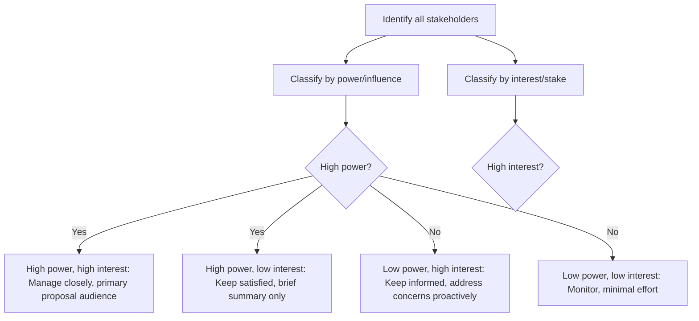
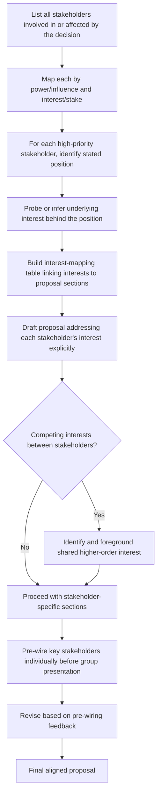

## Aligning Proposals With Stakeholder Interests

### Overview

Aligning a proposal with stakeholder interests is the analytical and rhetorical discipline of tailoring a persuasive document or pitch to the specific priorities, incentives, and concerns of each distinct decision-maker or influencer involved in approving it — recognizing that a single proposal rarely faces a single, homogeneous audience. Unlike general audience calibration (adjusting tone or technical depth), stakeholder alignment addresses the deeper problem that different stakeholders may have genuinely different, sometimes competing, criteria for what counts as a good decision, and a proposal that persuades one may fail with another unless each stakeholder's specific interest is explicitly addressed.

---

### Core Principle: Stakeholders Evaluate the Same Proposal Differently

The same proposal — say, a new software platform investment — will be evaluated through entirely different lenses depending on the stakeholder's role and incentives. A proposal optimized for only one lens (e.g., pure cost savings) may fail to persuade stakeholders who evaluate primarily on risk, strategic fit, or operational disruption, even if the underlying facts are identical.

**Example — same proposal, different stakeholder lenses**:

| Stakeholder | Primary Evaluation Lens | What They Need to See |
| --- | --- | --- |
| CFO | Cost, ROI, budget impact | Payback period, total cost of ownership |
| CTO/IT | Technical risk, integration complexity | Architecture fit, security posture, maintenance burden |
| Department heads (end users) | Workflow disruption, ease of adoption | Training requirements, transition timeline |
| Legal/Compliance | Regulatory and contractual risk | Data handling, liability, vendor contract terms |
| CEO/Board | Strategic fit, competitive positioning | Alignment with company strategy, opportunity cost |

---

### Core Technique: Stakeholder Mapping

Before drafting, identify all parties who will influence or make the decision, and classify each along two dimensions commonly used in stakeholder analysis:

- **Power/influence**: how much authority this stakeholder has over the final decision
- **Interest/stake**: how much this decision affects them personally or operationally

This is a standard power/interest grid used in stakeholder management methodology; it determines not just *what* to say to each stakeholder but *how much* effort the proposal should invest in persuading versus simply informing them. [Inference] The power/interest grid is a widely used framework in project and stakeholder management literature; the specific quadrant labels and recommended actions vary somewhat by source.

---

### Core Technique: Identifying Underlying Interests, Not Just Stated Positions

A frequently cited distinction from negotiation theory (notably the "principled negotiation" framework from *Getting to Yes*) applies directly to stakeholder-proposal alignment: stakeholders often state a **position** ("I want a cheaper vendor") that masks an underlying **interest** ("I'm worried about my budget being blamed if costs run over"). Addressing only the stated position can miss the actual concern driving resistance.

**Example**

> Stated position: "We should just keep the current system."
>
> Underlying interest (upon inquiry): concern about disruption to a process the stakeholder personally owns and would be blamed for if it breaks.
>
> Aligned proposal response: explicit transition plan with the stakeholder's team involved in testing before cutover, directly addressing the disruption/blame concern rather than re-arguing cost savings.

---

### Core Technique: The Interest-Mapping Table

A structured tool for translating stakeholder-specific interests into proposal content, ensuring each major stakeholder's concern is explicitly addressed somewhere in the document rather than assumed to be covered by general persuasive language.

| Stakeholder | Stated Position (if known) | Likely Underlying Interest | Proposal Section Addressing It |
| --- | --- | --- | --- |
| CFO | "Show me the ROI" | Budget accountability, cost predictability | Cost-benefit analysis, fixed-price contract terms |
| IT Director | "Will this integrate with our stack?" | Avoiding technical debt, reduced support burden | Technical architecture appendix |
| Sales VP | "Will this slow my team down?" | Protecting team productivity during transition | Phased rollout plan, minimal-disruption timeline |
| Legal | (often silent until late-stage review) | Liability and compliance exposure | Data handling and contract terms section |

---

### Core Technique: Preempting Stakeholder-Specific Objections

Because different stakeholders will raise different objections based on their distinct interests, a well-aligned proposal proactively addresses the most likely objection from each major stakeholder type before it is raised, rather than waiting for a Q&A session to surface it — reducing the risk that an unaddressed concern from one stakeholder stalls a proposal that has already won over others.

**Example — proactive stakeholder-specific objection handling**

> "For IT leadership, a common concern with new platform adoption is integration overhead. This solution uses standard REST APIs and has been validated against our existing authentication system in a two-week pilot, requiring no changes to current infrastructure."

---

### Core Technique: Sequencing Stakeholder Conversations (Pre-Wiring)

For high-stakes or politically sensitive proposals, it is common practice to have individual conversations with key stakeholders *before* a formal group presentation — sometimes called "pre-wiring" — to surface objections privately, adjust the proposal accordingly, and reduce the likelihood of a stakeholder raising a serious objection for the first time in a public, high-stakes setting where it is harder to resolve constructively.

**Benefits of pre-wiring**:

- Surfaces objections in a lower-stakes setting where they can be genuinely addressed
- Builds individual stakeholder buy-in before the group forum, increasing the likelihood of vocal support rather than silence or opposition in the room
- Allows the proposal to be revised based on legitimate concerns before it is finalized

[Inference] Pre-wiring is a widely documented practice in organizational and executive communication, though its formality and prevalence vary significantly by organizational culture.

---

### Core Technique: Coalition and Common-Ground Framing

When stakeholders have genuinely competing interests (e.g., cost-focused finance vs. speed-focused operations), an aligned proposal identifies and foregrounds the **shared higher-order interest** that both parties actually care about, rather than treating the proposal as a zero-sum negotiation between competing lenses.

**Example**

> Instead of separately arguing "this saves money" (to Finance) and "this doesn't slow us down" (to Operations) as competing claims, frame the shared interest: "This investment reduces cost per transaction while maintaining current processing speed — addressing both efficiency and reliability concerns simultaneously."

---

### Common Failure Patterns

| Failure Pattern | Consequence | Correction |
| --- | --- | --- |
| One-size-fits-all proposal | Persuades some stakeholders, alienates or fails to address others | Build a stakeholder interest-mapping table before drafting |
| Addressing stated positions only | Underlying concern remains unaddressed, resistance persists | Probe for underlying interests, not just surface objections |
| No stakeholder mapping performed | Key influential stakeholder is overlooked entirely | Conduct power/interest grid analysis before drafting |
| All objections handled reactively in Q&A | High-stakes public setting for surfacing serious concerns | Pre-wire key stakeholders individually beforehand |
| Treating competing interests as zero-sum | Proposal reads as favoring one faction over another | Frame shared higher-order interests where genuinely present |
| Ignoring low-power/high-interest stakeholders | Can generate ongoing resistance or sabotage post-approval | Keep informed and address concerns even without formal decision power |

---

### Stakeholder-Aligned Proposal Drafting Workflow

---

### Executive Communication Application

- **Cross-functional investment proposals**: interest-mapping tables prevent a proposal optimized for one function (e.g., finance) from stalling in another (e.g., legal or IT) due to unaddressed concerns
- **Organizational change initiatives**: pre-wiring is especially critical here, since public surfacing of resistance during a formal announcement can harden opposition
- **Board approvals with divided interests**: coalition framing around shared higher-order interests (e.g., long-term value vs. short-term risk) can bridge factions with different default priorities
- **Vendor and partnership proposals**: distinguishing stated positions from underlying interests often reveals that a "cost" objection is actually a risk or reputational concern in disguise
- Effectiveness depends on accurate stakeholder identification and genuine (not superficial) understanding of underlying interests; outcomes may vary by organizational politics and the accuracy of the stakeholder analysis performed.

---

**Related Topics**

- Structuring a persuasive business case as the document-level counterpart to this stakeholder-alignment layer
- Power/interest grid and stakeholder management frameworks in project management
- Principled negotiation theory (positions vs. interests) from *Getting to Yes*
- Pre-wiring and informal consensus-building before formal decision meetings
- Audience analysis and message calibration in executive communication
- Objection handling and proactive risk disclosure in proposals