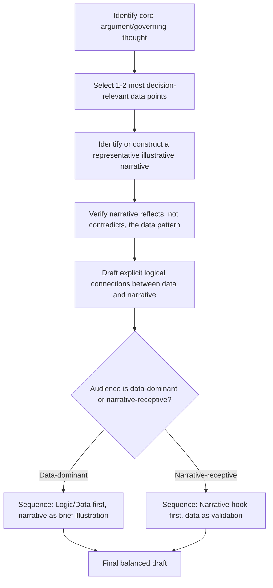

## Balancing Data, Logic, and Narrative in Writing

### Overview

Balancing data, logic, and narrative addresses a core tension in persuasive and executive writing: pure data and logic (statistics, structured argumentation, quantified analysis) establish credibility and rigor but often fail to generate emotional engagement or memorability on their own, while pure narrative (stories, anecdotes, vivid examples) engages and sticks in memory but can feel unsubstantiated or manipulative without quantitative grounding. Effective business writing deliberately interweaves both modes, using each to compensate for the other's weaknesses, rather than treating them as competing or mutually exclusive approaches.

---

### Core Principle: Data and Narrative Serve Different Cognitive Functions

Research on judgment and persuasion (broadly associated with dual-process theories of cognition) distinguishes between analytical processing (evaluating evidence, weighing probabilities, checking logical consistency) and narrative processing (following a story, empathizing with characters, drawing conclusions through pattern and emotional resonance). These are not competing modes to choose between but complementary channels that, used together, produce stronger persuasion and retention than either alone. [Inference] The dual-process framing draws on established cognitive and persuasion research; the precise mechanisms and relative weighting of analytical vs. narrative processing remain active areas of study rather than settled, precisely quantified findings.

---

### Core Technique: Data Establishes Credibility, Narrative Establishes Meaning

A common and effective pattern: use narrative to make an abstract problem feel concrete and urgent, then use data to establish that the narrative example is representative rather than a cherry-picked anecdote.

**Example — narrative-then-data sequencing**

> "Last quarter, one of our largest clients almost churned after a support ticket sat unanswered for nine days. [Narrative] This wasn't an isolated case — average first-response time across our support queue has grown from 4 hours to 31 hours over the past six months, and clients citing 'slow support' as a churn reason rose from 8% to 22% in the same period. [Data]"

The narrative creates emotional stakes and concreteness; the data confirms the narrative reflects a genuine pattern rather than a single unfortunate incident.

---

### Core Technique: The Anecdote-Verification Problem

A pure anecdote, however compelling, is vulnerable to a specific and common objection: "is this representative, or a single outlier?" Business writing that relies on narrative alone without any supporting data invites this objection and can undermine the writer's credibility if the anecdote turns out to be unrepresentative.

**Correction pattern**: always pair a vivid example with either (a) explicit framing that it is illustrative rather than definitive ("this is one example of a broader pattern"), or (b) actual supporting data confirming its representativeness.

---

### Core Technique: The Data-Without-Meaning Problem

Conversely, data presented without narrative or interpretive framing often fails to generate the intended urgency or understanding, because raw numbers do not inherently convey significance to a reader unfamiliar with the relevant baseline or context.

**Example**

- Data alone (fails to land): "Churn increased by 3.4 percentage points."
- Data with narrative/interpretive framing: "Churn increased by 3.4 percentage points — meaning roughly one in six customers we retained last year, we're now losing. For a business our size, that's the equivalent of losing our entire Southeast region's customer base in a single quarter."

The second version translates an abstract statistic into a concrete, comprehensible scale using narrative-style comparison, without sacrificing the underlying data.

---

### Core Technique: Logical Scaffolding as the Connective Tissue

Beyond data and narrative individually, the explicit logical connections between them — the "because," "therefore," and "which means" statements — determine whether a piece of writing reads as a coherent argument or a disconnected collection of facts and stories. This logical scaffolding should be made explicit rather than left for the reader to infer.

**Example**

- Weak (data and narrative present, but logic implicit): "Support response times have grown to 31 hours. One client nearly churned after a 9-day wait. We should hire two more support staff."
- Strong (explicit logical connection): "Support response times have grown to 31 hours, which is directly correlated with rising churn — as illustrated by [client]'s near-churn after a 9-day wait. Because response time is a leading indicator of churn risk, hiring two additional support staff should directly reduce both metrics."

---

### Core Technique: Sequencing Strategies

Different sequencing of data, logic, and narrative suit different rhetorical goals:

| Sequence | Effect | Best Suited For |
| --- | --- | --- |
| Narrative → Data → Logic | Hooks emotionally, then validates and explains | Persuading a skeptical or disengaged audience |
| Data → Logic → Narrative | Establishes rigor first, then humanizes the conclusion | Highly analytical audiences (finance, engineering) who want data-first framing |
| Logic → Data → Narrative | States the argument structure first, fills in evidence, closes with resonance | Formal reports and business cases following Pyramid Principle conventions |

The choice of sequence should be calibrated to the audience's default processing preference (see Audience Calibration below), not applied uniformly across all contexts.

---

### Core Technique: Avoiding Narrative Manipulation

A narrative-heavy approach carries an ethical risk distinct from a purely rhetorical one: vivid, emotionally resonant stories can be persuasive independent of whether they represent the underlying reality accurately (a pattern related to the availability heuristic in judgment research). Responsible business writing uses narrative to *illustrate* a data-supported pattern, not to substitute for or override data that would complicate the story being told.

**Warning sign**: if removing the data from a piece of writing would not change the strength of the argument at all, the narrative may be doing rhetorical work disproportionate to its actual evidentiary weight — a signal to add or reconsider the underlying data.

---

### Audience Calibration: Data-Dominant vs. Narrative-Receptive Audiences

| Audience Type | Typical Preference | Calibration |
| --- | --- | --- |
| Finance/analytical leadership | Data-first, skeptical of anecdote | Lead with data and logic; use narrative sparingly, as illustration only |
| General/mixed leadership audience | Responsive to both | Balanced narrative-data-logic weaving throughout |
| Broad internal communications | High narrative receptivity | Lead with story/example; support with data, avoid overloading with statistics |
| Technical/engineering audiences | Logic and mechanism-focused | Emphasize causal logic explicitly; data as primary support, narrative minimal |

---

### Common Failure Patterns

| Failure Pattern | Consequence | Correction |
| --- | --- | --- |
| Pure anecdote, no supporting data | Vulnerable to "is this representative?" objection | Pair narrative with data or explicit illustrative framing |
| Pure data, no interpretive framing | Reader fails to grasp significance or urgency | Add narrative-style comparison or concrete scale translation |
| Implicit logical connections | Reader must infer why data and narrative relate | Make "because/therefore" logic explicit |
| Narrative overriding contradicting data | Misleading persuasion; ethical risk | Ensure narrative illustrates, not substitutes for, the data pattern |
| Uniform sequencing regardless of audience | Data-first audiences disengage from narrative-first openings, and vice versa | Calibrate sequence to audience's analytical vs. narrative receptivity |
| Overloading with statistics | Numbing effect; individual data points lose salience | Select the 1–2 most decision-relevant figures rather than exhaustive data dumps |

---

### Integration Workflow

---

### Executive Communication Application

- **Business cases and proposals**: narrative establishes urgency (the Complication in Situation-Complication-Resolution structuring), while data validates the recommendation's soundness
- **Board and investor communications**: data-first sequencing with narrative used sparingly is typically preferred, given the analytical orientation of these audiences
- **Internal change communications and town halls**: narrative-first sequencing tends to generate greater engagement and buy-in than data-first delivery for broad, less technically specialized audiences
- **Crisis communication**: narrative empathy (acknowledging affected individuals) combined with data-grounded corrective action plans is standard practice for balancing credibility and human connection
- Effectiveness of any given balance depends on genuine representativeness of the narrative used and accurate calibration to the specific audience; outcomes may vary by context and audience composition.

---

**Related Topics**

- The Pyramid Principle and Situation-Complication-Resolution as structural frameworks for sequencing data and narrative
- Availability heuristic and narrative-driven judgment biases
- Structuring a persuasive business case as an applied context for this balance
- Audience calibration and stakeholder-specific message design
- Quantitative storytelling and data visualization in business writing
- Ethics of persuasion: narrative framing vs. manipulation