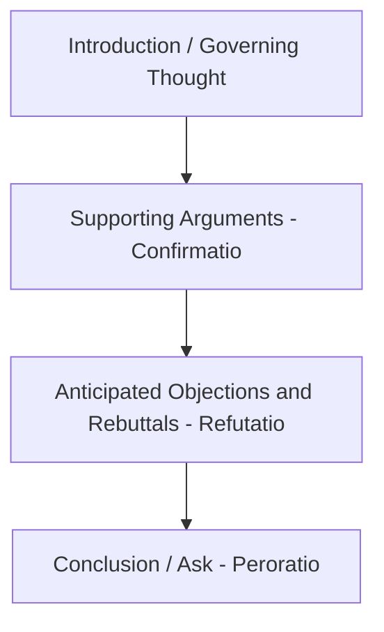
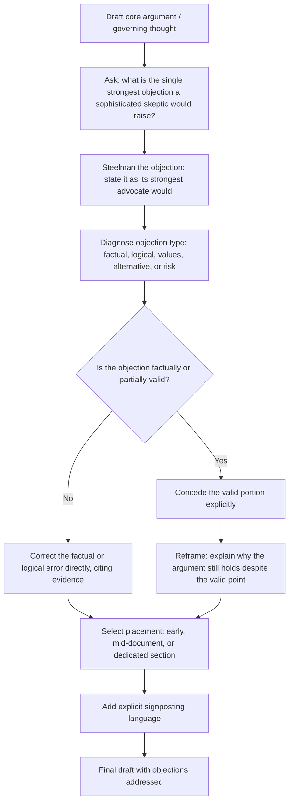

## Anticipating Objections in Written Arguments

### Overview

Anticipating objections is the practice of identifying the strongest counterarguments a skeptical reader would raise against a written argument, and addressing them proactively within the document itself, rather than waiting for them to surface in review, Q&A, or after a decision has stalled. This technique has roots in classical rhetoric (the concept of *refutatio*, the section of a classical oration dedicated to addressing opposing arguments) and functions as both a logos-strengthening move (the argument survives its strongest counterpoint) and an ethos-building move (the writer appears rigorous, fair-minded, and non-evasive).

---

### Core Principle: Unaddressed Objections Become the Reader's Focus

A well-known dynamic in persuasion: if a reader identifies a strong counterargument that the writer has not addressed, the reader's attention often fixates on that gap rather than on the argument's stated strengths — regardless of how compelling those strengths are. An argument that is 90% airtight but silent on the one glaring objection a sophisticated reader will immediately think of is often weaker in practice than a less polished argument that directly confronts that same objection.

---

### Core Technique: The Classical *Refutatio* Structure

Classical rhetorical arrangement includes a dedicated section, traditionally placed after the main supporting arguments (*confirmatio*) and before the conclusion (*peroratio*), specifically for acknowledging and rebutting opposing views. Modern business writing adapts this structure without necessarily using the classical terminology:

---

### Core Technique: Identifying the Strongest, Not the Weakest, Objection

A common failure mode is addressing only weak or easily dismissed objections (a pattern related to the "strawman" fallacy when done to an opponent's argument, but equally a self-sabotaging error when applied to one's own). Effective objection-anticipation requires genuinely identifying the strongest available counterargument — the one a sophisticated, good-faith skeptic would raise — even when it is uncomfortable to state.

**Diagnostic question**: "If I were the most qualified critic of this proposal, what is the one objection I would raise that I'm most worried about?" That objection, not a milder substitute, is the one to address.

---

### Core Technique: The Concede-and-Reframe Pattern

Rather than denying a valid objection outright (which can damage credibility if the objection has genuine merit), a common and effective pattern is to concede the valid portion of the objection explicitly, then reframe why the overall argument still holds despite it.

**Example**

> "It's true that this approach costs more upfront than our current process. [Concede] But the upfront cost is recovered within 14 months through reduced error-correction time, and the current process's hidden cost — the 31-hour average support delay driving client churn — isn't reflected in its lower sticker price. [Reframe]"

This differs from simply denying the objection ("this doesn't actually cost more") in cases where the objection is factually accurate; denial in the face of a valid point damages credibility, while concede-and-reframe preserves it.

---

### Core Technique: Distinguishing Objection Types

Not all objections require the same handling. Categorizing the anticipated objection clarifies the appropriate response:

| Objection Type | Description | Appropriate Response |
| --- | --- | --- |
| **Factual objection** | Disputes a specific fact or figure | Verify and cite the source, or correct if genuinely wrong |
| **Logical objection** | Argues the reasoning doesn't follow, even if facts are accurate | Strengthen or clarify the logical connection explicitly |
| **Values/priorities objection** | Agrees with the facts and logic but weighs priorities differently | Acknowledge the value tradeoff explicitly and argue why this priority ordering is appropriate here |
| **Alternative-solution objection** | Proposes a different solution to the same problem | Address directly in an "alternatives considered" section (see business case structuring) |
| **Risk/downside objection** | Points out a genuine risk or cost the proposal creates | Concede the risk and present a specific mitigation plan |

---

### Core Technique: The "Steelman" Discipline

Borrowed from argumentation and debate practice, steelmanning means constructing the strongest, most charitable version of the opposing argument — deliberately stronger than what a reader might actually raise — before attempting to address it. This discipline prevents the common failure of subconsciously constructing a weaker version of the objection (a strawman) that is easier to defeat but less persuasive to a reader who recognizes the gap.

**Practical technique**: before drafting the rebuttal section, write out the objection as if the writer were personally advocating for it, using the most compelling evidence and framing available — only then draft the response.

---

### Core Technique: Placement Strategy — When to Address Objections

| Placement | Effect | Best Suited For |
| --- | --- | --- |
| Early, right after the governing thought | Signals immediate awareness and rigor | When the objection is likely to be the reader's very first reaction |
| Mid-document, after supporting arguments | Allows the case to be built before addressing pushback | Standard placement for most formal business cases and proposals |
| Dedicated FAQ/objections section at the end | Keeps the main argument uninterrupted, groups all pushback together | Longer documents, technical proposals, RFP responses |
| Woven throughout, addressed as each point is raised | Prevents any single point from feeling unaddressed | Highly technical or legally scrutinized documents |

---

### Core Technique: Explicit Signposting of the Objection-Response Move

Naming the move explicitly ("A common concern here is...", "Some may argue that...", "It's reasonable to ask...") helps the reader recognize that the writer is being proactively transparent rather than defensively reacting, which reinforces the ethos-building function of this technique.

**Example**

> "A reasonable objection here is that a 14-month payback period is too long given current budget constraints. We addressed this directly with the vendor and secured a phased payment structure that reduces the effective payback period to 8 months for the initial deployment phase."

---

### Common Failure Patterns

| Failure Pattern | Consequence | Correction |
| --- | --- | --- |
| No objections addressed at all | Reader's attention fixates on the unaddressed gap | Include a dedicated objections/risks section |
| Only weak objections addressed | Sophisticated reader notices the strongest counterargument was avoided | Apply the "strongest objection" diagnostic question |
| Objection denied when factually valid | Credibility damage when reader recognizes the denial is inaccurate | Use concede-and-reframe instead of outright denial |
| Strawmanned version of the objection | Rebuttal feels hollow or dismissive to a knowledgeable reader | Apply steelman discipline before drafting the response |
| Objection type mismatched to response | E.g., responding to a values objection with more facts, which doesn't address the actual disagreement | Diagnose objection type before selecting response strategy |
| Objections buried or hard to find | Reader assumes they were avoided even if technically present | Use explicit signposting language to make the move visible |

---

### Objection-Anticipation Workflow

---

### Executive Communication Application

- **Business cases and investment proposals**: the "alternatives considered" and risk-mitigation sections function as structured objection-anticipation, directly increasing approval likelihood by preempting committee pushback
- **Board memos**: proactively addressing the single most likely director objection reduces the risk of the discussion derailing around that point during the actual meeting
- **Policy and regulatory submissions**: steelmanning opposing positions is often expected practice, since regulators and legal reviewers actively look for evidence that alternative views were genuinely considered
- **Crisis communications**: anticipating and addressing the public's most likely skeptical question directly (rather than only presenting favorable framing) strengthens perceived credibility and reduces follow-up scrutiny
- Effectiveness depends on genuinely identifying the strongest objection (not a convenient weaker substitute) and calibrating the concede-and-reframe balance honestly; outcomes may vary by audience sophistication and the objection's actual merit.

---

**Related Topics**

- Classical rhetorical structure (*confirmatio* and *refutatio*) as the origin of this technique
- Structuring a persuasive business case: risk analysis and alternatives-considered sections
- Steelmanning and charitable interpretation in argumentation and debate
- Ethos, pathos, and logos as the rhetorical appeals reinforced by objection-handling
- Managing hostile or unexpected questions (the spoken-delivery counterpart to this written technique)
- Balancing data, logic, and narrative in persuasive writing