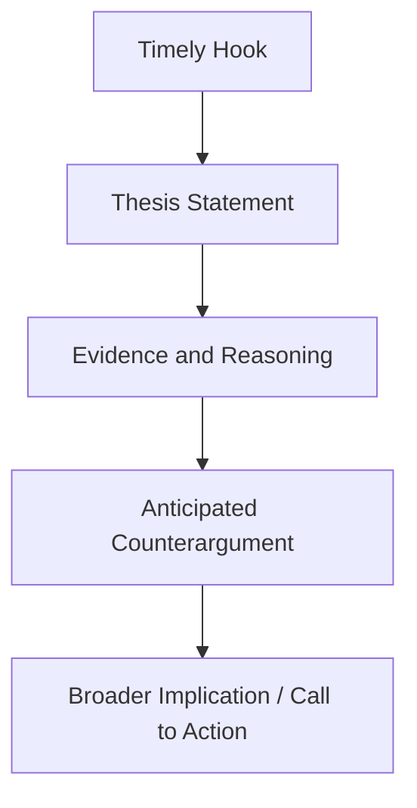
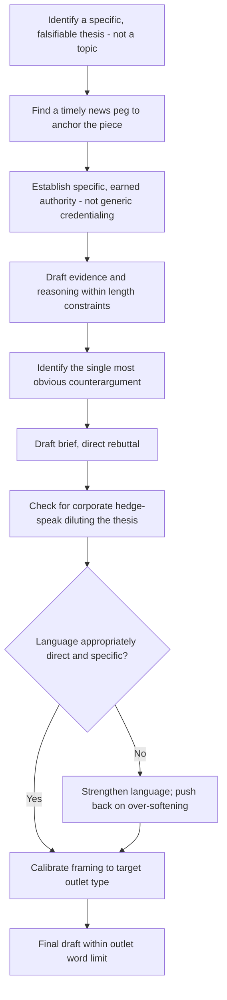

## Writing Thought Leadership Articles and Op-Eds

### Overview

Thought leadership articles and op-eds are public-facing persuasive genres in which an executive or expert stakes out a position on an issue — industry trend, policy question, organizational philosophy — to build credibility, influence public or industry opinion, and establish the author (and often their organization) as an authoritative voice. Unlike internal business writing (business cases, memos), these genres are written for an external, self-selecting audience who can stop reading at any point, and success is measured by influence and reputation rather than a specific internal decision. This places thought leadership at the intersection of journalistic op-ed convention, personal branding, and executive communication strategy.

---

### Core Principle: A Thesis, Not a Topic

The single most common failure in thought leadership writing is presenting a topic ("the future of remote work") rather than a thesis (a specific, arguable claim: "remote work will bifurcate the labor market by seniority level within five years"). A genuine thesis is falsifiable and takes a position that could reasonably be disputed — if no reasonable person could disagree with the central claim, it is likely a topic restated as a sentence, not a thesis.

**Example**

- Topic (not a thesis): "AI is transforming customer service."
- Thesis: "Companies that use AI to eliminate human customer service entirely will see short-term cost savings but long-term brand erosion, based on emerging churn data from early adopters."

---

### Core Structure: The Op-Ed Arc

1. **Hook / timely hook** — connects the piece to a current event, trend, or widely felt tension, establishing immediate relevance
2. **Thesis statement** — the specific, arguable claim, typically within the first 2–3 paragraphs
3. **Evidence and reasoning** — data, examples, and logical support (per data-narrative balancing principles)
4. **Anticipated counterargument** — brief acknowledgment and rebuttal of the most obvious objection
5. **Broader implication / call to action** — why this matters beyond the immediate topic, and what the reader or industry should do differently

---

### Core Technique: The Timely Hook (News Peg)

Op-eds are typically anchored to a "news peg" — a recent event, report, or widely discussed development that justifies why this piece is being published now rather than at any other time. Thought leadership without a clear news peg often reads as generic or evergreen in a genre that rewards timeliness.

**Example**

> "Last week's earnings reports from three major retailers all cited 'AI-driven efficiency' as a cost-savings driver — and all three also reported customer satisfaction declines. This is not a coincidence."

---

### Core Technique: Personal Authority and Credible Standing

Thought leadership pieces derive persuasive force partly from the author's demonstrated standing to speak on the topic (an ethos-based appeal). This is typically established through:

- Brief, specific credential or experience references (not an extended biography)
- First-hand data, observation, or experience unique to the author's position
- A track record referenced implicitly through specificity of insight, rather than explicit self-promotion

**Example**

- Weak (generic credentialing): "As a 20-year veteran of the tech industry, I believe AI will change everything."
- Strong (specific, earned authority): "Having overseen three AI-driven support transitions across different company sizes, I've seen the same pattern each time: short-term savings followed by unexpected retention costs."

---

### Core Technique: The Contrarian or Under-Discussed Angle

Effective thought leadership often distinguishes itself by challenging a prevailing consensus or surfacing an angle not yet widely discussed, rather than restating a widely accepted position. A piece agreeing entirely with conventional wisdom rarely generates the attention or influence that defines successful thought leadership, since it adds little new to the conversation.

**Caution**: contrarian framing should reflect genuine, defensible analysis — manufacturing a contrarian position purely for attention, without underlying analytical support, damages long-term credibility even if it generates short-term engagement.

---

### Core Technique: Concision and the Op-Ed Length Constraint

Op-eds for major publications typically operate under strict length constraints (commonly 700–1,200 words), which enforces the same ruthless-editing discipline covered elsewhere in this curriculum, but at a stricter threshold than most internal business documents. Every paragraph must justify its inclusion under this constraint.

[Inference] The 700–1,200 word range reflects commonly cited submission guidelines across major op-ed outlets; exact limits vary by publication and should be confirmed against the specific target outlet's guidelines.

---

### Core Technique: Avoiding Corporate Hedge-Speak

A common failure specific to executive-authored thought leadership is excessive hedging or corporate-safe language that dilutes the thesis to the point of vagueness, undermining the genre's core requirement of taking a clear, specific position. Legal or PR review processes can inadvertently over-soften a piece to the point where it no longer reads as thought leadership at all.

**Example**

- Over-hedged (fails as thought leadership): "There may be some considerations worth exploring regarding the potential impacts of AI on certain aspects of customer service in some contexts."
- Appropriately direct: "AI-driven service cuts will erode brand loyalty for companies that don't preserve a human escalation path."

---

### Core Technique: The Anticipated Counterargument (Refutatio, Compressed)

Given strict length constraints, op-eds typically address only the single most obvious counterargument, briefly, rather than a full risk/alternatives section as in a business case. This preserves rigor and credibility without sacrificing the tight word count.

**Example**

> "Some will argue that AI-driven efficiency is simply cost discipline that customers will accept as the new normal. But churn data from early adopters suggests otherwise: the companies that removed human escalation entirely saw retention drop twice as fast as those that kept a human option available."

---

### Core Technique: Publication-Specific Calibration

Different outlets have distinct editorial voice, audience sophistication, and political/cultural framing expectations. A thesis and framing suited to a trade publication may need significant adjustment for a general-interest outlet or a different national context.

| Outlet Type | Typical Calibration |
| --- | --- |
| Trade/industry publication | Technical specificity, assumes shared industry vocabulary |
| General business outlet | Broader framing, less jargon, clearer stakes for a non-specialist reader |
| General-interest/opinion outlet | Strongest news-peg requirement, most accessible language, widest audience assumption |
| Company blog / owned media | More latitude on length and hedging, but lower inherent credibility than earned third-party placement |

---

### Common Failure Patterns

| Failure Pattern | Consequence | Correction |
| --- | --- | --- |
| Topic presented instead of a thesis | Reads as a generic survey with no clear argument | Sharpen to a specific, falsifiable, arguable claim |
| No news peg | Reads as generic or evergreen, reduces publication interest and reader urgency | Anchor to a specific recent event or report |
| Excessive corporate hedging | Thesis diluted to the point of meaninglessness | Push back on over-cautious legal/PR softening; preserve directness |
| No counterargument addressed | Reads as one-sided or naive to sophisticated readers | Address the single most obvious objection briefly |
| Generic credentialing | Reads as self-promotional without adding persuasive weight | Use specific, earned experience details instead |
| Manufactured contrarianism | Damages long-term credibility if position lacks genuine analytical support | Ensure contrarian framing reflects defensible analysis |
| Exceeding outlet length norms | Piece rejected or heavily cut by editors, losing authorial control over final framing | Draft within standard 700–1,200 word range, or the specific outlet's stated limit |

---

### Drafting Workflow

---

### Executive Communication Application

- **Industry positioning**: thought leadership is a standard tool for establishing an executive and organization as a category authority ahead of competitors
- **Policy influence**: op-eds addressing regulatory or legislative questions can shape public and legislative discourse in ways internal advocacy cannot
- **Talent and investor perception**: externally visible thought leadership contributes to employer brand and investor confidence independent of any single article's direct impact
- **Crisis-adjacent reputation management**: a well-timed, direct op-ed can reframe public narrative around an organization's position on a contested issue, though this requires careful coordination with legal and communications teams given public and permanent visibility
- Effectiveness depends on genuine thesis strength, appropriate outlet calibration, and resisting over-softening through review processes; outcomes may vary by publication, timing, and audience reception.

---

**Related Topics**

- Anticipating objections in written arguments (the compressed *refutatio* applied here)
- Ethos and personal authority as a rhetorical appeal
- Balancing data, logic, and narrative in persuasive writing
- Editing ruthlessly for impact and brevity, applied under stricter op-ed length constraints
- Media training and public-facing executive communication strategy
- Crisis communication and public narrative management