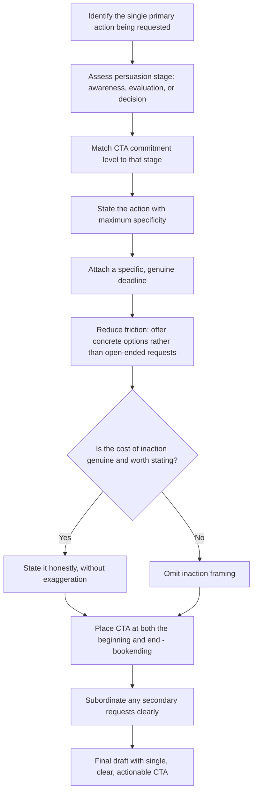

## Calls to Action in Written Persuasion

### Overview

A call to action (CTA) is the specific instruction a piece of persuasive writing gives the reader about what to do next — approve a budget, reply by a date, click a link, schedule a meeting, change a behavior. It is the operational endpoint toward which every other persuasive technique (BLUF, Pyramid Principle, data-narrative balance, objection-handling) is ultimately building. A persuasive document that succeeds in generating agreement or interest but fails to specify a clear next action often fails to convert that agreement into actual behavior — a well-documented gap between attitude change and behavior change in persuasion research.

---

### Core Principle: Agreement Without Action Is Persuasion Failure

Many effective-seeming pieces of writing generate genuine reader agreement ("yes, this makes sense," "I see the problem") without producing any behavior change, because the reader is left to independently determine what to do with that agreement. A CTA closes this gap by making the desired next behavior explicit, specific, and low-friction, rather than leaving it to the reader's own initiative.

---

### Core Technique: Specificity of Action

A vague CTA ("let me know your thoughts," "consider this") places the burden of defining the actual next step back on the reader, which reduces the likelihood of any action being taken at all. Effective CTAs specify precisely what behavior is requested.

**Example**

- Vague: "We'd appreciate your feedback on this proposal."
- Specific: "Please reply with approve/reject by Friday, September 18."

---

### Core Technique: Deadline and Urgency Framing

Attaching a specific deadline (rather than an open-ended "soon" or "when you can") measurably increases response rates and reduces the likelihood that the request is deprioritized indefinitely. Urgency framing should be genuine and proportionate — manufactured urgency for low-stakes requests can damage credibility and reader trust over repeated use.

**Example**

- No deadline (low urgency): "Let us know if you're interested in moving forward."
- Specific deadline: "If we don't hear back by end of day Thursday, we'll assume the answer is no and proceed with the alternative vendor."

---

### Core Technique: Reducing Friction in the Requested Action

The easier and more specific the requested action, the higher the likelihood of compliance — a principle closely related to the "foot-in-the-door" and general behavioral-economics findings on choice friction. Reducing the number of steps, decisions, or ambiguities in the CTA itself increases the probability the reader follows through.

**Example**

- Higher friction: "Let's find a time to discuss this further."
- Lower friction: "Are you free Tuesday at 2pm or Wednesday at 10am for a 20-minute call?"

Providing specific options (rather than an open-ended scheduling request) removes a decision step for the reader, increasing the likelihood of a fast, concrete response.

---

### Core Technique: The Single, Primary CTA

A document with multiple competing calls to action (approve the budget, also review the appendix, also forward to your team, also schedule a follow-up) dilutes the reader's attention and reduces the likelihood that any single action is taken with priority. Effective persuasive writing typically identifies **one primary CTA** and treats any secondary requests as clearly subordinate or deferred to a later stage.

**Example — subordinated secondary CTA**

> "Primary ask: please approve the $150K budget by September 30. [Secondary, lower priority] Once approved, we'll follow up separately with a detailed implementation calendar for your team's review."

---

### Core Technique: Matching CTA Type to Persuasion Stage

Not every piece of persuasive writing should culminate in a final decision-level CTA; early-stage communications often should request a smaller, lower-commitment action that moves the relationship or decision process forward incrementally.

| Persuasion Stage | Appropriate CTA Type | Example |
| --- | --- | --- |
| Initial awareness/interest | Low-commitment engagement | "Reply if you'd like the full analysis." |
| Early evaluation | Information-gathering step | "Can we schedule 20 minutes to walk through the data?" |
| Late-stage decision | Explicit approval/commitment | "Please approve the budget by Friday." |
| Post-decision | Confirmation/next-step logistics | "Confirming: implementation begins Monday. Reply if this conflicts with your calendar." |

Requesting a late-stage, high-commitment CTA (e.g., final budget approval) prematurely — before the reader has had the earlier-stage information they need — often produces resistance or delay, rather than accelerating the decision.

---

### Core Technique: Framing the Cost of Inaction

Alongside stating the positive action requested, effective CTAs sometimes make explicit what happens if no action is taken — particularly useful when the default (inaction) is not neutral but carries its own cost or consequence the reader may not have considered.

**Example**

> "If we don't move forward with this vendor by end of month, we lose the negotiated rate and will need to restart procurement, delaying the project by an estimated two months."

This should be used judiciously and honestly — exaggerating or fabricating consequences of inaction to manufacture pressure is a manipulative tactic distinct from genuinely informing the reader of a real cost, and it damages long-term credibility if the stated consequence turns out to be overstated.

---

### Core Technique: Placement — CTA Position in the Document

| Placement Pattern | Rationale |
| --- | --- |
| CTA stated at the very beginning (alongside the governing thought) | Reinforces BLUF; reader knows the ask immediately, evaluates supporting content against it |
| CTA restated at the very end | Ensures the ask is the last thing read, reinforcing it as the takeaway even if earlier sections were skimmed |
| Both (bookending) | Most common convention in business cases and memos — states the ask up front, then again explicitly in the closing |

Bookending the CTA (stating it both at the beginning per BLUF/Pyramid Principle conventions, and restating it explicitly at the end) is standard practice, since it accounts for readers who skim the middle section entirely.

---

### Common Failure Patterns

| Failure Pattern | Consequence | Correction |
| --- | --- | --- |
| Vague CTA ("let me know your thoughts") | Reader unsure what specific action is being requested | State the precise action requested |
| No deadline attached | Request deprioritized indefinitely | Attach a specific date/time |
| Multiple competing CTAs | Reader's attention diluted; no single action prioritized | Identify one primary CTA; subordinate secondary requests |
| High-friction request (open-ended scheduling, vague next steps) | Lower response and follow-through rate | Offer specific options or a single clear next step |
| CTA mismatched to persuasion stage | Premature high-commitment ask generates resistance | Match CTA commitment level to where the reader is in the decision process |
| CTA only at the end, or only at the beginning | Readers who skim only one section miss the ask entirely | Bookend: state CTA at both beginning and end |
| Manufactured urgency or exaggerated cost of inaction | Damages credibility if discovered to be overstated | Use only genuine, verifiable consequences |

---

### CTA Drafting Workflow

---

### Executive Communication Application

- **Business cases and briefing memos**: the explicit, time-bound ask (covered in those chapters) is a direct application of CTA principles at the document-conclusion level
- **Executive email requests**: precision, deadlines, and reduced friction directly determine response speed from busy recipients, including peers and superiors
- **Pitches and proposals**: matching CTA commitment level to persuasion stage prevents premature asks (e.g., requesting full investment before a prospect has seen sufficient evidence)
- **Internal change communications**: clear CTAs (specific behaviors expected of employees) are more effective at driving actual behavior change than general statements of new policy or direction
- Effectiveness depends on genuine specificity, honest urgency framing, and appropriate calibration to where the reader is in their decision process; outcomes may vary by relationship, organizational context, and request complexity.

---

**Related Topics**

- BLUF and the Pyramid Principle as the structural logic bookending the CTA
- Structuring a persuasive business case and briefing memos: the explicit ask
- Email etiquette: precision in requests and deadlines
- Behavioral economics: choice friction and default effects
- Writing compelling pitches: the ask as the final element of the pitch arc
- Attitude-behavior gap in persuasion and behavior-change research